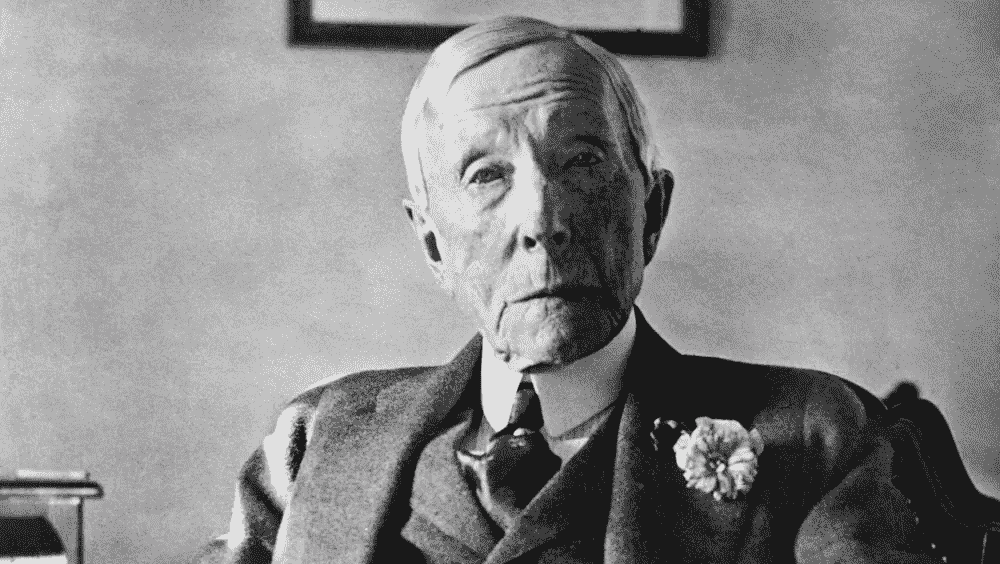

# 亲爱的加密货币投资者——历史掌握着答案

> 原文：<https://medium.com/hackernoon/dear-cryptocurrency-investors-history-holds-the-answer-3af569c7ac52>

有人曾经告诉我，一遍又一遍地做同样的事情，并期望得到不同的结果，这是疯狂的行为，但如果一遍又一遍地忽视同样的情况，继续错过，又会怎么样呢？

这个故事要追溯到 1863 年，当时第一条铁路正在富饶的产油区宾夕法尼亚和炼油区克利夫兰之间修建。这两个城市相距 100 英里，这使得克利夫兰与匹兹堡或巴尔的摩等更近的炼油区相比处于巨大劣势。然而，克利夫兰的优势在于其土地和原材料价格较低。

正是在这里，约翰·d·洛克菲勒和他的商业伙伴莫里斯·克拉克决定投资克利夫兰炼油业，因为他们认为可以改善其他油区目前面临的低效率状况。洛克菲勒削减成本的能力使他比全国其他炼油厂都有优势，这使他能够不断扩大和发展公司。

直到 1865 年，洛克菲勒和克拉克因债务问题陷入无法解决的商业纠纷，两个合伙人之间的关系一直很好。年仅 26 岁的洛克菲勒最终以高于公平市价的 72，500 美元买下了克拉克的全部股份。但是在一个被颠覆的行业中，克拉克缺乏耐心和对未来的远见，这让他付出了超乎想象的代价。

在接下来的五年里，洛克菲勒将炼油技术提升到了一个全新的水平，每天生产 1500 桶，超过了大多数竞争对手一周的产量，而且成本大大降低。该公司后来成为俄亥俄州的标准石油公司，有史以来最大的公司之一。

克拉克可能对他的收购很满意，但他因过早退出而损失的财富是美国历史上最大的金融错误之一。大多数人可能从未听说过莫里斯·克拉克，而约翰·d·洛克菲勒几乎是美国所有商学院的经典案例。

# **加密货币投资者不确定该做什么**

有无数的所谓“专家”对这个问题发表自己的看法。他们的建议范围很广，从加密货币毫无价值到它们将如何为一个公平而光明的未来彻底改变社会。

我们这个时代最优秀的金融头脑之一查理·芒格(Charlie Munger)曾说比特币是“一文不值的人造黄金”。

沃伦·巴菲特抨击比特币，称“当你购买非生产性资产时，你所指望的是下一个人会给你更多钱，因为他们对下一个人的到来更加兴奋。”

巴菲特难道不明白底层技术和区块链能做什么吗？

这让我想起了老炼油商，他们看不到未来，也不知道技术将如何永远改变运营，让位于更年轻、更雄心勃勃的老方法，为那些与新技术保持一致的人打开了财富之门。

事实上，没有人确切知道未来几年会发生什么，但历史是预测未来的最佳工具之一。

# **颠覆是人们致富的方式**

事情总是在变化，不断有新的更好的方法来完成工作，这就是我们如何走到今天的。一些人可以看到它并加以利用，另一些人继续认为事物是时尚，让机会从他们身边溜走。

约翰·d·洛克菲勒是一个年轻的前瞻性思想家，他打破了炼油行业的旧的做事方式，使他最终成为历史上最富有的美国人。他的破坏能力导致控制了美国 90%的石油，同时积累了今天 3670 亿美元的净资产。

亨利·福特创立了利润丰厚的食品汽车公司，彻底改变了交通运输，并把它带给所有阶层的人。一些人认为汽车只有富人才能拥有，或者根本不相信福特的所作所为。但是在 17 年的时间里(1903-1920 年)，福特销售了超过 100 万辆汽车，使他和他的投资者变得非常富有。人们骑着马到处跑的日子已经结束了，坚持到底的投资者获得了大量的财富。以今天的美元计算，福特去世时的净资产超过 2000 亿美元也就不足为奇了。

最近，90 年代的互联网繁荣造就了几个亿万富翁。我记得我曾讨论过互联网是否只是一时的时尚，还是会一直存在下去。这在现在看来似乎是显而易见的，但当时大多数人只是不知道该做什么，决定不去冒险和投资。

它不是一夜之间发生的，它花了几年时间来开发这项技术，但如果历史告诉了我们什么，那将是又一次错过的机会。比尔·盖茨充分利用了这一点，在 1999 年积累了 101 亿美元的财富，经通货膨胀调整后，相当于今天的 1440 多亿美元。

# **又发生了**

我不禁在加密货币领域和历史上世界运行的方式中看到了同样的相似之处。归根结底是创新和采用——这两者在加密货币领域仍在快速扩张。

如果你认为你参加聚会迟到了，再想想。在地球上的 76 亿人中，只有大约 2500 万个比特币钱包存在。这意味着目前只有约 0.3%的人口拥有比特币钱包。我们甚至还没有触及表面。

说到技术，事情变化很快，五年后世界将会发生巨大的变化。你可以站在那里，看着它在你面前发生，或者登上船，准备乘坐。

想想莫里斯·克拉克，他做得很好，但如果他能多呆几年，他会赚 100 多倍的钱。

颠覆再次发生，现在就在发生，这一次有足够的东西分给任何想要分一杯羹的人。当然，这并不意味着你可以简单地购买任何加密货币并变得富有。将会有大量的加密货币崩溃并烧毁，可能比成功更严重，因此选择正确的多元化项目仍然是成功的关键。

你需要问自己，从现在起的 10 年里，你想成为那个从未参与比赛，或者更糟，早早出局，然后回想可能会发生什么的人吗？或者你想成为一个足够强大的人，度过风暴，作为一个具有前瞻性思维的加密货币投资者，利用生活扔给我们的一个难得的机会？

—

获取我们的一份报告，了解哪个区块链项目通过革新旧的做事方式并将其带入未来而获得了巨大成功。[点击此处](https://cryptoinvestinginsider.com/cryptocurrency-to-invest-in/?utm_source=hn&utm_campaign=rockefeller)了解详情。