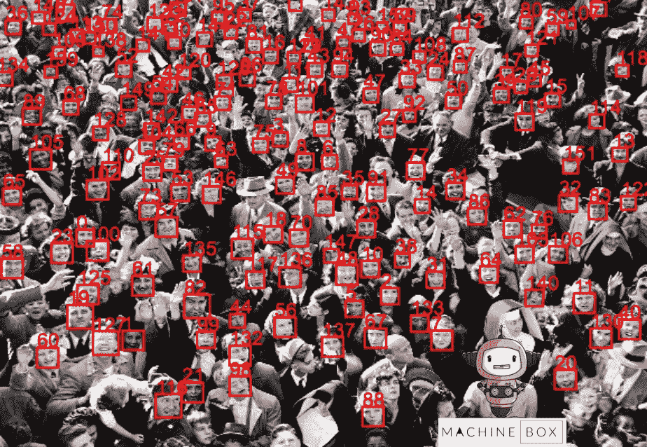

# 亲爱的企业——以下是你如何在今天(而不是明天)集成人工智能

> 原文：<https://medium.com/hackernoon/dear-enterprises-heres-how-you-can-integrate-ai-today-instead-of-tomorrow-e3f9dd25e953>

## 写一篇关于人工智能在企业中的一般功效的文章很容易，这篇文章试图深入研究企业如何快速有效地从机器学习中获得投资回报。

Photo by [Markus Spiske](https://unsplash.com/photos/Skf7HxARcoc?utm_source=unsplash&utm_medium=referral&utm_content=creditCopyText) on [Unsplash](https://unsplash.com/search/photos/enterprise?utm_source=unsplash&utm_medium=referral&utm_content=creditCopyText)

让我们面对它，机器学习和人工智能就在这里，它们是一股不可忽视的力量。这是为什么呢？因为机器学习代表了一代人最大的投资回报。

> 关于人工智能、机器学习、神经网络和其他术语的初级读本，[阅读这篇文章](https://towardsdatascience.com/understand-these-5-basic-concepts-to-sound-like-a-machine-learning-expert-6221ec0fe960)。

好了，我们来谈生意吧。你今天阅读大量关于机器学习和人工智能的原因是因为计算领域的一场有点沉默的革命。有一段时间，摩尔定律似乎已经崩溃，因为 CPU 能力的主要进步已经停滞。有趣的是，有一种称为 GPU(图形处理单元)的不同类型的处理技术最终非常擅长处理神经网络所需的相同类型的计算。GPU 处理能力在过去几年中爆炸式增长，因此，以一种*实用*的方式使用神经网络的现实就在我们面前。

[https://www.wired.com/wp-content/uploads/archive/ly/wired/news/images/full/supercomputer2_f.jpg](https://www.wired.com/wp-content/uploads/archive/ly/wired/news/images/full/supercomputer2_f.jpg)

我强调实用这个词，是因为神经网络和机器学习已经存在了很长时间，但处理一个人脸识别系统(例如)所需的时间和资源极其昂贵。

Face recognition at scale

GPU 相对较低的成本突然使强大的机器学习成为一项可行的商业技术。

## 但是机器学习仍然很难

尽管人们对机器学习和人工智能越来越感兴趣，但事实证明这仍然很难实现。你需要受过专门训练的机器学习工程师、博士数据科学家、数学家，以及理解机器学习的复杂性和局限性的管理者。对于企业来说，这仍然是一个昂贵的命题。

Photo by [jens johnsson](https://unsplash.com/photos/OFpzBycm3u0?utm_source=unsplash&utm_medium=referral&utm_content=creditCopyText) on [Unsplash](https://unsplash.com/search/photos/robots?utm_source=unsplash&utm_medium=referral&utm_content=creditCopyText)

训练机器学习模型我自己，我可以告诉你，建立有用的东西最难的部分是收集训练数据。在某些情况下，您需要成千上万个不同类别数据的示例来训练模型。你必须确保数据的格式正确，并且没有太多的变化。一旦你对你的数据集满意了，你就必须从上百个决定中选择一个来决定你将使用哪种处理来得到你想要的结果。而且你第一次尝试时通常都是错的——所以要做好大量测试的准备。

6 个月后，您已经有了一个满意的模型，但是现在您需要弄清楚如何在生产中部署和扩展它。这是机器学习之外的另一门学科，你需要有这方面的专家，才能有一些可行的东西。

## 进入云公司

云计算有它的好处，也就是说你只需要为你所使用的东西付费。从理论上讲，您不再需要为空调、设备更换和数据中心的物理空间付费来支持您的服务。那应该是一笔巨大的储蓄。这是 op-ex 革命！

但事实证明，来回移动内容的成本、数据的惊人增长、供应商锁定以及安全性的复杂性仍然是个问题。当云公司开始提供机器学习即服务(MLaas)时，企业遇到了类似的障碍。就我个人而言，当涉及到集成基于云的机器学习时，我听到客户抱怨同样的两件事；1)规模太大，因为他们按 API 调用收费，2)我不想或不能让我的数据离开我的场所。

## 内部机器学习

[加里·奥伦斯坦](https://venturebeat.com/author/gary-orenstein-memsql)在他的 [Venture Beat 文章](https://venturebeat.com/2018/01/25/using-ai-to-find-bonus-value-hidden-in-your-companys-data/)中说得最好，这篇文章题为**利用人工智能发现隐藏在你公司数据中的奖金价值:**

> 如今，大型企业已经有了大量的应用程序和数据存储库。然而，随着广泛的商业关注数字化转型，现在是时候追求新的数据应用并融入机器学习和人工智能了。
> 
> 考虑到来自亚马逊、谷歌、微软和其他公司的云中的可用资源，从那里开始通常是有意义的。但公司应该记住，在任何云上或在自己的数据中心部署解决方案的能力可能是长期为公司提供最佳服务的重要前提。

企业需要成为他们自己的机器学习的主人，实际上，建立一个内部的 MLaaS 解决方案来满足他们自己的需求并推动客户价值。

我给你举个例子。

我公司的一个客户[机器盒](https://goo.gl/WFiLAC)在一家医疗保健行业的企业工作。他探索建立一个机器学习团队，发现成本太高。然后他调查了 IBM Watson，但是告诉我们，不仅他们的文本分析能力不如 [Machine Box 的](https://goo.gl/WFiLAC)准确，而且他们将被收取一大笔费用。

他需要做的是将他的团队从每天手动倾倒数千页文本中解放出来，以便他们可以专注于他们的主要工作(顺便提一下，这是机器学习的一个完美用例)。

改变企业游戏的是能够集成强大的机器学习工具，以节省时间、创造新产品、创造收入，并以经济高效的方式从创建、管理和处理的无尽数据中获取巨大价值。请记住，这是关于投资回报率高于一切。

## 企业级、简单的 API 和无限制的使用

企业将需要这三者。幸运的是，这正是 Machine Box 所做的。

# 什么是机器盒子？

[Machine Box](https://goo.gl/WFiLAC) 将最先进的**机器学习**功能放入 **Docker 容器**中，这样像您这样的开发人员可以轻松地将自然语言处理、面部检测、对象识别等功能融入其中。到您自己的应用程序中。

这些盒子是为了扩展而建造的，所以当你的应用真正起飞的时候，只需要水平地添加更多的盒子，直到无限甚至更远。哦，它比任何云服务都便宜**([而且可能更好](https://hackernoon.com/which-face-recognition-technology-performs-best-c2c839eb04e7))……而且**你的数据不会离开你的基础设施**。**

**[有戏](https://machinebox.io/docs/facebox/teaching-facebox)让我们知道你的想法。**