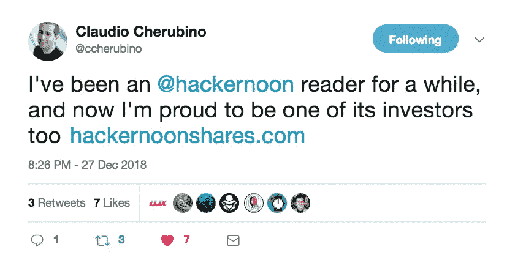

# 亲爱的黑客:2018 年顶级科技故事

> 原文：<https://medium.com/hackernoon/dear-hacker-2018s-top-tech-stories-d1d76108bbec>

Source, [Giphy.com/channel/HackerNoon](https://giphy.com/channel/hackernoon)

## [**2018**](https://hackernoon.com/2018/home)**——[WTF](https://hackernoon.com/wtf/home)！**

**我们的总统认为关闭政府很酷，我们的技术领导者表现得好像他们拥有用户数据和活动，我只是工作，工作，工作，直到下一个家庭成员去世。在你自己生活中，工作和生活的平衡在哪里？好好珍惜吧。哼哼，我们开始吧！我根据不同的标准查看了前 100 篇帖子，并选择了体现 Hacker Noon 的前 20 篇。**

> ****顺带一提:** [我们的股权众筹](http://bit.ly/HNshares)从 714 人处高达 83.1 万美元(即将结束，[今日投资](http://bit.ly/HNshares) ) &邮箱[stories@hackernoon.com](mailto:stories@hackernoon.com)为黑客正午贡献一个故事。**

# **《黑客正午》2018 年 20 大故事:**

## **20.[我所知道的关于阅读的一切都是错的](https://hackernoon.com/everything-i-knew-about-reading-was-wrong-bde7e57fbfdc)作者[约翰尼](https://medium.com/u/336fe295463d?source=post_page-----d1d76108bbec--------------------------------)【13 分钟阅读】**

## **19.[彼得·麦科马克【13 分钟阅读】写给银行的一封关于比特币和加密货币](https://hackernoon.com/an-open-letter-to-banks-about-bitcoin-and-cryptocurrencies-b0c7ef9b7c62)的公开信**

## **18.[最佳私人搜索引擎——谷歌](https://hackernoon.com/untraceable-search-engines-alternatives-to-google-811b09d5a873) **的替代品** [**克里斯蒂安·斯图尔特·✔️**](https://medium.com/u/3ffe4274e771?source=post_page-----d1d76108bbec--------------------------------)**【6 分钟阅读】****

## **17. [50 家白手起家的大公司](https://hackernoon.com/50-big-companies-that-started-with-little-or-no-money-4ef1b68aac25)由[创始人集体](https://medium.com/u/f49435c6fa9?source=post_page-----d1d76108bbec--------------------------------)【16 分钟阅读】**

## **16.[如何用纸笔在荒岛上运行区块链](https://hackernoon.com/how-to-run-a-blockchain-on-a-deserted-island-with-pen-and-paper-899949ec555b)作者[塔尔·科尔](https://medium.com/u/83a4f96844d0?source=post_page-----d1d76108bbec--------------------------------)【10 分钟阅读】**

## **15.[为什么棱角分明让我退出 Web Dev](https://hackernoon.com/why-angular-made-me-quit-web-dev-f63b83a157af)**by**[**Tobias Merkle**](https://medium.com/u/b91a139bce64?source=post_page-----d1d76108bbec--------------------------------)**【10 分钟阅读】****

## ****14.[理解人工智能实际看到的东西](https://hackernoon.com/understanding-what-artificial-intelligence-actually-sees-7d4e5b9e648e)作者[尼克·布尔达科斯](https://medium.com/u/154a0d2814f0?source=post_page-----d1d76108bbec--------------------------------)【6 分钟阅读】****

## ****13.[安全令牌论文](https://hackernoon.com/the-security-token-thesis-4c5904761063)作者[斯蒂芬·麦肯](https://medium.com/u/d1b00c9f1ea7?source=post_page-----d1d76108bbec--------------------------------)【16 分钟阅读】****

## ****12.[谷歌面试问题解构:骑士拨号器](https://hackernoon.com/google-interview-questions-deconstructed-the-knights-dialer-f780d516f029) **by** [**亚历克斯·戈莱克**](https://medium.com/u/fc349a0617c0?source=post_page-----d1d76108bbec--------------------------------)**【15 分钟阅读】******

## ******11.[Python 为什么这么慢？](https://hackernoon.com/why-is-python-so-slow-e5074b6fe55b) **由** [**安东尼肖**](https://medium.com/u/ec39004dd57f?source=post_page-----d1d76108bbec--------------------------------)**【8 分钟阅读】********

## ******10.[如何在 10 分钟内丢掉一份 IT 工作](https://hackernoon.com/how-to-lose-an-it-job-in-10-minutes-3d63213c8370) **作者** [**白化 Tonnina**](https://medium.com/u/7d787296773d?source=post_page-----d1d76108bbec--------------------------------)【9 分钟阅读】******

## ****9.[我对 2018 年及以后最有价值的加密市场的见解](https://hackernoon.com/my-most-valuable-crypto-market-insights-for-2018-and-beyond-5c0a454fb278)作者[Pierre rog nion](https://medium.com/u/100bbba7af33?source=post_page-----d1d76108bbec--------------------------------)【18 分钟阅读】****

## ****8.[web pack 4 的故事以及如何最终以正确的方式配置它。](https://hackernoon.com/a-tale-of-webpack-4-and-how-to-finally-configure-it-in-the-right-way-4e94c8e7e5c1)作者[玛格丽塔·奥布拉兹索娃](https://medium.com/u/91e56913e1f1?source=post_page-----d1d76108bbec--------------------------------)【19 分钟阅读】****

## ****7.[2018 年最受欢迎的 3 种编程语言(及其年薪)](https://hackernoon.com/top-3-most-popular-programming-languages-in-2018-and-their-annual-salaries-51b4a7354e06) **作者**[**Michael j . Garbade 博士**](https://medium.com/u/3bc0ac239206?source=post_page-----d1d76108bbec--------------------------------)**【4 分钟阅读】******

## ******6.[为什么企业在机器学习上失败](https://hackernoon.com/why-businesses-fail-at-machine-learning-fbff41c4d5db)作者[凯西·科济尔科夫](https://medium.com/u/2fccb851bb5e?source=post_page-----d1d76108bbec--------------------------------)【6 分钟阅读】******

## ******5.[以太坊-区块链的大小已经超过 1TB，是的，这是一个问题](https://hackernoon.com/the-ethereum-blockchain-size-has-exceeded-1tb-and-yes-its-an-issue-2b650b5f4f62)由[停止和解密](https://medium.com/u/cbbfa20339f2?source=post_page-----d1d76108bbec--------------------------------)【21 分钟读取】******

## ******4.[如何粉碎加密市场，辞掉工作，搬到天堂，在余生中做任何你想做的事情](https://hackernoon.com/how-to-crush-the-crypto-market-quit-your-job-move-to-paradise-and-do-whatever-you-want-the-rest-27a4a3cc2bb1)作者[丹尼尔·杰弗里斯](https://medium.com/u/618a7c78c957?source=post_page-----d1d76108bbec--------------------------------)【25 分钟阅读】******

## ******3.[如何生物破解你的智力——从性到莫达非尼再到摇头丸](https://hackernoon.com/biohack-your-intelligence-now-or-become-obsolete-97cdd15e395f)Serge Faguet【48 分钟阅读】******

## ******2.[我是如何黑掉现代自动售货机的](https://hackernoon.com/how-i-hacked-modern-vending-machines-43f4ae8decec)作者[马泰奥·皮萨尼](https://medium.com/u/2d0e356721fb?source=post_page-----d1d76108bbec--------------------------------)【5 分钟阅读】******

## ******1.[我正在从您的网站收集信用卡号码和密码。以下是方法。](https://hackernoon.com/im-harvesting-credit-card-numbers-and-passwords-from-your-site-here-s-how-9a8cb347c5b5)作者[大卫·吉尔伯森](https://medium.com/u/f735d3b0f2f3?source=post_page-----d1d76108bbec--------------------------------)【10 分钟阅读】******

******直到下一次，不要把世界的现实想当然。******

******亲切的问候，******

******大卫·斯穆克******

********附言** [*我们的股权众筹*](http://bit.ly/HNshares) *从 714 人到 83.1 万美元。* [*快结束了，今天投资吧。*](http://bit.ly/HNshares)******

************