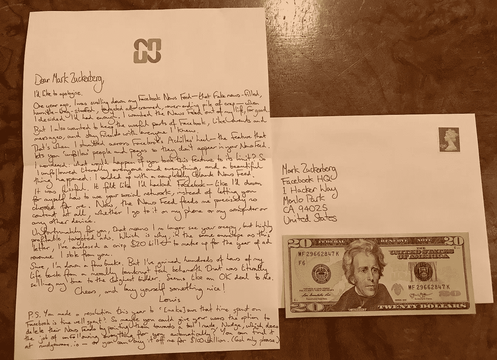

# 亲爱的马克·扎克伯格，这是我从你那偷的 20 美元

> 原文：<https://medium.com/hackernoon/dear-mark-zuckerberg-heres-20-that-i-stole-from-you-3f93c7fc0390>

亲爱的马克·扎克伯格，

我想道歉。

一年前，我滚动浏览我的脸书新闻——充斥着假新闻、低俗不堪、有针对性的广告、永无止境的一堆废话——时，我觉得自己已经受够了。我想永远摆脱我生活中的新闻。

但我也想保留脸书有用的部分，比如事件和信息，并和我认识的每个人保持朋友关系。

就在那时，我偶然发现了脸书的致命弱点——这个功能可以让你“取消关注”某些人和页面，这样他们就不会出现在你的新闻提要中。

我想知道:如果你将这个特性发挥到极致，会发生什么？所以我取消了对所有人和所有事的关注，美妙的事情发生了:我最终得到了一个完全空白的新闻源。

这是幸福的。感觉就像是我黑了脸书——就像我自己选择了如何使用你的社交网络，而不是让你替我选择。现在，无论我是通过手机、电脑还是其他任何设备，新闻源都不会给我提供任何内容。

对你来说不幸的是，这意味着我再也看不到你的令人毛骨悚然，但利润很高，有针对性的广告。这就是为什么，在这封信的同一个信封里，我附上了一张崭新的 20 美元钞票——以弥补我从你那里偷走的一年的广告收入。

当然，我少了一些钱。但我从一个道德沦丧的科技巨擘那里获得了数百个小时的生命，这个巨擘简直是在向出价最高的人出售我的时间。对我来说似乎是个不错的交易。

干杯，给自己买点好东西！

路易斯（号外乐团成员）

又及:你今年下定决心要“[确保]花在脸书的时间是值得的”。所以，也许你可以给你的用户选择删除他们的新闻提要，把他们指向我做的一个工具，Nudge，它可以自动为你完成[取消关注所有](/@louisbarclay/how-to-delete-your-facebook-news-feed-6c99e51f1ef6)的工作？你可以在 [nudgeware.io](http://bit.ly/2gFsVrf) 找到它——或者你可以花 1000 亿美元从我这里买下它。(请只收现金。)