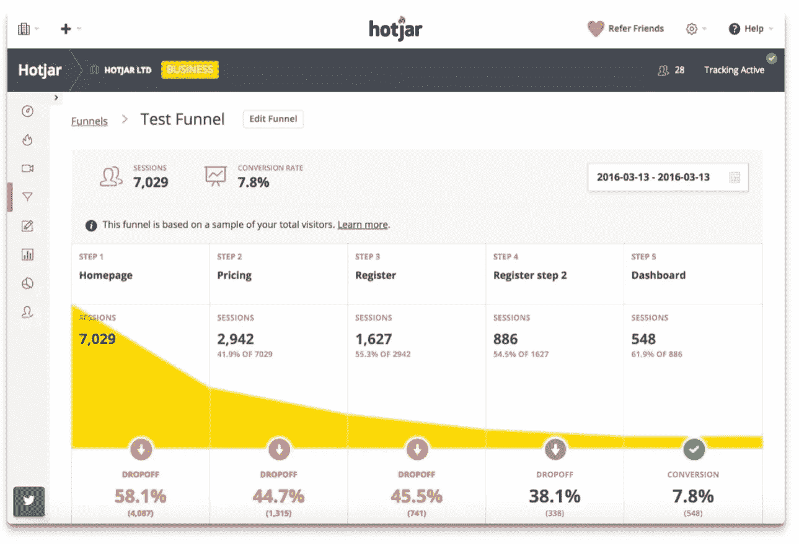
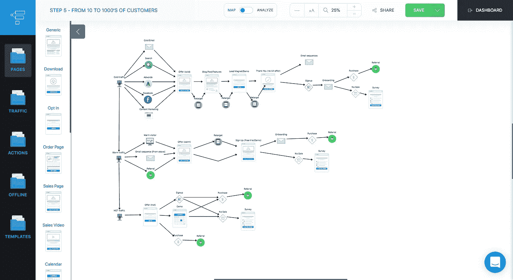
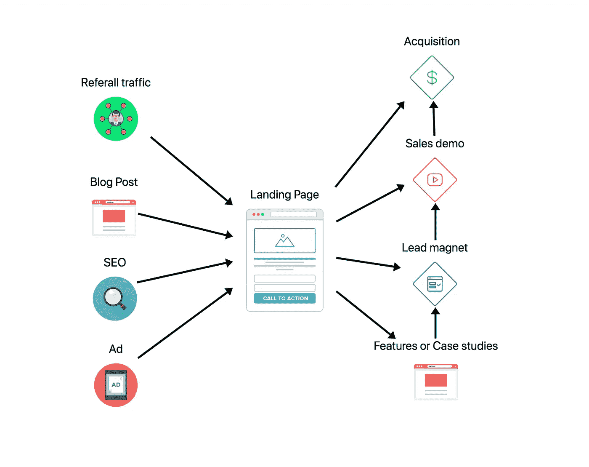
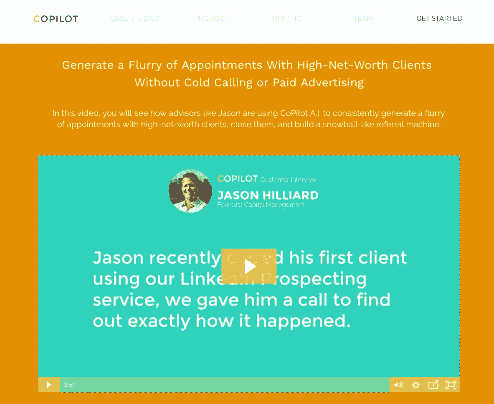
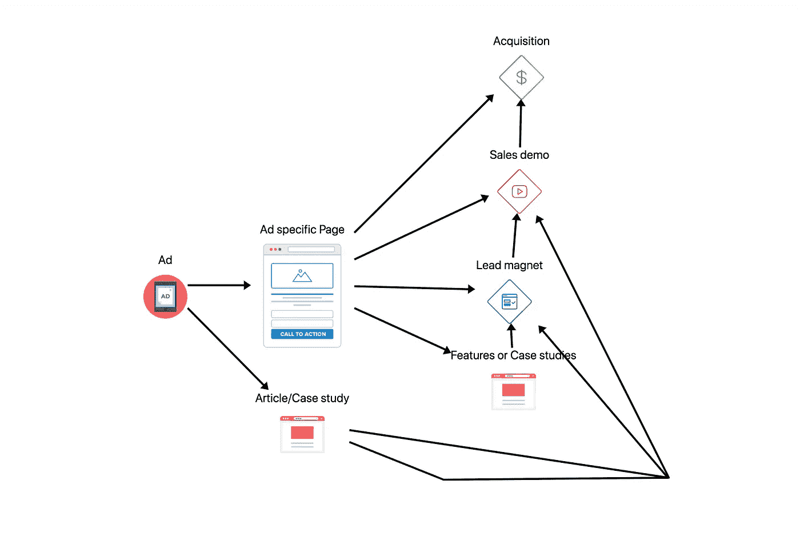
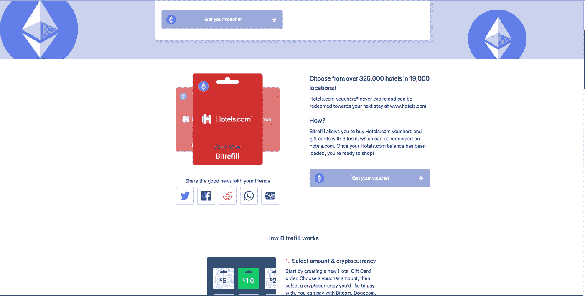
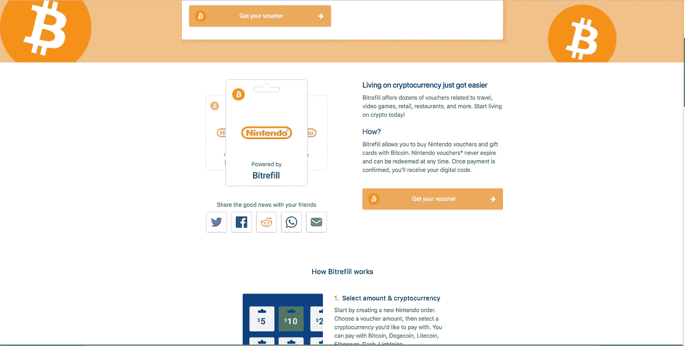
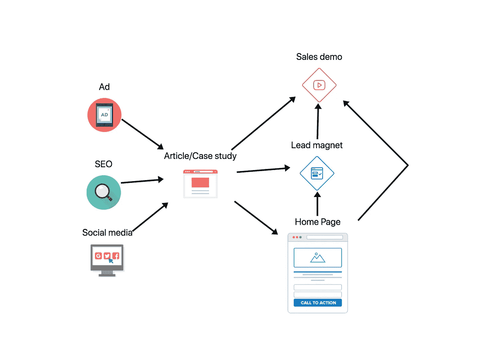

# 亲爱的 SaaS 创业公司…你不需要登陆页面，你需要一个合适的漏斗！原因如下…

> 原文：<https://medium.com/hackernoon/dear-saas-startups-you-dont-need-a-landing-page-you-need-a-proper-funnel-here-s-why-how-36e21f5ce778>

You don’t need a Landing page, you need a Funnel!

我看到大多数创始人担心他们的登陆页面，担心它的外观和如何转换…

但是专注于登录页面根本不会给你带来任何结果！

这仅仅是你需要做的将你的访问者转化为顾客的皮毛。

在这篇文章中，**我将向你展示为什么你需要一个漏斗，是什么造就了一个高转化率的漏斗，以及 SaaS 创业公司的最佳漏斗的例子(在最后)。**

# 你对登陆页面的期望是错误的

大多数初创公司的创始人都希望放一个简单的登陆页面，然后神奇地转化一大部分访问者…

没有异议…没有问题…100%低接触…加上一些魔法…

不…这从来没有发生过！

漂亮的页面不能转换，性感的普通图片可以，使用其他网站作为参考也不行！

> ***相关文章:*** [*别再看大公司的网站做参考了，没用！*](https://www.cortes.design/post/stop-looking-at-websites-from-bigger-companies-for-reference-it-doesnt-work-what-to-do-instead)

 [## 别再看更大公司的网站做参考了，没用的！(+怎么办…

### 查看大公司的网站是一种非常有偏见和危险的方法来为你的登陆获取参考…

www.cortes.design](https://www.cortes.design/post/stop-looking-at-websites-from-bigger-companies-for-reference-it-doesnt-work-what-to-do-instead) 

如果你不改变你的思维模式，你将会寻找错误的指标，并期望登陆页面会完成所有的工作。

这只会让你陷入无尽的迭代，而转化率却没有任何显著的提高。

# 唯一能提高转化率的

CRO 世界充满了噪音…

他们给你微小的调整，颜色的变化，“生理”策略和不可复制的结果。

这是唯一能真正改变访客的东西… **回答异议**。

异议只是一个问题(或一组问题)，人们需要在准备购买甚至尝试您的产品之前得到答案。

**如果这些问题得不到解答，他们将永远不会愿意转变。** ‍

你怎么解决这个问题？

这一切都是为了给正确的受众找到正确的信息(更多信息请见下文)。

> ***相关文章:*** [*如何为你的登陆页识别正确的信息(这是我为我的客户使用的流程)。*](https://www.cortes.design/post/use-this-process-to-identify-which-message-will-make-your-saas-landing-page-convert-the-most)

 [## 使用此过程来确定哪条消息将使您的 SaaS 登录页面转换最多！

### 在这篇文章中，我将向你展示我开发的过程，使我能够把 4-5 页的功能列表，针对 160+…

www.cortes.design](https://www.cortes.design/post/use-this-process-to-identify-which-message-will-make-your-saas-landing-page-convert-the-most) 

# 正确的漏斗与登录页面

这里的大问题是，你期望登录页面做所有的工作和回答所有的异议。 **‍**

**这导致了两大问题。** ‍

#1:没有在购买过程的不同阶段向人们解释正确的东西。

#2:以一个非常模糊的信息结束，这个信息不会改变任何人(同时试图吸引所有人)。

漏斗的想法是根据他们购买的准备程度来划分受众，这样我们就可以适当地确认并跟踪他们，直到他们转变。 **‍**

以下是适当的漏斗相对于只关注登陆页面的一些优势。

# 漏斗更容易追踪

图片来自 Hotjar.com

您可以使用 Google Analytics 或 Hotjar 来跟踪您自己的漏斗，这是一款更加用户友好的工具，可能是我最喜欢的分析工具，您可以免费获得大量功能，[更多信息请点击此处。](http://www.hotjar.com/)‍

**这时你会注意到人们离开的地方以及你需要优化的地方。** ‍

跟踪你的登陆页面如何转换，而不参考其他页面，这没有任何意义。

此外，登录页面可能具有欺骗性，因为转化率的增加可能只是意味着将问题推到漏斗的下一步，这仍然会导致无法获得更多的客户(即使“转化率”增加)。

# 漏斗可以“改变所有人”

使用漏斗，您可以为可能有不同需求或可能有不同问题的不同用户组规划路径。

你不可能在一个登陆页面上回答所有的问题！你需要一个漏斗来正确地划分和鉴定你的访问者。 **‍**

**一个合适的漏斗或“用户路径”可以带来 2-3 倍的单独销售线索**。你最终会将这些线索中的很大一部分转化为客户。

# 对 SaaS 良好漏斗的剖析

一个适合你的 [SaaS](https://hackernoon.com/tagged/saas) 创业的漏斗应该…

# 为寒冷的交通做好准备

冷流量是最难转化的流量，因为他们对你的公司和产品一无所知。

尽管很难将人们从冷冰冰的流量中转化出来，但这是利用你的网站扩大公司规模的唯一方法。 **‍**

你还能在哪里把同一个“音调”重复成千上万次？ ‍

虽然你首先需要一个起作用的“音高”；)

> ***相关文章:****[*SaaS 网站交通温度优化*](https://www.cortes.design/post/optimizing-for-traffic-temperature-in-saas-landing-pages)*

* [## 优化 SaaS 登陆页面的交通温度

### 这些人对你的产品、你的公司或者你如何解决他们的问题一无所知，而你可以…

www.cortes.design](https://www.cortes.design/post/optimizing-for-traffic-temperature-in-saas-landing-pages) 

# 至少提供两种选择

不幸的是，大多数人不会准备好立即转化，所以你需要一些替代的 CTA，它们比立即转化的承诺要少，但仍然可以抓住这些线索，直到他们准备好以后购买。

如果没有这些替代方案，你将只能转化 3-5%的人。

> ***相关文章:*** [*为什么 SaaS 创业公司错失了 70%的转化(+如何修复)*](https://www.cortes.design/post/why-saas-startups-are-missing-out-on-70-of-conversions-how-to-fix-it)

 [## 为什么 SaaS 的创业公司错过了 70%以上的转化率(+如何解决)

### 大多数人只是没有准备好立即转换，所以你的网站应该是一个可预测的转换系统…

www.cortes.design](https://www.cortes.design/post/why-saas-startups-are-missing-out-on-70-of-conversions-how-to-fix-it) 

# 易于调整和跟踪

试着让你的漏斗尽可能简单！

如果你正在创建的漏斗开始变得过于强大，那么你可能还没有找到在你的网站上使用的最好/最简单的信息。

它可能仍然转换得比较好，但是如果它不简单，你可以忘记能够跟踪哪些东西工作得最好，这样你就可以加倍努力，因为很难区分它。

# 资源:一个伟大的(免费)工具来设计这些漏斗

You can get a breakdown of this funnel in step#5 of my free video course

这是我在开始设计页面之前为我的客户设计漏斗的工具。

它使用起来非常简单，并且拥有你需要的大部分功能。

你猜怎么着？可以免费使用！

# SaaS 创业公司的好渠道

这里有几个 SaaS 创业公司的好渠道的例子。

这不是一个完整的列表，但是这里有一些最重要/最有用的(排名不分先后)

# 高度接触/演示型漏斗

SaaS 初创公司的高接触度/演示驱动漏斗

我最喜欢的，最可预测的，带来最多收入的。

这是最难做对的事情之一，尤其是当你没有钱做广告的时候，但是它也能带来最大的回报。

对于高接触和/或高门票 SaaS，你应该把重点放在你的产品可以带来的结果，并简要说明你的产品如何可以达到目的。

你的登陆页面应该关注结果的原因是，如果你卖的是更贵或更复杂的产品，转化的承诺会更高，所以你需要给人留下深刻的印象。如果你的产品不能产生很好的效果，你就不应该收取这些价格。

这里有一个来自 Copilotai.co 的例子。

在这种情况下，他们使用网上研讨会作为销售线索磁铁，但主要目标是让你与他们通话，这样他们就可以向你推销。这是非常有效的，甚至可以让你计算出你的客户获取成本，看看你是否真的可以通过付费广告扩大这一规模(下一个漏斗)。

如果做得好，它会产生足够的好奇心来安排演示，你知道你的销售团队(或你自己)可以将这些演示转化为客户甚至线索，你可以使用最终会变成演示电话的点滴电子邮件活动。

这个漏斗的另一个很好的用途是在客户面试时接到演示电话，这样你就可以得到尽可能多的关于你的产品的反馈。

在这种情况下，因为你可能没有结果显示你可以专注于你的产品带来的最大利益。

例如，如果你说“你可以减少 50%的 X 错误”(或类似的话)，那么这个人可能会对你的产品的投资回报率有一个粗略的想法，尽管它不如结果驱动的方法有效。

# 付费流量漏斗

SaaS 初创公司的付费流量漏斗

这个漏斗可能与上面的类似，但你可以使用更多的重定向广告，获得更多的冷流量。

如果你使用付费流量，你有能力获得一个激光聚焦目标，这将最有可能对你的产品感兴趣。

一个常见的错误是驱动这种付费流量到登陆页面，这是不应该的！

你将把一个高度集中的观众带入一个没有多大意义的普通页面。

只有当人们觉得解决方案是为他们量身定做的时候，他们才会改变想法，所以你需要为他们制作一个定制的页面。

**听起来工作量很大吗？**嗯真的不是！

有了正确的技能，你可以创建非常棒的动态模板，这些模板将会非常集中，并且易于复制，而不会被人注意到。 **‍**

## 这是我的一个客户(Bitrefill)的一个例子。‍

在这种情况下，我设计了一个模板，以便他们可以针对自动生成的凭证、加密货币和受众的不同组合！
‍

Hotels.com+以太坊的例子

任天堂+比特币的例子

相同的页面，但不同的信息和目标受众。

通过这种方式，他们能够利用社交媒体+搜索引擎优化将合适的人带入他们想要的产品中。

结果呢？惊人的转化率(在这种情况下不能透露确切的数字) :)

# 内容营销漏斗

内容[SaaS 创业公司的营销](https://hackernoon.com/tagged/marketing)漏斗

这是一个基本的方法，但是有很多可以使它成功或失败的调整(我可能会单独写一篇关于这个的文章)。

基本上，在这种情况下，你的登录页面将是一篇博客文章，这意味着你必须将大量的访问者转化为查看你的服务(主页)或注册你的销售线索磁铁。

否则，你可能会写出很棒的内容，获得大量的流量，但你不会转化任何人:(

例如，如果你看我的博客，我也有几个 CTA，让很多人看到我提供的服务(在我的主页上)。如果我不这样做，我就不会得到任何免费课程的注册(也就是领导)和潜在项目的来电。

# 想要一个合适的渠道将访客转化为客户？

当构建这样的系统时(没有适当的经验),可能会有很多问题，但是一旦你让它们运行起来，它们可以为你的创业公司带来很多线索和收入。

您愿意讨论一下这将如何为您的企业服务吗？

让我们谈谈你目前的问题，以及我们可以做些什么来为你的网站创造更多的收入。

[‍Schedule 免费攻略环节在此](http://www.cortes.design/consultation)

*最初发表于*[*www . cortes . design*](https://www.cortes.design/post/dear-saas-startups-you-dont-need-a-landing-page-you-need-a-proper-funnel-heres-how)*。**