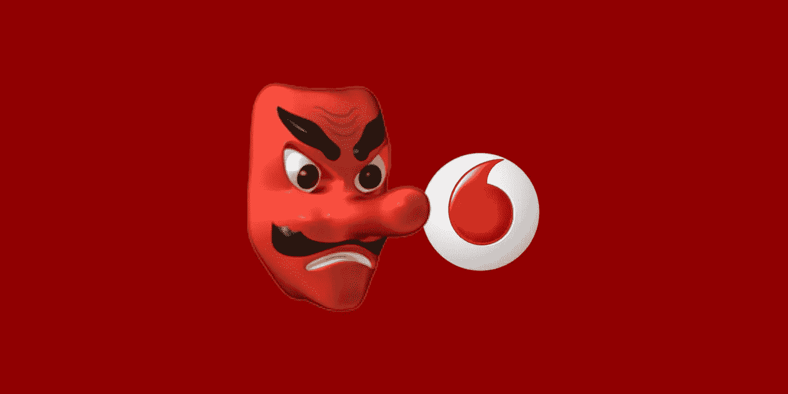
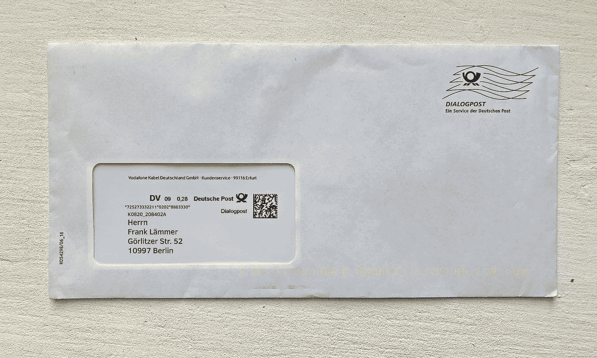
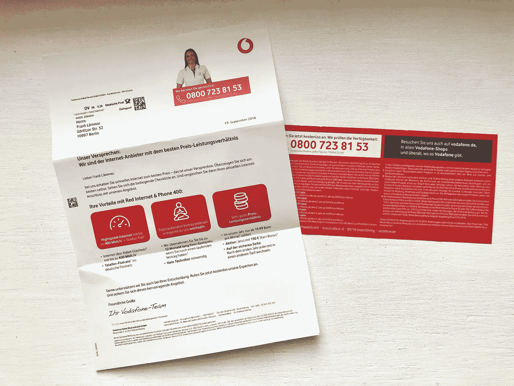
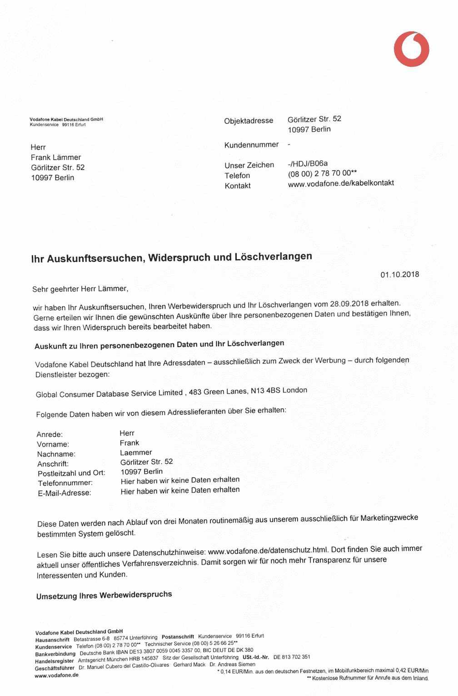
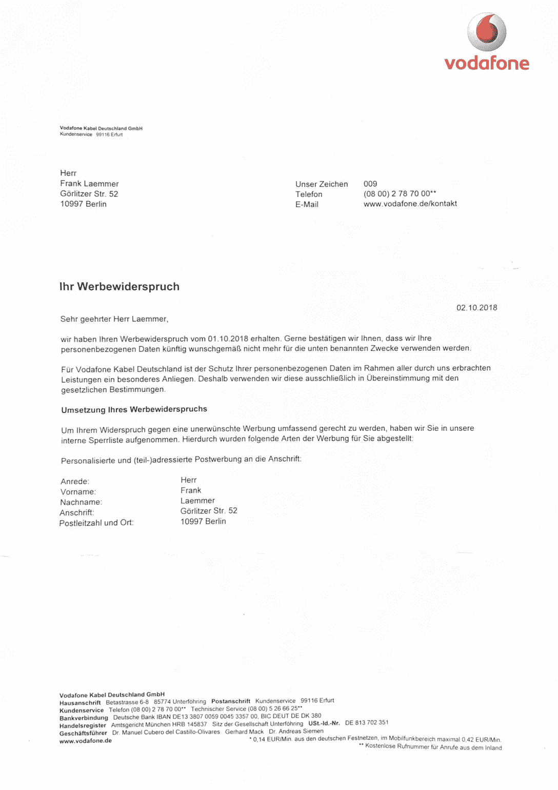

# 亲爱的沃达丰，请尊重我的隐私

> 原文：<https://medium.com/hackernoon/dear-vodafone-please-respect-my-privacy-c4a70283760>

## 主题:未经同意的蜗牛邮件，我想被遗忘！

亲爱的沃达丰，
我定期收到您的邮件:

No Logo. Vodafone is printed in small size as the return address.

我经常不小心打开它们。只是为了找到这样的东西:

snail mail SPAM at its best

蜗牛邮件因为技术原因没有一键退订。我明白了。

[我在推特](https://twitter.com/frank_laemmer/status/1044517831621193728)上问过你的服务团队。他们无法回答我的问题，因为我甚至不是客户。是的，我已经收到这些邮件，而不是客户。我想知道为什么。因此，根据 [GDPR](https://hackernoon.com/tagged/gdpr) 的说法，我写了一封数据主体访问请求电子邮件，发给您的数据保护官:

> *嘿，伙计们，看来你们有我的资料。为什么？你从哪里得到它的？*

几天后，我收到了两封蜗牛邮件(这一次，邮件外面有清晰可见的沃达丰(Vodafone)标志)。这是第一个:

我了解到你使用我的地址仅仅是为了营销的目的，而且你是从一家名为“全球消费者数据库服务有限公司”的公司收到的，这是一个多么奇怪的通用名称啊。经过网上的一些研究，我很确定这是一家信箱公司。2018 年 10 月 26 日成立[，我的请求仅在两天后完成，但垃圾邮件之前就已经发生了。](https://beta.companieshouse.gov.uk/company/11589671)

注册在一个托管董事名下。我发现他与英国 350 多家公司有联系，其中许多公司与 T2 的名字相似，注册地址相同。我还发现了[多个](https://christ.media/vorsicht-bei-e-mail-ihr-stadteintrag-201617) [帖子](https://burrenblog.wordpress.com/2015/09/28/neue-alte-datenkrake-wieder-unterwegs-fundstueck-der-woche/) [抱怨](https://www.phishingmails.de/ihr-stadteintrag-aktuell-performance-interactive-marketing-ltd/) [关于](https://macandegg.de/2018/02/spam-der-capitax-ag-melanie-bieder-mueller-existiert-nicht/) [垃圾邮件/钓鱼邮件](https://rout0r.org/2018/02/14/erneute-ping-mails-von-melanie-bieder-mueller/)，甚至还有一篇[报纸文章，关于以他的名义进行的网络欺诈导致的警方突袭](http://www.maz-online.de/Lokales/Prignitz/Pinnower-will-Loeschung-seiner-Daten)。

亲爱的沃达丰，我感觉有些事情不对劲。我想知道这一切的背景。

你有没有意识到，你正在与犯罪的垃圾邮件发送者合作？或者你只是在使用和一些垃圾邮件发送者一样的邮箱公司即服务？如果有，为什么？我的邮政地址怎么会出现在你的数据库里？我一般不参加促销比赛。是某种网络搜索吗？亚马逊卖了我的地址吗？某个地方有数据泄露吗？我的地址是在什么情况下交易给你的？这是一种普遍的做法，每个人都这样做吗？

但是让我们回到第二封信:

它说:为了确保我不会再收到任何营销邮件，你需要将我的邮政地址存储在一个数据库中。

我完全明白，这种黑名单是避免任何未来邮件的最安全的实现方式，因为你可能打算继续购买更多的邮政地址用于营销目的。

我被遗忘的权利呢？

我看到你只是确保从未来的邮件中排除我，但我仍然不希望你存储我的任何数据。

亲爱的沃达丰，这是我给你的建议:停止遵循黑暗模式。不要买非法获取的地址池来炮轰我这样的公民。再看一眼顶部显示的营销信:你不同意整体视觉外观和文案令人讨厌吗？我无法想象任何一个正常人会说:“哇，这是一个很酷的提议！”这些字母本身正在损害你的强势品牌。让人们对你要说的感兴趣，他们就会订阅。

我自己也是小企业的创始人。[我们投入了大量时间来遵守欧洲通用数据保护法规](https://blog.fortrabbit.com/fortrabbit-is-gdpr-ready)。我不是最大的 GDPR 球迷，但我完全看到了这里的价值。**请多点隐私！**

感谢阅读！

你诚挚的
军衔