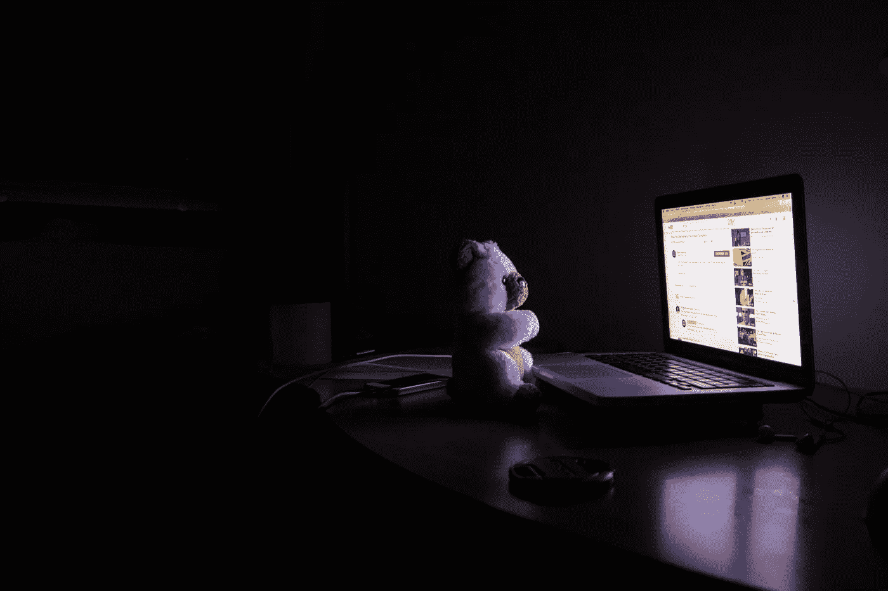
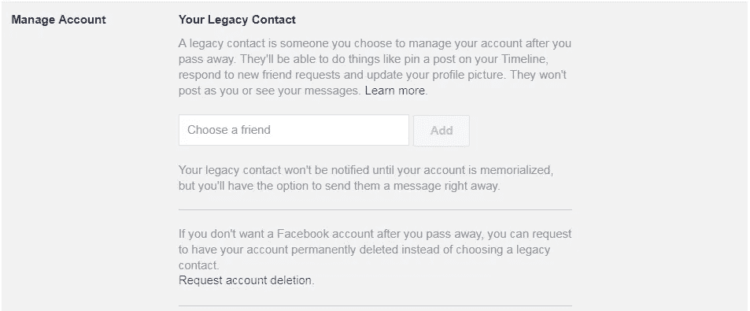
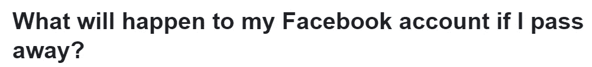

# 社交媒体上的死亡(和出生)

> 原文：<https://medium.com/hackernoon/death-and-birth-on-social-media-39f2dc8777cd>

## 当你死后，你在脸书的个人资料会发生什么变化？

image source: [pexels](https://www.pexels.com/photo/bear-business-computer-connection-461497/)

前几天晚上，我在查看我在[脸书](https://hackernoon.com/tagged/facebook)上的账户设置，看看是否有可能制作不止一个个人资料页面(我既想要一个“真实的”页面，也想要一个专业的页面)，但我被一个特别的设置吸引住了。上面写着:*修改你的遗留联系人设置*。我不熟悉这个设置，所以我点击它来查看更多。原来“传统联系人设置”的真正含义是:**决定你死后你的个人资料会发生什么。**

天哪，脸书，谢谢你突然把我自己的死亡扔在我面前…

Facebook’s “Legacy Contact” settings

我想在死后有一个纪念页吗？如果我的朋友和家人继续在我的墙上发帖，分享回忆，或者集体哀悼，我会喜欢吗？或者我希望我的页面被删除？脸书怎么会知道我死了？？

当我完全没有考虑这些事情的时候，这么多的问题突然向我袭来。我甚至没有立遗嘱，但是我在考虑如果我死了，我会如何处理我的一个社交媒体账户。

我震惊地关闭了浏览器。但我想这就是现在的生活。一个人去世时必须注意的事情包括:讣告、葬礼、财务、社交媒体。这是个奇怪的时代。

Question on [Facebook’s Help Center](https://www.facebook.com/help/103897939701143)

如果你和我一样有病态的好奇心，脸书有一个方便的帮助页面,解释如果你死了，你的账户如何处理。我觉得有点令人不安的是，脸书没有使用“死亡”或“死亡”这两个词。他们只用平淡无奇、毫无感情的一句话“过世”。

我想“去世”是更敏感的词，但不知何故感觉更冷。就像他们在低声耳语一句禁忌语。直截了当地说出来，脸书:死亡。死了。去死吧。使用行动词汇。“去世”听起来像是我刚刚打了个盹。你还不如说“过期”。是的，*“一旦到期，我的脸书帐户会怎么样？”那有一个漂亮的黑色镜子，不是吗？*

无论如何，如果你选择在死后删除你的个人资料页面，你的朋友或家人需要联系脸书，通知他们你的死讯。关于这一点也有一个方便的帮助页面。为了删除你的个人资料页面，脸书要求一份你的死亡证明。如果你的家人不能提供死亡证明，脸书将接受一些其他文件，如你的遗嘱和你的讣告副本。

> 如果我死了，然后我所有的朋友和家人都死了，然后在某个时候，我们都只是纪念脸书页面？

我不确定我死后是否希望我的脸书主页被删除，但我想是的。你一定知道至少有一个人去世了，他的个人资料页面变成了一个纪念物。你不觉得有点奇怪吗？

我觉得这很奇怪，为一个永生的人建立一个数字纪念碑。我想知道脸书是否会移除纪念页？如果我死了，然后我所有的朋友和家人都死了，然后在某个时候，我们都只是纪念脸书页面？太可悲了。我不想作为一个纪念脸书·佩奇而存在。我不希望人们发帖说他们想念我，或者他们不敢相信又一年过去了。

我想让人们用传统的方式去悲伤和哀悼。我想让他们把我的骨灰倒在野外的某个地方，也许在倒的时候还会朗诵一首诗。我想让他们把我的照片塞在旧书里，或者挂在稍微有点歪斜的相框里。我希望他们在餐桌上或长途汽车旅行中分享故事。我想让他们找到并阅读我的日记，同时感到娱乐、恐惧和好奇。我想让他们记住我身上的味道，我笑的样子，以及我尴尬时脸红的样子。

我不希望他们能够回到 2008 年，看到我写了一篇抱怨铲雪的帖子。我不想让他们翻回去看到我分享的愚蠢的迷因，或者知道我“喜欢”一个甚至已经不存在的乐队。这些都不重要。我笑的方式很重要。

这让我想到，当你死后，你的数字存在还会发生什么变化。推特呢？Instagram？Gmail？我不是第一个思考这些事情的人。网上到处都有帮助页面和文章。 [Twitter 允许你的家人请求停用你的账户](https://help.twitter.com/en/rules-and-policies/contact-twitter-about-a-deceased-family-members-account)。与脸书类似，[的 Instagram 账号可以被删除或者变成纪念物](https://help.instagram.com/264154560391256?helpref=faq_content)。Gmail 允许你在去世前指定一个“非活动账户管理人”，或者在你去世后让你的家人处理你的账户。

生命光谱的另一端是出生。社交媒体上的出生几乎和死亡一样奇怪。除了怀孕公告和出生公告以及所有这些显示婴儿在填充动物旁边变大的照片的喧闹之外，还有一个问题*婴儿什么时候有自己的社交媒体账户？*

好吧，也许不是在他们还是婴儿的时候……但也许是在他们十几岁的时候？

我真的非常非常高兴，直到我上大学的时候，社交媒体还不算什么东西(事实上，我非常高兴我使用了所有这些副词)。我上高中时，MySpace 就存在了，但没有人经常使用它，当然也不会像脸书现在这样使用。人们肯定没有把婴儿照片放在 MySpace 上。

但是今天长大的孩子很可能在他们还不知道脸书是什么的时候就已经把他们的照片贴满了互联网。父母在没有得到孩子的同意，甚至不知道这种事情正在发生的情况下，张贴他们孩子的照片。想到有一天你在[未来的](https://hackernoon.com/tagged/future)雇主可以用谷歌搜索你的名字，找到你小时候的照片，这有多奇怪？或者更糟:你尴尬的青少年时期的照片？

一个人的一生，从出生到死亡，直到被纪念，都可以被记录在脸书上。

这让我很不舒服。

我不是一个家长，因此我可能根本没有权利告诉任何人如何为人父母，但我知道，如果我真的有了孩子，我不会把他们的照片放在社交媒体上。这个世界上总有一些东西是神圣的，我认为死亡和婴儿照片就是它。

如果你想知道，我最初问题的答案是否定的和肯定的。您不能将两个脸书个人资料与同一个电子邮件地址关联，但是如果您需要个人和专业页面，您可以使用不同的电子邮件地址创建第二个个人资料。

这提供了一个全新的选择。也许我会让私人的我死去，从脸书消失，但我会让职业的我被纪念？两个版本的我，两个版本的网上死亡。真是奇怪的时代。