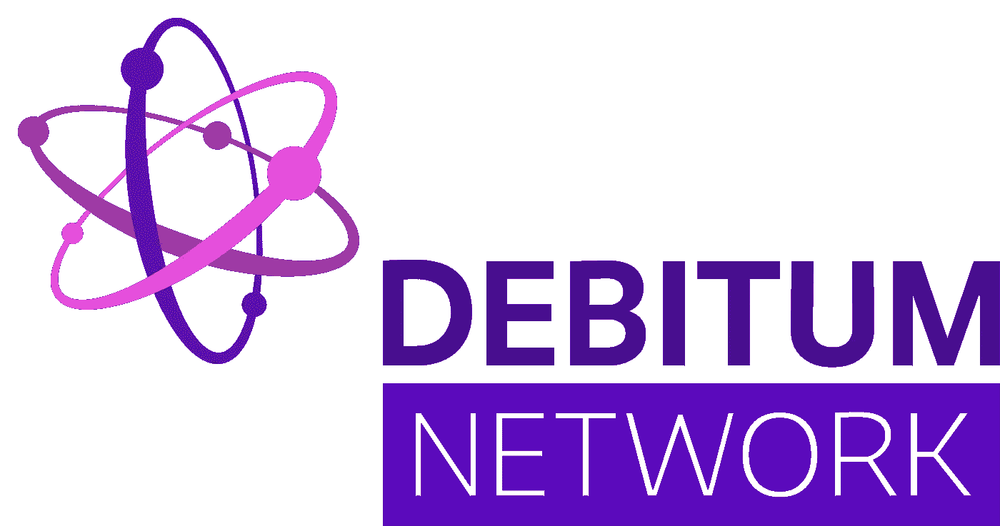

# Debitum:区块链上的无国界小企业融资网络

> 原文：<https://medium.com/hackernoon/debitum-a-borderless-small-business-financing-network-on-the-blockchain-785500fc868a>

Debitum 是一个无国界的小型企业融资网络，旨在改革替代金融行业，使更多的中小型企业能够在以前困难、耗时或根本不可能的情况下获得贷款。

通过实施以太坊区块链以及智能合同和离线应用程序，Debitum 将改造替代金融行业，以更好地帮助小型企业获得贷款。

根据世界银行的一项审查，尽管中小企业中超过 2/3 的中小企业无法获得信贷。近年来，通过个人对个人贷款、众筹、资产负债表贷款、发票交易(由应收账款支持的贷款)和增值税融资等替代融资方式为中小企业融资提供了帮助，但没有一种单一的解决方案涵盖所有业务领域。结果，据世界银行组织和国际金融公司统计，全球信贷缺口仍然高达 2 万亿美元。

另类融资可以被看作是帮助小型企业成长的一种方式，直到它们变得“有利可图”；勾选现代银行巨头发放贷款所需的所有方框。然而，虽然新的在线市场可以到达全球的各个角落，但这些非加密或法定的解决方案仅限于在单一市场内运行，通常基于该地区使用的货币以及不同的文化和商业道德。

通过使用加密货币，区块链有能力真正为替代贷款创造一个开放的市场。密码是无国界的，在世界上任何地方都有同样的价值。这给了 Debitum 一个通用的支付工具，可以帮助解决导致如此大的信贷限额的问题之一。此外，开源软件和自动化智能合同使这种系统能够在没有任何中介的情况下运行，这消除了中间人费用，使这一过程比传统方法便宜得多。

**借方信息**

**硬币名称:** Debitum (DEB)

**总供应量:** 4 亿

**Ico 前价格:**0.1000 美元

Ico 价格:【0.02833 美元

**通过 ICO 筹集的代币/资金:**筹集 680 万美元/ 6000 ETH

**白皮书:**[https://debit um . network/assets/files/debit um-White-Paper . pdf？a_aid=bon](https://debitum.network/assets/files/Debitum-White-Paper.pdf?a_aid=bon)

**令牌类型:** ERC223

**苦味生态系统**

**三大民族精神支柱……**

Debitum 建立在三个主要支柱之上，包括真正的去中心化，混合连接加密和菲亚特，以及基于信任。通过这些基金会，它寻求将中小企业与寻求分配资本和增加投资组合的全球投资者联系起来。

**社区**

为了做到这一点，Debitum 将参与者组织成称为社区的团体。每个社区将由各种服务提供商和机构借款人组成，这些借款人可以是个人，也可以是已经在该行业运营的另类金融公司。

该系统鼓励每个用户以及整个群体通过对他们的行为进行评级来参与生态系统并获得更多信任。每一笔交易和每一项服务都将为社区赢得一个等级，或者失去一个等级。

社区由一个领导者管理，当成员活跃时，他从社区的信任套利智能合同中收取费用。这将激励领导者发展业务和壮大社区。该小组还负责解决问题，信任套利智能合约中内置了其他功能，以便领导者可以管理这项任务。

这种社区结构确保分散的生态系统自给自足，参与者保持控制。

为了建立社区，用户或组织实现了 *Debitum 网络社区*智能合同接口/ API。发起者必须为社区成员提供一个评级计算算法，并让 Debitum Network Trust Arbitrage 对其进行审计。或者，*社区信任套利*智能合约也适用于那些不需要自己编写算法的人。

不适当的行动，或表现不佳的用户将被要求改善他们的行为或面临从社区中删除。如果这些行为没有被跟进，那么社区领导，有时甚至是社区本身，可以冻结他们的借项代币，直到决定解决这种情况。这可能包括将令牌退还给受影响的一方，降低评级，甚至禁止用户进入网络。

**混合连接密码和菲亚特**

加密货币和区块链的引入推动了分散式平台的发展，这种平台没有边界，不受昂贵的货币汇率的影响。然而，尽管 cryptos 的无边界特性向全球用户开放了货币，但概念背后看似复杂的技术，以及缺乏旨在管理这些财务的用户友好的应用程序，严重阻碍了该技术的采用；这是 Debitum 必须解决的一个问题。

为了让那些可能对区块链了解不多的人更容易使用这个平台，该团队引入了一个混合连接加密和法定货币协议。这使得用户可以获得贷款，并以法定货币偿还，所有交易仍通过指定的法定服务商记录在区块链上。

Debitum 令牌是一种 ERC223 令牌，可单独用于支付网络交易，而被借出的资金可通过传统货币进行管理。密码仍然处于早期阶段，因此仍然非常不稳定。引入一种混合格式，使贷款原则和利息支付能够使用现有遗留系统以传统方式进行管理，这使得对 cryptos 和区块链很少或没有经验的人更容易理解整个系统。

**贷款资本**

尽管这个平台是在 p2p 的基础上运行的，但是 Debitum 意识到不仅仅需要一个简单的双重方法。相反，网络需要三方来形成一个社区；贷方、借方和投资者。

投资者取代了贷款经纪人的职能，取代了不需要收取高额费用的既得利益方的中间人。

贷款资本来源于链外交易的实物商品。借款人拿出资产作为贷款的抵押品。然后，验证者评估交易，概述风险因素，并批准资产以创建定价结构。然后，投资者可以为协议投保，以确保全部或部分还款。然后，投资者可以使用二级市场来清算他们的贷款头寸，新的投资者可以进入市场来获得已经投资的头寸。

然后，借款人偿还贷款，或违约，此时债务收集过程开始，保险单执行。交易完成后，信任等级会根据智能合同进行更新，该合同定义了所有参与者的条件。

Debitum 将确保与其他现有金融或金融科技解决方案的兼容性和互操作性，为新进入或目前正在替代金融行业运营的公司提供一种方式，以整合他们的服务，为寻求信贷的中小企业创建一个有效的求助中心。

最小可行产品(MVP)已经可以从该公司的网站上获得，

**现实世界应用**

借方最初将针对那些没有被授予商业信任的国家。这将有助于缩小信贷差距，因为这些国家极大地造成了那些能够获得信贷的人和那些不能获得信贷的人之间的巨大差异。

该平台有许多实际应用。其中之一如下:

被剥夺获得企业贷款的机会会严重阻碍增长，因为以前为该地区大多数小企业提供资金的当地银行已经萎缩，取而代之的是更大的金融公司式银行，它们使用不灵活的标准化遗留解决方案来管理更大的企业，从而实现利润最大化。

在互联网时代之前，大多数中小企业通常能够从当地银行和建筑协会获得贷款。然而，新数字时代的曙光涵盖了金融行业的大部分，因此，这些帮助推动当地经济发展的当地银行被只对为更大回报的更大项目融资感兴趣的大公司所取代。

银行系统的这种转变迫使许多中小企业倒闭，直到今天，小公司比以往任何时候都更难获得实现增长所需的金融帮助。

例如，一家因午餐菜单而受欢迎的三明治外卖店收到了一位常客的订单；同一建筑中位于较高楼层的办公室。但是，最近办公室扩大了，团队通常订购的不是 30 份三明治和饮料，而是 100 份三明治和随附的饮料。顾客每周至少订购 3 次，因此，为了确保额外的 70 份三明治成为常规订单，商店能够处理并正确处理顾客的请求是非常重要的。一个相当简单的等式，除了最后一分钟的订单意味着他们不能从他们的常规供应商那里得到原料，而是他们必须去市场或超市用现金支付。

以零售价格购买原料和供应品会增加成本，降低利润；此外，这会导致现金流问题，因为商店可能没有应急资金来进行额外的购买。

不幸的是，对于中小企业来说，类似的情况非常普遍，而且他们经常得不到贷款。因此，增长明显受阻，在某些情况下，这种情况可能会导致商店失去顾客，因为现在 70 像素的办公室工作人员仍然希望一起吃饭，因此将他们的业务转移到其他地方。

使用 Debitum，商店可以自动找到愿意贷款的人，贷款几乎可以立即发放。现在可以购买原料，一旦收到收入就可以偿还贷款

**社交媒体信息:**

**脸书 **

网址:https://www.facebook.com/DebitumNetwork？a_aid=bon

喜欢:14 172 个喜欢者 14 731 个关注者

过去 7 天有多少帖子/更新:10 条最新更新

***推特***

网址:https://twitter.com/DebitumNetwork？a_aid=bon

追随者:4 310 名追随者

过去 7 天有多少条推文/转发:7 条最近的转发/推文

***电报***

网址:https://t.me/joinchat/G6KFmURKsu0FIfJetJ3mOA？a_aid=bon

用户:7 566 名成员

***电报管理员***

用户名:@mliberts

用户名:@mmackevicius

用户名:@donatasj

用户名:@Vytiss

用户名:Justas alti NIS-debit um Network

***Reddit***

URL:https://www . Reddit . com/r/DebitumNetwork/

读者:107 名读者

***Youtube***

网址:https://www . YouTube . com/channel/uckwnaigaj 2 xfudt 1 GRM 7 SOA

订户:638 名订户

***中等***

网址:https://medium . com/debit um-network

关注者:未显示

过去 7 天有多少次更新:3 次最近更新

***领英***

网址:[https://www.linkedin.com/company/24999208/?a_aid=bon](https://www.linkedin.com/company/24999208/?a_aid=bon)

追随者:183 名追随者

过去 7 天有多少次更新:4 次最近更新

***GitHub***

网址:https://github.com/debitum

过去 7 天有多少更新:最近没有更新

***多余的***

BitcoinTalk 网址:[https://bitcointalk.org/index.php?topic=2321064.0?a_aid=bon](https://bitcointalk.org/index.php?topic=2321064.0?a_aid=bon)

**员工/团队信息:**

名字叫:mārtiņš·李伯茨

头衔:联合创始人/远见者

简历:在技术、金融和未来方面有深刻见解的知名高管和企业家。

领英:https://www.linkedin.com/in/martins-liberts-6607b6/？a_aid=bon

额外链接:https://twitter.com/mliberts？https://medium.com/@mliberts?a_aid=bon

姓名:多纳塔斯·尤德利斯

头衔:联合创始人/合伙人关系

生物:全球网络在世界范围内建立强大的联系，并有能力激励个人加入这一事业。

领英:https://www.linkedin.com/in/donatas-juodelis-60886465/？a_aid=bon

姓名:胡斯塔斯·阿尔蒂尼斯

头衔:联合创始人/融资运营

生物:成功认证的 CFA，在创建另类融资生态系统方面有良好的记录。

LinkedIn:https://www . LinkedIn . com/in/just as-% C5 % a1 alti NIS-CFA-57a 93714/？a_aid=bon

姓名:mavydas Mack viius

职位:技术负责人/区块链技术专家

Bio:注册企业架构师，在开发安全、可扩展的金融和全球解决方案方面拥有丰富的经验。

领英:https://www.linkedin.com/in/mazvydasmackevicius/？a_aid=bon

额外链接:https://github.com/debitum？a_aid=bon

姓名:马尔特·卢姆

职位:首席产品经理

简历:成为 Slack 的第一名员工。在过去的 10 年中，已经产生了许多成功的消费者和企业软件项目。

领英:https://www.linkedin.com/in/martlume/？a_aid=bon

姓名:莫妮卡·瓦尔卡莱特

职位:首席营销官

生物:鼓舞人心的专业人士，具有强大的品牌创建、营销和 UX/UI 背景。

领英:https://www.linkedin.com/in/monikavarkalyte/？a_aid=bon

姓名:雷金纳德斯·拉伊拉

头衔:软件开发人员

Bio:经验丰富的企业开发人员，专注于金融和支付相关解决方案的业务流程自动化开发。

领英:https://www.linkedin.com/in/reginaldas-raila-b5aba094/？a_aid=bon

姓名:安德留斯·比利内维丘斯

头衔:软件开发人员

Bio:专注于用户体验和设计的热情的前端开发人员，不断改进他的干净编码和部署自动化技能。

LinkedIn:https://www . LinkedIn . com/in/and rius-bilinevi % C4 % 8d ius-563199110/？a_aid=bon

姓名:托马斯·巴伯利斯

头衔:软件开发人员

生物:对他的理论物理和天体物理硕士学位感到兴奋，喜欢解决复杂和基于算法的挑战。

领英:https://www.linkedin.com/in/tomas-babelis-022167101/？a_aid=bon

姓名:保利乌斯·加斯纳斯

头衔:软件开发人员

Bio:集成专家，能够连接任意两个解决方案，确保最终解决方案的高安全性和可扩展性。

LinkedIn:https://www . LinkedIn . com/in/pauli us-gas % C4 % 97 nas-0b 6585113/？a_aid=bon

姓名:Vytis Papeč kys

职位:业务发展经理:

生物:喜欢国际社区和网络，有强烈的目标感，喜欢从事有意义的项目。

领英:https://www.linkedin.com/in/vytis-papeckys-5b4995110/？a_aid=bon

姓名:Eglė Sereič ikienė

标题:操作

生物:注重细节的专业人士，在中小企业融资操作方面有丰富的经验。

姓名:埃维莉娜·斯图恩蒂安

职位:沟通经理

简历:Evelina 是一名优秀的文案和翻译，拥有社交媒体、通信和社区管理方面的背景。

领英:https://www.linkedin.com/in/evelinastundziene/？a_aid=bon