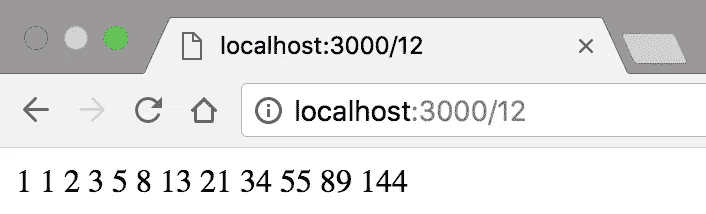
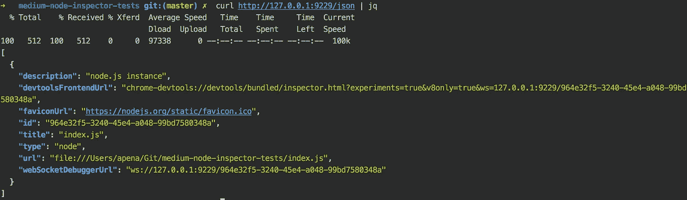
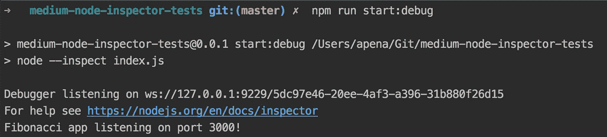
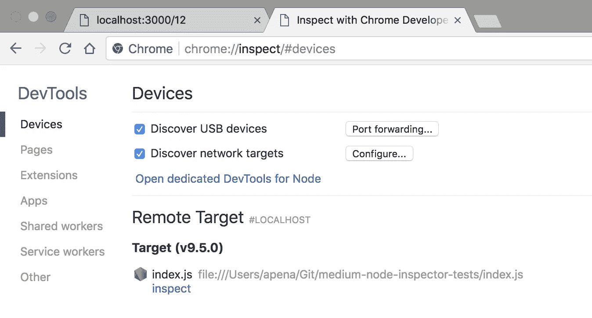
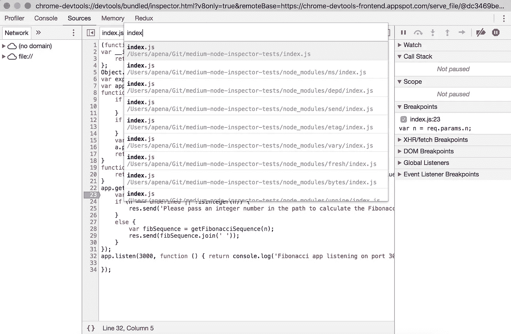
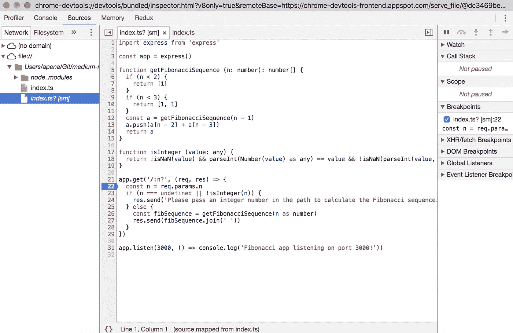

# 使用 Chrome DevTools、VS Code 和 WebStorm 调试 JavaScript/TypeScript 节点应用程序🐞🔫

> 原文：<https://medium.com/hackernoon/debugging-javascript-typescript-node-apps-with-chrome-devtools-vs-code-and-webstorm-97b882aee0ad>


本文涵盖了使用[节点检查器](https://github.com/node-inspector/node-inspector)调试 JavaScript 和[类型脚本](https://www.typescriptlang.org/) [Node.js](https://nodejs.org/en/) 应用程序，使用 [Chrome DevTools](https://developer.chrome.com/devtools) 、 [Visual Studio 代码](https://code.visualstudio.com/)和 [WebStorm](https://www.jetbrains.com/webstorm/) 。

如 [Node.js 调试指南](https://nodejs.org/en/docs/guides/debugging-getting-started/)中所述，Node.js 6.3 引入了[“inspect”和“inspect-brk”CLI 参数](https://nodejs.org/api/cli.html#cli_inspect_host_port) ( `node --inspect [file]` 或`node --inspect-brk[file]` )，使`node`通过 WebSockets 监听由 [Chrome 调试协议](https://nodejs.org/api/debugger.html#debugger_v8_inspector_integration_for_node_js)定义的诊断命令。该协议已经取代了 [V8 调试协议](https://nodejs.org/en/docs/guides/debugging-getting-started/#legacy-debugger)(现在称为遗留协议)，该协议在节点 7.7 上已经过时。

此外， [Node CLI 还提供了一个“require”参数](https://nodejs.org/api/cli.html#cli_r_require_module)，用于预加载模块(`node --require [file]`)，但最重要的是，出于调试目的，[它允许第三方库挂钩到“require.extensions”模块](https://gist.github.com/jamestalmage/df922691475cff66c7e6)，并使 Node 能够编译和生成其他语言(如 TypeScript)的源代码映射。为了调试 TypeScript，我们将使用 [ts-node](https://github.com/TypeStrong/ts-node) 。重要的是要记住，在你的`tsconfig.file`，可以通过运行`tsc --init`生成，你应该有`“sourceMap”: true`，这是默认值。

我准备了一个 [GitHub repo](https://github.com/andrerpena/medium-node-inspector-tests) 和一个计算斐波那契数列的简单快速应用程序。我推荐你[克隆它](https://github.com/andrerpena/medium-node-inspector-tests)来跟随，但是这不是继续阅读这篇文章的必要条件。

```
$ git clone https://github.com/andrerpena/medium-node-inspector-tests.git$ cd medium-node-inspector-tests$ npm i
```

[我还为我们将在本文中运行的所有命令创建了脚本](https://github.com/andrerpena/medium-node-inspector-tests/blob/master/package.json)。如果您在阅读本文时没有克隆回购协议，请参考以下内容:

在您的环境设置好之后，您应该能够`npm start`并访问`localhost:3000/[n]`来查看斐波那契数列。



因为我想展示 JavaScript 和 TypeScript 调试，所以我先写了 [index.ts 文件](https://github.com/andrerpena/medium-node-inspector-tests/blob/master/index.ts)，而 [JavaScript 版本](https://github.com/andrerpena/medium-node-inspector-tests/blob/master/index.js)是由`tsc`生成的，所以看起来有点难看。如果你的代码主要是用 JavaScript 写的，你显然不会有这个问题。

## 在调试模式下运行

我们将探索两种调试模式。使用`--inspect`和`--inspect-brk`。不同的是，在附加像 Chrome DevTools 这样的代理之前，后者不会实际开始执行您的代码，一旦附加，它会在第一个用户代码行自动中断。

当 Node.js 应用程序在“检查”模式下启动时，将会发生两件重要的事情:

1.  一个`UUID`将被分配给这个调试会话，并且一个 [WebSockets](https://developer.mozilla.org/en-US/docs/Web/API/WebSockets_API) 端点将在`ws://127.0.0.1:9229/[UUID]`启动。这个端点将用运行代码的当前状态流式传输实时事件。
2.  一个 HTTP 端点将在`[http://127.0.0.1:9229/json](http://127.0.0.1:9229/json)`旋转起来。这允许像 Chrome DevTools 这样的代理了解每个正在运行的节点会话及其各自的`UUID`。

可以`curl` `[http://127.0.0.1:9229/json](http://127.0.0.1:9229/json)`。更多信息[点击此处](https://nodejs.org/en/docs/guides/debugging-getting-started/#legacy-debugger):



## 使用 Chrome 开发工具调试 JavaScript

运行:

```
npm start:debug // if you're on the suggested repo or...
node --inspect index.js // ...otherwise.
```

您应该会看到类似这样的内容:



您可以看到 WebSocket 服务器已经在端口`9229`上启动。你也可以注意到`UUID`是`5dc97...`。每个会话都有它自己的，每次重启服务器时都会有所不同。

下一步是打开 Chrome 并在地址栏输入`Chrome://inspect`。您应该会看到类似这样的内容:



同样，Chrome 可以通过检查`[http://127.0.0.1:9229/json](http://127.0.0.1:9229/json)`来自动检测正在运行的会话。现在点击`Inspect`开始调试。一个新的 DevTools 窗口将会出现。您现在可以[导航到所需的文件](https://plus.google.com/+AddyOsmani/posts/e4W2kdrFJY9)(例如，在 Mac 上按下`Cmd + P`)，放置您的断点并享受乐趣😄：



相反，如果您运行:

```
npm start:debug:brk // if you're on the suggested repo or...
node --inspect-brk index.js // ...otherwise.
```

…您会注意到`localhost:3000`不会立即可用。这是因为，由于`--inspect-brk`参数，Node 将只在附加了 DevTools 或另一个调试代理后才开始执行您的代码，以便您有机会预先放置断点。点击`Inspect`后，你现在可以刷新`localhost:3000`，它会自动在你代码的第一行中断。

## 使用 Chrome DevTools 调试 TypeScript

除了现在我们在运行 Node 时应该包含`--require ts-node/register`之外，它应该和我们用 JavaScript 做的几乎一样。运行:

```
npm start:debug:ts // if you're on the suggested repo or...
node --require ts-node/register index.ts // ...otherwise.
```

你应该看看这个:


当您在`Chrome://Inspect`上开始检查时，您应该会看到每个类型脚本文件的两个版本:一个带有源代码映射(标记为`[sm]`)，另一个没有。当然，把你的断点放在`[sm]`上😄：



其他一切都应该完全一样。

## 使用 Visual Studio 代码调试 JavaScript

只需选择目标 JavaScript 文件，点击 Debug 选项卡(Mac 上的`Shift + Cmd + D`)并点击▶️按钮，即使不选择任何`launch configuration`，也足以开始调试当前的 JavaScript 文件。VS 代码将自动启动带有`--inspect`参数的节点并附加到它上面。

您还可以非常容易地创建一个`launch configuration`来附加到从终端运行的节点流程。VS 配置的代码自动完成是令人惊讶的。配置应该是这样的。记住`9229`是节点检查器的默认端口:

注意，上面的配置没有指定节点会话的`UUID`。VS 代码，就像 Chrome DevTools 一样，将检查`ws://127.0.0.1:9229`并自动附加到当前运行的会话(如果只有一个的话)。

配置就绪后，从终端运行通常的启动脚本:

```
npm start:debug // if you're on the suggested repo or...
node --inspect index.js // ...otherwise.
```

…然后选择`Attach`作为`launch configuration`并点击▶️按钮:

## 使用 Visual Studio 代码调试 TypeScript

VS 代码，当使用一个配置`"type":"node"`不允许程序是一个`.ts`文件时(至少在撰写本文时是这样)，那么你有两个选择:你可以运行`ts-node`传递一个`.ts`文件作为参数(`${relativeFile}`返回当前聚焦的文件)…

…或者您可以将`runtimeExecutable`指定为 NPM(而不是默认的:`node`)并传递一个脚本名作为参数。两者有着完全相同的效果:

相反，如果您希望从终端附加到正在运行的 TypeScript 进程 spawn，它与我们用于纯 JavaScript 的脚本完全相同。只需在您的终端上运行通常的脚本…

```
npm start:debug:ts // if you're on the suggested repo or...
node --require ts-node/register index.ts // ...otherwise.
```

…然后使用我们用于纯 JavaScript 的相同脚本进行附加:

## 使用 WebStorm 调试 JavaScript

在 WebStorm 的右上角有一个下拉菜单，你可以在那里设置`Run/Debug Configurations`。单击它，然后选择➕符号，查看所有可用配置的列表。选择`Node.js`，给它一个`Name`，并在`JavaScript file`字段中，填写您的入口点文件。就是这样。您现在可以点击🐞按钮，调试会话应该开始。

## 使用 WebStorm 调试 TypeScript

为了调试 TypeScript，过程与 JavaScript 完全相同，除了在`Node Parameters`字段中，您应该填写`--inspect --require ts-node/register`并在`JavaScript file`字段中选择您的 TypeScript 文件。您可以像往常一样通过点击🐞按钮。

我希望你喜欢它，调试愉快🐞🔫！

# 关于作者

我是安德烈·佩纳，我喜欢写作和建筑。最近我建了: [https://remoted.io](https://remoted.io) ，一个面向开发者的远程作业聚合器，看看吧！💗