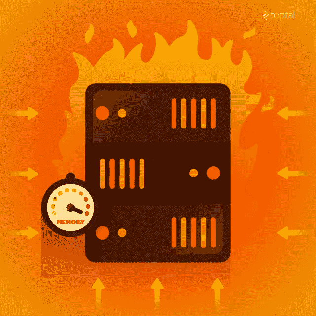
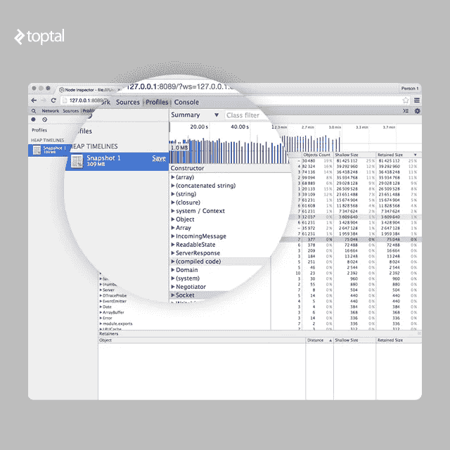
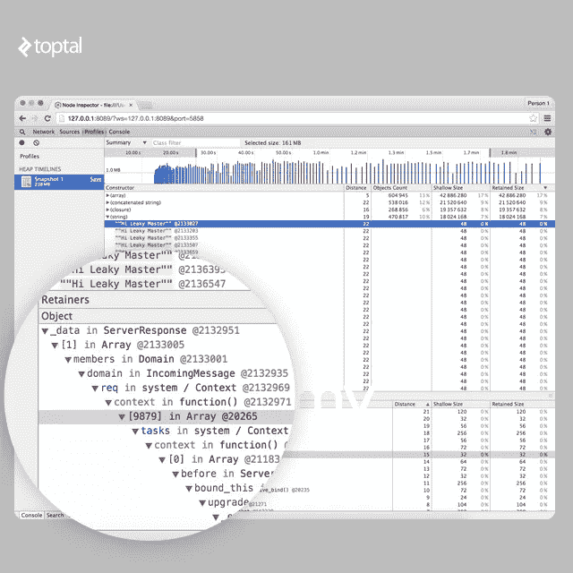
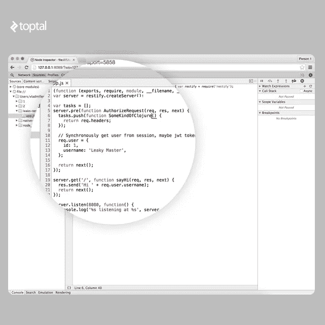
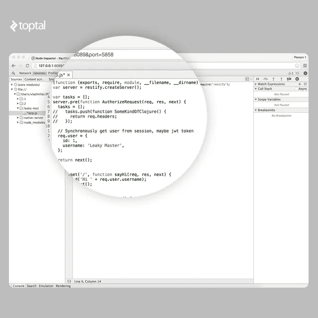

# hde bugging node . js 应用程序中的内存泄漏

> 原文：<https://medium.com/hackernoon/debugging-memory-leaks-in-node-js-applications-84125c0530d2>

注意:我之前在[的博客](https://topt.al/cEQY)上发表了这篇文章。

我曾经开过一辆内部搭载 V8 双涡轮增压发动机的奥迪，性能简直不可思议。凌晨 3 点，我在芝加哥附近的 IL-80 高速公路上以大约 140 英里的时速行驶，当时路上没有人。从那时起，术语“V8”就与我的高性能联系在一起。

[Node.js](https://hackernoon.com/tagged/nodejs) 是一个基于 Chrome 的 V8 [JavaScript](https://hackernoon.com/tagged/javascript) 引擎构建的平台，用于轻松构建快速且可扩展的网络应用。

尽管奥迪的 V8 引擎非常强劲，但你仍然受到油箱容量的限制。Google 的 V8 也是如此——node . js 背后的 JavaScript 引擎。它的性能令人难以置信，这也是 Node.js [在许多用例](https://www.toptal.com/nodejs/why-the-hell-would-i-use-node-js)中运行良好的原因，但你总是会受到堆大小的限制。当需要在 Node.js 应用程序中处理更多请求时，有两种选择:垂直伸缩或水平伸缩。水平扩展意味着您必须运行更多的并发应用程序实例。如果做得好，你最终可以满足更多的请求。垂直伸缩意味着您必须提高应用程序的内存使用和性能，或者增加应用程序实例的可用资源。



调试 Node.js 应用程序中的内存泄漏

最近，我被要求为我的一个顶级客户开发 Node.js 应用程序，以解决内存泄漏问题。该应用程序是一个 API 服务器，旨在每分钟能够处理数十万个请求。最初的应用程序占用了将近 600MB 的内存，因此我们决定采用热 API 端点并重新实现它们。当您需要服务于许多请求时，开销会变得非常昂贵。

对于新的 API，我们选择了 restify 与原生 MongoDB 驱动程序和 Kue 进行后台作业。听起来像是一个非常轻量级的堆栈，对吗？不完全是。在高峰负载期间，一个新的应用程序实例可能会消耗高达 270MB 的 RAM。因此，我每个 1X Heroku Dyno 有两个应用程序实例的梦想破灭了。

# Node.js 内存泄漏调试工具

## 记忆手表

如果您搜索“如何找到节点中的泄漏”，您可能会找到的第一个工具是 **memwatch** 。原来的包很久以前就被放弃了，不再维护。然而，你可以很容易地在 GitHub 的库的[分支列表中找到它的新版本。这个模块很有用，因为如果它发现堆在连续 5 次垃圾收集后增长，它可以发出泄漏事件。](https://github.com/lloyd/node-memwatch/network)

## 堆转储

这是一个伟大的工具，允许 [Node.js 开发者](https://www.toptal.com/node-js-development)获取堆快照，并在以后用 Chrome 开发者工具检查它们。

## 节点检查器

甚至是 heapdump 更有用的替代方法，因为它允许您连接到正在运行的应用程序，进行堆转储，甚至动态地调试和重新编译它。

# 带着“节点检查器”兜一圈

不幸的是，您将无法连接到在 Heroku 上运行的生产应用程序，因为它不允许向正在运行的进程发送信号。然而，Heroku 并不是唯一的托管平台。

为了体验 node-inspector 的运行，我们将使用 restify 编写一个简单的 Node.js 应用程序，并在其中放置一点内存泄漏源。这里所有的实验都是用 Node.js v0.12.7 做的，这个版本是针对 V8 v3.28.71.19 编译的。

```
var restify = require('restify');

var server = restify.createServer();

var tasks = [];

server.pre(function(req, res, next) {
  tasks.push(function() {
    return req.headers;
  });

  // Synchronously get user from session, maybe jwt token
  req.user = {
    id: 1,
    username: 'Leaky Master',
  };

  return next();
});

server.get('/', function(req, res, next) {
  res.send('Hi ' + req.user.username);
  return next();
});

server.listen(3000, function() {
  console.log('%s listening at %s', server.name, server.url);
});
```

这里的应用程序非常简单，有一个非常明显的漏洞。数组*任务*会随着应用程序的生命周期而增长，导致它变慢并最终崩溃。问题是我们不仅泄漏了闭包，还泄漏了整个请求对象。

V8 中的 GC 采用 stop-the-world 策略，因此这意味着内存中的对象越多，收集垃圾的时间就越长。在下面的日志中，您可以清楚地看到，在应用程序生命周期的开始，收集垃圾平均需要 20 毫秒，但是在几十万个请求之后，大约需要 230 毫秒。由于 GC 的原因，试图访问我们的应用程序的人将不得不等待**230 毫秒**更长时间。您还可以看到，每隔几秒钟就调用一次 GC，这意味着每隔几秒钟用户就会遇到访问我们应用程序的问题。延迟将会增加，直到应用程序崩溃。

```
[28093] 7644 ms: Mark-sweep 10.9 (48.5) -> 10.9 (48.5) MB, 25.0 ms [HeapObjectsMap::UpdateHeapObjectsMap] [GC in old space requested]. [28093] 7717 ms: Mark-sweep 10.9 (48.5) -> 10.9 (48.5) MB, 18.0 ms [HeapObjectsMap::UpdateHeapObjectsMap] [GC in old space requested]. [28093] 7866 ms: Mark-sweep 11.0 (48.5) -> 10.9 (48.5) MB, 23.2 ms [HeapObjectsMap::UpdateHeapObjectsMap] [GC in old space requested]. [28093] 8001 ms: Mark-sweep 11.0 (48.5) -> 10.9 (48.5) MB, 18.4 ms [HeapObjectsMap::UpdateHeapObjectsMap] [GC in old space requested]. ... 
[28093] 633891 ms: Mark-sweep 235.7 (290.5) -> 235.7 (290.5) MB, 357.3 ms [HeapObjectsMap::UpdateHeapObjectsMap] [GC in old space requested]. [28093] 635672 ms: Mark-sweep 235.7 (290.5) -> 235.7 (290.5) MB, 331.5 ms [HeapObjectsMap::UpdateHeapObjectsMap] [GC in old space requested]. [28093] 637508 ms: Mark-sweep 235.7 (290.5) -> 235.7 (290.5) MB, 357.2 ms [HeapObjectsMap::UpdateHeapObjectsMap] [GC in old space requested].
```

使用*–trace _ GC*标志启动 Node.js 应用程序时，会打印这些日志行:

```
node --trace_gc app.js
```

假设我们已经用这个标志启动了 Node.js 应用程序。在将应用程序与 node-inspector 连接之前，我们需要将 SIGUSR1 信号发送给正在运行的进程。如果在集群中运行 Node.js，请确保连接到一个从属进程。

```
kill -SIGUSR1 $pid # Replace $pid with the actual process ID
```

通过这样做，我们使 Node.js 应用程序(准确地说是 V8)进入调试模式。在这种模式下，应用程序使用 [V8 调试协议](https://code.google.com/p/v8-wiki/wiki/DebuggerProtocol)自动打开端口 5858。

我们的下一步是运行 node-inspector，它将连接到正在运行的应用程序的调试接口，并在端口 8080 上打开另一个 web 接口。

```
$ node-inspector Node Inspector v0.12.2 Visit http://127.0.0.1:8080/?ws=127.0.0.1:8080&port=5858 to start debugging.
```

如果应用程序在生产环境中运行，并且您有防火墙，我们可以通过隧道将远程端口 8080 连接到本地主机:

```
ssh -L 8080:localhost:8080 admin@example.com
```

现在，你可以打开你的 Chrome 浏览器，完全访问远程生产应用程序附带的 Chrome 开发工具。不幸的是，Chrome 开发者工具无法在其他浏览器上运行。

# 我们去找个漏洞！

V8 中的内存泄漏并不是我们从 C/C++应用程序中了解到的真正的内存泄漏。在 JavaScript 中，变量不会凭空消失，它们只是被“遗忘”了。我们的目标是找到这些被遗忘的变量，提醒他们多比是自由的。

在 Chrome 开发者工具中，我们可以访问多个分析器。我们对**记录堆分配**特别感兴趣，它随着时间的推移运行并拍摄多个堆快照。这让我们清楚地看到哪些物体正在泄漏。

开始记录堆分配，让我们使用 Apache Benchmark 在主页上模拟 50 个并发用户。


```
ab -c 50 -n 1000000 -k [http://example.com/](http://example.com/)
```

在拍摄新快照之前，V8 会执行标记-清除垃圾收集，因此我们肯定知道快照中没有旧垃圾。

# 快速修补漏洞

在经过 **3 分钟**的时间收集堆分配快照后，我们得到如下结果:



我们可以清楚地看到，在堆中有一些巨大的数组、大量的传入消息、ReadableState、ServerResponse 和域对象。让我们试着分析一下泄漏的来源。

在图表上选择从 20 秒到 40 秒的堆差异时，我们将只看到从启动探查器起 20 秒后添加的对象。这样，您可以排除所有正常数据。

注意系统中每种类型有多少个对象，我们将过滤器从 20 秒扩展到 1 分钟。我们可以看到，已经相当庞大的阵列还在继续增长。在“(数组)”下面我们可以看到有很多距离相等的对象”(对象属性)。那些对象是我们内存泄漏的来源。

我们还可以看到“(闭包)”对象也在快速增长。

查看字符串可能也很方便。在字符串列表下面有很多“嗨，漏大师”的短语。那些也可能给我们一些线索。

在我们的例子中，我们知道字符串“Hi Leaky Master”只能在“GET /”路径下组装。

如果你打开 retainers path，你会看到这个字符串通过 *req* 被引用，然后上下文被创建，所有这些都被添加到一个巨大的闭包数组中。



所以在这一点上，我们知道我们有某种巨大的闭包数组。让我们实际上在 sources 选项卡下为我们所有的闭包实时命名。



在我们编辑完代码后，我们可以按 CTRL+S 保存并重新编译代码！

现在让我们记录另一个**堆分配快照**，看看哪些闭包占用了内存。

很明显*somethodofclojure()*是我们的反派。现在我们可以看到 *SomeKindOfClojure()* 闭包被添加到全局空间中的某个名为 *tasks* 的数组中。

很容易看出这个数组就是没用。我们可以把它注释掉。但是我们如何释放已经被占用的内存呢？非常简单，我们只需将一个空数组分配给任务*和任务*，在下一次请求时，它将被覆盖，内存将在下一次 GC 事件后被释放。



多比自由了！

# V8 中的垃圾生活


嗯，V8 JS 没有内存泄漏，只有被遗忘的变量。

V8 堆被分成几个不同的空间:

*   **新空间**:这个空间比较小，大小在 1MB 到 8MB 之间。大多数对象都分配在这里。
*   **旧指针空间**:包含可能指向其他对象的对象。如果对象在新空间中存在足够长的时间，它将被提升到旧的指针空间。
*   **旧数据空间**:仅包含原始数据，如字符串、装箱数和未装箱双精度数组。在新空间中经历了足够长时间的 GC 的对象也被移动到这里。
*   **大对象空间**:在这个空间中创建太大而不适合其他空间的对象。每个对象在内存中都有自己的区域
*   **代码空间**:包含 JIT 编译器生成的汇编代码。
*   **单元空间、属性单元空间、映射空间**:该空间包含`Cell`、`PropertyCell`和`Map` s，用于简化垃圾收集。

每个空间都由页面组成。页面是操作系统用 mmap 分配的内存区域。除了大对象空间中的页面之外，每个页面的大小始终是 1MB。

V8 有两个内置的垃圾收集机制:清除、标记-清除和标记-压缩。

清除是一种非常快速的垃圾收集技术，它对**新空间**中的对象进行操作。Scavenge 是[切尼算法](https://en.wikipedia.org/wiki/Cheney%27s_algorithm)的实现。这个想法很简单，**新空间**被分成两个相等的半空间:To-Space 和 From-Space。当 To 空间已满时，会发生清除 GC。它只是简单地交换空间，将所有活的物体复制到目标空间，或者将它们提升到旧空间，如果它们在两个拾荒者中幸存的话，然后从空间中完全清除。清道夫的速度非常快，但是他们的开销是保持双倍大小的堆，并且不断地在内存中复制对象。使用清道夫的原因是因为大多数对象在年轻时就死亡了。

Mark-Sweep & Mark-Compact 是 V8 中使用的另一种垃圾收集器。另一个名字是完全垃圾收集器。它标记所有活动节点，然后清除所有不活动节点并整理内存碎片。

# GC 性能和调试技巧

虽然对于 web 应用程序来说，高性能可能不是一个大问题，但是您仍然希望不惜一切代价避免泄漏。在完全 GC 的标记阶段，应用程序实际上是暂停的，直到垃圾收集完成。这意味着堆中的对象越多，执行 GC 的时间就越长，用户等待的时间也就越长。

## 总是给闭包和函数起名字

当所有的闭包和函数都有名字时，检查堆栈跟踪和堆就容易多了。

```
db.query('GIVE THEM ALL', function GiveThemAllAName(error, data) {
    ...
})
```

## 避免热函数中的大对象

理想情况下，您希望避免热函数中的大对象，以便所有数据都适合新空间**。所有 CPU 和内存限制的操作都应该在后台执行。还要避免热函数的去优化触发，优化的热函数比非优化的热函数使用更少的内存。**

## **热功能应该被优化**

**运行速度更快但消耗内存更少的热函数导致 GC 运行的频率更低。V8 提供了一些有用的调试工具来发现非优化函数或去优化函数。**

## **避免热函数中 IC 的多态性**

**内联缓存(IC)用于加速一些代码块的执行，或者通过缓存对象属性访问`obj.key`或者一些简单的函数。**

```
function x(a, b) {
  return a + b;
}

x(1, 2); // monomorphic
x(1, “string”); // polymorphic, level 2
x(3.14, 1); // polymorphic, level 3
```

**第一次运行 *x(a，b)* 时，V8 创建一个单态 ic。当您第二次调用`x`时，V8 删除旧的 ic 并创建一个新的多态 IC，它支持整数和字符串两种类型的操作数。当您第三次调用 ic 时，V8 重复相同的过程，并创建另一个 3 级多态 IC。**

**然而，有一个限制。在 IC 等级达到 5(可以用*–max _ inlining _ levels*标志改变)后，函数变成巨型函数，不再被认为是可优化的。**

**可以直观地理解，单态函数运行速度最快，内存占用也较小。**

## **不要将大文件添加到内存中**

**这是显而易见的，众所周知的。如果您有大文件要处理，例如一个大的 CSV 文件，请逐行读取并分块处理，而不是将整个文件加载到内存中。在极少数情况下，一行 csv 会大于 1mb，因此您可以将其放入新的空间。**

## **不要阻塞主服务器线程**

**如果你有一些热的 API 需要一些时间来处理，比如一个调整图像大小的 API，把它移到一个单独的线程或者变成一个后台作业。CPU 密集型操作会阻塞主线程，迫使所有其他客户等待并继续发送请求。未处理的请求数据会堆积在内存中，从而迫使完整的 GC 花费更长的时间来完成。**

## **不要创建不必要的数据**

**我曾经有过一次 restify 的怪异经历。如果您向一个无效的 URL 发送几十万个请求，那么应用程序内存将迅速增长到几百兆字节，直到几秒钟后一个完整的 GC 启动，这时一切将恢复正常。原来，对于每个无效的 URL，restify 都会生成一个新的错误对象，其中包含长堆栈跟踪。这迫使新创建的对象被分配到**大对象空间**，而不是**新空间**。**

**访问这些数据在开发过程中非常有用，但在生产中显然不是必需的。因此，规则很简单——除非确实需要，否则不要生成数据。**

**最后，但肯定不是最不重要的，是了解你的工具。有各种调试器、泄漏导管和使用图生成器。所有这些工具都可以帮助你使你的软件更快更有效。**

# **结论**

**理解 V8 的垃圾收集和代码优化器是应用程序性能的关键。V8 将 JavaScript 编译为本机汇编，在某些情况下，编写良好的代码可以获得与 GCC 编译的应用程序相当的性能。**

**如果你想知道，我的 Toptal 客户端的新 API 应用程序，尽管还有改进的空间，但工作得非常好！**

**Joyent 最近发布了 Node.js 的新版本，它使用了最新版本的 V8。一些为 Node.js v0.12.x 编写的应用程序可能与新的 v4.x 版本不兼容。然而，在 Node.js 的新版本中，应用程序将体验到巨大的性能和内存使用改进**

***最初发表于*[*www.toptal.com*](https://www.toptal.com/nodejs/debugging-memory-leaks-node-js-applications)*。***