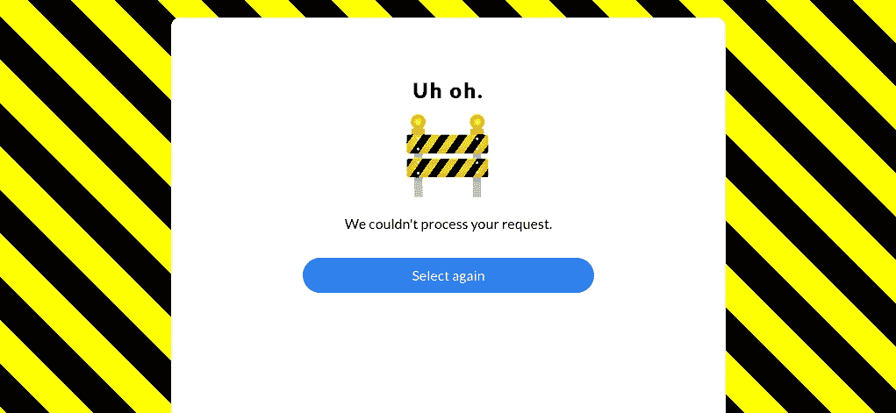

# 用 Linkerd 2.0 调试 Kubernetes 中的节点服务

> 原文：<https://medium.com/hackernoon/debugging-node-services-in-kubernetes-with-linkerd-2-0-f878382fb380>

Node 是微服务最流行的语言之一。随着 Kubernetes 的兴起，越来越多的节点开发者被要求将他们的服务部署到 Kubernetes 集群中。但是在 Kubernetes 上安全地部署和运行节点服务需要什么呢？在这篇文章中，我们关注一个特定但重要的组件:我如何理解我在 Kubernetes 上的节点服务发生了什么，以及当出现问题时我如何调试它？

此时，您可能会想，我不能只使用 Kubernetes 仪表板吗？不幸的是，虽然 Kubernetes 可以在节点故障或软件崩溃的情况下自动保持您的服务，但它实际上并不知道您的服务是否正常运行*。*事实上，一项服务可能会返回 500 个或花费太长时间来响应，Kubernetes 仪表盘将显示所有绿灯。

这就是为什么 Kubernetes 经常与 Linkerd 之类的东西结合使用。Linkerd 是一个*服务 sidecar* ，它增强了任何 Kubernetes 服务，为运行时调试、诊断和可靠性提供零配置“黄金指标”仪表板和 UNIX 风格 CLI [工具](https://hackernoon.com/tagged/tools)。(Linkerd 还可以作为一个*服务网*，运行在多个服务上，提供一个统一的遥测、安全和控制层。)

Linkerd 通过插入一个超轻代理(<10mb) into each pod of a service, and automatically sending traffic to and from that pod through its proxy. These proxies provide telemetry data to, and receive signals from, a control plane. Because the proxy runs alongside your application and is transparent, there are zero code changes required. And, of course, Linkerd is completely open source, Apache v2 licensed, and is hosted by the Cloud Native Computing Foundation–just like Kubernetes itself.

In this tutorial, we’ll walk you through deploying Linkerd 2.0 to a Kubernetes cluster and using it to debug failures in an example application.

(If you don’t have a Kubernetes cluster, don’t worry! Take a look at [minikube](https://github.com/kubernetes/minikube) )来工作，或者查看这篇博客文章的[交互式教程](https://www.katacoda.com/grampelberg/scenarios/nodevoto)，您可以直接从浏览器运行它。)

我们将部署的演示应用程序由多个服务组成，这些服务允许为喜爱的 gif 投票。这些服务通过 gRPC 进行通信，并且都是用 Javascript 编写的。你可以在 [GitHub](https://github.com/sourishkrout/nodevoto) 上查看源代码。

该应用程序由以下 4 个服务组成:

*   [nodevoto-web](https://github.com/sourishkrout/nodevoto/blob/master/services/nodevoto-web) : Web 前端和 REST API
*   用于查找和列出 gif 的 gRPC API
*   [nodevoto-voting](https://github.com/sourishkrout/nodevoto/blob/master/services/nodevoto-voting) :用于投票和排行榜的 gRPC API
*   [投票机器人](https://github.com/sourishkrout/nodevoto/blob/master/services/nodevoto-web/voteBot.js):流量生成器


这个应用程序有一个主要的 bug，我们将使用 Linkerd 的 web dashboard 和类似 UNIX 的 CLI 工具来调试这个 bug。

# 步骤 1:安装演示应用程序🚀

在我们安装 Linkerd 之前，让我们安装 Nodevoto 演示应用程序。在笔记本电脑的终端窗口中，运行:

这个命令为 Nodevoto 下载 Kubernetes 清单，并使用`kubectl`将其应用到您的 Kubernetes 集群。Nodevoto 由运行在`nodevoto`名称空间中的几个服务组成。您可以通过运行以下命令来查看服务:

您还可以通过运行以下命令实时查看应用程序:

(如果你看到类似`kubectl: command not found`的东西，说明你没有正确设置 Kubernetes。)

在应用周围点一下。您应该会看到应用程序的某些部分被破坏了！(提示—点击几次左上角的投票按钮，看看会发生什么)。当然，如果你看一下 Kubernetes 的仪表板，你会看到一切都是绿色的——所有的 pod 都在运行。

这是一种非常常见的失败场景:Kubernetes 认为一切正常，但是您知道应用程序正在返回错误，因为您可以看到它们。在接下来的几个步骤中，我们将指导您如何使用 Linkerd 来诊断问题。


# 步骤 2:安装 Linkerd 的 CLI

我们将从在您的本地机器上安装 Linkerd 的命令行界面(CLI)开始。访问 [Linkerd 发布页面](https://github.com/linkerd/linkerd2/releases/)，或者直接运行:

安装完成后，将`linkerd`命令添加到您的路径中:

让我们通过运行以下命令来验证您的集群是否为 Linkerd 做好了准备:

因为有许多不同类型的 Kubernetes 集群，以及无数种配置它们的方法。这个方便的命令将报告任何会影响您安装 Linkerd 的问题。希望一切看起来都没问题，你已经准备好进入下一步了。

注意:如果你的 Kubernetes 集群在 GKE 上启用了 RBAC，你将需要一个额外的步骤:你必须首先授予你的 Google Cloud 账户一个`cluster-admin`的`ClusterRole`，以便安装控制平面。为此，请运行:

```
kubectl create clusterrolebinding cluster-admin-binding-$USER \
  --clusterrole cluster-admin \
  --user=$(gcloud config get-value account)
```

# 步骤 3:将 Linkerd 的控制面板安装到集群上

在这一步中，我们将在您的集群上将 Linkerd 的轻量级控制平面安装到它自己的名称空间(`linkerd`)中。为此，请运行:

这个命令生成一个 Kubernetes 清单，并使用`kubectl`将其应用到您的 Kubernetes 集群。(在应用之前，请随意阅读完整的清单。)

根据您的连接速度，您的 Kubernetes 集群可能需要一分钟来下载 Linkerd 容器映像并启动它们。此时，您可以通过运行以下命令来验证一切安装是否正确:

该命令将一直等到 Linkerd 安装并运行。

现在，让我们来看看 Linkerd 的仪表板！只需运行:

如果您看到类似下面的截图，Linkerd 现在正在您的集群上运行。🎉


# 步骤 4:将 Linkerd 添加到 Nodevoto web 服务中

此时，我们已经在`linkerd`名称空间中安装了控制面板，并且在`nodevoto`名称空间中安装了 nodevoto 演示应用程序。但是我们实际上还没有将 Linkerd 添加到我们的服务中。让我们开始吧。

在这个例子中，让我们假设我们是`web`服务的所有者。这么说吧，其他服务，像`gif`和`voting`，都是其他团队的——我们不想碰它们。虽然在这个例子中这些是本地服务，但是它们完全有可能是由一个完全独立的实体拥有的远程 API。

有几种方法可以将 Linkerd 添加到我们的服务中。出于演示目的，最简单的方法是这样做:

该命令从 Kubernetes 检索`web`服务的清单，通过`linkerd inject`运行该清单，然后将其重新应用到 Kubernetes 集群。`linkerd inject`命令添加到清单中，以包括数据平面的代理。和`install`一样，`inject`是纯文本操作。这意味着您可以在使用它之前检查输入和输出。由于`web`是一个部署，Kubernetes 非常友好地一次一个 pod 地慢慢推出服务——这意味着`web`可以在我们添加 Linkerd 时实时提供流量服务！

我们现在有一个服务侧柜运行在`web`服务上！

# 步骤 5:为了乐趣和利益进行调试

恭喜你！现在，在 Kubernetes 集群上运行了一个完整的 gRPC 应用程序，并且在`web`服务上安装了 Linkerd。不幸的是，当您使用该应用程序时，它会失败——所以现在让我们使用 Linkerd 来跟踪这些错误。



如果您看一下 Linkerd 仪表板(通过运行`linkerd dashboard`，您应该看到`nodevoto`名称空间中的所有服务都出现了。由于`web`上安装了 Linkerd 服务 sidecar，您还会看到成功率、每秒请求数和延迟百分比。


这很酷，但请注意成功率远低于 100%！点击`web`让我们调试。

您现在应该看到 web 服务的部署页面。您将看到的第一件事是 web 从`vote-bot`(包含在 Nodevoto 清单中的一个服务，用于持续生成低水平的实时流量)获取流量，并且有两个输出依赖项`gif`和`voting`。


gif 服务正在 100%运行，但是投票服务正在失败！相关服务中的故障可能正是 web 返回错误的原因。

让我们在页面上再向下滚动一点，我们会看到`web`正在接收的所有流量端点的实时列表。这很有趣:


有两个调用没有达到 100%:第一个是 vote-bot 对`/api/vote`端点的请求。第二个是从`web`到`voting`对`VoteCartoonHalloweenGhost`的请求。很有意思！由于`/api/vote`是一个传入请求，而`VoteCartoonHalloweenGhost`是一个传出请求，这是一个很好的线索，表明来自`voting`的响应是导致问题的原因！

最后，如果我们点击🔬图标，我们将看到与该端点匹配的请求的实时列表。这允许我们确认请求失败(它们都有 [gRPC 状态码 2](https://godoc.org/google.golang.org/grpc/codes#Code) ，指示一个错误)。


此时，我们有了与`voting`服务所有者对话所需的弹药。我们已经在他们的服务上发现了一个持续返回错误的端点，并且在系统中没有发现其他明显的故障源。

# 想要更多吗？

在本教程中，我们向您展示了如何在集群上安装 Linkerd，将它作为服务边盘添加到一个服务中，同时该服务正在接收实时流量！—并使用它来调试运行时问题。但这只是冰山一角。

例如，我们上面使用 web UI 所做的一切也可以通过纯 CLI 命令来完成，例如`linkerd top`、`linkerd stat`和`linkerd tap`。

另外，你注意到我们看的第一页上的小 Grafana 图标了吗？Linkerd 附带了针对所有这些指标的自动 Grafana 仪表板，允许您以时间序列格式查看您在 Linkerd 仪表板中看到的一切。看看吧！


Linkerd 有一个蓬勃发展的采纳者和贡献者社区，我们希望您能成为其中的一员。更多信息，请查看[文档](https://linkerd.io/docs)和 [GitHub](https://github.com/linkerd/linkerd) 回购，加入 [Linkerd Slack](https://slack.linkerd.io/) 和邮件列表([用户](https://lists.cncf.io/g/cncf-linkerd-users)、[开发者](https://lists.cncf.io/g/cncf-linkerd-dev)、[宣布](https://lists.cncf.io/g/cncf-linkerd-announce))，当然，在 Twitter 上关注 [@linkerd](https://twitter.com/linkerd) ！我们等不及让你加入了！

*原载于 2018 年 11 月 13 日*[*blog . linkerd . io*](https://blog.linkerd.io/2018/11/13/debugging-node-services-in-kubernetes-with-linkerd-2-0/)*。*