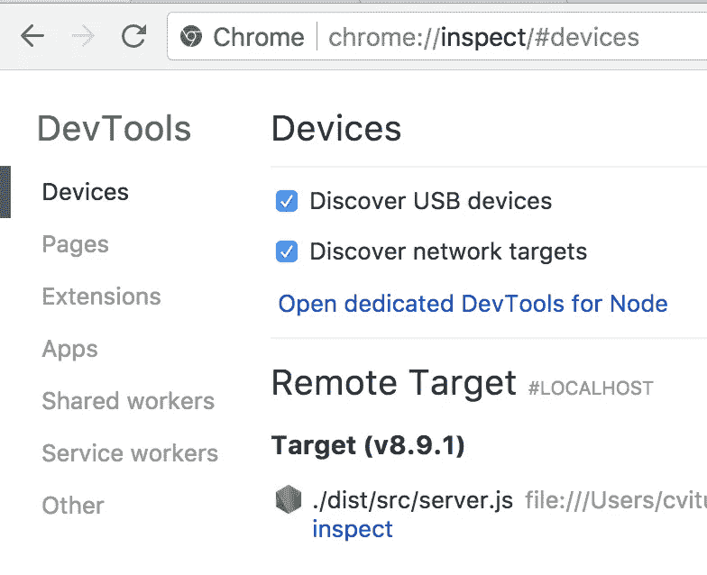

# 调试节点而不重新启动进程

> 原文：<https://medium.com/hackernoon/debugging-node-without-restarting-processes-bd5d5c98f200>

我通常是一名前端开发人员，但我不时会发现自己在编写或维护一些后端代码。我在将上下文切换到 Node 时遇到的最大缺点之一是缺少 Chrome 开发工具。没有它们确实凸显了我在日常的 web 开发中对它们的依赖。幸运的是，有启用它们的选项，而且最近它们变得更加稳定和可用。Node 有一个内置的调试模式，允许你连接到 DevTools，还有一个名为 [node-inspector](https://github.com/node-inspector/node-inspector) 的包可以自动连接。

值得注意的是节点版本< 8 use a now-legacy Debugger API. Node 8 introduces the Inspector API, which better integrates with existing developer tools.

There’s one common theme that I’ve encountered when using these methods: they must be invoked when starting the node process. The other day, I found myself with a process in an odd state that I’ve had trouble reproducing, and I didn’t want to risk losing it by restarting the process to enable the inspector.

However, I found a solution — no less, a solution from [官方节点文档](https://nodejs.org/en/docs/guides/debugging-getting-started/)。

> 在没有 inspect 的情况下启动的 Node.js 进程也可以通过 SIGUSR1(在 Linux 和 OS X 上)发出信号来开始监听调试消息。

这只适用于基于 unix 的操作系统(抱歉，Windows 用户)，但它在这种情况下救了我的命。unix 中的`kill`命令可能被命名为不祥之兆，但它也可以用于向正在运行的进程发送任意信号。`man kill`告诉我可以使用语法`kill -signal_name pid`这样做。信号名称列表可以用`kill -l`枚举，如下所示。

```
$ kill -l
hup int quit ill trap abrt emt fpe kill bus segv sys pipe alrm term urg
stop tstp cont chld ttin ttou io xcpu xfsz vtalrm prof winch info usr1 usr2
```

默认情况下，`kill`发送一个`int`，或者一个`int` errupt 信号，相当于在终端窗口中点击`ctrl-c`。处理信号有很大的深度，我不会深入探讨(我鼓励你去探索它们！)，但接近列表末尾的是`usr1`。这是节点文档引用的`SIGUSR1`,所以现在我只需要一个 pid 或流程 id，就可以将它发送到。我可以通过使用`ps`和`grep`来缩小在我的系统上运行的所有处理的列表

```
$ ps | grep node
9670 ttys000 0:01.04 node /snip/.bin/concurrently npm run watch:server npm run watch:client
9673 ttys000 0:00.46 node /snip/.bin/concurrently npm run watch:server-files npm run watch:dist
9674 ttys000 0:33.02 node /snip/.bin/webpack — watch
9677 ttys000 0:00.36 node /snip/.bin/concurrently npm run build:snip — — watch
9678 ttys000 0:01.65 node /snip/.bin/nodemon — delay 2 — watch dist ./dist/src/server.js
9713 ttys000 0:01.00 /usr/local/bin/node ./dist/src/server.js
9736 ttys003 0:00.00 grep — color=auto node
```

我的输出有点嘈杂，因为复杂的构建工具链会产生许多进程。但是我看到了最下面右边的进程:`node ./dist/src/server.js`，pid 为`9713`。

现在我知道信号名是`usr1`，pid 是`9713`，所以我需要运行。

```
$ kill -usr1 9713
```

它运行时没有输出，但是我检查了节点进程的日志

```
Debugger listening on ws://127.0.0.1:9229/ad014904-c9be-4288–82da-bdd47be8283b
For help see [https://nodejs.org/en/docs/inspector](https://nodejs.org/en/docs/inspector)
```

我可以打开`chrome://inspect`，并立即看到我的检查目标。



我点击“inspect ”,在我的节点进程的上下文中，我得到了一个 Chrome DevTools 窗口！我可以使用 profiler 来审计性能，使用 source 选项卡来添加断点和检查正在运行的代码，并使用控制台来查看日志或修改当前范围内的变量，就像在 web 上一样。

我也在 [Twitter](http://twitter.com/cvitullo) 上发布技术信息，在[React flux](https://www.reactiflux.com/)上回答关于 React 的问题。我还主持了节点开发者的姐妹服务器 [Nodeiflux](https://discord.gg/vUsrbjd) 。