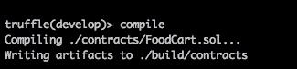
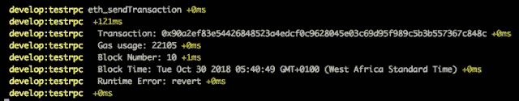
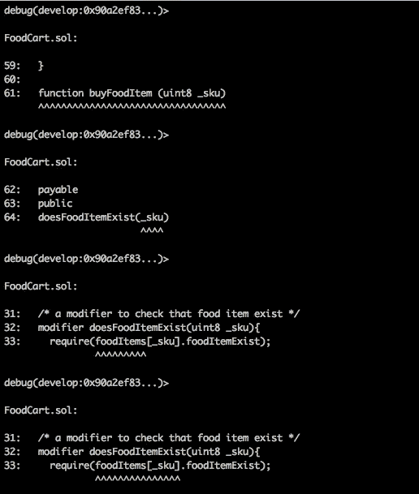
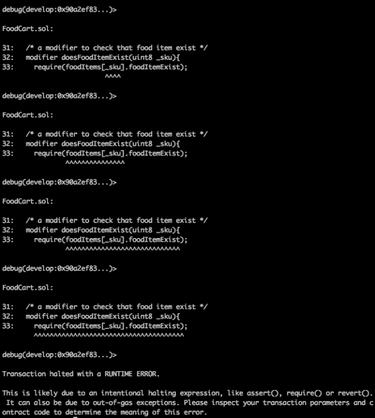
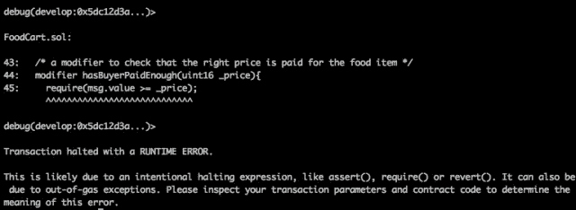

# 用 Truffle 调试器调试智能合约:一种实用的方法

> 原文：<https://medium.com/hackernoon/debugging-smart-contracts-with-truffle-debugger-a-practical-approach-f56bf0600736>


> 给足眼球，所有 bug 都是浅的。~ [莱纳斯定律](https://en.wikiquote.org/wiki/Linus_Torvalds)

虫子！bug 是外星人，他们在晚上没人注意的时候潜入程序员的代码，改变代码的状态。这些外星人只有一个使命——挫败一个程序员的生活。程序员如何在沮丧而死之前杀死一个 bug？是的，你猜对了！通过调试和删除有问题的代码。但是为什么一个程序员会在没有合适工具的情况下投入调试战争呢？如果程序员要调试，他最好用正确的方法，使用正确的工具。

> 如果说调试是去除软件 bug 的过程，那么编程一定是把 bug 放进去的过程。~ [埃德格·迪杰斯特拉](https://en.wikiquote.org/wiki/Edsger_W._Dijkstra)

在智能合约开发中，像传统的集中式软件[开发](https://hackernoon.com/tagged/development)一样，在智能合约的开发生命周期中，bug 会潜入智能合约开发人员的代码中。虽然智能合约可能存在漏洞有“太多”的原因，但有一点仍然很重要，在智能合约部署到 mainnet 之前，必须消除所有的漏洞，否则，我们将面临资金损失的风险，并最终失去智能合约的可信度。

在 solidity 中有几个开发智能合同的框架。在本文中，重点是 Truffle 框架。Truffle 旨在通过为智能合约开发提供开发环境、测试框架和调试工具，使开发人员的生活更加轻松。智能合约错误可能很难发现，错误消息可能很难理解。当使用 Truffle 构建智能契约时，Truffle 调试器在调试契约时非常方便。 ***这是因为在调试智能合约时，你不是在实时运行代码；相反，您将步入该事务在区块链上的历史执行，并将该执行映射到其关联的代码上。传统上来说，这种调试过程可能是乏味的，而这正是 Truffle 调试器真正有用的地方——只要我们有代码和事务的工件，我们就可以调试任何事务。让我们简单谈谈 Truffle 调试器，然后举一个例子来说明如何使用这个工具。***

> 调试是一个涉及执行测试和代码修正的循环活动。

# Truffle 调试器

Truffle Debugger 是一个集成到 Truffle 框架中的命令行工具，它允许使用智能合约代码和交易工件来调试智能合约交易。当调试器启动时，命令行界面提供在事务过程中处理或创建的地址列表、事务的初始入口点以及使用调试器的可用命令列表。下面突出显示了一些调试器命令:


`[o] step over`:

该命令评估由虚拟机相对于协定评估的指令，直到当前智能协定文件中的下一行，跳过在当前执行点引用的函数(如果有)。

`[i] step into`:

该命令进入在当前执行点调用的函数。

`[u] step out`:

该命令将使调试器跳出当前函数，直接执行下一行。

`[n] step next`:

此命令会单步执行当前调用的函数中的下一个逻辑语句或表达式。

`[;] step instruction`:

该命令单步执行由虚拟机评估的每个单独的指令。

你可以在这里查看其他命令

到目前为止，我们已经讨论了调试和 Truffle 调试器，让我们用一个例子来真正理解它。

# 调试 FoodCart 智能合约

下面的智能合同模拟了一个简单的食品推车，它允许任何人将食品添加到推车上进行销售，也允许任何有足够乙醚的人从推车上购买食品。此契约仅用于说明目的，不应在生产环境中使用。在我们开始本示例之前，需要遵循以下要求才能顺利完成本示例:

1.  松露 4.0 或以上
2.  Solidity 编译器版本 0.4.24 或以上
3.  私有区块链(Ganache CLI v6.1.6 或更高版本)

本文的存储库可以在[这里](https://github.com/mayorcoded/FoodCartTutorial)找到，以防您想在不编写智能契约的情况下完成调试过程。

## `Step 1: Building the smart contract`

*   让我们首先为这个项目创建一个目录，并构建智能契约。在终端输入以下命令:

```
mkdir FoodCart
```

*   进入文件夹，创建一个裸露的块菌项目。

```
cd FoodCart
truffle init
```

*   导航到合同文件夹并创建一个`FoodCart.sol`智能合同文件

```
cd contracts
touch FoodCart.sol
```

*   在您选择的任何 IDE 中打开您的 FoodCart 项目。我将使用 Visual Studio 代码。为什么？我真的不知道…lol。😂。打开`FoodCart.sol`合同，在下面输入智能合同:

在我们继续之前，让我解释一下上面的智能合同。FoodCart 智能合同可以分为 6 个部分:

*   状态变量:状态变量`owner`和`skuCount`分别存储所有者的地址和添加到购物车中的食品数量。映射`foodItems`将 SKU 映射到食品项目。
*   枚举:`State`枚举是一个用户定义的数据类型，保存购物车中食品的状态。枚举中列出的类型可以显式地与整数相互转换，即(`ForSale = 0`、`Sold = 1`)。
*   事件:事件`ForSale`和`Sold`记录了待售或售出的食品的详细信息。这些事件可以由 javascript 中的回调函数调用，它们的内容可以用来使 dApps 的使用更具交互性。
*   struct:struct`FoodItem`是一个用户定义的类型，用于保存食品的属性。可以使用结构上的点标记来访问这些属性。
*   函数修饰符:修饰符`doesFoodItemExist`、`isFoodItemForSale`和`hasBuyerPaidEnough`是在执行应用它们的函数之前自动检查条件的函数。这个智能契约中使用的函数修饰符的作用从它们的名字就很明显。
*   功能:`addFoodItem`、`buyFoodItem`和`fetchFoodItem`功能分别为合同添加食品、允许购买食品和查看食品的详细信息。构造函数用部署契约的地址初始化`owner`状态变量。匿名`payable`函数允许以太发送到这个契约。

## `Step 2: Deploying the smart contract`

让我们在私有[网络](https://hackernoon.com/tagged/network)上部署智能合约。

*   在您的 IDE 中，在`migrations`文件夹中创建一个名为`2_foodcart_migration.js`的新文件。创建文件后打开它，并添加以下代码:

这段代码将使框架能够将我们的`FoodCart.sol`契约部署到私有区块链。

*   打开您的终端，导航到该项目的文件夹，并键入以下命令:

```
truffle develop
```

这个命令启动了一个开发区块链，我们可以用它开始测试我们的契约。运行该命令应该会产生以下结果:


上图显示在端口 9545 上已经启动了一个开发区块链，测试账户也已经创建使用，终端导航到一个新的提示`truffle(develop)>`。

*   在`truffle(develop)>`提示符下，键入`compile`命令来编译合同。编译的结果存储在项目目录的 build 文件夹中。

```
truffle(develop)> compile
```

运行`compile`命令应该会产生这样的结果:



*   最后，让我们将编译好的契约迁移到区块链进行部署。在终端，输入`migrate`命令，将合同迁移到已经为我们启动的开发区块链。

```
truffle(develop)> migrate
```

运行`migrate`命令应该会产生以下结果:


## `Step 3: Interacting with the smart contract`

让我们与我们的智能合同互动，感受一下它是如何工作的。我们将添加食物到购物车，检查添加到购物车的食物的详细信息，并从我们开始开发区块链时为我们创建的一个帐户中购买含有乙醚的购物车中的食物。

*   仍然在`truffle(develop)>`提示符下，创建一个`foodCart`变量，并在其中存储已部署契约的实例。

```
truffle(develop)> let foodCart; truffle(develop)> FoodCart.deployed().**then**((instance) => { foodCart = instance; });
```

在上面的简短代码片段中，我们通过 web3 `.deployed`方法访问已部署的`FoodCart`契约，该方法返回一个 promise 接口，我们传递一个函数，该函数将已部署契约的实例存储在`foodCart`变量中。有了存储在`foodCart`变量中的契约实例，我们可以通过`foodCart`变量访问契约的功能。

*   让我们在`truffle(develop)>`提示符下运行下面的代码片段，将一些食品添加到购物车中。首先，让我们添加一个函数，它将帮助我们添加食物项目，并在控制台上轻松地打印交易结果。

`addFoodItemToCart`函数允许我们在调用时将食品的名称和价格作为参数传递给函数，从而轻松地将食品添加到购物车中。该函数充当智能契约中`addFoodItem`的包装器，为我们进行智能契约调用，并格式化从函数调用返回的日志输出。通过运行以下命令，我们可以用`addFoodItemToCart`功能添加一些食物:

*   现在我们在食品推车上有大约 3 种食品，让我们从推车上买一些食品。在我们购买食品之前，我们需要指定我们将使用什么地址来购买，因为我们可以从这个地址获得资金`in ether`来购买食品。回想一下，当我们开始我们的私人区块链时，为我们创建了 10 个测试账户，每个账户都有 100 以太币，我们可以用它来购买我们想要的任何东西，我们发财了🤑🤑。让我们创建一个变量来存储这些地址或帐户中的一个，以便我们可以随时轻松地调用它。

```
truffle(develop)> **const** buyerAddress = web3.eth.accounts[1]; truffle(develop)> buyerAddress '0xf17f52151ebef6c7334fad080c5704d77216b732'
```

由于我们有一个账户`0xf17f52151ebef6c7334fad080c5704d77216b732`(你的会不同)，我们可以添加一个功能，在我们的`truffle(develop)>`提示下购买食品购物车中的食品。

通过使用商品的`itemSku`和`amount`调用函数，`buyFoodItemFromCart`允许我们从购物车中购买食品。为该商品支付的金额来自存储在我们的`buyerAddress`变量中的账户。我们去食品车上买炒饭吧。从我们以前的交易中，我们记得炒饭的 sku 是`0`，它的价格是`10 wei`。所以在`truffle(develop)>`提示符下，我们用这些值调用`buyFoodItemFromCart`函数:

从输出中，我们看到该商品的状态是`Sold`，而`foodItemExist`现在是`false`，表明该商品不再出售。

## `Step 4: Debugging errors in the smart contract`

如果你已经做到了这一步，你应该因为坚韧而获得诺贝尔奖，🎖，享受它带来的名声吧。到目前为止，我们已经看到了契约应该如何表现。为了能够使用 Truffle 调试器特性，我们将在与契约交互时引入一些错误，然后使用调试器来调试错误并修复它。为了调试一个事务，我们需要有事务的散列，然后在`truffle(develop)>`提示符下运行命令`debug [transaction hash]`，后面跟着任何调试器命令，直到我们找到事务失败的地方。

我们将尝试以下无效交易:

*   尝试购买不存在的食物
*   尝试支付少于食物价格的金额

在我们开始这些事务之前，我们需要在另一个终端中启动`truffle develop logger`，但是仍然在示例项目中。打开一个新的终端，导航到 FoodCart 项目并运行这个命令`truffle develop --log`。

```
FoodCart $ truffle develop --log
```

您应该得到以下输出:

```
Connected to existing Truffle Develop session at [http://127.0.0.1:9545/](http://127.0.0.1:9545/)
```

记录器连接到指定端口的现有会话，监听事务事件，并记录事务的输出，其中应包括事务哈希、块号等项目。让我们继续下去，让我们的合同生活成为人间地狱👹。

## 无效交易#1:试图购买不存在的食品

在之前的交易中，我们将食品添加到购物车中，我们分别为 3 种食品添加了 SKU`0, 1, 2`。我们将尝试使用 sku `6`购买一个不存在的食品。

尝试购买上面命令中显示的商品会产生错误`UnhandledPromiseRejectionWarning: Error: VM Exception while processing transaction: revert ...`,它并没有真正告诉我们问题来自哪里。现在，当没有调试器时，这可能是一个真正令人头痛的问题。我花了很多时间试图在不使用调试器的情况下调试一个智能合同，它可以榨干一个智能合同的最后一滴血。让我们看看日志输出，看看我们有什么。



对我们来说，日志中最重要的内容是事务哈希`0x90a2ef83e54426848523a4edcf0c9628045e03c69d95f989c5b3b557367c848c`，这将与您机器上的不同。有了事务散列，我们可以调试事务并找出问题所在。让我们调试这个事务。从调试器终端复制事务的散列，并在`truffle(develop)>`提示符下运行这个命令:`debug your-trasanction-hash`。您的输出应该如下所示:


从图中我们可以看到，当 debug 命令运行时，调试器会编译协定，收集事务数据，获取受影响的地址和在该地址部署的协定，并显示我们可以用来与调试器交互的调试器命令列表。在调试器中使用的最具交互性的命令是`step next`命令，它一次一个地单步执行一个事务中执行的所有指令。通过按下`enter`或`n`来执行`step next`命令，当然是在键盘上。

在`debug(develop:0x90a2ef83...)>`提示符下，连续按 enter 键，跟随每个指令步骤，直到到达交易失败的指令。在我们到达停止交易的最后一条指令之前还有`8`个步骤——您必须按 9 次 enter 键才能到达停止指令。让我们看看下图中的前 4 个步骤:



从图中，我们看到在第`61`行调用了`buyFoodItem`函数，但是在执行该函数之前，第`64`行的修饰符`doesFoodItemExist`被调用来检查购物车中是否存在要购买的食品。在进一步的检查中，在第`33`行，我们看到修改者使用了`require`函数来确保带有给定 sku 的食品项目的`foodItemExist`属性是`true`。让我们看看下图中的其余步骤发生了什么:



在上图第 33 行的最后一步，我们看到交易停止了，因为交易没有满足从购物车中购买食品的条件。我们想购买的商品不存在。`require`函数在其应用的条件失败时抛出**状态恢复**异常。**状态恢复**异常恢复或撤销当前调用(及其所有子调用)中对状态所做的所有更改，并向调用者标记错误。我们已经能够使用 Truffle 调试器成功地调试这段代码，这真是太棒了。

## 无效交易#2:尝试支付低于食品价格的金额

在此交易中，我们将尝试以低于食品价格的金额购买食品。在“步骤 3:与智能合约交互”中，我们添加了 3 种食品。我们试试买 sku `1`价格`10 wei`的‘鸡椒汤’。在`truffle(develop)>`的提示下，调用`buyFoodItem`功能购买一个金额少于价格的食品。

```
truffle(develop)> buyFoodItemFromCart(1, 5); 
truffle(develop)> (node:40269) UnhandledPromiseRejectionWarning: Error: VM Exception while processing transaction: revert
```

不出所料，这个事务失败了，像往常一样给出一个含糊的错误消息。为了调试这个事务，我们转到我们的日志终端，复制事务的散列。在我的机器上，事务哈希是`0x5dc12d3ac524cfd1e3c0ea9265a155149ff16fcb18f904016a87e83cca5f9a30`。有了这个事务散列，我们将调试事务并找出事务在哪里停止。

```
truffle(develop)> debug 0x2ad4c056a678f221d761d0bc11f641f6b4e63b3016587acd8b16ccf5295bd4d3
```

就像我们在第一次调试过程中所做的那样，我们将使用`step next`调试器命令来单步执行事务，因为它非常具有交互性，并且显示所有已经执行的指令，直到我们到达暂停事务的指令。使用`enter`浏览交易历史，直到到达暂停交易的指令，如下图所示:



在上图中，我们看到在第 44 行，修饰符`hasBuyerPaidEnough`在`buyFoodItemFromCart`函数执行之前被调用，在第 45 行，修饰符要求买方发送的值大于或等于商品的价格。然而，我们知道我们无视这一条件，因此，它停止了我们的交易。因此，如果我们发送正确的数量，我们肯定会购买我们需要的食品。

# 结论

总之，在构建智能契约时使用调试器的重要性怎么强调都不为过。有了调试器，我们可以测试我们的修饰符以确保我们的契约行为正确，我们可以通过向我们的契约发送恶意事务以查看它将如何行为来确保我们的契约是安全的，并且正确地调试事务以查看在事务停止之前已经执行的指令，如果它停止的话。最重要的是，每当我们面临智能合约的问题时，通过使用调试器，而不是摸索我们的代码，我们可以节省我们最有价值的资产，即**时间**。

# 参考资料:

*   [松露调试器](https://truffleframework.com/docs/truffle/getting-started/debugging-your-contracts)
*   [调试和测试](https://www.d.umn.edu/~gshute/softeng/testing.html)
*   [IntelliJ IDEA 调试工具](https://www.jetbrains.com/help/idea/debug-tool-window.html)

*最初发表于*[T5【www.mayowatudonu.com】](https://www.mayowatudonu.com/blockchain/debugging-smartcontracts-with-truffle-debugger)*。*