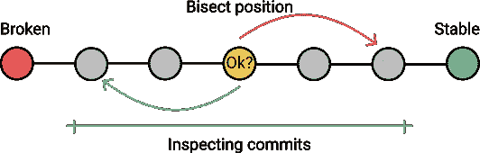

# 用 Git 调试

> 原文：<https://medium.com/hackernoon/debugging-with-git-b18600bbaa96>

当您从事一个大型项目时，您可能会发现代码中的错误，这些错误会阻止您继续开发。如何修复它们？

您可以从手动查看提交历史开始，但是这将是一个非常乏味的过程。令人欣慰的是，Git 有多个工具**可以帮助你在出错时寻找 bug 或罪魁祸首。**

# 责备

`$ git blame <file_path/file_name>`
`**git blame**`[命令](https://kolosek.com/git-commands-tutorial-part2/)帮助您在项目的**特定文件**中找到创建导致 bug 的特定代码行的提交。它还确定了提交的作者，使得询问关于代码的更多信息变得更加容易。

您可以使用-L 选项来限制行输出范围。

```
$ git blame -L 11,21 new_file
^95d69a196b5c7 (Jhon Smith 2018-05-18 13:04:22 +0200 11) def new ^95d69a196b5c7 (Jhon Smith 2018-05-18 13:04:22 +0200 12) @article =
Article.new
^95d69a196b5c7 (Jhon Smith 2018-05-18 13:04:22 +0200 13) end 3171aa2dbbce7 (David Smith 2018-05-16 18:21:30 +0200 14) def edit 3171aa2dbbce7 (David Smith 2018-05-16 18:21:30 +0200 15) @article = Article.find(params[:id])
3171aa2dbbce7 (David Smith 2018-05-16 18:21:30 +0200 16) end ^95d69a196b5c7 (Jhon Smith 2018-05-18 13:04:22 +0200 17) def create 3171aa2dbbce7 (David Smith 2018-05-16 18:21:30 +0200 18) @article = Article.new(article_params)
^95d69a196b5c7 (Jhon Smith 2018-05-18 13:04:22 +0200 19) if @article.save
^95d69a196b5c7 (Jhon Smith 2018-05-18 13:04:22 +0200 20) redirect_to @article
^95d69a196b5c7 (Jhon Smith 2018-05-18 13:04:22 +0200 21) else
```

通过跟踪提交的**部分 SHA-1** ,您可以很容易地看到谁、何时以及如何修改了特定的代码行。注意，`^`前缀显示了在初始提交中创建的行，并且从那以后一直保持不变。

> *使用* `[*-C*](https://git-scm.com/book/en/v2/Git-Tools-Debugging-with-Git#_file_annotation)` [*选项*](https://git-scm.com/book/en/v2/Git-Tools-Debugging-with-Git#_file_annotation) *找出代码片段最初来自哪里，如果它们是从别处复制的。它告诉您原始作者并提交，而不管后来做了什么重构。*
> 
> `*$ git blame -L -C 11,21 <file_path/file_name>*`

`git blame`当你能假设问题的原因时会有帮助。如果您不知道如何回到工作状态，该怎么办？这就是`git bisect`发挥作用的地方。

# Git 平分

一个`**git bisect**`是一个[调试工具](https://kolosek.com/rails-debugging/)，用于通过做一个[自动二分搜索法](https://labs.consol.de/development/git/2018/01/12/automated-debugging-with-git.html)来找出哪个具体的提交在项目中引入了一个 bug 或者问题。您不知道项目中的哪个文件包含 bug。

如果您不知道什么正在中断，并且自从您知道代码工作的最后一个状态以来已经有一堆提交，您可能会求助于`git bisect`。



`git bisect`所做的是，它将 [**git 提交树**](https://kolosek.com/git-branches/) 分成“好的”、无错误提交和“坏的”提交，通过用**二分搜索法**测试它们。基于测试的结果，Git 浏览最近的提交，识别它们，直到找到问题的根源。这就是所谓的二分搜索法算法。

> *如果你有多个 bug，你需要对每个 bug 进行二分搜索法。*

# 这是如何工作的？

1.  首先，让我们从二分搜索法模式开始寻找一个 bug: `$ git bisect start`。
2.  接下来，您需要寻找一个一切都还在工作的提交。为此，让我们检查一下**提交历史**以找到您需要的:`$ git log --oneline`。

oneline 选项仅显示 git 提交的名称。

```
$ git log --oneline
f11c599 Removed unnecessary lines
95d69a1 Added article tests
3171aa2 Enabled editing articles
95d69a1 Added articles
```

1.  **标签**最老的“好”犯 SHA-1: `$ git bisect good 95d69a1`。
2.  在分配了“好”标签之后，您需要找到一个**“坏”提交**来划分提交树，Git 可以在其中应用二分搜索法算法。既然您知道最近的提交有错误，那么您将把它指定为“坏的”提交:`$ git bisect bad f11c599`。
3.  一旦您为您的搜索指定了初始和最终指针，Git 将带您浏览[提交历史](https://kolosek.com/git-branches/)，并标记“好的”和“坏的”提交。
4.  这个过程一直持续到您成功地找到第一个“坏的”提交，即您的问题的原因。现在您可以通过执行:`$ git bisect reset`来退出 git 二分搜索法模式。

# Git Grep

`$ git grep <keyword>`它避免了搜索`.gitignore`文件。

> *GREP 代表****G****lobal****R****egular****E****xpression****P****rint。*

**附加选项:**

*   `-n`或`--line-number`:打印出 Git 找到匹配的行号。
*   `-i`或`--ignore-case`:忽略被搜索关键字和文件之间的大小写差异。
*   `-c`或`--count`:显示在文件中找到的与输入关键字匹配的次数。
*   `-p`或`--show-function`:显示被搜索关键字的上下文。
*   `--and`:确保同一行文本中有多个匹配项。

如果你知道错误代码在哪里，那么`git blame`是一个很好的工具。另一方面，如果您的存储库相当大，有大量的提交历史，很难发现错误，那么可以使用`git bisect`。或者您可以使用`git grep`在项目中搜索字符串或正则表达式。

三个调试工具，有三种不同的方法，以各自独特的方式解决您的问题。目前为止你遇到的是哪一个？分享一下你的经验！

感谢您的阅读！

*原载于 2018 年 6 月 18 日 kolosek.com*[](https://kolosek.com/debugging-with-git/?utm_source=me)**。**