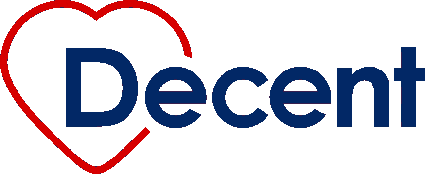

# Decent.com 刚刚筹集了 800 万美元，为所有人建立负担得起的医疗保健。

> 原文：<https://medium.com/hackernoon/decent-com-just-raised-8mm-to-build-affordable-healthcare-for-all-554c15a739b6>

## [加入我们](https://t.me/DecentHealth)的秘密冒险。

[Decent.com](http://decent.com)

三个月前[迈克尔](https://www.linkedin.com/in/mtlapinski/)、[理查德](https://www.linkedin.com/in/richardwluck/)，我意识到[美国医疗保健需要一个神经系统](https://hackernoon.com/us-health-care-needs-a-nervous-system-4dc743fac5f8)，并决定建立[体面的](https://www.decent.com/)。我们开始雇佣包括[莫莉](https://www.linkedin.com/in/mollymoore2/)、[苏珊娜](https://www.linkedin.com/in/suzannescharlock/)、[安迪](https://www.linkedin.com/in/andrzej-skiba/)和[肖恩](https://www.linkedin.com/in/swmleonard/)在内的世界级团队。我今天很高兴地宣布，我们已经从风险投资、加密和医疗保健领域令人难以置信的投资者名册中筹集了 800 万美元，用于资助我们旅程的开始。

我们的投资者包括基金会资本(pre-seed round lead)、门罗风险投资(seed round lead)、数字货币集团(Digital Currency Group)、Lux Capital、Maverick Ventures、Core Innovation Capital、Meridian Street Capital、Healthy Ventures、ChinaRock Capital Management、Abstract Ventures、Precursor Ventures、Ride Ventures、红杉资本侦察兵、Fenwick & West、Sure Ventures、Capitoria Ventures、Adam Marchick、Josh Jeffries、Avin Bansal、Grant Guttero、Ravi Grover、Yoko Okano、Trent Gegax、Andy Sack

我们非常感谢我们的投资者分享和支持我们的长期使命:通过调整整个医疗保健领域的利益相关者激励措施，为所有人提供负担得起的医疗保健，以改善健康，降低成本，并将会员置于医疗保健的中心。我们将使用加密和区块链技术来更好地为我们的成员服务。我们正在旧金山和西雅图招聘开发人员、产品人员和设计师。我们正在寻找合适的合作伙伴加入我们的 2019 年发布之旅，其中可能包括今年晚些时候的象征性发布。我们希望有助于实现去中心化未来的承诺，并将围绕加密的公共叙事从猜测推进到现实世界的价值。

如果这引起了你的共鸣，那就来说说吧。我们正在 Telegram 上建立一个早期社区，它已经在帮助激励我们，推动我们的愿景，并让我们对实现目标负责。今天请[加入我们](https://t.me/DecentHealth)，让我们听到你的声音。我们需要你的帮助，让每个人都有体面的工作。