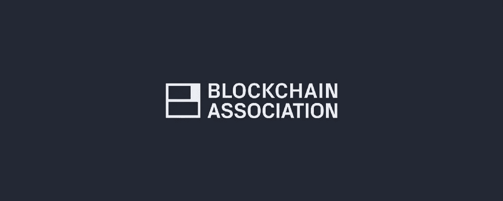

# 正派很自豪能成为区块链协会的创始成员。原因如下。

> 原文：<https://medium.com/hackernoon/decent-is-proud-to-be-a-founding-member-of-the-blockchain-association-heres-why-8eee77a49f3b>

## [正派](https://www.decent.com?utm_source=Medium&utm_medium=Content&utm_campaign=Blockchain-association-announcement&utm_content=pt-1-headline&UTM_ID=003)是第一个[医疗保健项目](https://hackernoon.com/us-health-care-needs-a-nervous-system-4dc743fac5f8)联合比特币基地和数字货币集团等领导者帮助[塑造加密的未来](https://www.washingtonpost.com/technology/2018/09/11/get-ready-big-bitcoin-cryptocurrency-industry-opens-dc-lobbying-arm/)。

*   政策很重要。我们认为 crypto 面临的最大生存威胁是不知情和不支持的监管。来自[区块链协会的](https://theblockchainassociation.org/) [发布帖子](/@BlockchainAssoc/a-unified-voice-for-the-blockchain-industry-8b63c93e9651):“我们的目标是为行业创造一个有利于创新的环境，满足全球对可访问、透明和民主的金融和技术系统日益增长的需求。为此，我们将促进社区和行业领袖之间的合作，向政策制定者和公众宣传区块链和相关技术的好处，倡导培养和支持创新并改善生活的公共政策。”
*   **合作伙伴很重要。**正派选择我们的[种子投资者](https://hackernoon.com/decent-com-just-raised-8mm-to-build-affordable-healthcare-for-all-554c15a739b6?gi=fe3fc45fbf73)是基于这样一个论点:钢铁磨砺钢铁——我们的合作伙伴应该激励并要求我们做到最好。如果我们是我们相处时间最长的五个成员中的平均水平，与比特币基地、Circle、Protocol Labs、数字货币集团、Polychain Capital、Interstellar、Hangar、Wicklow、CoinList、Blockstack 和 Z-Cash 一起成为区块链协会的首批 12 个创始成员之一，这将使我们成为一个值得骄傲的平均水平。
*   **影响重大。广泛采用的秘密是广泛的实用性。不多也不少。政治可以造就奇怪的同床异梦者，但不是在这件事上。我们将自豪地与所有能够帮助我们实现[全民负担得起的医疗保健](https://hackernoon.com/how-affordable-healthcare-looks-in-2025-ddf8ba4d1364)使命的合作伙伴合作。我们相信 crypto 中所有其他以任务为导向的公司也应该这样做。**

区块链技术不重要，除非它能帮助人。

不承认现在，加密就不能改变未来。

我们走吧。

