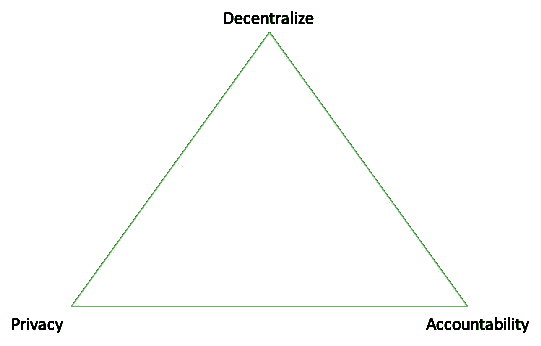
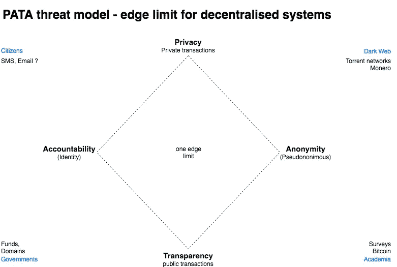

# 去中心化是对抗网络效应垄断的解决方案。但是我们真的了解真正的成本吗？

> 原文：<https://medium.com/hackernoon/decentralisation-is-the-solution-against-network-effect-monopolies-904d91fcd9e6>

垄断人类的强大网络效应是技术的最大威胁之一。它始于物理学对原子弹的觉醒。化学意识到了化学武器和生物学，以及它的生物武器和基因编辑。

# 科技股刚刚首次遭遇中央权力滥用

世界上最大的民主国家被黑客攻击吓坏了每个人，区块链似乎是一个默认的答案。但是权力越大，责任也越大。世界仍在考虑加密货币对洗钱的影响。在过去的几十年里，世界各国领导人都付出了巨大的努力，通过一个名为[金融行动特别工作组(FATF)](http://www.fatf-gafi.org/home/) 的组织来切断恐怖活动、毒品、贿赂和人口贩运的资金来源。该组织在幕后运作，将跨司法管辖区的系统与 100 多家中央银行协调起来，以阻止犯罪分子进行操作和跨越司法管辖区。它汇总了一份目前所有国家都必须遵循的[建议清单。这包括在“](http://www.fatf-gafi.org/media/fatf/documents/recommendations/pdfs/FATF%20Recommendations%202012.pdf)[新支付系统下进行的高风险交易。](http://www.fatf-gafi.org/publications/methodsandtrends/documents/moneylaunderingusingnewpaymentmethods.html)

区块链和加密货币天生就交织在一起。区块链的部分价值来自价值交换网络。

> 每个人都需要一把私人钥匙来操作区块链。这实质上代表了你在区块链的不可否认性。它代表你的数字身份。

问题是，这些身份目前是伪匿名的，任何人都可以创建数百万个这样的身份。它们是无法监管的，这实际上逆转了 FATF 多年来的所有努力。

# 权力下放的真正成本

提出了一个 DAP 三角，揭示了监管者在处理利用任何分散技术的犯罪方面的技术无能。

权力越分散，隐私和责任之间的选择就越难。

> **去中心化** —一种抵抗集中控制或故障的系统。
> 
> **责任** —可对信任或合规失败负责的端点或交易方。
> 
> **隐私** —不希望被识别或交易被披露的端点或交易方。

下面的四边形是为了理解上述困境而提出的。这是一个评估任何分散系统的威胁模型。

基本上，任何分散的系统都可以进行公开或秘密的交易。另一方面，它可以使对方被识别或匿名。在没有任何中央权威的情况下，系统受到在 4 个边缘结果之间选择的限制。

左下角代表最大的责任，因为它朝着右上角减少，并下降到一个黑暗的网络。

一个系统越是分散，在两个轴心中的选择就越是二元的。

# 非标准化的身份系统使问题更加突出。

世界缺乏可信的统一身份系统。身份对于产生责任至关重要。分散系统通常使用远程 KYC(识别检查进行“了解你的客户”)。如果没有面对面的 KYC，这个过程就容易出现身份欺诈、假身份，甚至还有稻草人。

# 可能的解决方案

具有责任性和隐私性只有在中央调解机构本身可能是分布式的情况下才有可能。一个可能的解决方案是区块链的身份保险。其中，在保护隐私的同时，交易对手在反洗钱/KYC 要求方面得到赔偿。用户可以选择几个保险提供商中的一个来隐藏他们的身份，通过提供保险来覆盖交易对手的风险，而不必向与您打交道的每个人透露您的详细文档。它提供了更好的用户体验和安全性。多个保险提供商将导致分散的培训和合规性，因为这将降低保险价格。这减轻了监管者培训和执行此类合规性的负担。

# 最后的想法

FATF、经合组织和其他监管机构在处理像加密货币这样的分散系统进入主流之前面临着巨大的挑战。建立身份保险是允许企业采用身份标准的实用方法。这将需要一种务实的方法来计算与执行反洗钱规则相关的罚款，以帮助发展与之相关的生态系统。

*关于作者*

***Vishal Gupta*** *是 DIRO 的创始人，该项目深度参与解决全球身份问题，使用基于联系人目录众包的分散身份&访问平台。他还支持将自主身份作为单一基本收入和无国界民主世界的基础。*