# 分散应用程序采用问题

> 原文：<https://medium.com/hackernoon/decentralised-applications-and-the-problem-with-adoption-9cfdaa868b2b>

最近关于分散化应用程序(dApps)的状态已经说了很多。大多数人持否定态度，称 [dApps](https://hackernoon.com/tagged/dapps) 总体上没有兑现 ICO 白皮书中的承诺。这些评论员是否太快做出判断了？或者，他们是正确的，dApps 只是一个善变的努力？和往常一样，真相可能介于两个阵营之间。也许，在这个时候，我们应该记住那句古老的格言:君士坦丁堡[不是一天建成的…](/futuresin/ethereums-constantinople-hard-fork-to-go-live-in-october-8d9ce7d8a0b8)

[AirBnb 用了近四年时间突破 100 万用户](https://growthhackers.com/growth-studies/airbnb)，优步 similar 和数字自由职业平台 UpWork 用了近二十年时间、三次合并和数千万美元才达到今天的水平。这些 dApps 大多只存在了不到一年。

此外，尽管许多 dApps 有令人印象深刻的独特销售主张(USPs)，但他们也比“普通创业公司”有更多的障碍要跨越。这篇博客将探索这些障碍，并讨论在可持续发展的道路上克服它们的技巧。

它将探讨采用以下问题:

*   入学障碍
*   波动性
*   营销和信息
*   技术和扩展问题
*   设计

这不是详尽的列表，但涵盖了大多数主要因素。

通篇给出的大部分例子都与去中心化的自由职业平台 [CanWork](http://canwork.io) 有关，然而，它们可以被推广到所有的 dApps。

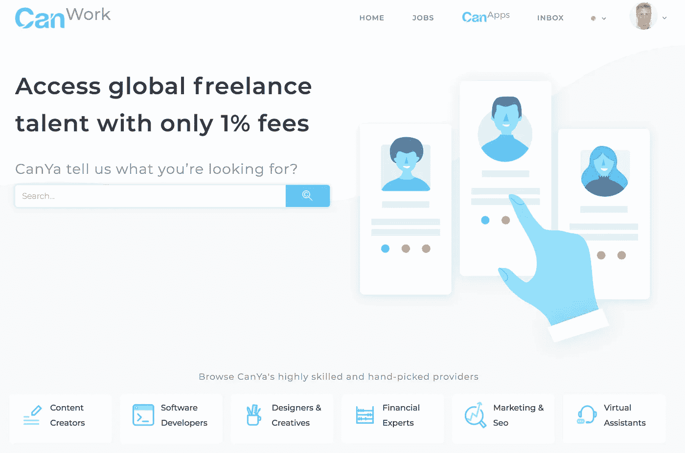

CanWork (note the Yellow icon indicating the user is currently not connected to the ETH mainnet)

# 支付准入壁垒

dApp 面临的第一个挑战是招生。也就是说，对于大多数 dApps，您需要项目的本机令牌来实际使用平台。尽管这有利于项目生态系统的秘密经济，但它不利于采用，因为它创建了很高的进入壁垒。

以下是来自 ICO 社区之外的潜在新用户在使用大多数 dApps 之前通常要面对的流程:

1.  注册
2.  该死的。我需要本地令牌来使用平台
3.  停止注册
4.  将 ETH(或类似产品)转移到交易所
5.  等待
6.  将 ETH 转换为本机平台令牌
7.  等待
8.  将本机令牌从 exchange 转移到支持的钱包
9.  等待
10.  用钱包注册
11.  应用平台

或者，如果潜在用户从未使用或听说过加密货币，它可能看起来更像这样:

1.  注册
2.  代币是什么鬼东西？元掩码…WTF？
3.  关上窗户，迷失在三个小时的 YouTube 黑洞中

[*注:上面的例子在下面的视频中模仿得非常好:*](https://www.youtube.com/watch?v=5lViQeyxKLE)

将此与更传统的网站/应用程序的新用户进行比较:

1.  注册(使用谷歌、facebook 等网站和信用卡信息)
2.  应用平台

如果你能让你的潜在用户坚持从第 1 步到第 11 步，那就做得很好。然而，显然，dApps 需要更加努力，才能更像传统的网站/应用程序体验。

dApp 的大部分认知来自某种类型的令牌生成事件。虽然这有利于创建一个强大的令牌持有者初始社区，但这些令牌持有者中的许多人可能会投机令牌的价格，根本不会使用该平台。即使有一万名 ICO 社区成员使用该平台(不经常使用),通常也不足以长期维持生态系统。因此，项目尽快允许更广泛(更容易)的进入项目生态系统是至关重要的。

这个旅程中最合乎逻辑的第一步是从只允许本地令牌持有者进入平台，到允许*所有加密货币持有者*进入平台。至少这些参与者熟悉加密货币和去中心化平台的价值。这在下面通过从阶段 1 到阶段 2 的移动来表示(这些文氏图属于 [CanWork](http://canwork.io) 在它寻求搭载数字自由职业者的过程中)。

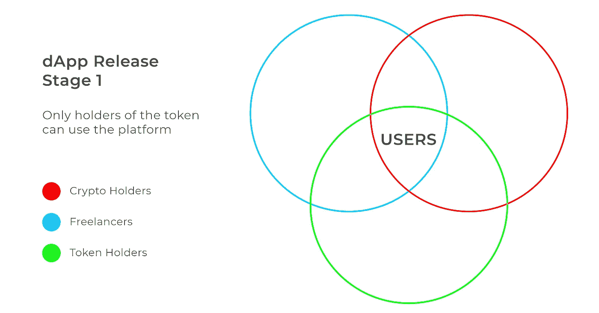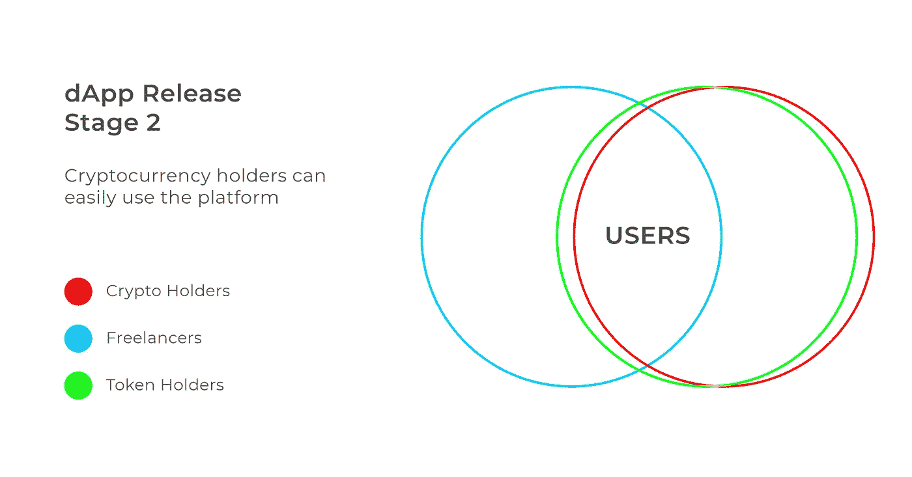

根据有根据的猜测，全球加密货币用户数量将超过 3000 万至 4000 万。特别是，加密货币开始在经济动荡的国家获得巨大的吸引力:

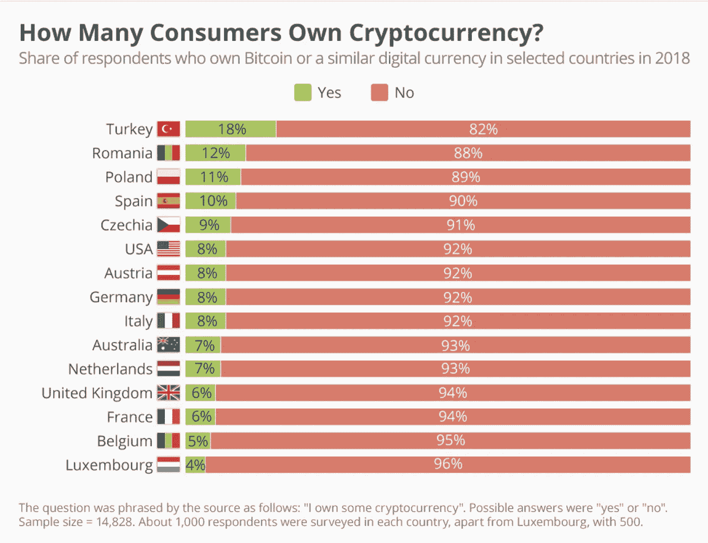

因此，通过从第一阶段进入第二阶段，你的*潜在*用户(或者那些不必从第一步到第十一步的用户)从 10，000(慷慨)增加到 4，000 万。膨胀系数为 4000；考虑到这一步并不太复杂，还不算太坏..

从阶段 1 到阶段 2 有很多方法。流行的方法包括 [Bancor](https://www.bancor.network/) (针对 ERC20)、kyber、changelly、shapeshift 等——然而这些方法要求你的用户离开你的平台，然后，希望还能回来。另一个解决方案是***can exchange***[CanYa](http://canya.io)开发团队将于 2018 年 10 月底发布。这将允许平台用户无缝地将大量加密货币转换为$CAN 令牌，而无需支付费用或离开平台。这当然是开源的，所以在临近发布日期的时候来看看我们的 [github](https://github.com/canyaio) 。请随意为您的项目复制它，并声称它是您自己的:)

通过使用 CanExchange(或其他类似的产品),用户的登录之旅现在被严重缩短，看起来像这样:

1.  注册
2.  该死的。我需要本地令牌来使用平台
3.  很好，我将使用 CanExchange 将我钱包中的一些加密转换为$CAN 令牌并注册。
4.  应用平台

处于 dApp 版本采用过程的第二阶段将允许您的项目巩固产品和发展。第二阶段的项目应该寻找互补的合作项目。理想情况下，你可以把用户群结合起来，解决彼此的问题，这样两个生态系统都会繁荣。

然而，真正的增长和 dApp 从菲亚特竞争对手那里窃取市场份额的能力不会到来，除非广泛采用加密技术，或者找到一种解决方案，以有效的方式让菲亚特进入和离开 dApp。显然，前者正在发生，但还不够快，因此，后者需要成为 dApp 项目的重点。到了第三阶段，你的潜在客户群看起来更像下图:

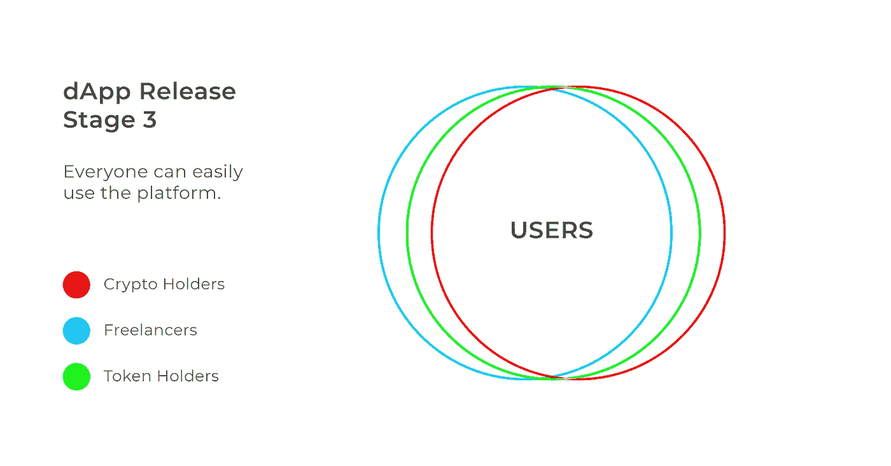

此外，您的入职流程现在基本上与任何其他 web 平台或应用程序相同。

有许多第三方平台和插件在帮助 dApps 进入阶段 3。然而，在这个阶段，它们是昂贵的，并且 UX 差，除去了大部分 dApps USP。说到这里，这里有一些在这个领域有前途的解决方案。如果一个低费用、用户友好的 dApp 解决方案发布，那么大规模采用 dApp 的可能性可能会在一夜之间发生变化。

# 波动性问题…

采用 dApp 的另一个主要障碍是加密货币波动的尴尬问题。代币价格波动(上下波动)是大多数投机者和 ICO 参与者持有代币的原因。然而，具有讽刺意味的是，这也是这些项目无法扩大用户群的原因之一。当商品或服务的商定价值(相对价值)可能在一周内翻倍或减半时，没有人真的想交易这些商品或服务。

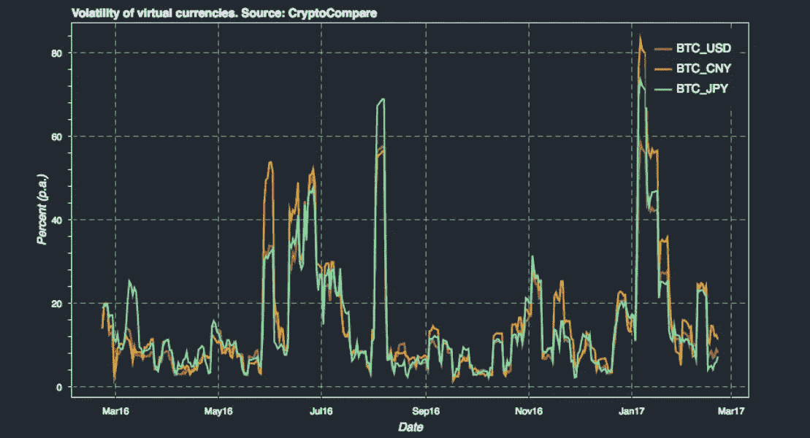

A visual representation of cryptocurrency volatility throughout 2017

当然，有很多关于发展中国家(或经济状况不佳的国家)转向加密货币支付的精彩故事，因为加密货币支付比他们的国家货币更不稳定，但对世界上大多数人来说，情况并非如此。

dApp 项目需要找到解决这个问题的方法。商品销售的 dApps 一般不会像商品价格在销售点转移那样受到影响。然后，它可以被转换为菲亚特或持有在加密的突发奇想的商人。但是对于处理在一段时间内发生的交易或服务的 dApps 来说呢？通常，为了阻止不良行为者，这种类型的交易需要信用卡预授权或某种类型的托管。对于使用加密货币的 dApp 来说，前者不可用，而后者会带来重大的波动性问题。当平台的代币价格改变时，托管的相对价值也将改变。

作为一个例子，让我们用一个网页设计师通过数字自由职业 dApp 为某人创建一个页面的例子。网页设计将花费服务提供商两周的时间。现在，在这两周，FUD 成为头条新闻的常用比喻已经传遍了 reddit，引发了熊市。让我们来看看*“美国税收时间，中国禁止，外汇黑客，Mt Gox 钱包移动更短的喂养狂潮”*随后(尽管与上述任何一个没有逻辑关联)，dApp 的令牌已经失去了 40%的价值。因此，新网页的托管资金相对而言也减少了 40%。这是否意味着客户现在必须补充更多资金？或者 web 开发人员吃亏了，损失了 40%的工作价值，这意味着他们不再有完成工作的动力？正如你所看到的，这个非常现实的问题对双方都有很大的缺点。

解决上述问题的一个办法是建立一个稳定的契约。理想情况下，这是不可信的，以分散的方式完成。[CanYa 团队刚刚用“对冲托管”](/canyacoin/canya-releases-hedged-escrow-to-protect-platform-users-from-price-volatility-7fca7a0aad32)实现了这样一种机制。这种机制确保了在资金托管期间，工作的价值相对于美元(或未来发展中的黄金)保持一致。这是通过一系列的智能合同来实现的，这些合同使用了的戴和班科尔。

你可以在这里阅读:

 [## CanYa 发布“对冲托管”以保护平台用户免受价格波动的影响

### CanYa 为加密资产建立了第一个对冲托管系统。这是一个重要的技术里程碑，是…

medium.com](/canyacoin/canya-releases-hedged-escrow-to-protect-platform-users-from-price-volatility-7fca7a0aad32) 

或者在下面直观地看到它:

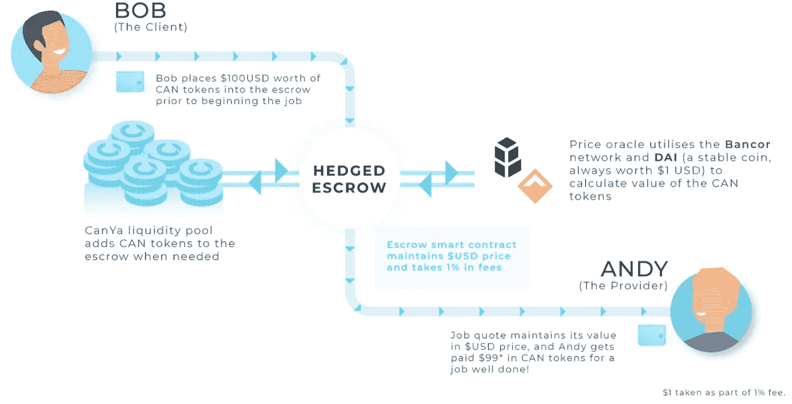

这现在意味着，一旦平台采用率上升，代币持有者仍有$CAN 的潜在上涨空间，但那些预订工作的人不必担心任何短期波动。同样，这是开源的，所以我们鼓励其他 dApps 继续前进，看看他们是否可以在他们的平台上实现类似的东西。[这是 github 的链接。](https://github.com/canyaio/canya-contracts-price-oracle)

# 营销和信息

dApp 项目及其团队需要面对的一个严峻事实是，对于加密货币领域之外的潜在用户来说:

*没人在乎你的平台是分散的……*

这本身不是一个 USP。一个去中心化的平台将允许你做一些不可思议的事情，然而，你的信息需要集中在这些不可思议的事情上。它不应该陷入遍布加密货币世界的深奥术语和修辞中。这个空间之外的许多人，在这个时间点上，并不真正关心。

为什么多年来一直乐于使用基于菲亚特的集中式平台的人会想要使用你的平台呢？说因为它是“去中心化的”或它使用加密货币(他们可能没有任何兴趣)是不够的。

Like any technology, most of the world doesn’t care about cryptocurrency if it provides them no benefit

让我们再次回到 [CanWork](http://canwork.io) ，这是一个为全球数字自由职业者设计的平台。它最终将通过一个去中心化的自治组织(DAO)运行，并使用加密货币，然而，我们将专注于这些事实对平台用户意味着的所有惊人的事情，而不是这些事实本身。

通过 DAO 操作和使用加密货币，CanWork 将:

*   比现有产品便宜 20 倍
*   意味着世界上大约 20 亿“无银行”的人(他们确实在采用加密货币)可以进入自由经济，这被称为“我们时代的工业革命”
*   通过安全的第三方平台访问您的数据，这意味着没有数据泄露。
*   允许以通用货币支付小额费用的跨境支付
*   始终以用户为中心，因为更多的用户意味着以美元为单位的价格增值，这是那些运行 DAO 的人的激励
*   还有更多。

对于那些使用竞争平台的人来说，上述 USP 是 CanYa 团队信息传递的重点。让我们简单的集中在价格角度。

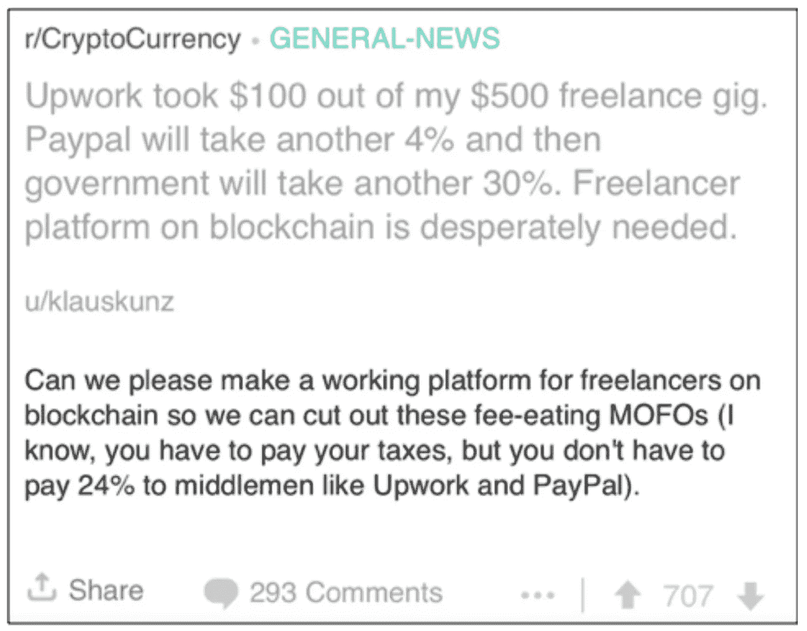

This is a reddit post from an UpWork user (one of CanWork’s main competitors)

CanWork 将比自由职业者便宜 20 倍，因为它使用了令牌模型和加密货币。潜在用户不需要知道为什么它便宜 20 倍，只需要知道事实就是如此。只要 CanWork dApp 的功能接近与现有服务提供商相当，费用的降低应该足以让大量用户转向其他服务提供商。下图可以轻松传达这一信息:

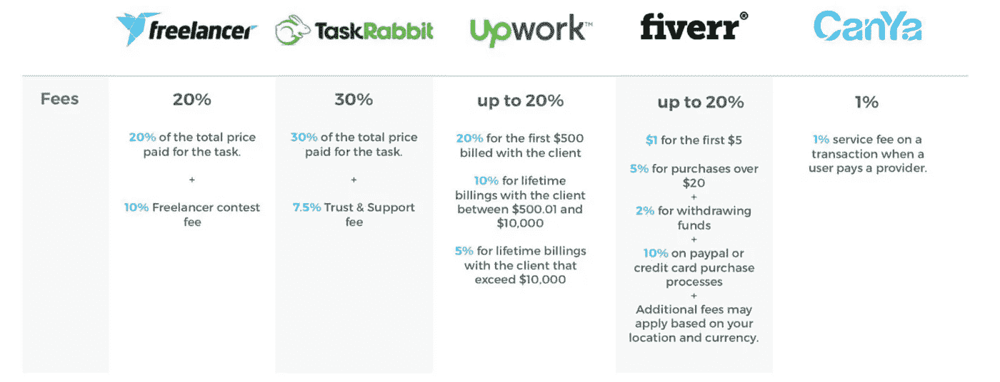

自由职业者都是企业经营者。因此，如果我们能够提供一项服务，将他们的费用降低 20 倍，这意味着他们的口袋里会有更多的钱，并且很可能为预订他们的客户提供更便宜的价格。这是 CanYa 团队在引入菲亚特用户时将关注的主要卖点之一。

# 技术和扩展

绝大多数 dApps 都基于底层协议。这主要是以太坊，但新玩家如 EOS，Zilliqa，Stellar 声称未来 dApp 部署的条件更有利。无论项目决定在什么协议上构建 dApp，当今的技术都存在固有的局限性。最常见的问题之一是协议处理大量用户的能力。高使用率时的拥塞会使整个网络(以及在其上构建的任何 dApps)陷入停滞。

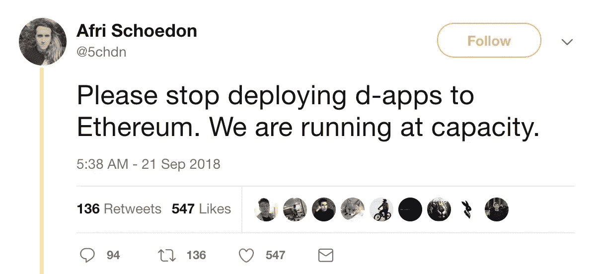

Inspiring stuff…

这方面的一个经典例子是 2017 年底的 cryptokitties 热潮。几乎在一夜之间，这种时尚让以太坊网络陷入瘫痪。汽油价格上涨了 16 倍！这意味着网络上的每个 dApp 都要求其用户支付前一天所支付费用的 16 倍，或者让他们的请求淹没在内存池中，从而使 dApp 无法使用。这是(现在仍然是)有史以来使用最广泛的 dApp。想猜猜需要多少用户才能让整个网络近乎瘫痪吗？[仅仅 27000。](/cryptokitties/cryptokitties-birthing-fees-increases-in-order-to-accommodate-demand-acc314fcadf5)相比之下，大多数读者会承认你在使用[脸书时会有无缝的体验，尽管它每天有超过 10 亿的用户。](http://uk.businessinsider.com/apps-platforms-with-1-billion-plus-users-whatsapp-gmail-google-facebook-club-2016-2/?r=AU&IR=T/#facebook-1-billion-users-daily-10)在 dApps 及其相关协议能够以这种规模运行，或者至少接近这种规模之前，他们将努力获得他们渴望的采用。

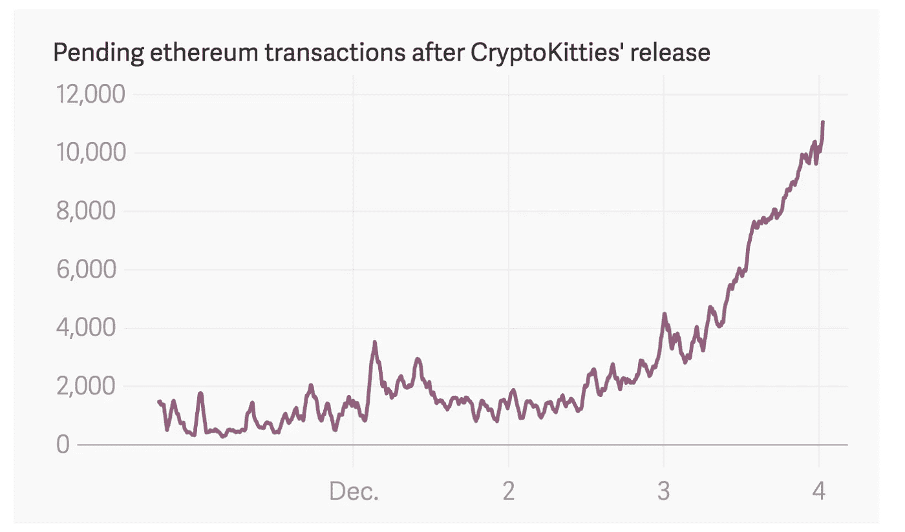

Transactions stuck in the mempool in the four days it took cryptokitties to get to 27k users in December 2017

这并不是说所有的希望都破灭了，绝对不是。有许多协议都做出了重大声明(他们或许能够支持)。即使是以太坊(被认为是首要的智能合约协议)也即将推出重要的扩展解决方案。他们面临的问题是试图解决“[区块链](https://hackernoon.com/tagged/BLOCKCHAIN)三难困境”，即安全、分散 T10 和可伸缩 T11 这三个相互竞争的目标。大多数协议只能实现这三个目标中的两个。

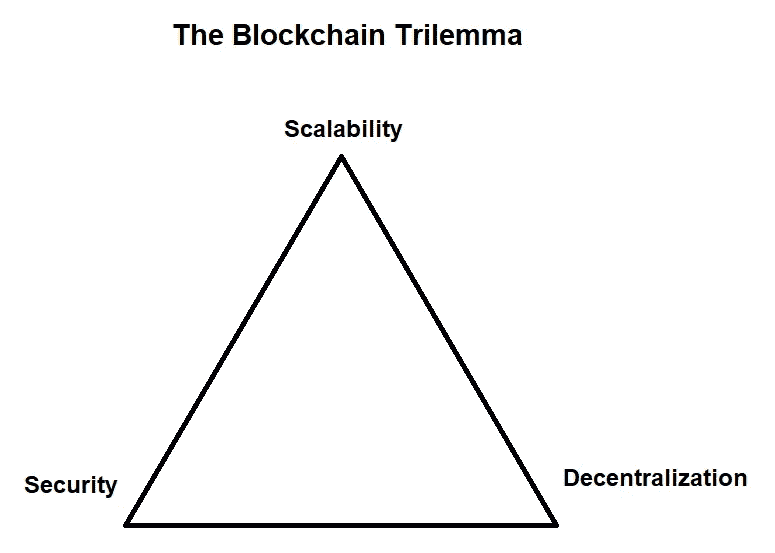

令人欣慰的是，这个领域的一些项目和非常聪明的人正在取得重大进展。[第二层和分片技术可能是以太坊的答案](https://blockonomi.com/plasma-raiden-ethereum-scaling/)，而其他网络也有自己的方法。最重要的一点是，这项技术每天都在进步，dApp 的潜力也是如此，有一天，在使用方面，它可以与当前的世界科技巨头竞争。

# 设计(或缺乏设计)

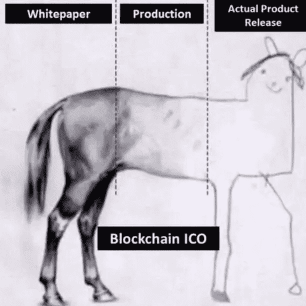

我要讨论的最后一点是设计。对于任何成功的产品来说，这是一个非常重要但经常被忽视的方面(尤其是在加密领域)。目前大多数 dApps 的用户体验(UX)和用户界面(UI)都很糟糕。加密/区块链空间公开强调核心技术，这似乎导致了对设计原则的忽视或厌恶。这创造了人们不能或不想使用的平台，即使是加密货币的最大倡导者。大约有 4000 万加密货币持有者是有原因的，但大多数 dApps 很难突破 1000 个每日用户。虽然声称这都是因为糟糕的设计会让人产生误解，但这绝对是一个因素。

当今大多数最成功的软件产品都以拥有出色的设计而著称。AirBnb 就是一个很好的例子，这个平台实际上是由设计师而不是软件工程师创建的。当然，围绕这项技术带来的一些困难进行设计需要时间，但是，这是必须要做的。如果新用户不能直观地使用它，在世界上最快的区块链上推出下一个杀手级 dApp 想法完全是浪费。在当今社会，人们对新技术的关注度和耐心都很低，这一点更为贴切。除非更多的注意力放在拥有良好界面和体验的 dApp 用户身上，否则采用速度会很慢。请不要让你惊人的想法或技术白白浪费；创造一些外行人也乐于使用的东西！

# 整理想法

在我看来，现在判断 dApps 的表现或未来的成功还为时过早。当然，许多人没有达到宣传的效果，但是，认为他们会在完成 ICO 后的一年内敲开优步、AirBnb 和 UpWork 的大门，这现实吗？在他们真正有机会与大公司较量之前，有许多内部和外部因素需要解决。

顺便提一下，看到人们支持新协议背后的所有令人惊叹的技术，以及它对构建在其上的应用程序有多好，同时又说 dApps 只是一种幻想，很可能永远不会实现，这往往是具有讽刺意味的。如果后者是真的，为什么要为前者费心呢？

进入壁垒、波动性、信息传递、技术限制和糟糕的设计都是促成因素；但是还有其他的。

但是，希望并没有消失。许多 dApp 项目已经吸取了这些教训，并正在努力寻找巧妙的方法来克服它们。dApps 会到达那里，但也许我们只是需要给他们多一点时间？

我很想听听你的想法和评论。完全不同意？你认为还有其他因素导致收养率下降吗？把它们扔在下面的评论里吧。