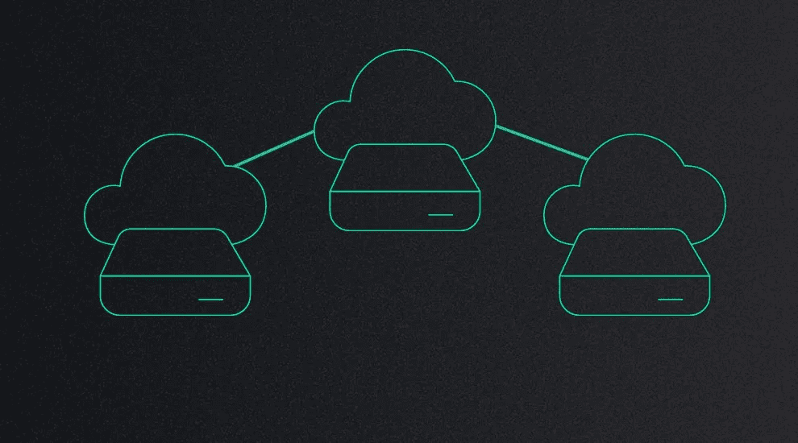

# 分散式存储系统—提供最佳的安全性和效率

> 原文：<https://medium.com/hackernoon/decentralised-storage-systems-offering-optimum-security-and-efficiency-59222acec3cf>

Representing decentralised cloud storage

数字领域的进步无疑简化并改善了人们接受服务的方式。目前，普通大众可以随时随地访问大量信息和服务。然而，数据安全性和效率一直是全球公司持续应对的一个关键挑战。虽然目前的云存储选项提供了广阔的空间，但存在一些挑战，使企业无法完全依赖集中式数据存储系统。

**现有数据存储系统的挑战**

以下是传统数据存储选项的基本缺陷

**隐私和安全问题**

互联网隐私威胁，如身份盗窃、跟踪、黑客攻击等。对个人和企业都产生了重大影响。事实上，根据最近的一项调查，96%的互联网用户认为在线隐私威胁是他们害怕的最大的互联网挑战。集中式存储系统总是容易受到数据泄露的攻击，这使得它成为一种无效的选择。

**缺乏灵活性**

公司显然有大量的数据要存储。虽然集中式数据库提供了足够的空间来存储数据，但也存在不容忽视的挑战。集中式数据库的适应性较低，并且只关注某些特定的任务。这给协作留下了空间，导致了僵化的存储流程。

**速度不足**

在我们生活的这个高速发展的世界里，没有人有时间或耐心去等待技术。所以，一个服务的速度是极其重要的。然而，云存储无法提供快速数据传输所需的高网络带宽，使得数据可访问性成为一个严格的过程

**朋友；呈现数字自由**

Friend 是区块链技术公司开发的一个开源社区，旨在为上述问题提供有效的解决方案。通过消除这些陷阱，该平台旨在为互联网用户提供数字独立性。有了图标、菜单和应用程序，Friend 看起来就像一个操作系统。然而，它是一个平台，使操作系统能够提供一个由区块链驱动的应用程序支持的强大网络。它基本上是一台完全由用户控制和管理的自主云计算机。这是一个没有压迫和审查的生态系统，每个人的个人信息都是安全的

**好友平台的基本特性**

以下是朋友生态系统的基本特征

*   **完全控制**

该平台提供了一个分散的云存储，允许用户完全控制他们的数据。用户可以决定他们的数据存储在哪里以及谁可以访问这些数据，从而确保系统具有最佳的透明度和安全性。

*   **高效的数据共享**

该网络允许组织在其分散的基础设施上轻松部署应用、服务和数据。用户既可以加入全球朋友网络，也可以为他们的组织建立一个专用网络，以便有效地共享应用程序、数据和服务等。

*   **轻松协作**

好友聊天的内置协作功能允许用户在查看数据集的同时进行实时讨论。此外，共享演示会话使每个人都可以在各自的屏幕上查看相同的内容，从而提供灵活的协作选项。

*   **安全和隐私**

友网专注于保护用户的重要数据。通过对用户设备进行加密，该平台可以在私人数据存储到服务器之前对其进行保护。此外，用户还可以获得匿名访问，从而防止其身份被泄露。它将用户从大技术中解放出来，并提供一个安全的生态系统，用户可以在其中存储数据，并获得使用任何设备和软件进行开发和协作的自由。

**向分散计算解决方案转型**

面对集中式存储选项的上述挑战，公司越来越多地寻找分散式解决方案来提高安全性和效率。基于区块链的云存储解决方案允许用户最有效地保护他们的数据并参与数字活动。Friend 就是这样一个独特的云计算平台，它允许用户从分散的服务器中获得最大的效率。