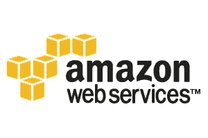
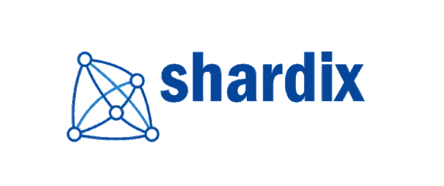

# 权力下放和营销

> 原文：<https://medium.com/hackernoon/decentralization-and-marketing-ad615a8d75db>

任何企业最重要的一个方面就是营销。无论这是以销售产品最早版本的形式出现，还是发展一个充满活力的社区来鼓励公众进一步采用，营销对任何公司未来的成功都至关重要。不幸的是，我们认为这是最近许多区块链公司所欠缺的一个领域。

对这些公司来说，这种营销需求尤为迫切，因为它们的销售周期与传统的替代产品有很大不同。对潜在客户来说，简单地停留在他们已经知道的东西上比转向一个全新的-未经测试的产品更容易。需要说服客户转向新的选择，这是通过营销和公司的知名度来实现的。

营销不充分的一个很好的例子是 Storj。Storj 为文件存储开发了真正革命性的协议。因为它基于[区块链](https://hackernoon.com/tagged/blockchain)，所以该平台上的存储比传统的基于单服务器的平台(如 Mozy 等备份服务提供的平台)安全得多。这是因为所有数据都在许多位置复制。此外，Storj 从世界各地的许多不同提供商处出租未使用的存储空间，从而降低了这些计算机的机会成本和维护成本。这降低了运营成本，并最终降低了存储价格。

Storj Logo

然而，正如任何安装了客户端软件的人所看到的，Storj 一直受到存储服务需求持续低迷的困扰。存储提供商无法以较高的正常运行时间运行，他们的资源处于闲置状态，等待签订合同。考虑到 Storj 提供的产品几乎在所有方面都优于传统的非区块链服务，这是令人惊讶的。虽然 Storj 很有可能最终取得成功，但他们并没有真正实现其潜在增长率。那么，问题是为什么？我们认为这是由于缺乏重要的[营销](https://hackernoon.com/tagged/marketing)和可见性。当你搜索谷歌的“文件存储”时，首先出现的结果是微软 Azure、Dropbox 和 AWS。Storj 甚至没有出现在搜索结果的前五页。

这个问题不是 Storj 独有的，许多区块链公司正因为这个原因未能实现显著的市场渗透。

Amazon Web Services

这种营销赤字是由于这些区块链公司的结构。在任何给定的公司网络中，区块链允许买方和供应商之间的直接交易，而不需要中央中介。这是区块链的主要优势之一。然而，当开发网络的公司不从每笔交易中抽取任何佣金时，就像许多双边网络的情况一样，它们就没有促进市场发展和扩大用户基础的动力。如果公司的收入没有随着网络的成功而增加，他们将没有财政激励和资源来促进网络的增长。这归结为调整中央公司和网络本身之间的激励。

激励一致性是开发任何平台的重要考虑因素，在经济思想中有着悠久的历史。这个想法是，网络中的每个参与者必须只参与对所有其他参与者有益的行动。在这种情况下，应鼓励不可信网络中的中央权威机构推销网络本身，从而带来更多用户。

这导致了一种融资结构的兴起，在这种结构中，分散的公司从每笔交易中收取“费用”。这里的想法是，虽然交易仍然是直接的，这是分散模式的一个关键标志，但仍然有资金支持和鼓励营销。生态系统的增长将增加收入，这将鼓励中心参与者的进一步营销，等等。这是一些新公司在去中心化领域的设计，包括 Shardix 和 Filecoin。例如，Shardix 是一家分散的数据库公司，它使用双向网络，很像 Sia 和 Storj。交易是双方直接进行的，但是，对于每一笔付款，他们都会收取一定的费用，这些费用可用于未来的开发和营销。

Shardix Logo

最终，为了实现区块链给不同行业带来的潜力，每个公司都制定了一个全面的营销计划。这包括创建一个融资战略和形成网络结构，以提供一个持续的增长激励。这将使区块链公司最终开始与传统的替代品在一个公平的环境中竞争。

来源:

[https://storj.io/](https://storj.io/)

https://aws.amazon.com/

【http://www.shardix.com/ 

[https://filecoin.io/](https://filecoin.io/)

 [## 希雅·凯特·伊索贝尔·富勒

### Sia 是一个由区块链技术保护的分散式存储平台。Sia 存储平台利用了…

新航科技](https://sia.tech/)