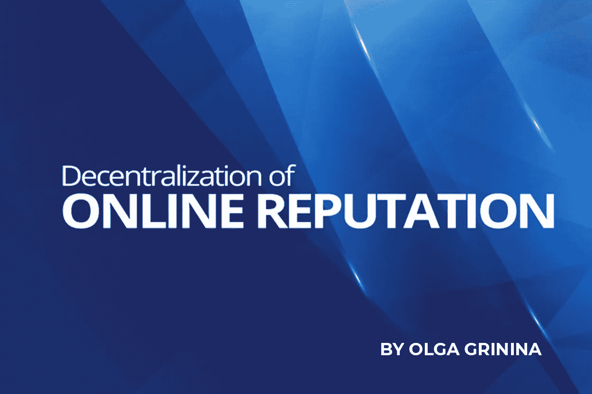

# 在线声誉的分散化:在线评论的新时代

> 原文：<https://medium.com/hackernoon/decentralization-of-online-reputation-a-new-era-of-online-reviews-d1510576e9dc>

奥尔加·格里尼纳

# 为真实观点而战

在假新闻和数据隐私丑闻的时代，观点和网络评论的真实性每天都在受到挑战。斗争是真实的:机器人、机器人和地下特工——编程的或付费的——都在争夺消费者的注意力。今天，编造完全错误的正面或负面评论，并采用黑帽策略来增加利润是一件常见的事情。然而，事实证明，在线评论对企业和消费者都非常有用，这是有证据的。评论平台一直是分享宝贵意见的地方，也是企业收集客户反馈的驱动力。但是用户如何确保他们的评论不会被编辑或删除呢？至于公司，他们现在甚至怀疑这些评论是由真人写的这一事实:在人工智能和机器学习的时代，编写一个自动评论引擎来生成“机器人”评论是不是很难？

# 区块链会再次让评论变得真实吗？

如今，区块链技术已经成为热门技术开发的一部分，并且正在形成势头。利用分布式账本进行在线信誉管理可以带来巨大的价值，原因如下。首先，一个区块链驱动的评论平台将为用户、商家和第三方提供一个管理评论的机制和规则的清晰视图，以及活动的同等透明度。评论的不变性和提供任何一方都无法更改的可靠的单一信息来源——或者至少不会没有人注意到——是可信度的另一个关键因素。

正如我们所说的，寻求为在线评论行业创造双赢局面的解决方案正在市场上出现。第一个尝试是 [Revain](https://dashboard.revain.org/) ，它已经存在了将近一年，并且即将推出他们的第一个运行版本 1.0。通过创建一个平台，提供一个可信的单一信息来源，任何一方都不能更改它——至少不能在没有人注意到的情况下。该平台旨在建立所有利益攸关方之间的信任，并增强审查者的责任感，鼓励他们提供真实的意见，企业负责对潜在的批评做出适当的反应。评论的真实性是通过机器和人工处理评论片段，然后保存到区块链中的操作方法来实现的。因此，可以保证这些评论以后不会被编辑。与其他区块链创业公司一样，Revain 在平台内使用自己独特的数字货币进行结算，这样作家就可以因为真实和建设性的评论而获得奖励，企业可以付费曝光这些评论，而坏玩家则在违反平台政策时受到惩罚。该平台从自己的加密领域的排名开始，并寻求扩展到电子商务和游戏等其他领域。

# AI 呢？

但是，如果区块链不是银弹，它需要更多的权力下放来保证审查的不变性呢？公正性问题一直是这里最大的痛苦:如何区分评论的真伪？人类大脑的常识经常做不到这一点。最近的研究表明，深度学习语言模型可以很容易地逃避人类的检测，这意味着设计良好的神经网络现在能够产生逼真的在线评论。用户调查还显示，这些虚假评论可以始终避免被真实用户发现。此外，还有经过训练的人工智能程序来生成与人类撰写的真实评论难以区分的虚假评论！然而，看起来隧道的尽头有光明。芝加哥大学的一组研究人员能够训练一种人工智能防御机制——一种可以高精度检测机器生成的评论的神经网络。

像在线评论这样一个巨大的市场根本没有接触到太多的人工智能，而这是一个合乎逻辑的跳跃，表明这个行业将是它的滋生地。Revain 实际上正在努力将人工智能融入其系统，这可能会使该平台成为市场上独一无二的平台。由于 IBM Watson 的语气分析器特性，该平台能够自动确定评论中的情感成分。如果我们看一看一些明显带有偏见的评论，像这样的:‘哦，这个地方糟透了，真是一派胡言，我再也不会回到这里了！!'，Tone Analyzer 将立即能够检测出可疑的特征，并使用愤怒、厌恶、悲伤程度、语言风格和社会倾向等标准来建议这篇评论是假的。像这样的评论甚至不会达到第二个人工验证级别。Revain 的引擎建立在智能合同协议的基础上，使人类和机器都可以访问所有的评论，这在物联网和 M2M 交互的时代显得至关重要。物联网的潜在价值巨大。想象一下，一台自动售货机不仅可以监控和报告自己的库存，还可以根据客户的购买历史或在线评论自动安排新商品的交付。这对未来的机器通信来说是真正的革命，我们看到技术正在蓬勃发展，因此这些发展的应用是普遍的。

# 有什么解决办法吗？

破坏在线评论生态系统的最新例子是 Lina.io。目前，很难判断这家初创公司将走向何方，但它声称是一个由区块链连接的评论者、专业人士和企业的新生态系统。通过建立一种新型的“社会评级系统”，该团队通过引入透明度和为用户提供报酬来解决当前消费品和服务评级系统的问题。除了说明“Lina 平台引入了一种混合架构方法”之外，他们没有详细说明平台的运营模式。有一个 MVP，目前只列出了两个评论部分——餐馆和手机，看起来该平台主要针对快速消费品行业。我们当然预见到该平台可能会有更多的应用以及扩展机会，但是，它还没有被充分利用。

Revain 和 Lina 这样的人从扰乱加密领域开始，看起来对区块链的初创公司和其他主要利益相关者都很有吸引力。刚刚经历种子阶段的新企业将在一个地方获得有价值的反馈。这解决了有偏见的报道的问题，因为通常项目的网站或其社交媒体渠道基本上是公众的唯一信息来源，而来自真实用户的有价值的反馈分散在许多网站上，这使得积累数据和分析数据相当具有挑战性。早期投资者和平台用户将能够通过许多标准来评估初创公司，如团队、进展、与社区的沟通、宣布的目标和实际成就之间的相关性。

重塑互联网的可信度绝非易事，需要整合最新的技术和人类的专业知识。作为多个行业的信任担保人，区块链驱动的平台有很大机会打破现状，成为无需任何中介的真正意见分享的新框架，并渴望为用户和企业引入新的行为模式。在线信任问题可能需要数年时间来解决，但随着新一轮用户评论初创公司和现有技术的出现，我们可以看到它将很快到来。