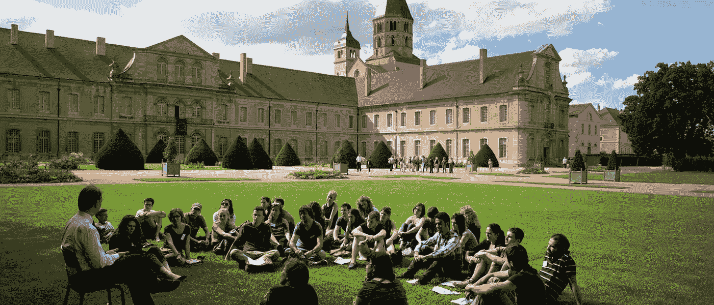

# 是时候去中心化大学了:如何使用区块链让高等教育再次变得伟大

> 原文：<https://medium.com/hackernoon/decentralize-college-blockchain-higher-education-d25104f2cdee>

由于我们正处于几年来最糟糕的秘密熊市之中(这很正常，放松)，快速致富的人已经退出这个领域去寻找另一个方案，而建筑商仍在这里经受风暴。对一些人来说，这些时间可能是艰难和有压力的，但这是谈论想法的好时机，而不是让$$$成为谈话的中心。

我们总是听到诸如“加密将改变世界”或“区块链可用于任何事情，如(在此插入随机字段)”之类的热门短语，但我们距离大规模采用还有一段时间。因此，请允许我插一句我自己的想法，关于高等教育这个话题，以及区块链如何在适当的时候能够极大地改革这个机构。

一段时间以来，高等教育一直是众矢之的，却没有多少解决办法。学费大幅上涨，令人不安的是[超过了通货膨胀](https://www.usnews.com/education/best-colleges/paying-for-college/articles/2017-09-20/see-20-years-of-tuition-growth-at-national-universities)，这导致数百万学生贷款来支付他们的教育费用。当他们出来的时候，他们已经被债务束缚住了，美国总共有 4400 万借款人欠了[1.5 万亿](https://www.forbes.com/sites/zackfriedman/2018/06/13/student-loan-debt-statistics-2018/#dd760467310f)美元的学生贷款。超过七分之一的人不仅早年就背负着债务，而且在未来对经济做出贡献时也会遇到困难。几十年前看似遥不可及的东西，如房屋所有权、新企业创业、家庭建设等等，现在都大幅下降，这并不奇怪。具有讽刺意味的是，推动每个人都应该为了更好的生活而上大学，不管一个人是否负担得起，已经创造了一个现代的契约仆人阶层，他们将更多地强调偿还债务，而不是积极地为债务创造解决方案。

而当我们上大学的时候，我们到底在为什么买单？我们为学分付费，也为社会经验付费。如果我们真的想学点什么，我们都可以谷歌一下或者参加网上课程，有了 [edX](https://www.edx.org/) 和[可汗学院](https://www.khanacademy.org)在身边，我们几乎可以自学任何东西。如果你注意到这些在线教育项目，他们一次只收一节课的费用。从这个想法出发，我将创造我的假想梦——教育区块链。

# 提议:分权学院

介绍分散式学院系统，简称 DAS。其工作原理是，感兴趣的学生将获得 DAS 令牌，并可以使用它们来选择要报名的课程。为了注册，学生必须下注他们的 DAS 令牌(下注意味着永久锁定令牌一段时间，以便在令牌生态系统中执行操作)，然后将被允许参与。在课程结束时，学生将根据学习成绩分成三份，要么获得 DAS 代币奖励，要么退还初始金额，要么被削减(意味着 DAS 代币被锁定更长时间)。授课的教师要么获得基本的代币报酬，要么根据他们的教学表现获得奖金，奖金由学生来评判。根据讲师的偏好，d as 课程可以通过在线、现场和/或两种方式授课，随着 DAS 规模的扩大，将围绕其构建一个服务生态系统，提供辅导、建议、学习工具等服务。

使用 DAS 代币，学生和教师将能够对每个给定项目的课程进行投票。例如，如果有足够多的人想在区块链获得学位，他们可以投票批准该项目以及所需的课程。这种想法不是没有根据的。在 UMass Amherst，有一个名为个人集中学士学位(简称 BDIC)的学位项目，允许学生[设计自己的专业](https://www.umass.edu/bdic/bdichistory)。这个项目从 1968 年就开始了，集中的例子包括说服艺术、舞蹈疗法、儿童早期发展和神经经济学。

DAS 的这种投票机制将允许班级的动态发展，允许课程根据当前的需求进行调整，而不是停留在大多数现代大学不幸陷入的过时话题上。在教育方面之外，学生和教师可以对驱动网络的经济机制进行投票，如通货膨胀率、燃烧参数等。

分散学院的成绩被记录在区块链上，作为完成学业的不可改变的证据，相当于大学学分。理论上获得的学分可用于转入传统教育和/或用于获得 DAS 网络认可的特定研究领域的学位。此外，可以使用一种方法来根据学生过去的成绩、教师的评论以及关于课程主题的附加反馈来对班级的声望进行排名，这将为感兴趣的学生和教师提供背景。

这与现在的系统相比如何？今天，学生们为他们的课程支付数万美元；在分散式学院，最好的情况是学生获得好成绩的代币，最坏的情况是他们在更长的时间内无法获得代币。讲师的情况略有不同，他们要么获得奖金，要么仅仅获得最低报酬。

# 结论

我承认，我在 Everipedia 工作的时候受到了影响，并且在对 DAS 进行理论化时观察了 [IQ Network](https://github.com/EveripediaNetwork/Everipedia/blob/master/TechnicalWhitepaper.md) 的令牌经济学。作为一个每天为 Everipedia 做贡献的人，我仍然对我正在使用一个真实的区块链产品感到惊讶，这让我意识到去中心化的应用程序只会越来越多地渗透到我们的生活中。如何管理和运营这些区块链取决于我们这些用户，不管它们是一所大学、一部百科全书还是其他什么。

DAS 将通过直接将学生与教师联系起来，并剔除那些往往与政府/私人贷款有共生但寄生关系的管理人员，使教育更有效地运行。过去几十年，政府/私人贷款推高了教育成本。随着高等教育债务达到临界点，是时候考虑如何改革当前体系了。DAS 使用新技术提供了一个有趣的解决方案。数以百万计的毕业生负债累累，还有数以百万计的毕业生准备被束缚在发展的道路上，我们真的会失去什么呢？