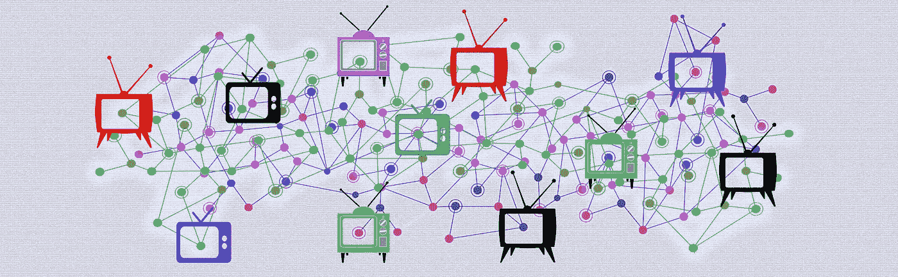

# 分散我的电视！以塔塔图平台为特色

> 原文：<https://medium.com/hackernoon/decentralize-my-tv-featuring-the-tatatu-platform-c84bb6519d2b>

在过去的几十年里，我们见证了人类历史上最伟大的权力转移之一，一场全球信息民主化和去中心化的运动:互联网。回到 20 世纪 90 年代，随着互联网开始流行，许多人担心它会破坏就业并导致经济崩溃。20 年后，显然发生了完全相反的情况。互联网每淘汰一份工作，就会创造两份额外的工作，而且当今世界的许多经济活动都是数字化的。但是即使获取信息和数字媒体已经变得难以置信的民主化，这场数字革命才刚刚开始。

互联互通的下一步包括通过权力下放减少中介的权力，增加用户的权力。我相信，通向更广泛采用数字货币和去中心化平台的大门是一个我了解并热爱的行业；娱乐业。*分散我的电视*需要改变内容制作者获得资金的方式和在线业务的激励结构，如 YouTube、网飞、Hulu、亚马逊和许多其他网站。

你看，在获取信息和内容民主化的过程中，我们最终创造了一些 T4 有史以来最大的公司。我们在互联网推动的内容民主化方面前进了两步，但在这个过程中创造的商业模式方面却后退了一步。尽管我们喜欢使用的这些服务通常是免费的，但我们作为用户总是要为此付出代价的:自愿地，[或不](https://www.theatlantic.com/technology/archive/2018/06/what-we-know-about-facebooks-latest-data-scandal/561992/)。这一切都归结于经济激励。

在数字货币出现之前，很难设计出一种经济激励结构，能够同时让**用户、****平台**和**内容提供商**受益。设计这样的东西很难，部分原因是政府发行的货币交易成本高，不能用于小额支付，而且不容易编程。加密货币具有所有这些属性，这使得企业可以设计完美的经济激励措施来增加其服务的采用。

和互联网一样，这第二波革命性的信息技术是由面向用户的平台点燃的。例如，Napster 为我们称之为互联网的这种通信协议引入了一种新的用例，从而推动了互联网的普及。虽然这对制作内容的艺术家不公平，但 Napster 完全改变了人们获得娱乐的方式。为了看你最喜欢的节目，你不得不查阅电视指南杂志的日子已经一去不复返了，Napster 在这方面值得一些赞扬。

内容的生产和消费方式无疑得到了改善。内容制作者获得报酬的方式也是如此。但是使这些改进得以实现的集中化程度对用户来说仍然是不公平的。尽管我们的选择比以往任何时候都多，但我们访问内容的方式仍然是集中的。YouTube 等基于广告的平台提供免费内容，以换取几乎持续的广告消费。然后是有线电视恐龙将有线电视与互联网和电话服务捆绑在一起，试图维持一个正在衰落的行业。最后，还有一些基于在线订阅的平台不断相互竞争——如果你像我一样，当*开心汉堡店*从网飞转向 Hulu 时，你*不得不*购买 Hulu 订阅……请注意，我只列出了**合法的**选项。

如果人们买不起内容，你不能责怪他们非法下载他们的电视节目。但你也不能否认，这伤害了这些内容的制作者，尤其是对较小的独立制作的损害。不仅作品被轻视，最终观众也是如此(**公平的制作预算=创造优质内容的能力**)。

很明显，到目前为止，没有一个平台能够在用户、内容制作者和商业模式之间建立公平的货币平衡。当我第一次开始写这篇文章时，它应该是关于数字资产如何能够使 DApps(去中心化应用程序)改善这种不平衡。但是后来我偶然发现了一个叫做 [**TaTaTu**](https://hackernoon.com/tagged/tatatu) **，**的项目，它正在一个平台上做这种事情。而且越来越好；塔塔图平台有一个工作产品和一些聪明的想法，以增加日常生活中人们对数字资产的采用。

# 塔塔图奖励整个生态系统

塔塔图的想法是由电影制作人安德里亚·耶沃利诺(Andrea Iervolino)构思的，他制作了许多成功的电影，如《T2》*《威尼斯商人》* 以及最近的《彻头彻尾的 T7》*。*本质上，TaTaTu 是一个基于奖励的娱乐和社交媒体平台，提供各种数字内容。它计划提供电影和热门电视节目等优质内容，假以时日，任何用户都将能够上传原创内容。最重要的是，塔塔图是一个以用户为中心的平台，也公平地奖励内容制作者。

我最欣赏这个项目的一点是，它有一个现实的执行计划。在 crypto 中，我们经常看到非常雄心勃勃的项目，当涉及到执行他们的想法时，这些项目一点也不实际。像人们熟悉的服务一样，塔塔图也将向其用户提供广告，这是一种行之有效的商业模式。但这里的关键区别在于这些广告的收益是如何分配的。

塔塔图平台将使用一个数字令牌系统，奖励为其生态系统做出贡献的所有人。只要你做出积极的贡献，无论是观看内容还是制作内容，你都会得到合理的回报。它在智能合约中利用以太坊，用塔塔图自己的代币(TTU)进行公平透明的广告支付。如果你想了解更多关于以太坊和智能合约的工作原理，请务必阅读我的 [*以太坊，对于地球人*文章](/@nancyellenherriman/ethereum-for-earthlings-e12ec293011a)，在那里我解释了所有这些。

在我深入研究在以太坊网络上运营一个像 TaTaTu 这样的平台的好处之前，让我们更全面地了解一下 TaTaTu 及其提供商对参与其中的每个人的激励措施:

## **用户受益**

用户不仅可以通过观看广告来访问提供高质量内容的平台，而且**用户也将因观看内容而获得收入**。与任何其他流行的娱乐平台不同，用户将从观看中获得部分广告收入！！！(现在辞掉白天的工作！！)…用户也将从朋友推荐到平台观看的任何内容中获得收入。

层层中介，层层烦恼都被裁掉了。通过对内容(以及相邻的广告)投入时间和注意力，观众直接资助了他们热衷的项目。它不像一个基于订阅的系统，在那里你支付每月的费用，让平台来决定如何在项目之间分配订阅费。一个项目的好坏直接反映了观众对它的感受。

## **内容提供商受益**

如前所述，盗版是在线内容制作者的一个大问题。一旦内容以数字形式发布，就很难控制它发布到哪里，盗版惩罚了那些可能在财务上挣扎的小制作。在 TaTaTu 平台上，内容提供商将通过广告获得公平的观看报酬。不像 YouTube 等基于广告的平台，直到最近才区分严肃作品和低质量视频，TaTaTu 将有一个优质的内容层，以区分好莱坞级别的电影和家庭电影。

有了一个以用户为中心的系统，塔塔图平台有潜力自然地建立一个忠实的观众群。使用[区块链](https://hackernoon.com/tagged/blockchain)系统的一个副产品是强大的，塔塔图也在建立一个数字版权管理器(DRM)的过程中，这将允许内容制作者和发行者定位和执行他们内容的观看权。由于支付和许可权都在区块链系统上执行，塔塔图的平台提供了最佳的组织和透明度。

## **广告主受益**

对广告客户来说幸运的是，有了塔塔图的亲身实践，广告客户在匹配广告内容方面有了更多的控制权。同样，这与 YouTube 等更集中的系统形成了对比，YouTube 处理所有支付和向在其平台上寻找广告的公司投放广告。这在过去的一些基于广告的平台上造成了一些问题，公司将其品牌与他们认为不合适或与其产品/服务完全无关的内容相关联，这项技术允许品牌对他们的受众有更多的控制，充分利用他们的广告时间。

## **塔塔图平台的优势**

塔塔图平台也从中受益。广告收入的一小部分也将用于营销和其他间接成本，以帮助维护和改善平台。通过一个不仅奖励广告商、内容制作者和观众观看内容，而且最终还奖励他们为社交媒体平台做出贡献的系统，他们实际上正在创造一个激励所有人增长的社区。

# 当今的工业

我想，如果你还在阅读，你就是某种形式的在线娱乐的访问者。为了充分理解 TaTaTu 提供的好处，让我们回顾一下作为娱乐消费者，我们在网上访问最喜爱的电视节目和电影的选项，以突出 TaTaTu 这样的分散平台和当前市场之间的差异。

*   **基于订阅的平台**:用户每月向提供娱乐的平台支付费用，因此给予平台对什么连续剧、电影等的控制权。通过他们的平台产生和/或流传送。网飞和其他付费流媒体网站，如 Hulu 和亚马逊 Prime Video，近年来变得非常成功，不仅提供你可以在有线电视上观看的电视节目和电影，还开始引入自己网络制作和分发的原创内容。尽管这些平台很受欢迎，但生产成本和许可权很高，并且由于大量用户共享一个帐户，以及在线内容消费者的利润损失，这些消费者将继续非法流式传输和下载内容，以便免费访问相同的内容，损失的利润非常高，而且，即使用户使平台能够蓬勃发展，他们也将所有权力掌握在给定平台的手中。
*   **基于广告的平台**:用户通过消费广告来获取内容。在这个系统中，广告商向平台支付费用，以按次付费的方式播放他们的广告，来自广告的收入在平台和内容提供商之间分成，其中大部分归平台所有。最受欢迎的基于广告的系统之一可能是你们很多人都熟悉的——YouTube。由于如此大一部分广告收入流向了 YouTube 平台，更高质量内容的制作者不愿意让他们的内容以流媒体形式播放。这可能就是为什么流行的电视节目和电影在这里找不到，因为 YouTube 已经成为低预算独立系列、教程、音乐视频和大量被归类为“随机”的视频的保留地。这个系统没有任何问题，YouTube 在控制这类视频的收视率和广告收入方面做得非常出色，但该公司并没有为奥斯卡提名感到自豪。

# 分散的行业

从我对 TaTaTu 的上述描述中，你可以得出结论，这种类型的平台也受益于一种现实的、走向市场的策略，这是一种相对类似于 YouTube 等传统广告平台的广告收入系统。我相信最终，基于广告的系统将是最有利可图的，因为不管基于订阅的平台有多便宜，*免费的高质量内容是有市场的。*

那么，在以太网上运行一个基于广告的平台有什么好处呢？有几件事——我在文章前面提到的一个特性是，该平台的多个方面能够在区块链系统上运行。塔塔图正致力于建立一个区块链机制来追踪许可权，以确保内容只被那些获得许可的人浏览。这激励了更高质量的内容制作者，因为他们可以跟踪他们的内容在哪里被观看——因此相信他们的所有权将得到保护。

由于 TaTaTu 基于以太坊，数字身份被加密绑定并链接到账户地址，这是对平台上恶意活动的巨大威慑，因为与传统互联网证券相比，创建假账户和身份更具挑战性。同样，要想更详细地了解以太坊，可以看看我的文章 [*以太坊，对于凡间*](/@nancyellenherriman/ethereum-for-earthlings-e12ec293011a) *s.*

当我第一次比较 TaTaTu 和 YouTube 的数字时，我有点失望——我想知道当百分比支付似乎与 YouTube 上的内容制作人类似(甚至更少)时，内容制作人如何能够制作高质量的作品。然而，我喜欢这种新技术的想法以及它如何惠及每个人——所以我一直在研究和剖析 TaTaTu 的白皮书。现在很明显，技术和平台本身就是塔塔图将改变我们消费娱乐方式的原因。

虽然我们不能完全知道像塔塔图这样的平台的财务收益，因为它是真正的创新，有这么大比例的广告收入流向内容消费者，这个平台不可能不吸引更多的观众。我的意思是…一个付钱给人们来消费娱乐的系统…我仍然不能接受！此外，当试图预测公司的成功时，不能想当然地认为塔塔图计划建立的社区是理所当然的。

它不仅是一个提供娱乐的平台，也是一个社交网络系统。是的，YouTube 也允许评论和喜欢，但在 TaTaTu 上，作为用户，你可以以一种活跃的方式创建和管理个人资料——你的个人资料不仅可以代表你的一部分，而且与朋友分享内容也可以得到 TaTaTu 平台的奖励。通过奖励用户建立并活跃他们的个人资料账户，塔塔图正在使其生态系统成长！

最终，去中心化网络的使用不仅自然地加强了透明度和诚实性，而且使塔塔图能够用微支付来补偿其生态系统。与银行就小额交易进行谈判不会带来麻烦或利润损失。因为有了这项技术，社区可以为他们的每一秒钟获得报酬。随着内容提供商、广告品牌和用户都通过单一的交易媒介进行支付，各方都将拥有一个数字钱包。(上面的樱桃来了！)而作为观看内容的平台用户，你也将有能力使用你的广告收入向慈善机构捐款。这就是这个想法和塔塔图平台如此鼓舞人心和创新的关键所在——*它赋予人们权力，使其能够运行*。用户不仅因为他们的时间和他们喜欢的补偿项目而获得发言权，而且他们也有机会通过向他们热衷的慈善机构捐款来帮助更大的社区。就我个人而言，我非常期待这个平台的最终结果。有了这样一个强大的团队，想法和执行计划，我真的相信塔塔图有能力为积极的变革铺平道路，从娱乐业开始！