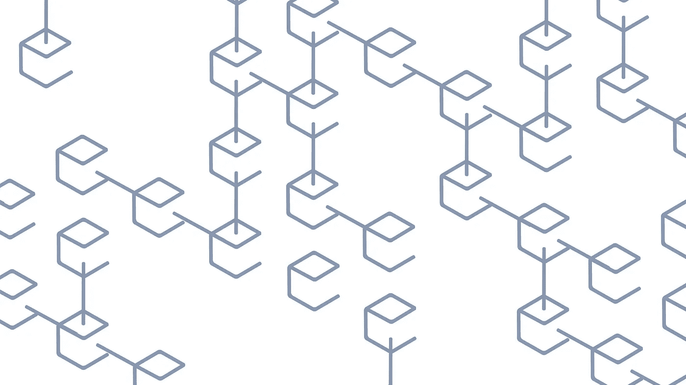

# 分散且不可信的网络

> 原文：<https://medium.com/hackernoon/decentralized-and-trustless-networks-f881671fae4e>

作为 [Bluzelle](https://medium.com/u/1ebc95e9d994?source=post_page-----f881671fae4e--------------------------------) 的首席技术官，在会议、聚会和相关的社交活动中，我经常想起**区块链**在我们的行业中变得多么普遍。

事实上，在过去几年中，区块链已经成为软件行业最热门的技术之一，有望颠覆多个行业，包括银行/支付、IT 基础设施、保险、政府等。事实上，当谈到去中心化和不可信计算时，唯一被积极讨论的真正技术是区块链。

区块链只是许多不同的分散式网络中的一个，而分散式网络本身通常是一个更大的群体(称为无信任网络)的子集。

**分散网络**节点可以在没有集中的决策和管理资源的情况下进行互操作。更具体地说，节点可以在它们之间做出决策，包括基于**共识**的系统管理决策，其中节点的某个子集使用共识算法协作来确定结论。共识有多种形式，但它们都有一个共同的目标，即作为一个群体做出关键的必要决策。这里的力量是显而易见的——没有给定的节点是特殊的，因此在这样的网络中很少有漏洞。节点可以来来去去，事实上，根本不需要验证或专门授予单个节点加入的权限。最重要的是，没有一个节点或节点的共谋能够单方面采取任何对整个网络有实质性影响的行动。这是因为适当设计的分散共识算法需要大量人口的参与，以便作出决定和随后采取行动。这就否定了坏演员。分散家族中值得注意的其他网络包括网状网络和**群体**网络(如 **Bluzelle DB** )。

在**无信任网络**中，参与的节点不需要以任何方式特别许可或验证，但是这些节点作为一个群体，可以被信任做出正确的、自私的决定，这些决定也符合整体的最佳利益。更具体地说，以前需要单个集中式角色(如数据库服务器)的信任现在在系统中的所有节点之间分布得如此精细，以至于不再需要对任何单个节点的信任，这导致了**不信任**。这些节点中的每一个都受到经济模型的激励而正确行动并与他人合作。例如，在战俘区块链，每个矿工都有强烈的经济动机通过计算散列值和寻找新的区块来促进区块链。采矿者获得区块奖励和采矿费，并在此过程中向新区块提交新交易。同时，由于网络中所有其他矿工的检查，而且由于所有矿工都拥有他们正在开采的货币这一事实，可以信任矿工诚实而准确地完成这一过程。因此，任何一家矿商都不应该做出对人民币价值产生负面影响的事情。在典型的区块链，每一个这样的矿工都是一个未经审核和识别的节点，在一个“未经许可”的环境中，网络的决策是由一组不可信的资源决定的。

以下是**的关键要点**:

*   区块链是一种分散式网络，但重要的是要认识到许多其他类型的分散式网络，包括网状网络和群网络。
*   分散式网络对于将可靠性引入网络至关重要，因为它消除了任何集中形式的决策，通过共识算法将此责任委托给集体。
*   无信任网络的参与节点，每个节点做出对自己有利的决定，将隐含地做出也与整个网络一致并有利于整个网络的决定，但是具有节点本身不需要被特别审查或允许参与的附加属性。以前集中的信任现在分散在节点中，只要不信任节点的集合相互合作，就不需要信任任何给定的单个节点。

Bluzelle DB 是一个由农业节点组成的不可信网络，这些节点会形成集群，因此 Bluzelle DB 实际上也是一个分散的网络。这些节点每个都是未经许可和批准的，然而 Bluzelle DB 网络的架构确保每个农民的自私利益和随后的行动与农民参与的每个群体的利益和行动一致。此外，每个群体本身是一个独立的实体，有自私的利益，每个群体的行动也与整个网络的利益一致。因此，可以得出结论，Bluzelle DB 网络中的每个节点，尽管未经许可和审查，都符合以安全、可靠、高性能和可扩展的方式存储数据的网络目标。