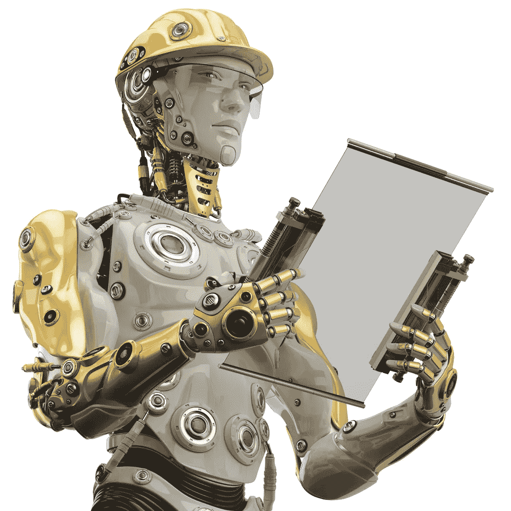

# 分散自主的工人

> 原文：<https://medium.com/hackernoon/decentralized-autonomous-workers-cbaeca9ce6b3>

我认为结构性失业是不可避免的，它将是我们这个时代快速变化的副产品，而不仅仅是与廉价机器人劳动力的纯粹竞争。那么，我们该拿数百万无法就业的成年人怎么办呢？他们无法重新学习技能或接受教育，无法跟上未来就业市场的需求。假设我们不想让他们悲惨地死去，我们要么重新分配其他人的财富，给一些失业者，要么我们以某种方式分配未来财富创造**手段**的所有权。

最酷的部分来了！通用基本机器人的想法(即每个人都将拥有一个超级聪明的机器人奴隶来为他们赚钱！)有它的优点，但在我们到达机器人如此多才多艺和聪明以至于它们可以做我们扔给它们的任何事情的地步之前，将会有许多更笨的、特定应用的人工智能或机器人的中间步骤。以自动驾驶汽车为例，每个[优步](https://hackernoon.com/tagged/uber)的司机都可以攒够钱买一辆[自动驾驶汽车](https://hackernoon.com/tagged/autonomous-car)(或者入股一个 AVs 车队！)并让他们为他/她赚钱。

优步会更喜欢运营自己的无人驾驶车队，还是会继续像现在这样成为开放、中立的平台！？政府的工作将是激励优步(UBER)和谷歌(Google)这样的大公司，让财富创造系统变得更加分散。

机器人化并不总是一目了然。一个相关的想法可能是成立主权财富基金，主要投资于自动化和人工智能。公民将从政府为他们管理的更加多样化的投资组合中受益。更进一步，可能是一种面向大众的股票市场，未来的公民可以在这里交易机器人劳动力和人工智能工人！这将给失业者一种新的目标和控制感。有一天，我们可能都会成为这种新型资产的投资者

让我知道你对这种机器人共享所有权的新模式有什么看法！