# 分散式(抵制审查)视频即将改变我们的社会

> 原文：<https://medium.com/hackernoon/decentralized-censorship-resistant-video-will-transform-our-society-b6baaaf797df>

## 一个新的区块链项目如何让我们摆脱审查

“Two roads diverged in a [yellow] wood, and I, I took the one less traveled by…” — Robert Frost

我设想了两种截然不同的技术未来。一方面，我们继续走 T2 集中式 T3 视频传输平台的老路——在这个世界里，视频从脸书、亚马逊和谷歌拥有的庞大数据中心进行存储、转码和分发。或者另一种情况，视频通过*分散*节点的网络分发——在这个世界里，视频(信息)不受某个单一权威的支配。

这篇文章背后的主要目的——除了呈现这两种不同的未来——是指导那些不熟悉新的[区块链](https://hackernoon.com/tagged/https://hackernoon.com/tagged/blockchain)协议，称为 **Livepeer** 的读者踏上从视频捕捉到最终在某人的屏幕上交付的技术之旅。

当你读完之后，你不仅会对这项技术的社会意义有更好的理解，还会对它的深层技术过程有更深的理解。

***注*** *:如果你想跳过剧情，只需要了解技术，向下滚动到“Livepeer Network”部分*🤓

# 路径一:*集权*的未来

2022 年，进步的纽约州终于选举出了第一位女州长——距离内利·罗斯宣誓成为怀俄明州第一位女州长已经过去了将近整整一个世纪。不管怎样，纽约北部以外的几乎所有人都欣喜若狂。随着各种政治组织将他们的干部推上街头，出现在镜头前，庆祝活动正在曼哈顿各地爆发。

Time to celebrate!

与此同时，这位新当选的州长在她位于上东区皮埃尔酒店每晚两万英镑的塔塔总统套房里，不安地在临时“作战室”外踱步。她闷闷不乐的原因不是因为对计划中的获奖感言感到焦虑，而是越来越担心她会收到一些非常坏的消息。

门打开了。一个衣冠楚楚的男人——她的竞选经理——神色不安地爬过木地板。

“我们仍在解决这个问题。”

从表面上看，这个问题似乎很平常。显然，其中一名员工在薪酬问题上与财务主管发生了激烈的争执。然而，这位工作人员没有同意一些可行的解决方案，而是威胁要发布州长的罪证视频。

“这个工作人员到底是怎么拿到这个视频的？”她冲他大喊大叫。

竞选经理看起来更加激动。他知道如果这个视频泄露出去，那么这次州长竞选就结束了。他的政治生涯结束了。

他有充分的理由预见这样的情景。该视频据称显示州长同意从一名与中国政府有联系的男子那里接受 500 万美元的非法竞选捐款。

> “我们知道视频是用新版 Instagram 制作的。这意味着它在 facebook 的一个服务器上。

Instagram. Your media belongs to Facebook.

与此同时，回到作战室，团队处于全面的损害控制模式。那里的一名员工恰好“有关系”他的岳父是 facebook 的董事会成员之一。

> 打了几个电话后，视频被追踪到，并悄悄地从所有服务器上删除了。

有一段时间，员工们感到不安。如果视频重现呢？如果有目击者站出来呢？

事实上，有些谣言确实在流传。一些小报把谣言当成故事来报道，但它很快就销声匿迹了。幸运的是，对于州长来说，大多数媒体都同情她的事业，而不是节外生枝。

一年后，这件事完全被遗忘了。纽约州再一次创造了历史——*第一个选举出一个受中国利益支配的州长。*

“I ❤ centralization”

# 路径 B:分散化的未来

除了一个例外，这个场景中的一切都和第一个场景一样。由工作人员拍摄的视频现在通过完全不同版本的 Instagram 传播。

你看，在未来，许多提供视频供应服务的平台已经将几个新的分散协议整合到他们的技术堆栈中。像脸书、亚马逊和谷歌这样的大公司这样做，并不是出于对去中心化的新爱好，也不是出于对信息自由的原则性信念，而是出于实际的商业意识。

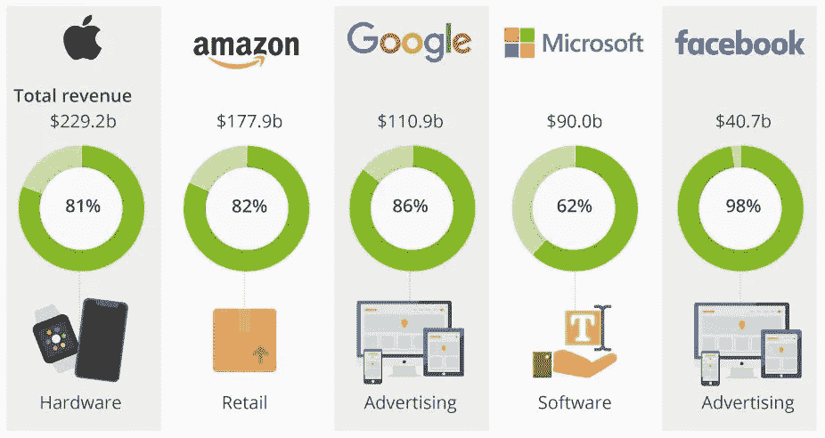

Sources of Revenue in 2017

这些公司已经计算过了。虽然集中式视频解决方案提供了一些优势——跨技术堆栈的垂直集成和竞争对手的强大进入壁垒——但分散式版本是一种更具可扩展性、更便宜的替代方案。

*“那么，为什么不通过将这种分散式协议集成到我们现有基础设施的一部分中来对其进行测试呢？”一些经理建议。事实上，这正是 facebook 对其 Instagram 产品所做的。*

因此，员工不断增加的视频片段通过 Livepeer 的网络传送。具体来说，视频被分割成一秒钟的片段，然后快速通过一系列节点进行快速转码、视频认证，最后进入点对点(P2P)存储。

由于许多这些编码视频是由独立节点托管的，这些节点与 P2P 内容交付网络(CDN)一起运行，因此对交付的干扰变得更加复杂…

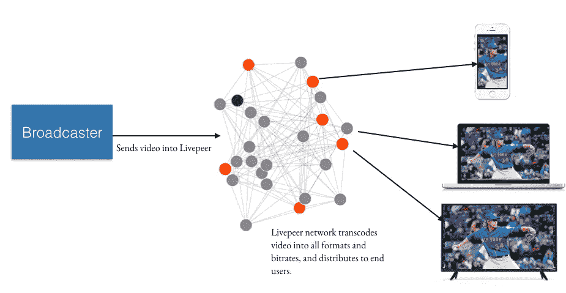

Basic illustration of how a decentralized live-streaming layer would work

> 其中一些节点——现在存储着这段视频——不仅分散在全球各地，还超出了 facebook 的覆盖范围。孟买一间宿舍里有一个节点，归 Aarav 所有，他是学工程的。还有另一个节点属于科罗拉多州丹佛市一家公司经营的采矿池。拥有者的名单是无穷无尽的…

这位“人脉很广”的员工打电话寻求帮助，他的岳父是 facebook 董事会成员。等了一个小时后，电话那头传来一个声音，带来了一些坏消息:

> “视频通过一种叫做‘live peer’的分散式网络传输。我们无能为力。”

“I am everywhere”

# Livepeer 网络

## 概观

在我们深入了解这个视频如何通过一个看似复杂的节点网络传递的本质之前，让我们先来理解一些与 Livepeer 项目有关的更广泛的概念。

这个项目是两位技术创始人的心血结晶:[道格·佩特卡尼斯](https://medium.com/u/55f7a4bffb8d?source=post_page-----b6baaaf797df--------------------------------)和[埃里克·唐](https://medium.com/u/507fc56d031a?source=post_page-----b6baaaf797df--------------------------------)。他们对中国未来的影响可能会被某些治理结构弱化。这种结构仍在研究中，但很明显，那些对网络维护做出贡献的个人(*如开发人员、代码转换器等)。将对其未来拥有多数发言权。*

该协议背后的美妙之处在于它是一个可扩展的、现收现付的网络。换句话说，直播视频广播所需的网络资源随着需求而扩展和收缩。这与集中式基础架构形成鲜明对比，后者要么通过某个服务提供商(*例如* Google)直接*管理，要么通过*第三方提供商(*例如* Akamai、Lively 等)直接*管理。).像这样的公司有时满负荷运行数据中心，有时只运行 10%的容量。*

关于这项技术，也有一点天才，也许是意外之喜。我这么说是因为视频的转码——从原始编码到一系列可访问的替代方案——最好由 GPU 来处理，而 GPU 恰好以闲置的 ASIC 芯片的形式散落在区块链的生态系统中。这些芯片可以重新用于这种新的分散式视频经济，与当前的替代产品相比有相当大的折扣:

> 平均而言，集中式系统以大约 3 美元/小时的价格对每个视频流进行编码。重新利用闲置的 ASIC 可能会使成本降低 1000 倍！

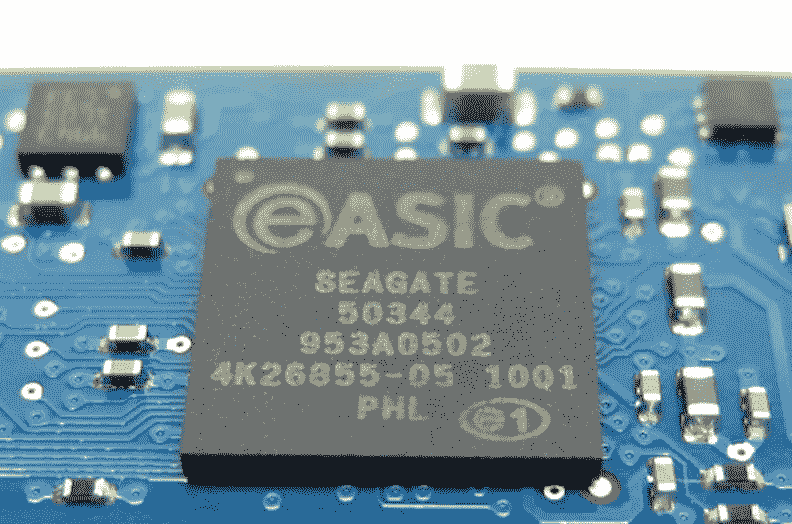

还有证据表明，与当今许多集中式 HTTP CDN(*如*亚马逊 S3、Cloudflare 等)相比，分散式 P2P CDN 的*(如* IPFS 或 Swarm)可以大幅降低成本。):

> 据估计，使用 P2P CDN 比 HTTP CDN 便宜[80–98%](https://techcrunch.com/2017/01/26/peer5-y-combinator/)！

在撰写本文时，该协议的工作版本已经在以太坊的 Mainnet 上运行了 6 个多月([2018 年 5 月 1 日发布](/livepeer-blog/launching-the-livepeer-network-50dc7be7840))。然而，可能还需要几年时间才能解决许多问题。

现在让我们探索一下，我们新当选的州长的视频是如何通过一个分散的网络可靠地移动——不受审查或篡改——并最终到达某人的屏幕上的…

## **术语表**

*   一个**节点**是连接到网络的任何计算机:*广播器、代码转换器、对象存储器等。*短语“代码转换器节点”、“代码转换节点”、“代码转换器”、“编排器”或者甚至“节点”都可以表示相同的东西。
*   一个**代币持有者**就是拥有代币的任何人，无论他们是*实际节点*还是*简单投资者*。代币也可以指任意数量的加密货币:ETH、LPT 等。
*   **绑定节点**是已经将它们的令牌委托(绑定)给另一个节点(例如代码转换器)的任何节点。

## **最终注释**

该项目进展迅速。许多组件仍在被研究、测试、实现、审查等。这意味着并非下面的每个细节都是 Livepeer 项目的最准确表述。然而，总的来说，流程很可能保持不变。

因此，此处介绍的许多细节都是理论性的，并不一定表明该项目多年后可能会如何运作…

# 视频的流媒体之旅

## 广播公司→代码转换器(“编排者”)

在我们去中心化的未来，一个独特版本的 Instagram 被用来捕捉我们州长的叛国行为。Instagram 不是将整个视频传送到 facebook 的中央数据中心，而是将视频分成许多片段，发送到节点*(运行* [*Livepeer 媒体服务器*](https://github.com/livepeer/wiki/wiki/Livepeer-Media-Server) *)* 的网络中进行转码**。**但是，在发送视频之前，*必须收到付款！*

通常 facebook 会在内部补贴成本，但由于这个视频正走向一些外部协议，成本必须由 ETH 或 stablecoin(未来)支付。幸运的是，在这种情况下，facebook 可以使用*离线* [*原子互换*](https://www.investopedia.com/terms/a/atomic-swaps.asp) *s* 进行 ETH 支付，然后通过 **Livepeer 智能合约结算标签*在线*。**

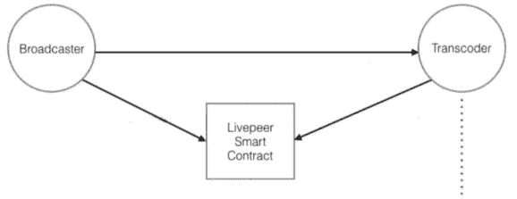

Payment (ETH): **Broadcaster → Livepeer Smart Contract → Transcoder |** Video: **Broadcaster → Transcoder**

因此，在 facebook 进行所需的 ETH 存款后，整个视频被分成单秒片段，并附加了各种字段:*片段源、片段位置、有效载荷哈希等。*

> 这些视频片段随后被发送到一个转码器节点网络，这些节点开始工作(代码转换),并期望它们将收到一部分原始 ETH，这些 ETH 现在作为智能合同中的托管。

因为所有这些节点都在竞争做代码转换工作，所以必须有某种方法来证明它们的工作产品是合格的。这是通过根据一些特定标准对每个节点进行排序来解决的:*赌注金额、代码转换器性能、广播公司接近度、代码转换器可靠性等。*

显然，有许多变量会影响选择最佳节点来进行代码转换工作。或许这一选择中最重要的因素之一是 *Livepeer Token (LPT)* 赌注的数量…

## **live peer 工作令牌(LPT)**

Livepeer 使用一种被称为*委托利益证明(dPoS)的共识机制。因此，分配给每个节点的工作比例取决于标记的数量。这个标记使用的令牌是一个名为 **Livepeer Token (LPT)** 的 [ERC-20 令牌](https://www.investopedia.com/news/what-erc20-and-what-does-it-mean-ethereum/)，它的功能是要求*工作的权利。因此，下注的 LPT 越多，分配的工作就越多。**

那些执行高保真、诚实的代码转换的节点被激励去尽可能多地下注 LPT，以便最大化利润。另一方面，表现不佳、不诚实的节点会受到惩罚性的惩罚，它们的标记 LPT 会被削减(拿走)。

> 这是非常有用的，因为 LPT 令牌变得不仅仅是简单的**交易媒介**(即支付)或基本的**储值手段**(即投资)，它成为网络维护的**记账单位**。这使得代币价值更能反映整体网络价值。

共识机制[也允许委托](https://forum.livepeer.org/t/an-overview-of-bonding/97)。这意味着那些拥有 LPT 但不愿意做一些工作的代码转换器以及投机者(统称为“*令牌持有者*”)可以在一段时间内将他们的令牌委托(或绑定)给代码转换器节点。

令牌持有者有很好的理由将他们的 LPT 令牌与一个节点绑定:由于诚实的代码转换器被激励去尽可能多地持有 LPT，他们通过提供慷慨的 ETH-split 来争夺令牌持有者。

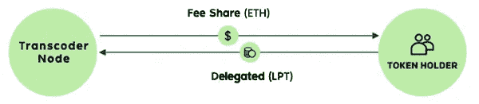

**Transcoder Node** can stake their own **LPT tokens** or receive delegated **LPT tokens** from **Token Holder**

> 这种委托很重要，因为它作为生态系统中代码转换器的质量控制机制。事实上，在这里可以看到一个活跃的代码转换器的精选列表:【https://explorer.livepeer.org/transcoders

## **通货膨胀代币奖励**

除了从 facebook 发送到 Livepeer Smart Contract 的 ETH，然后它会找到自己的方式到达完成代码转换工作的节点，还有一种额外的补偿形式: **LPT 令牌奖励**。这些特定的令牌由协议以编程方式在每个块循环中发出。

我们已经确定 LPT 令牌是 Livepeer 的共识机制使用的两个 rk 令牌。然而，重要的是要理解这些 LPT 令牌——取决于参与者在生态系统中的视角——实现稍微不同的目的:

1.  对于节点操作符:LPT 令牌用于要求*做工作*的权利以换取利润。
2.  对于令牌持有者:LPT 令牌通过绑定到他们选择的节点，被用作被动收入的一种形式。
3.  对于生态系统本身:LPT 令牌通过吸引诚实的工作人员和阻止潜在的攻击，有助于**网络质量(**和安全性)。

有趣的是，许多区块链都被设计成有一个固定的代币供应目标。一些人逐渐释放他们的代币作为多年的*块奖励*(*例如* [比特币](https://hackernoon.com/tagged/bitcoin))而其他人一次释放他们所有的代币(*例如*占卜)。

> Livepeer 不同寻常，因为它没有固定的令牌供应目标。取而代之的是，使用一个[算法调整发行模型](/@petkanics/inflation-and-participation-in-stake-based-token-protocols-1593688612bf)将 ***参与率*** (目前)设定为 50%。

*什么是“参与率？”*对于使用利害关系一致性证明的协议，活动(赌注)参与者的数量可以大致与网络安全性相关联。原因很简单，网络中标记的令牌越多，对网络发起攻击的成本就越高。

> 因此，参与率可以被定义为相对于总代币供应的赌注代币的某个比例。

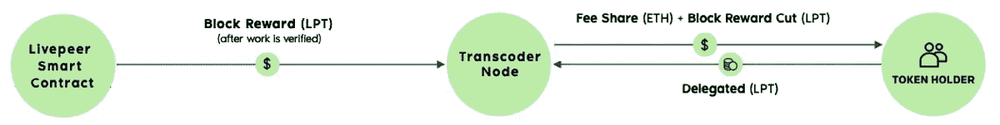

**Block Reward** is sent to **Transcoder Node** and **Block Reward Cut** is shared with **Token Holder**

该协议的自我调整令牌时间表就像一个平衡块，将网络参与推向一个特定的最佳点。此时，协议的参数设置为 50%:

*   所以当网络赌注**低于 50%** 时，协议发出一个很大的 LPT 令牌奖励。这稀释了每个人的 LPT 值，促使许多人押上他们的 LPT 以避免未来的通货膨胀。
*   而当网络跑马圈地**在 50%** 以上时，协议发出一个小的 LPT 令牌奖励。这对 LPT 值影响很小，释放了继续打桩的压力。

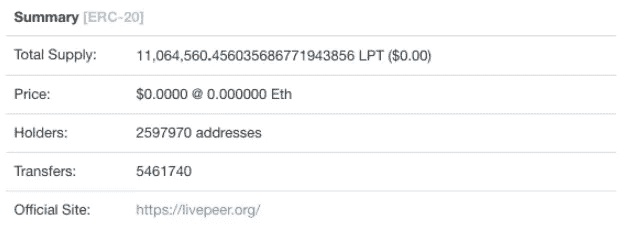

As of 11/30/2018, there are over [11 million LPT tokens](https://etherscan.io/token/0x58b6a8a3302369daec383334672404ee733ab239). This number will increase for the foreseeable future.

## **对象商店(例如 Swarm、IPFS、亚马逊 S3……)**

*注:蜂群是* [*仍未生产*](https://blog.ethereum.org/2018/06/21/announcing-swarm-proof-of-concept-release-3/)*；IPFS 被用作临时溶液。*

一旦我们的州长的视频被转码，必须有一些方法来验证输出。毕竟，我们不希望有人找到一种巧妙的方法来篡改最终的视频输出。因此，为此目的实现了另一个专用组件:

> 对象存储只是一个使用基于对象的存储体系结构存储数据的服务器(或节点集合)。对象存储可能能够也可能不能够作为内容传递系统运行。然而，在旅程的这个阶段，只需要对象存储来托管用于验证的视频片段。

因此，在转码器节点完成对所有视频片段的处理后，身份验证将逐步进行:

1.  代码转换器节点为在该段上完成的工作发出收据(填充有各种重要字段)。
2.  然后，该收据被发送到 Livepeer 智能合同，该合同随后选择应被质询(验证)的随机视频片段。
3.  然后代码转换器将这些片段发送到一个像 Swarm 或 IPFS 甚至亚马逊 S3 这样的对象存储库进行验证。

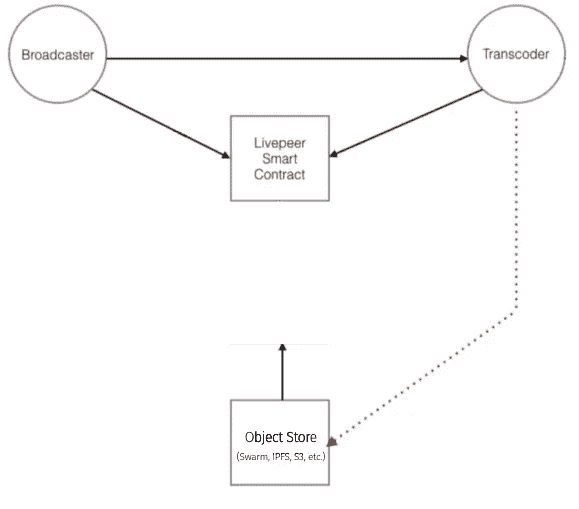

**Transcoder Node** writing random video segments to **Object Store (e.g. Swarm, IPFS, etc.)** for storage…

> Swarm 是一个尚未投入生产的内容寻址存储平台。然而，由于它计划使用一个特殊的合同([称为 SWEAR](https://swarm-gateways.net/bzz:/theswarm.eth/ethersphere/orange-papers/1/sw%5E3.pdf) )，可以保证数据可用性的概率很高，因此对它的发布有很大的期待。

保证一些对象存储中的数据可用性是非常重要的，因为视频数据将很快需要被另一个称为 Truebit 的协议访问以进行验证…

## **Truebit 协议**

*替代品:* *API Oracle，Oraclize 计算，安全硬件等。*

Truebit 协议用于确保代码转换器节点不会创建受损的视频片段。在一个完美的世界中，每个片段都将被检查，但这将被证明是相当昂贵的:[*5X–50X*](https://github.com/livepeer/wiki/blob/master/WHITEPAPER.md)*原始代码转换价格。*

相反，Livepeer 智能合约随机分配有限数量的要检查(质询)的数据段。现在代码转换器的责任是证明他们的工作是合法的:

1.  **代码转换器**将被质疑的片段的原始版本发送到一些对象存储，如 IPFS 或 Swarm(在上一节中讨论)。
2.  **代码转换器**调用 *Truebit 智能合同*开始验证，并提供某个对象存储*中的段的地址(哈希或 url)。*
3.  **Truebit 验证器**通过重新编码(检查)片段，然后将结果发送到 *Livepeer 智能合约*来进行链外“验证游戏”。
4.  **Livepeer Smart Contract** 比较*代码转换器的索赔*与 *truebit 的索赔*，然后报告该部分的最终结果。

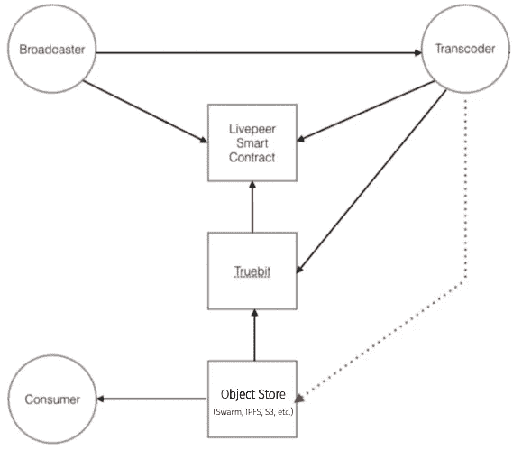

**Truebit** must verify video integrity before **Fee Share** (ETH) + **Block Rewards** (LPT) can be released

由于流程中有如此多的活动部分，为了简单起见，省略了一些细节。关于 Truebit，主要的收获应该是，在将结果*传送到链上*之前，该协议能够处理链外的所有繁重计算。

一旦所有被挑战的段通过验证，Livepeer 智能合同将从托管中释放 ETH，并将正确的 LPT 块奖励分配给代码转换器。新编码的视频(州长违法)现在可以分发了…

## 对象商店(如 IPFS、Swarm、S3..*。* ) →消费者

*注意:对象存储甚至可以是原始的广播者。*

我们已经确定*对象存储*只是使用基于对象的存储架构存储数据的节点，它们可能能够也可能不能作为内容交付系统运行。因此，在这种情况下，一旦编码的视频被 Truebit 验证，视频必须以某种方式从对象存储中分发。

考虑到 Livepeer 协议的灵活性，可以通过多种方式交付最终的视频。以下是几个例子:

***分散交货***

*   对象存储 *(IPFS 或蜂群)* → CDN *(Peer5，Viblast 等。)* →消费者
*   转播商 *(* [Livepeer 媒体服务器](https://github.com/livepeer/wiki/wiki/Livepeer-Media-Server) *)* → CDN *(Peer5 等。)* →消费者

***集中发货***

*   对象存储 *(S3 等。)* → CDN *(云锋、风头等。)* →消费者
*   广播员 *(Instagram 等。)* → CDN *(Akamai，Level 3 等。)* →消费者

虽然上述步骤是说明性的，但它们确实揭示了许多人似乎忽略的重要一点:*审查-抵制* ***取决于*** *开发者*。换句话说，如果开发者选择集成其他必要的组件，Livepeer 为分散堆栈提供了媒体层，可用于创建抗审查的应用程序***。***

因此，公平地说，在确保审查阻力方面，责任完全落在开发者的肩上，而不是 Livepeer。这种开发人员的责任落在两个特定的设计选择上，它们位于 Livepeer 协议的边缘:(a) *应用程序接入点*和 *(b)内容交付解决方案。*

最后要强调的一点是，上述步骤可以以各种不同的方式混合和匹配。例如，开发者可以选择完全放弃 CDN，直接从他们选择的接入点提供新编码的视频。

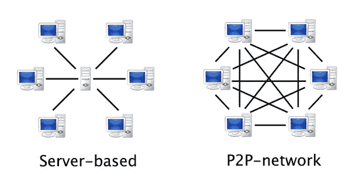

**Centralized HTTP CDN** *vs.* **Decentralized P2P CDN**

幸运的是，在我们的场景中，Instagram 将腐败州长的视频从代码转换器节点路由到许多分散的群节点，然后这些节点使用混合解决方案通过 HTTP CDN 和 P2P CDN 来交付视频。与之前所有案例一样，facebook 决定使用这种分散交付解决方案，因为这样可以节省成本。

最终，该视频不仅可以从 Instagram 上广泛访问，还可以从各种不同的访问点访问。有网络应用程序，以及其他网关，向全球数百万人传输我们违法州长的视频。

*任何人都无法阻止视频的传播……*

# 最后的想法

我们今天生活的世界与昨天的世界没有什么不同。技术可能会改变，人们可能会活得更长，但人性永远不变…

> "古今中外，人类大同小异，因此历史不会告诉我们什么新奇的事情。"
> 
> 大卫·休谟(1748 年)

这是一个简单的概念——对许多人来说仍然难以理解。这与进化生物学或精神超越无关。更确切地说，这种批判是指驱动人类的最基本的、潜在的力量。

就像细菌可以[适应抗药环境](https://www.youtube.com/watch?v=plVk4NVIUh8)一样，人类可以学会利用机会。这是人的本性。让我们用更具体的语言来解释一下:

> 从根本上来说，人类会做坏事，比如撒谎、偷窃、欺骗等等。)不是出于简单的情况(例如，不良的社会化、腐败的教育等。)而是因为他们可以。

在历史上，一个强制性的中央权力被用来确保人们相互合作。这仍然是今天的主导模式。然而，区块链带来了范式的转变。

就信息而言，这可能意味着不再需要通过某个单一的中央权威机构传递数据(*例如*谷歌、脸书等)。).毕竟，这是一个重要的发展，因为越来越多的人通过某种形式的视频获取新闻。一个典型的例子是，对 4K 视频和脐带切割的需求继续大幅增长。

这个故事的另一个重要部分是，长期以来，我们一直依赖各种集中服务——在某些情况下是垄断——来调节我们的信息，但有些人开始问: [**谁将监督观察者？**](https://en.wikipedia.org/wiki/Quis_custodiet_ipsos_custodes%3F)

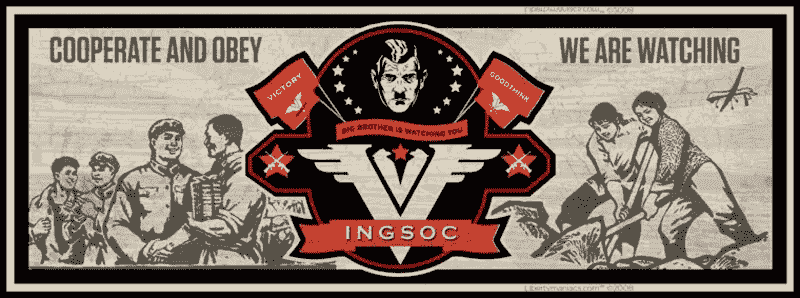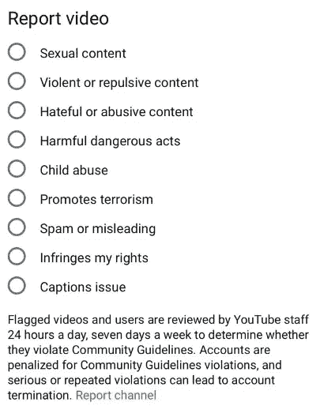

[“1984](https://www.amazon.com/1984-Signet-Classics-George-Orwell/dp/0451524934)“ — George Orwell

毕竟，谁来决定什么是“好的演讲？”你今天尖锐的政治演讲会不会变成明天不那么好的演讲？我们只需要把目光转向过去，亲眼看到只要有机会压迫、否定和审查，人类就会这样做。

然而不知何故，我们似乎走到了一个十字路口。我们现在有一个选择。一方面是分散的区块链技术，另一方面是先进的集中技术(人工智能)。一个系统透明地运行，另一个在幕后。

我们会选择什么？

*   如果我们继续走中央集权的道路，我们将受到保护。然而，这种保护不是以我们作为自由人的条件，而是以某人或其他人的条件。
*   如果我们选择权力下放的道路，没有人会保护我们。我们可以自由地表达自己，但是——也许在一段时间内——也会接触到冒犯、恶心和下流的东西。

我坚信，作为自由的个体和启蒙运动的继承者，我们必须选择去中心化的道路。尽管我必须再次指出，权力下放并不是人类的灵丹妙药。那些建立在实际区块链技术基础上的项目并没有给世界提供一个乌托邦的愿景，而仅仅是*通向个人自由的道路*。

只有未来的应用程序开发者将 Livepeer 协议集成到整个 web3 基础设施堆栈中，这条道路才能实现*。看来我们抵制审查的世界的命运完全落在了你的肩上——开发者。让我们骄傲。*

## Livepeer 项目资源

*   网址:[livepeer.org](https://livepeer.org/)
*   观看/阅读
    → [入门 Youtube 视频](https://www.youtube.com/watch?v=Y_lammvup8M)
    → [最新文档](https://livepeer.readthedocs.io/en/latest/)
    → [成为开发者](https://livepeer.readthedocs.io/en/latest/developers.html)
    → [成为转码器](https://livepeer.readthedocs.io/en/latest/transcoding.html)
*   聊天
    → [不和群](https://discordapp.com/invite/RR4kFAh)
    → [Livepeer 论坛](https://forum.livepeer.org/)
*   代码
    →[Github](https://github.com/livepeer)
    →[开发者测试版报名](https://livepeer.us16.list-manage.com/subscribe?u=57807e9b74db375864b2c4c68&id=b9626dd647)