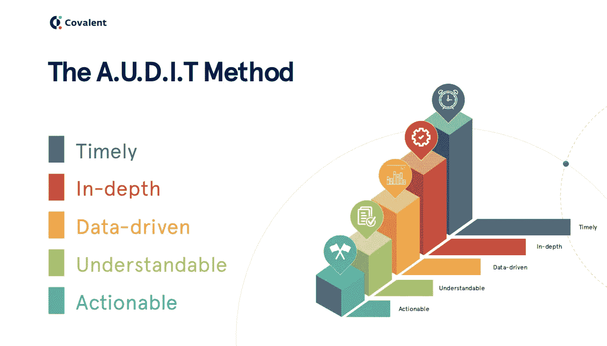
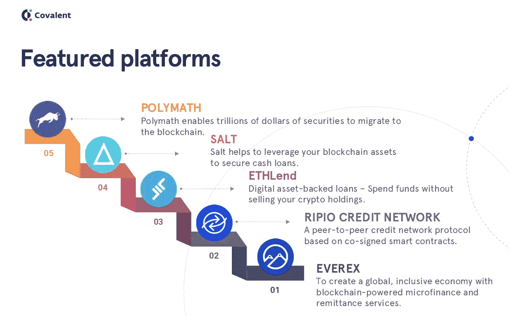
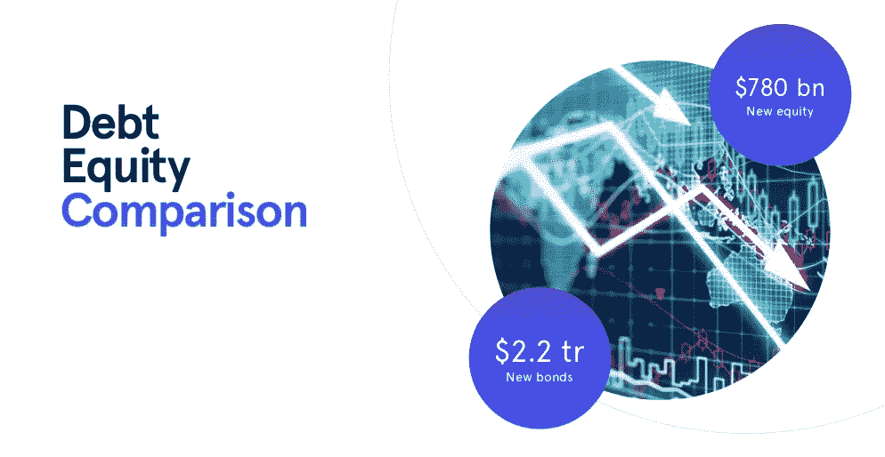
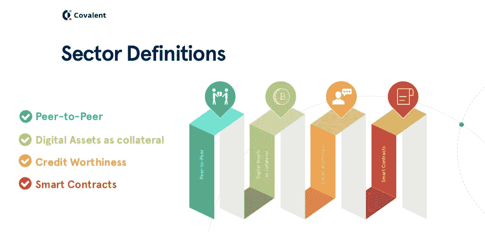
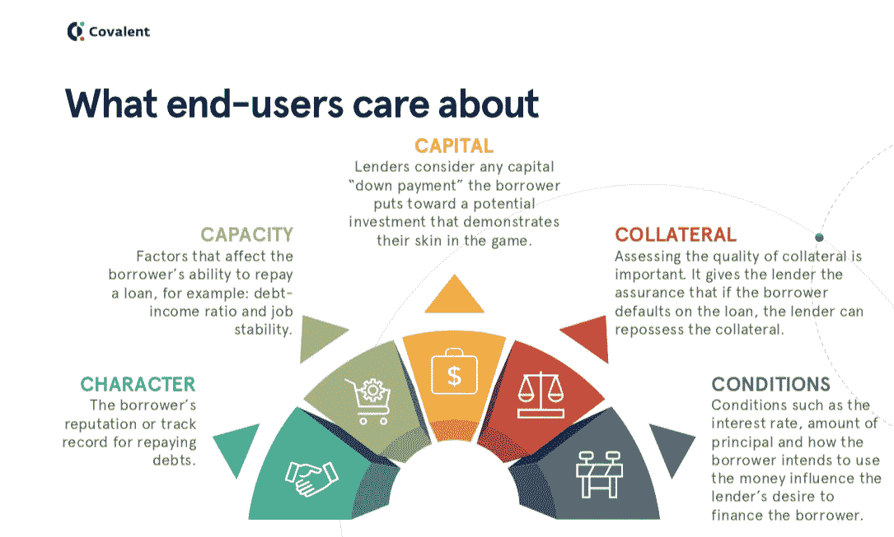
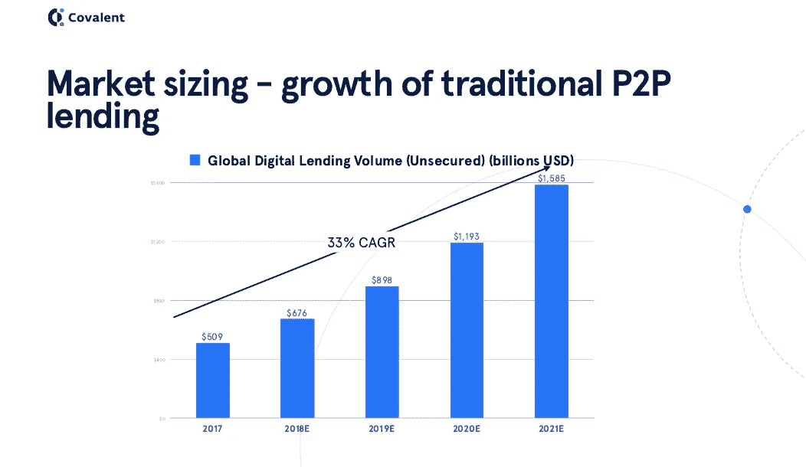
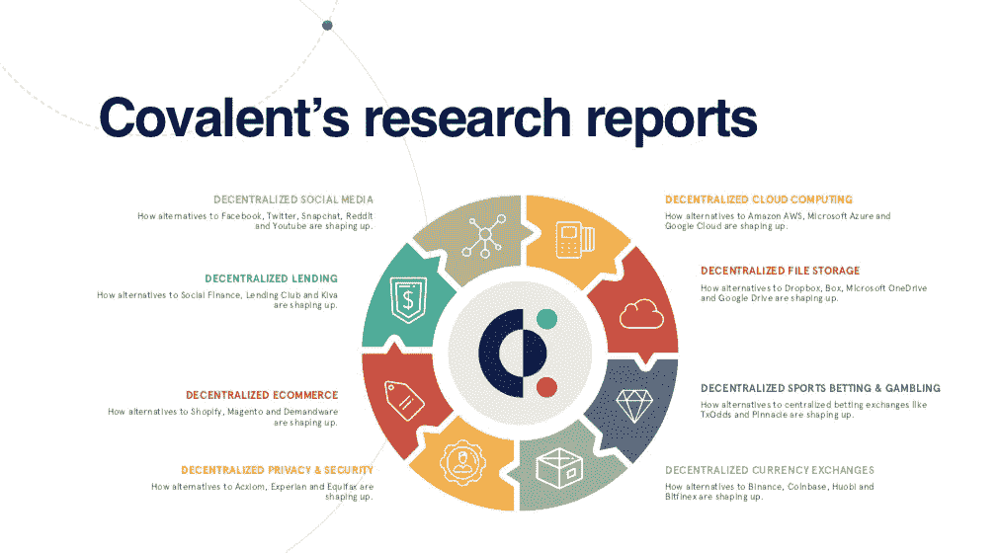

# 区块链上的去中心化信贷研究

> 原文：<https://medium.com/hackernoon/decentralized-credit-lending-on-the-blockchain-fa988b1ec7b4>

今天的瑞普托正处于一个非常有趣的时刻。没有数据，就很难知道该注意什么，忽略什么。数据支持的研究是获得战略优势的关键。这种理解和透明度对于大规模市场采用加密技术至关重要。

[**共价**](https://www.covalenthq.com/research/) ，使用基于**审计**方法的数据驱动研究方法，这是一个缩写，代表可操作的可理解的数据驱动的深度及时信息。

我们报告区块链和加密货币市场趋势，这些趋势是公正的、独立的、同类最佳的、有数据支持的，最重要的是外行也能理解。我们 [**即将发布的第一份报告是关于区块链**](https://www.covalenthq.com/research/decentralized-credit-lending/?utm_source=medium&utm_medium=posts&utm_campaign=blogpromo) 的信用&借贷

Covalent Research Methodology

因此，区块链的信贷是人们不去银行就能筹集资金(或贷款)的一种选择。众筹和 ico 就是这一成长过程的例子。区块链借贷依赖于永恒的点对点模式，使整个过程更加无缝和短周期。

有些项目和平台正在发展，以满足信贷和借贷需求。一些平台有 **Polymath、SALT、ETHLend、Ripio Credit Network 和 Everex** 。我们只关注后 ICO 时代的公司，因此这些公司在区块链交易活跃并被利用。

Credit and lending Platforms

**为什么要关注分散的信贷和借贷空间？**

普通人更熟悉股票市场，但债券市场要大得多。例如，2017 年发行了约 2.2 万亿新公司债券。相比之下，新发行的公司股本略低于 7800 亿美元。

尽管债务市场规模庞大，但效率低下。债务市场的问题可以归结为一个或多个核心点——流动性风险、市场和地区间互操作性的障碍，以及由于对市场运营至关重要的参与者高度集中而导致的单点故障。

## [***观看此点播网络研讨会&下载幻灯片***](https://www.covalenthq.com/research/decentralized-credit-lending/?utm_source=medium&utm_medium=posts&utm_campaign=blogpromo)

**分散信贷和借贷空间的定义是什么？**

我们将这个部门定义为具有四个关键属性。

**首先——**债务市场的点对点(P2P)性质。贷款人和借款人的对等网络分散了风险，也使跨境贷款成为可能。

**第二—** 数字资产作为抵押。在分散版本中，借款人可以抵押他们的加密资产作为抵押品，以借入更受欢迎的货币，如美元或欧元。

Sectors Definition for Decentralized Credit & Lending Space

**第三—** 非传统的信用评估方法。许多分散式贷款机构已经建立了自己的内部风险评估技术，来评估贷款抵押品的信誉。他们还开发了新技术，结合 FICO 等传统信用评分来评估借款人的交易对手风险。

**第四—** 智能合约。智能合同就像一份贷款协议，包含有关资本、抵押品、到期条款、参与方、信誉以及违约情况下会发生什么的数据。

智能合同在区块链上自动运行，无需集中式服务器，这也是效率如此之高的原因。如果平台展示了这些关键属性中的一个或多个，我们将其定义为属于分散的信贷和借贷空间。

**市场上的终端用户关心什么？**

[**在共价**](https://www.covalenthq.com/research/) **，**我们根据财务的五个 C 评估了的放贷空间。5 C 是品质、能力、资本、抵押品和条件。借贷空间迎合了两种最终用户，借款人和贷款人。为了满足市场需求，这五个 C 必须以无摩擦的方式满足两类用户。

**权力下放如何解决财务的 5c 问题？**

通常，最终用户并不真正关心分散化本身。他们更关心平台如何满足他们的需求。因此，我们根据五个 C 对分散式平台进行评级。

就性格而言——非常好。容量——出色。资本——平均值。由于抵押品是数字资产，它们本质上是不稳定的。因此，他们只能获得抵押品价值的 60%至 70%。抵押品——很好。条件——差。

这些分散的信贷和借贷平台有多大的破坏性？

1.  **商业模式颠覆**。

这里有两点。首先，分散的借贷空间利用数字资产作为抵押品。没有现成的中央播放器可以让你把数字资产作为抵押品。全球范围内，数字资产的利用率和采用率正在快速增长。

其次，这些分散式平台利用智能合约来实现自动化，并节省大量成本。因此，更大的潜在市场和成本节约具有颠覆性。

**2。** **单点故障。**

在传统的贷款系统中，所有贷款的抵押品都由一个实体持有，从安全的角度来看，这是有风险的。2008 年的信贷危机在很大程度上可以归因于债务担保证券的集中化性质。在分散平台中，抵押品由不同的实体持有，在这些用户之间分配风险。

**3。** **数据透明或数据出处。**

数据起源可以定义为跟踪和记录数据来源及其在数据库之间移动的过程。贷款的透明度至关重要。2016 年，一个名为 Lending Club 的集中式学习平台的首席执行官从在线贷款机构借款，以扩大公司的业务量。这些贷款与美国证券交易委员会注册的证券相关，包含误导性信息。不完全透明。

另一项内部调查发现，该公司向一名投资者出售了该投资者不想要的 2200 万美元贷款。

**4。审查制度**

集中化的公司规定了用户在平台上的上车和下车。此外，政府规定禁止某些行业，如赌博。加密资产使得跨境借贷成为可能，这对借贷双方都有好处。

对贷款人来说，将投资组合分散到不同国家甚至大洲的机会是最显著的好处之一。

## [观看此点播网络研讨会&下载幻灯片](https://www.covalenthq.com/research/decentralized-credit-lending/?utm_source=medium&utm_medium=posts&utm_campaign=blogpromo)

另一方面，不管借款人住在哪里，也不管他们打算用这笔资金做什么，他们都从全球贷款人中受益。

**该行业未来的优势、劣势、机会和威胁。**

**分散贷款和信贷空间的优势**是

1.  它向贷款人提供高回报率，
2.  它为借款人提供有竞争力的利率
3.  它有地理多样性的选择。

**弱点**

1.  人们对这些平台缺乏了解，
2.  一些平台仅限于一种贷款形式，如 crypto to fiat only。
3.  目前，它只能满足小型企业的信贷需求。

**机遇**

1.  使用智能合同带来的透明度和效率，
2.  借款人优越的筛选技术，
3.  数字资产尤其是区块链现实世界资产的令牌化将会继续存在并迅速增长。

**威胁**

1.  处理加密货币的网站是黑客攻击的主要目标。
2.  加密担保品有时会经历高波动性，这对平台上的贷方来说是一种风险。

— — — — — — — — — — — — — — — — — — — — — — — — — — — — — —

## 你如何看待区块链的分散信贷和借贷？

请在评论中告诉我们。

[**共价**](https://www.covalenthq.com/research/) 致力于各种不同领域的数据支持研究报告，如去中心化云计算、文件存储、体育博彩、货币兑换、电子商务、隐私和安全以及去中心化社交媒体。

欢迎观看关于此完整主题的 [**网络研讨会&抓取幻灯片**](https://www.covalenthq.com/research/decentralized-credit-lending/?utm_source=medium&utm_medium=posts&utm_campaign=blogpromo) ，如果您有任何问题或意见，请与我们分享。