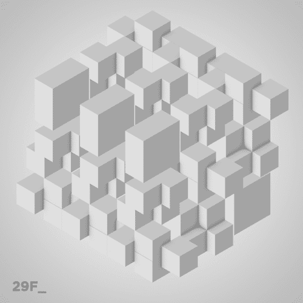
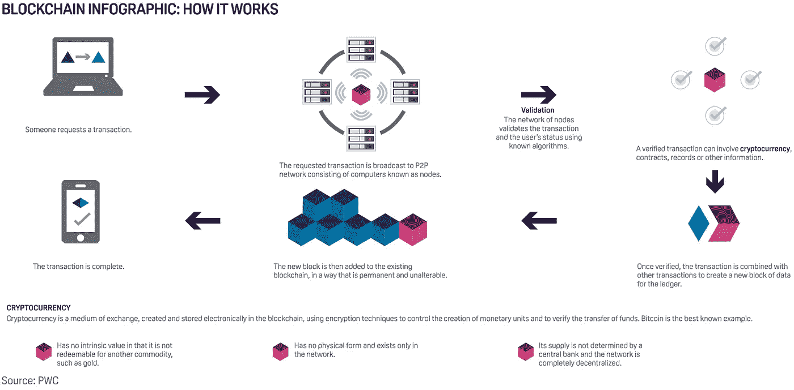
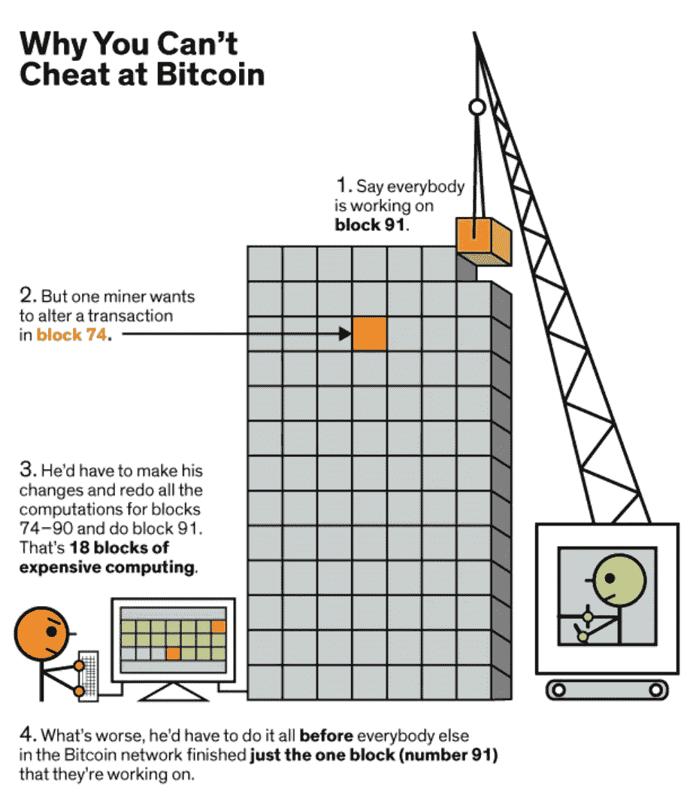
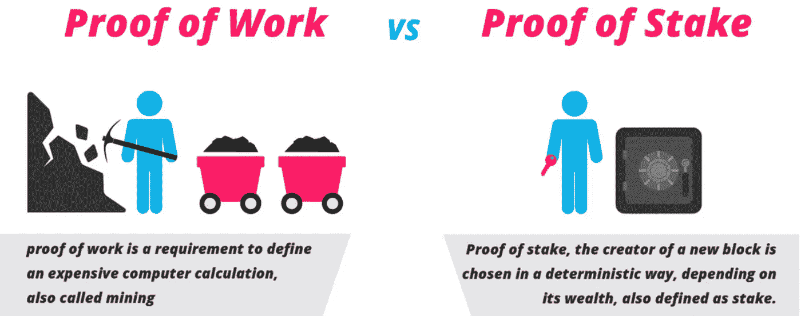
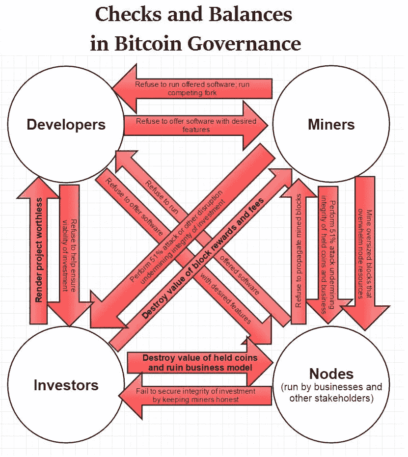
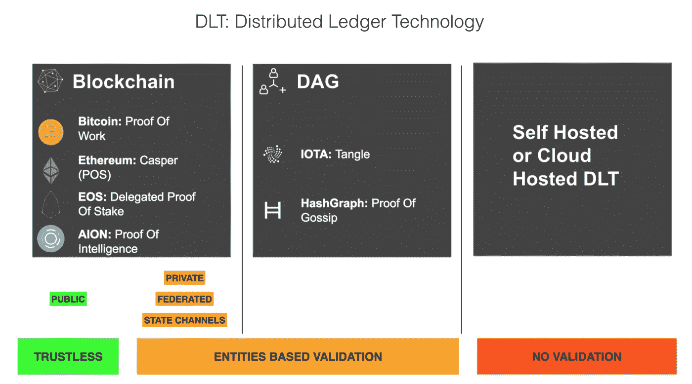
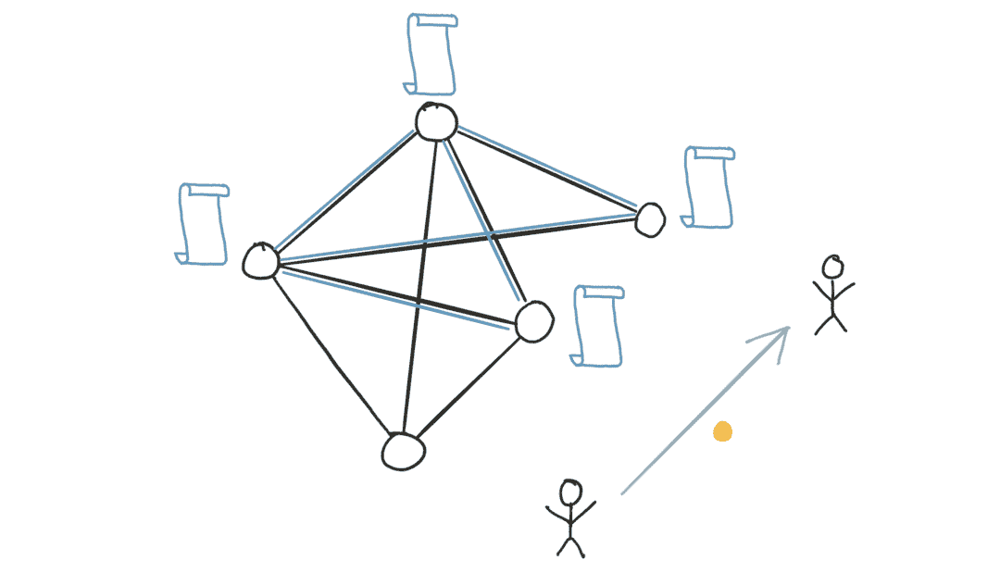

# 去中心化数据:“为什么区块链没有意义，不可信就是一切”

> 原文：<https://medium.com/hackernoon/decentralized-data-why-blockchain-is-meaningless-and-trustless-is-everything-318fd14d3827>

正如我在我的文章《 [***理解区块链和去中心化 AI 驱动的可扩展和验证数据的淘金热***](/@alet89/understanding-the-gold-rush-of-scalable-and-validated-data-powered-by-blockchain-and-decentralized-ee05db6b6a68)***:***

> 就价值而言，去中心化数据将是基于不可信 it 核心的区块链技术所赋能的下一步。

# 为什么区块链没有意义

总的来说，区块链技术和去中心化是一种尚未准备好大规模采用的新技术，但同时也是未来十年的明确趋势。

作为一项新技术，谁以务实的方式理解这项技术的愿景和真正价值，谁就将在未来十年主导市场。

不幸的是，对于使这项技术可用和安全的真正价值和功能，区块链这个时髦词正在发生的事情是一个巨大的误解。区块链只是一个数据库结构，并且信任它没有其他在区块链网络中创造价值的功能，如比特币、以太坊是非常危险的。

区块链不是在黑客攻击方面创造安全性的功能，也不是在货币或分散数据方面创造价值的功能，但它只是一个流行词，用来表示没有删除功能的分布式数据库，并组织在事务块中。

区块链技术旨在将信息片段存储在区块内，不是作为杀手级应用，而是作为一个层来支持在这个生态系统中真正重要并创造价值的不可信功能。

例如，在像比特币或以太坊这样的网络中，它们的不可信功能创造了安全性和价值，区块链只是组织它们的分类账的数据库结构。

[区块链无意义| **The Verge**](https://www.theverge.com/2018/3/7/17091766/blockchain-bitcoin-ethereum-cryptocurrency-meaning)

# 为什么一切都不可信

无信任的概念是在区块链网络中创造价值的概念，即在不信任实体的情况下通过算法验证交易和逻辑的想法。

为了实现这一目标，并在区块链网络而不是区块链数据库结构中开发最先进的技术，有三个功能对于排除实体和实现无信任验证至关重要:

## -匿名验证器

验证者是谁把计算能力，维护分布式账本和验证块的安全性。在一个不可信的网络中，验证器是匿名的，网络中的验证器越多，共享的计算能力越多，网络就越好。

如果您创建一个具有选定验证器或一个验证器的网络，这不是一个无支架网络，因为您信任实体而不是算法。

## -共识

证据是验证器(或矿工)用来验证块的算法，这些算法被设计成尽可能多地保证验证器的分散权力，以确保验证器不能使用经济抑制手段操纵分类账或单个交易。

## -分权治理

有价值的区块链网络在决策事件和更新中是分散的，这是达到无信任验证的另一个隐藏价值。

在技术上，升级是至关重要的，尤其是在区块链网络中，并且如果网络集中于如何构建和如何升级，这可能使其他特征无用，因为如果一个实体能够决定如何更新网络，则他实际上控制该网络，并且如果一个分散的应用运行到这种网络中，则信任该实体而不是不信任的验证。

匿名验证器、共识算法和去中心化治理是在区块链网络中创建不信任的特征，如果没有这三个方面中的任何一个，就网络成本、开发者成本和安全性而言，网络只是一个可黑客攻击的、没有价值和昂贵的架构。

> [与公众区块链的根本挑战| **普瑞蒂·卡西雷迪**](/@preethikasireddy/fundamental-challenges-with-public-blockchains-253c800e9428)
> 
> [区块链:为什么一个无信任系统是世界上最可信的系统| **CNN**](https://www.ccn.com/blockchain-trust-less-system-trustable-system-world/)
> 
> [区块链生态系统中【仍然】存在的中心化危险| **CNN**](https://www.ccn.com/the-dangerous-threat-of-centralization-that-exists-in-the-blockchain-ecosystem/)

# 为什么区块链世界中的信任实体是危险的

私有或联合区块链在安全方面是危险的，因为你信任网络中的其他实体，或者黑客可以破坏它，例如在这种情况下，网络的验证者越少，可被黑客攻击的就越多。

在价值体系中，私有或联合区块链是没有用的，因为你验证的一切都是经过验证的信任实体，所以如果你想在你的数据上添加价值是没有意义的，例如在这种情况下，你的数据与常规的基于云的 web 应用中的数据具有相同的价值。

> 一个经典的基于 API 的网络比私有区块链更具可扩展性，更便宜，也更安全。

> [区块链有多安全？看情况。| **哈佛商业评论**](https://hbr.org/2017/03/how-safe-are-blockchains-it-depends)
> 
> [论私立区块链的危险| **悉尼大学**](https://www.zurich.ibm.com/dccl/papers/gramoli_dccl.pdf)
> 
> [比特币是荒谬的。区块链很危险| **彭博**](https://www.bloomberg.com/news/features/2018-03-09/bitcoin-is-ridiculous-blockchain-is-dangerous-paul-ford)

以太坊或 AION 等区块链项目正在努力利用混合私有区块链的概念来扩展网络，例如，当以太坊将释放血浆时，你可以使用简单的智能合同来创建私有区块链，从公共区块链的安全性方面进行控制，但我们不知道这个系统是否也能工作。AION 正在致力于从私有区块链到公共区块链的分散式互操作性，但这是一个和 Plasma 一样的工作项目，所以**将来私有区块链可能有意义，但不是现在。**

EOS 等其他项目正在努力利用新的共识算法扩展公共区块链，降低验证的艺术水平，但同时扩展公共网络，而不是创建混合私有区块链。

真正的问题是，对于非金融用例来说，使用区块链技术的请求是巨大的，但该技术还没有准备好大规模采用，同时真实的价值很难被理解，因为你必须处理金融世界的每个复杂方面，以及技术世界和无信任者的每个复杂方面，这是一个更类似于千禧一代导向的思维方式而不是 X 代和 B.B .的代沟概念。

# 等等，但是为什么？

网络或分散应用中的无信任验证是开发未来技术的基本特征。区块链技术隐藏的真正价值是去中心化的数据，即在不信任实体的情况下，但以不信任的方式跟踪数据的概念。

> 网络越分散，分散应用程序跟踪数据的质量越好，数据本身就越有价值。

为了理解这一概念，我们需要思考，今天的数据是如何有价值的，以及今天的数据是如何可操作的，并基于实体验证。

> 未来不可信和分散的数据有多少价值？

# 分散数据的概念

用技术术语来说，建立一个 Dapp 并开始制造分散的数据很简单，但真正的问题是基于分散的数据如何工作。

要建立一个去中心化的逻辑，制造去中心化的数据，并在其上维护不可信的价值，你不能只开发中心化的应用程序，并使用交易将数据放入区块链，因为这样你会忘记验证用户创建信息的“内容”和“方式”,因此，最终，为了证明你的数据，人们必须相信你的公司是所发生事情的验证者，而你会失去不可信的验证。

这个问题在加密社区中争论了多年，因为这项技术的先驱在当时就明白，分散 it 的机会不仅仅是金融交易。

许多项目都试图在比特币或其他区块链上分散逻辑构建层，但大多数都失败了，因为区块链不是为了分散逻辑而开发的，而是为了分散值。

第一个解决这个根本问题的项目是由比特币社区著名的早期活跃用户 Vitalik Buterin 创立的以太坊。以太坊在开发新的区块链网络时破坏了区块链技术，该网络旨在处理逻辑，其使命是成为智能合同、应用程序和分散数据的第一个操作系统。

以太坊技术概念的核心，奠定了我们今天所说的标准 ***第二代区块链技术*** 因为 Vitalik 引入了用智能合约概念来验证区块链内部区块去中心化逻辑的想法。

随着智能合约技术的基本引入，与以太坊网络交互的开发者不得不分散他的功能。

用户每次与去中心化功能交互时，都要进行以太坊交易。在以太坊交易期间，网络在块内验证被调用的函数、请求和结果。这三个方面是以完全不可信的方式交付分散数据的基础。

> [未来的数据库将会是去中心化的| **Hackernoon**](https://hackernoon.com/databases-of-the-future-will-be-decentralized-d6d9887c494e)
> 
> [分散所有的事情？| **麻省理工学院媒体实验室数字货币倡议**](/mit-media-lab-digital-currency-initiative/decentralize-all-the-things-84702944f3fe)

> 我们处在区块链技术的泡沫中，就像 90 年代的技术泡沫一样，只有 1%的人了解这项技术，这对不了解这项技术的人来说是危险的。