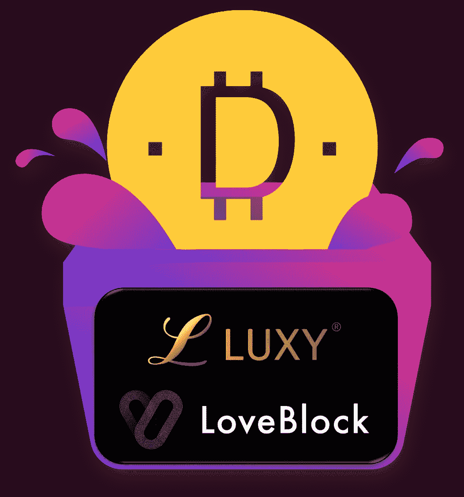

# 分散数据库 LoveBlock 正式与百万富翁约会应用 Luxy 合作

> 原文：<https://medium.com/hackernoon/decentralized-database-loveblock-has-officially-partnered-with-millionaire-dating-app-luxy-b9803cb44534>

On Luxy, users can make payments with LoveBlock’s token DDD

我们很自豪地宣布，LoveBlock 已经正式与 Luxy 合作。这两个平台都将从这种合作中获得许多新的好处。

# **什么是 Luxy？**

Luxy 成立于 2014 年，是为寻求有意义的关系的百万富翁和高净值个人提供的终极配对应用程序。Luxy 已经迅速积累了超过 200 万用户，其中许多人是经过验证的百万富翁，并在全球各地招揽会员。Luxy 已经有一个很好的内部安全系统来保护它的用户，但随着它的规模继续增长，它一直在寻找更好的东西。

# ***什么是 LoveBlock？***

LoveBlock 成立于 2017 年 9 月，一直坚定不移地致力于创建一个致力于安全、数据保护和减少欺诈的在线约会生态圈。凭借 LoveBlock 最先进的安全功能及其实施的[区块链](https://hackernoon.com/tagged/blockchain)，LoveBlock 正准备成为在线约会安全领域的领导者。

# **为什么需要 LoveBlock？**

因为在这个任何人都可以轻而易举地创建一个假脸书账户的时代，仅仅使用脸书登录是不够安全的。Luxy 可以外包他们的安全问题，并通过利用 LoveBlock 获得更好的用户。简而言之，LoveBlock 的安全系统让 Luxy 受益匪浅。

# **这对 LoveBlock 有什么帮助？**

LoveBlock 从与 Luxy 的合作中获得了巨大的洞察力和经验。通过保护 Luxy 的 200 多万用户，LoveBlock 可以将其最先进的安全系统大规模投入使用。此外，通过用 Luxy 证明其安全效率，LoveBlock 可以开始发展并扩展到其他约会平台——从而建立自己的在线约会生态系统，所有这些都由 LoveBlock 连接在一起。

# **这对 DDD 令牌实施意味着什么？**

Luxy 将是第一家有机会使用分散数据库进行约会(DDD)的公司。Luxy 用户可以使用这些代币进行应用内购买，并用来购买高级功能。在不久的将来，DDD 将不仅限于投资者或 LoveBlock 网络中的公司:LoveBlock 范围内的其他在线约会用户也将有机会积累 DDD，如果他们帮助改善在线约会社区或推广 LoveBlock 的话。这对 DDD 的前景是非常有希望的，因为它将在背后和在许多人的手中有真正的效用。

我们希望重申我们为在线约会社区提供最佳安全保障的承诺。我们非常幸运有 Luxy 和我们一起工作。随着我们最新的合作，LoveBlock 正在走向光明的未来，并希望有更多的合作。

请访问[**www . love block . one**](http://www.loveblock.one)并加入我们的[**Facbeook**](http://www.facebook.com/theloveblock)&[**Twitter**](http://www.twitter.com/theloveblock)了解更多信息！