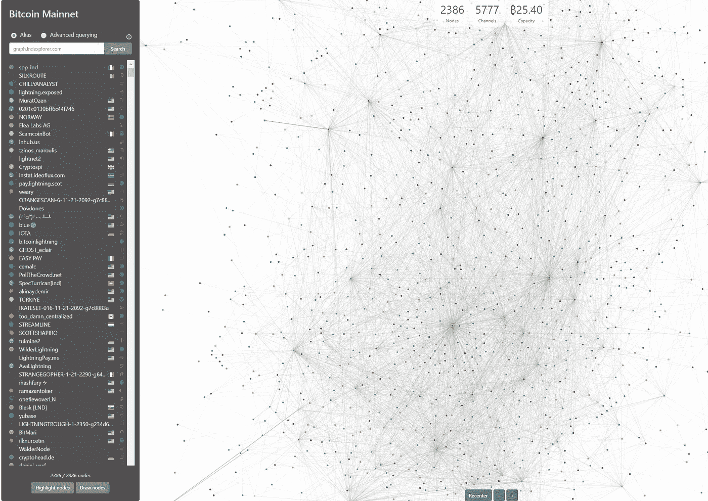
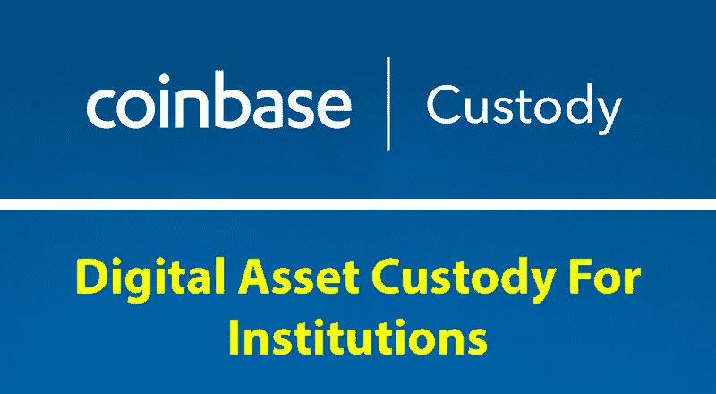

# 分散的交易所——fin cen、支付渠道和托管，天哪！

> 原文：<https://medium.com/hackernoon/decentralized-exchanges-fincen-payment-channels-and-custody-oh-my-1ae3d83bc42a>

基于我之前对分散式交易所(dex)的研究，我想更深入地探讨围绕 dex 的监管和实践问题。有几个问题我很有兴趣回答，我现在对答案的最佳天真猜测并不太令人鼓舞。首先:

> **问:dex 能避开 FinCEN 的监管吗(KYC/反洗钱)？**
> 
> **答:因为大多数都是目前设计的，可能不会。**

这部分主要是关于一个法律问题，鉴于我不是律师，你可能会对此持保留态度。

dex 的主要好处之一是能够匿名交易，不依赖第三方。不幸的是，当权者强烈反对匿名金融交易。这对于任何从事加密工作的人来说都是老生常谈了，人们一直认为 dex 可以避免这个问题，因为“没有人负责”。在实践中，似乎通常有人负责，或者至少有能力关闭它。

分散法律部的 Chris 有一篇关于这个话题的精彩文章，我会大量借鉴。第一个相关问题是代币是否也算作“货币”，因此属于洗钱监控基础设施的范畴。正如 FinCEN 在 2013 年 3 月澄清的那样，这是一个响亮的肯定回答(重点是我的):

> “虚拟”货币是一种交换媒介，在某些环境下像货币一样运作，但不具备真实货币的所有属性。
> 
> “可兑换虚拟货币”(“CVC”)被定义为与真实货币具有等价价值或者充当真实货币替代品的虚拟货币。
> 
> 受 MSB 管制和资金转移登记的 CVCs 的兑换商是指那些**"从事虚拟货币兑换真实货币、资金或其他虚拟货币的** ***业务*** **的人"** ⁶此外，任何“根据 FinCEN 的条例，任何(1)接受*和*传输可兑换虚拟货币或(2)出于任何原因买卖可兑换虚拟货币的交易所都是货币传输者。”⁷

一个给定的 DEX 是否可以被分类为从事交易的*业务*，或者它是否接受和传输密码，成为关键问题。有哪些因素可能表明 DEX 从事交易所业务或正在接受和传输加密？一些猜测，按严重程度升序排列:

*   宣传自己是一个交易所(见:[涟漪](https://www.fincen.gov/sites/default/files/shared/Ripple_Facts.pdf))
*   接受存款，保管客户资金(包括在智能合同中！)
*   在密码的买方和卖方之间充当中间人(“经销商”)
*   收取交易费以实现盈利(即经营一家从您平台上的交易中获利的企业)

这些似乎相当广泛。更糟糕的是，考虑一下 LocalBitcoins.com 的。LocalBitcoins 的功能相当于一种离线 DEX，它将寻求亲自交易(通常使用现金)的加密交易者与菲亚特交易者联系起来。使用上面的标准，你会认为这是明摆着的(他们的[收费模式](https://localbitcoins.com/fees)广告收费)。然而，他们已经开始要求他们平台上的大交易者使用 KYC。这很可能是对针对通过本地比特币经营货币服务业务的个人的执法行动的回应。后一点很关键:**在某种程度上，一个给定的平台将逃避 FinCEN 的监督，这并不能免除交易** ***业务*** **的参与者必须对其交易对手执行 KYC！最好的情况是，你最终会得到一个缺乏专业流动性提供者的指数——祝你好运，那样可以完成很多交易。**

在这种框架下，DEX 领域的现有参与者看起来如何？正如你所想象的，这并不令人鼓舞。

[Bisq](https://bisq.network/) 是 [LocalBitcoins](https://hackernoon.com/tagged/localbitcoins) 的变种，除了收取交易费用。他们以及他们平台上的任何主要参与者都不太可能不受到 FinCEN 的审查。

[OasisDEX，戴交易的全链以太坊指数(由 Maker 运营)及其 Oasis。直接 DApp](/makerdao/announcing-oasis-direct-instantly-transfer-eth-for-mkr-dai-8cccec81688e) ，除了汽油之外不收取任何费用，并且是非托管的。他们似乎可以避免审查，尽管这不适用于平台上的大型交易者。

除了对标准方法的其他调整外，Decred 还提议创建一个不收取交易费用的 DEX。避免交易费用将有助于他们不做货币服务[业务](https://hackernoon.com/tagged/business)的案例。此外，通过保持所有订单在链上，他们避免了通过智能合同运行一切的陷阱，这将有效地保管和充当各种中间人。后者是许多 dex(例如 [altcoin.io](https://blog.altcoin.io/why-weve-chosen-a-plasma-like-sidechain-solution-for-our-dex-97737ca46b86) )采用的方法，以便保持所有东西都在链上，但实现低延迟功能。FinCEN 将这些视为货币服务业务似乎是合理的。如果侧链组分足够分散，这可能是可以避免的——我必须看到任何在实践中实现这一点的合理计划。然而，考虑到集中智能合约在主链上的锚作用，如果这些合约受证券交易法管辖，我也不会感到惊讶(在一定程度上，它们支持证券交易)。

**预测:任何几年后仍在运行的、不做 KYC 的 dex 都将是完全分散的，交易成本非常高——买卖价差大(流动性低),交易量不大。它们将仅限于从事小额不频繁交易的人，对于那些从事流动性提供业务的人来说，很难操作。**

> **问:我们离完全分散在链上并能吸引大量流动性的实用指数还有多远？**
> 
> **A .可能年份。我们将需要完全分散和可扩展的低延迟** [**第 2 层**](/l4-media/making-sense-of-ethereums-layer-2-scaling-solutions-state-channels-plasma-and-truebit-22cb40dcc2f4) **解决方案。**

当你试图保持所有东西都在链上，并依赖原子互换进行跨链交易时，就像 Decred 提出的方法一样，会发生什么？目前，原子互换的一个核心限制是它们的性能——在交易被安全清算之前，它们需要在两个链上进行确认。在 BTC，等待几个小时的交易结算并不罕见，这对流动性提供者来说是一个重大障碍。

BTC Lightning network graph from [https://graph.lndexplorer.com/](https://graph.lndexplorer.com/)

一个提议的解决方案是使用第二层[状态通道或侧链](/l4-media/making-sense-of-ethereums-layer-2-scaling-solutions-state-channels-plasma-and-truebit-22cb40dcc2f4)，专门创建更低延迟的支付通道，如[闪电](http://lightningbitcoin.io/)(用于比特币)和[雷电](https://raiden.network/)(用于以太坊)。这些第 2 层解决方案允许更快、更便宜的传输，但也有一些注意事项。原则上，从支付网络的角度来看，交易只是快速且廉价地发生。例如，只要你的收件人在闪电上，他们可以很快确认你的 BTC 转移给他们。这不应该是一个主要障碍，因为大概所有主要交易所都希望在这些支付网络上运行钱包存款/取款，但这带来了另一个问题:[发送大额资金的能力有限](https://www.ccn.com/bitcoins-lightning-network-still-unsuitable-for-large-payments-research-suggests/)。由于这些系统的网状网络设计，它们很可能无法在短时间内发送相对大量的数据，如 10 BTC。**从套利者和算法流动性提供者的角度来看，这将大大降低其效用**，没有他们，任何给定的市场(包括 dex)都将遭遇流动性问题。

> **问:dex 是否比拥有更好托管解决方案的集中式交易所更安全？**
> 
> **答:在这一点上很难自圆其说，尤其是在他们继续依赖网络浏览器将钱包与市场连接起来的时候。**

由于 FinCEN 的监管，匿名将很难实现，在可预见的未来，可扩展性/性能问题将继续成为一个制约因素，但或许 dex 会因为更好的安全性而胜出？这似乎越来越难以置信。首先，**管理自己的私钥的好处很快就消失了，因为实际上这意味着通过一些 Chrome 插件连接到 DEX 来进行交易。**每次把钱包暴露在网上，[就有风险](https://mashable.com/2017/12/21/etherdelta-hacked/)。作为一个活跃的 DEX 交易者，这是一个大问题。诚然，硬件钱包集成正变得越来越普遍，并缓解了其中一些问题。

然而，我宁愿在像比特币基地这样声誉良好的集中交易所碰碰运气——至少他们有一个庞大的团队不断提高他们钱包的安全性，以及为他们火热的钱包投上一份保险。不要把这看作是对比特币基地的认可——我是不可知论者——但是**让一个系统战经过不断使用的测试，并有足够数量的工程师努力强化它，以服务于品牌的声誉，肯定会有好处。**最后，至少在美国，大多数机构参与者将被 [*要求*使用合格的第三方托管机构](https://www.cordium.com/insights/applying-the-custody-rule-to-cryptocurrency-holdings/)。无论如何，如果你放弃了对私人钥匙的控制权，你就不会那么担心在集中交易市场上的交易……尤其是当你的托管人拥有或隶属于该交易所的时候。

**总之，至少在可预见的未来，dex 似乎不会在加密交易生态系统中扮演重要角色。**大多数现有和拟议的设计至少将受到 FinCEN(反洗钱/KYC)的审查，并且鉴于 dex 交易随机代币的趋势(我相信艺术术语是“shitcoins”)，可能会受到更严重的证券监管机构的监督，这些代币将来可能会被归类为证券。为了避免这种疏忽，dex 可以尝试推动完全分散的链上模型，但由于高延迟或低容量，从技术角度来看，这些模型不会很快发挥作用(如果有的话)。这将使流动性提供者保持距离，从而注定这些指数流动性低，除了非常小的交易外，实际上毫无用处。请参见 [OasisDEX 的订单簿和卷册](https://oasisdex.com/)了解您可以期待的内容。

我们可以期待 dex 在未来的密码交易格局中扮演什么样的角色？我可以想象 Bisq 模型的一些变体——促进小规模的 p2p 加密到菲亚特的交换——是可持续的和有用的。然而，我怀疑 crypto 的主要诉求之一——匿名——将是一场苦战。我有一种预感，政府将逐渐接受加密货币，但只是那些不保持匿名的货币——所有交易都需要可追踪到个人身份。在以后的文章中会有更多关于这方面的内容…