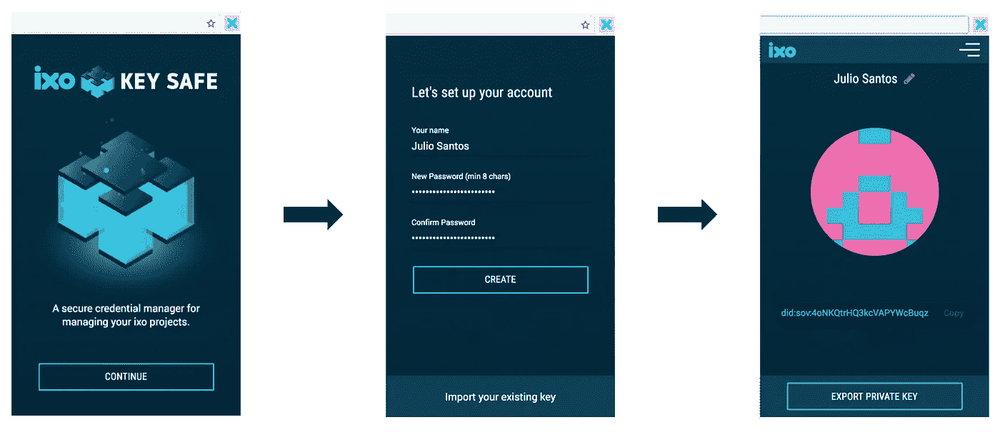
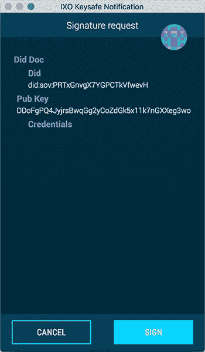
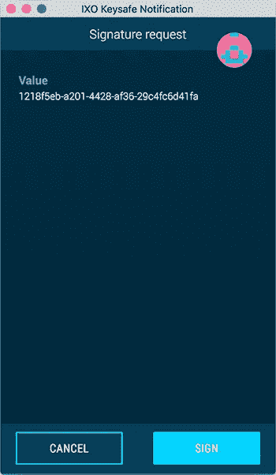

# 分散身份:W3C 标准和 ixo KeySafe

> 原文：<https://medium.com/hackernoon/decentralized-identity-w3c-standards-and-the-ixo-keysafe-69d7e8d6fd7c>

## 以及如何可证明地将 DID 与人相关联

ixo 是可持续发展影响的区块链，旨在帮助标准化影响的衡量和奖励。通过他们的协议和本地 IXO 令牌，ixo 计划通过开启一个收集和验证影响数据的新经济来激励对影响项目的资助和跟踪。

ixo 鼓励数据完整性是至关重要的。因此，他们高度参与分散的身份空间，因为正确识别几个网络利益相关者很重要。ixo 使用 W3C DID 和可验证声明标准草案来促进这个过程。

*(参见:关于去中心化身份，我之前写过关于 ERC 725 和 ERC 735 的文章，内容是为众筹销售实现一个简单的 KYC 声明验证，请看下文。)*

[](https://hackernoon.com/first-impressions-with-erc-725-and-erc-735-identity-and-claims-4a87ff2509c9) [## 对 ERC 725 和 ERC 735 的第一印象——身份和主张

### 为众筹销售实现简单的 KYC 索赔验证

hackernoon.com](https://hackernoon.com/first-impressions-with-erc-725-and-erc-735-identity-and-claims-4a87ff2509c9) 

# W3C 标准

一直以来，W3C 都是开路先锋，一直在努力为[分散标识符](https://w3c-ccg.github.io/did-spec/)和[可验证声明](https://www.w3.org/TR/verifiable-claims-data-model/)制定标准。

*(注意，为了清晰起见，下面提供的例子被极大地简化了，并且有点破坏了精心制作的标准。)*

## 分散标识符

DID 代表*分散标识符*，代表脱离中央控制的身份的新标识符。出自[马嘴](https://w3c-ccg.github.io/did-spec/):

> 分散标识符(DIDs)是一种新型的可验证的“自我主权”数字身份标识符。DID 完全在 DID 主体的控制之下，独立于任何集中的注册中心、身份提供者或认证机构。

他们让我在*自主*。从现在开始:

> DID 是将 DID 主题关联到与该主题进行可信交互的手段的 URL。DID 解析为 DID 文档——描述如何使用特定 DID 的简单文档。

以下是 DID 文档的一个示例:

```
{
  "did": "did:example:person-123456789",
  "pubKey": "DDoFgPQ4JyjrsBwqGg2yCoZdGk5x11k7nGXXeg3wokFy"
}
```

这个简单的文档声明了一个 DID 及其对应的公钥(更复杂的文档可以包含其他信息，比如相关个人数据的位置，或者 DID 所有者的代理)。孤立地看，人们对此无能为力。然而，将 DID 与可验证的声明结合起来是非常有效的。证明对可信声明的 DID 的所有权将授予您访问声明授予您的任何权限。我们来探索一下。

## 可证实的说法

可验证声明是可信方在 DID 上可验证地颁发证书的一种方法(c *laim* 和 *credential* 在本文中可互换使用)。同样，W3C:

> 驾驶执照被用来表明我们有能力驾驶机动车，大学学位可以用来表明我们的教育状况，政府颁发的护照使持有者能够在国家之间旅行。该规范提供了一种标准的方式，以加密安全、尊重隐私和可自动验证的方式在 Web 上表达这些声明。

想想传统的驾照。它通常由受信任的一方(您当地的机动车辆管理机构)签发给由政府 ID 标识的人。他们会评估你的驾驶技术，如果你通过测试，他们会将你的政府证件与你的申请联系起来，证明你适合驾驶。

可验证声明是在 DIDs 上实现相同结果的更安全的方式。如果我在机动车辆管理局的标识符不是我的政府颁发的 ID，而是一个 ID，这将如何工作？

首先，他们需要验证申请人是否拥有他们声称的 DID。这是通过使用公钥加密来实现的，本文稍后将对此进行描述。

一旦核实完成，当局可以发出声明，确认申请人的驾驶能力。这是它可能的样子。

```
{
  "issuer": "did:example:trusted-authority-123",
  "issued": "2010-01-01",
  "claim": {
    "id": "did:example:person-123456789",
    "canDrive": true
  },
  "signature": "g4j9UrpHM4..."
  }
}
```

这代表了`did:example:trusted-authority-123`声称 DID `did:example:person-123456789`可以驾驶。任何人都可以制作类似的文件。能证明这份声明的是它是签名的。也就是说，我们知道`signature`值只能由`did:example:trusted-authority-123`的所有者正确产生(因为加密)。这意味着，如果我们知道`did:example:trusted-authority-123`确实代表了它所声称的权威，我们可以相信这种说法是合法的，并认为`did:example:person-123456789`有驾驶能力。

这里有一个用例。假设你被当地的交通部门拦下进行随机文件检查。他们真正需要知道的是你被授权驾驶。然而，传统的驾照包含许多其他不相关的数据(如您的姓名和地址)，所有这些数据都会在文档检查过程中泄露。证明您的 DID 的所有权并展示相关索赔将仅产生所需的信息，仅此而已。

# IXO 区块链的身份和权利主张

为了让人们更容易注册 ixo 的网络，ixo 基金会分叉了[元掩码](https://metamask.io/)并建立了 KeySafe，这是一个浏览器扩展，简化了人们创建分散身份的过程。KeySafe 代表用户生成一个分散标识符(DID)。摘自[白皮书初稿](http://ixo.foundation/wp-content/uploads/2017/12/The-ixo-Protocol-Draft-White-Paper-3.0-for-technical-review-12_8_2017.pdf):

> 影响交换项目[……]的每个参与者都用数字标识[DID]作为一个实体。实体可以指自然人、组织、软件代理或设备。例如，评估代理可以是一个已识别的软件代理，其功能相当于一个智能 Oracle，根据外部数据参考检查提交的索赔数据，并执行算法计算，以得出验证索赔的结论。这些标识符解析回可验证的身份凭证，如技能资格证明，可用于确定实体交换其资金申请的资格。

为了让某人在 ixo 上注册，这个 DID 需要在 ixo 的区块链上显示。

## 设置 KeySafe

安装后，用户必须首次设置 KeySafe。这个设置过程将为用户生成一个 DID(更准确地说，它生成一个公钥/私钥对，并从公钥中导出 DID)，如下所示。



Generating a DID with KeySafe (simplified journey)

一旦用户完成了旅程并生成了 DID，就该在 ixo 区块链上注册 DID 了。

## 突出 DID

为了对 ixo 链上的 DID 进行分类，ixo 需要一个分类意图的证明。换句话说，ixo 一定知道 DID 的所有者一定希望这种欺诈发生。因此，无论是谁提出申请，无论是 DID 所有者还是第三方，都必须证明这一意图。

验证这是真的一种方式是通过要求突出请求有效载荷包含所述有效载荷的签名。这是有效载荷的样子。

```
{
  payload : [
    10,
    didDoc: {
      did: "did:sov:person-123",
      pubKey: "DDoFgPQ4JyjrsBwqGg2yCoZdGk5x11k7nGXXeg3wokFy",
      credentials: [],
    },
  ],
  signature: {
    signatureValue: [
      1,
      "8B81986B9E458E3B6D55F...",
    ],
    created: "2018-07-20T16:50:07.420Z",
  },
}
```

`signature`中的那个长十六进制是用 DID 的私钥对有效载荷中的`didDoc`进行签名的结果。我们首先将 didDoc 转换成 JSON:

```
{"didDoc":{"did":"did:sov:PRTxGnvgX7YGPCTkVfwevH","pubKey":"DDoFgPQ4JyjrsBwqGg2yCoZdGk5x11k7nGXXeg3wokFy","credentials":[]}}
```

然后让 KeySafe 提示用户签名。



KeySafe prompting the user to sign the ledgering payload

当我们将这个有效载荷提交给 [ixo 区块链 API](https://ixofoundation.github.io/mkdocs/api/#ixo-blockchain-api) 时，这个签名将在任何欺诈发生之前得到验证。只有成功的验证才会导致欺诈。这种验证有两个步骤。

第一步是确认提供的 DID 和公钥匹配。跳过这一步将允许攻击者提供一个不同的公钥，他们控制其私钥，并使用它来生成一个有效的签名。

DID 可以与公钥相匹配，因为 DID 本身是从公钥中派生出来的。然后，我们只需检查所提供的 DID 是否与从所提供的公钥导出的 DID 相同。

```
base58.encode(base58.decode(publicKey).slice(0, 16))
```

签名本身可以通过一种算法来验证，该算法将原始消息、公钥和签名作为输入。只有拥有 DID 私钥的代理才能生成通过该验证的签名。

需要注意的是，该流程并不能证明注册人实际拥有 DID 的私钥。攻击者可能在其他地方发现了这个签名消息(例如，在 ixo 链中)。这并不是什么大问题:私钥不能从消息+签名对中计算出来，所以攻击者所能做的就是重放突出显示，这大概是一个幂等运算。

同样，这个证明对于 ixo 来说已经足够了。由于攻击者成功注册该 did 的唯一方法是已经在其他地方发现了该签名，所以我们可以假设盗用已经发生，并且当盗用发生时，是由 DID 所有者完成的(因为正确的签名只能由私钥的所有者产生)。

## 可证明地将一个人与一个 DID 相关联

然而，ixo 关心的是将一个 DID 与一个真实的人联系起来。作为一个身份提供者，我们在[分形](https://trustfractal.com/business/)需要对个人进行 KYC 过程来证明他们的身份。我们还必须证明他们对 DID 的所有权。



Asking the user to sign a challenge nonce

因此，分形需要微妙地改变他们的身份供应 KYC 程序。除了正常的身份问题，我们还将确保用户安装和配置了 KeySafe。

一旦证实了这一点，Fractal 就可以发出一个密码挑战:我们要求用户签署一条内容似乎是唯一的消息(一个[随机数](https://en.wikipedia.org/wiki/Cryptographic_nonce))。这种唯一性保证了这种消息以前被签名的可能性很小，使得攻击者几乎不可能提供正确的签名来响应这种挑战。

让这条信息看起来很独特的一个方法是使用一个 UUID。如果用户能够产生一个有效的签名(如上面所定义的)，那就意味着他们拥有 DID 的私钥。

现在，我们已经确认了一个人和一个 DID 之间的关联，我们准备签署并发布关于他们的 KYC 身份的声明。然后，我们可以向 ixo 区块链广播以下内容。

```
{
  "issuer": "did:sov:fractal-123",
  "issued": "2010-01-01",
  "claim": {
    "id": "did:sov:person-123",
    "kycLevels": ["IdentityVerified", "AccreditedInvestor"]
  },
  "signature": "g4j9UrpHM4..."
  }
}
```

砰——ixo 现在可以放心了，这个确实与一个人匹配，这个人的身份已经被分形验证了。

**策划 ICO？**在 [Fractal](https://www.trustfractal.com/business/) ，我们提供了一个简单易用的 launchpad 解决方案，结合全面的客户身份识别服务(KYC/反洗钱),轻松成功地部署您的代币发行。