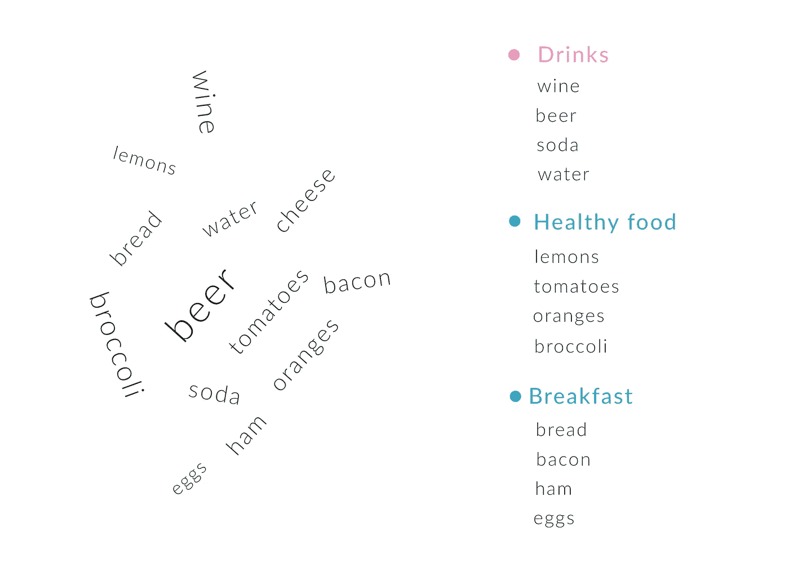

# 更快 dApps 的分散索引:图表

> 原文：<https://medium.com/hackernoon/decentralized-index-for-faster-dapps-the-graph-d93902b3f601>

Art by Peter Judson

许多朋友问我们如何识别可靠的项目。我们决定分享一份简短的尽职调查，内容是关于我们调查(或投资)的一些公司。我们希望这将有助于创造一个更健康的投资生态系统。

几天前，我们与图的[团队进行了一次愉快的会面:该基础设施为我们在](https://www.thegraph.com) [**区块链**](https://hackernoon.com/tagged/blockchain) 上存储的**数据创建了一个**分散索引**。**

会前我们对这个项目非常怀疑。为什么我们需要一个分散的指数？这个指数的表现有多快？领养呢——谁会使用它，为什么？

作为工程师，我们可以看到问题。当面和团队讨论后，事情就更清楚了。

在我们开始解释这个项目之前，让我们先看看什么是指数。

## 究竟什么是指数？

数据库和文件系统定义了数据存储和组织的方式。现在，索引是数据的“地址簿”。它们告诉我们如何以最佳方式搜索和检索数据。想象一下，每个索引都是一个目录，告诉我们存储设备上每个文件(或数据结构)的位置。我们可以通过名称、扩展名、文件类型或内容来组织东西。

每次我们以不同的方式组织东西，我们就创建了一个新的索引。

## 那么索引实际上是做什么的呢？

答:它们将我们检索数据的速度提高了几个数量级。

让我们再解释一下。

## 冰箱是我们日常生活中数据库和索引的典型例子。

在现实世界的类比中，想象一下:你有一台冰箱。请将此视为您的存储层。冰箱内物品的存放方式，能让你更高效地取出想要的物品。例如，你可以把最常用的东西放在前面，把不常用的东西放在架子后面。

这就是数据库(像 [Bluzelle](https://bluzelle.com) )所做的:它允许你以对你有意义的方式组织你的数据。现在，想象你的朋友让你从冰箱里给她拿些牛奶。这个命令叫做**查询**它告诉你要检索什么数据。假设你真的不知道牛奶在哪里，那么你需要检查冰箱里的每一件东西，直到你找到牛奶。

这就是指数的用处。想象一下，你有一张每样东西在冰箱里的位置图。甚至在你打开它之前，你可以看一下图表，你知道牛奶在右下角的第二个架子上。这是索引。

On the left, data as they get in the server. On the right, after they get indexed in a database.

## 为什么我们需要区块链数据的索引？

原因很简单，没有其他方法可以构建快速的 dApp。在以太网上，我们需要 10 秒来从链中检索数据。想象一下，盯着纺车等 10 秒钟。在集中式世界中，这在 10ms 内发生。

## 为什么我们需要一个分散的索引，为什么我们不使用一个集中的索引？

这是最有趣的部分。在一个集中的世界里，有人可以改变索引，给你指出错误的方向或错误的文件。想象一下，搜索一个客户的账户余额。你可以在索引上找到它。因为这个指数是集中的，所以它可以为你指出天平的任何版本。您可能想要当前余额 10 美元，但它指向 3 天前的余额 10，000 美元。

分散索引通过使用拥有索引副本的节点网络避免了这个问题。他们认为它不可信。就像我们在区块链做的一样。

如果出现问题，一个节点的索引失败，我们可以使用另一个节点，实现 100%的索引正常运行时间。

## 图表是如何工作的？

该图是一个分散的索引，适用于整个区块链(即，它可以索引多个区块链中的数据，如 eth 和 btc，但也可以索引[IPF](https://ipfs.io)和 [Filecoin](https://filecoin.io) 中的数据)。它监视区块链中的新数据，并在每次出现这种情况时更新索引。一旦索引被更新，它就试图在维护它的节点之间达成共识。一旦达成共识，就能确保索引的用户获得最新数据。

我们担心的一个问题是，一旦我们有了更快的区块链，索引更新过程中可能会出现瓶颈。在以太坊上，平均每 10 秒钟就有新的方块出现。该图在大约 1 秒时更新了索引(当前)。

索引更新的速度比数据输入的速度快得多，但是如果有 10 个不同的链每 1 秒钟输入一次数据，会发生什么呢？索引的更新速度是否足够快，并且在索引之间达成共识，以确保每个人都有相同的新鲜状态？

该团队在我们的会议上解释了他们的可扩展性解决方案，他们的目标是在将自己局限于任何设计之前，对这些不同的拓扑进行原型设计和实验。

关于查询语言，该图使用的是从脸书发展而来的语言 [GraphQL](https://graphql.org) 。这是一种容易理解的语言，大多数开发人员已经熟悉它了。

它是这样工作的:一旦应用程序执行了一个查询，图就将这个查询(使用网关节点)路由到保存索引的查询节点。查询节点将结果返回给网关节点，然后返回给开发人员。

现在，令牌用于保护和管理网络，并激励对网络至关重要的行为。简而言之，它是由查询节点绑定的，为了使用它，它们既可以被标桩，也可以被用作网络内的交换媒介(将很快分享关于它的更多信息)。

我们看到的另一个挑战是网络的监管。谁决定谁是节点？谁决定我们何时部署变更以及如何采用这些变更。该团队仍在努力，但我们喜欢他们设想一个巨大的开源社区，以分散的方式维护网络。

你可以在这里阅读更多关于这个项目的信息[https://medium.com/graphprotocol](https://medium.com/graphprotocol)

*请注意，这篇文章中的所有观点都是我个人的，仅提及我们应尽的努力。这篇文章无意作为投资建议。*