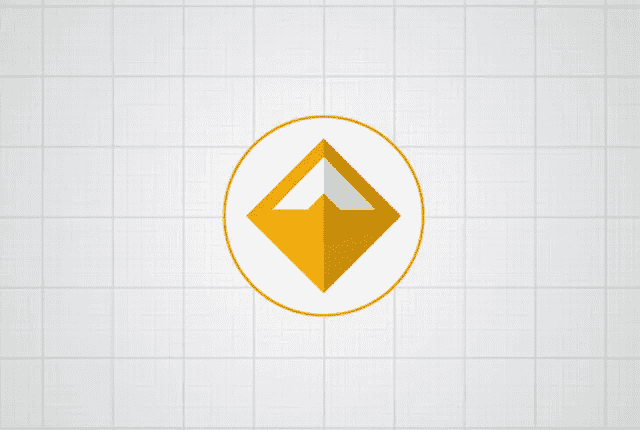
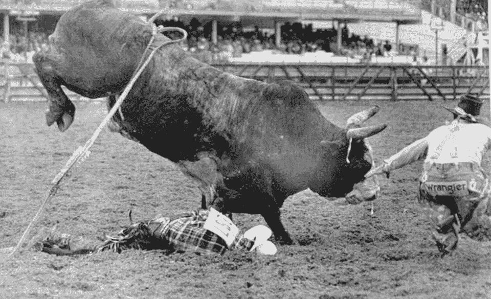

# 区块链分散贷款

> 原文：<https://medium.com/hackernoon/decentralized-loans-on-the-blockchain-b705e3f7e032>

Dai — the stablecoin

区块链的世界，尤其是以太坊，发展非常迅速。如此之快，以至于当你读完这句话的时候，[一个机器人](https://github.com/makerdao/bite-keeper)已经清算了某人抵押债务头寸(CDP)中的抵押品，这些抵押品是他用来购买汽车的，比获得传统贷款更便宜。便宜多了。

> 欢迎来到最复杂的金融(？)有史以来创造的乐器:CDP(或者如果你喜欢，戴 stablecoin)。

我们要花几个小时来解释为什么戴很棒，它是如何工作的，什么是等等，我还有许多其他的史诗般的文章要写，所以我只希望我能把你引向正确的方向，做你自己的研究。如果一切都失败了，在推特上给我发短信。

话虽如此，加密货币是非常危险的，戴是一种非常复杂的硬币，可能会随着你的梦想一起崩溃和烧毁。所以，要非常小心地对待它，只拿你能承受损失的钱做实验，并且读，读，读。

Always be skeptical of a bull (market)

言归正传[正事](https://hackernoon.com/tagged/business)。假设我有 10 万美元。美好时光。我不打算很快卖掉它们，因为我相信以太坊在 2018 年将会是 100，000，000 美元。*说正经的，这些每天做这些预测，然后在一切崩溃时消失的白痴是谁？*好了，回到我们的事情上来。

## 如果我告诉你，我可以锁定我在以太网中的 10 万美元，然后拿回 5 万美元。是的，用实际的美元。

当然，转换不会是无缝的，但这个想法是，最终，你将有 10 万美元被锁在以太坊的某个地方(提示:在区块链，在智能合同中你傻了！)而且你有 50k 美元去玩得开心！

对于持有(我不会说 **hodl** )的人来说，这些都是极好的消息！)因为他们可以用他们(借来的)钱投资其他机会。以下是一些想法:

1.  用借来的钱通过 Kiva 贷款给需要的人(我喜欢这个)
2.  多买乙醚！杠杆万岁！
3.  使用 [Lending Club](https://www.lendingclub.com/) 并编写一个算法，创建一个多样化的贷款组合并创造稳定的收入(帖子即将发布)。这意味着你锁定的以太正在给你带来被动收入
4.  买东西(车，电话，房子！)并开始在你自己的时间偿还债务，而不是支付 4%和每月付款
5.  将它们投入股市(就像在 [AgentRisk](https://agentrisk.com/) 中一样)

这听起来好得令人难以置信，当然也有同样的主要担忧(除了 CDP 和 DAI 的稳定性)。首先，只要以太坊稳定或者上涨，一切都很牛逼。如果它崩盘(取决于你投入多少抵押品)，你锁定的整个以太坊就没了。是的，走了。这意味着你得到了$50k，但是你失去了你在以太坊的$100k。哎哟。

那么，为什么我在讨论 CDPs 和戴，如果它这么糟糕？首先，整个概念是惊人的，让我难过的是，人们只关心密码的价格。这个领域是惊人的(博弈论、密码经济学等)，就我个人而言，我对以太坊如何试图使用社交(和智能)合同解决问题，而不是愚蠢的燃烧所有能量的解决方案(我正看着你比特币)很感兴趣。

其次，如果你考虑到所有涉及的风险，在同样的情况下，使用 CDP 将以太坊投入使用是有意义的。

这篇文章只是触及了 CDP 的表面，但是我相信它会让你知道你可以用它们做什么。只是要小心，因为其中一个风险是破产:)

什么，还在这里？我喜欢！感谢阅读，这里有一些更有趣的事实！

1.  1 戴= $1 和**它永远不涨也不跌**。好吧，至少这个想法是，有一些社会动态试图保持在那个价格。非常有趣的白皮书
2.  还有另一个硬币，尝试了同样的方法(1 个硬币= 1 美元)，但他们走的是老路子，也就是说他们需要在银行里有和硬币一样多的美元，但这最终没有实现(特别是对投资者来说)
3.  尽管我全职致力于在[帮助人们管理他们的财富](http://agentrisk.com)，但我花了大量时间在我的博客和洛杉矶的各种活动中谈论交易、算法和以太坊。