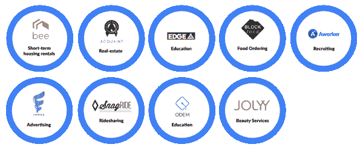

# 分散的市场

> 原文：<https://medium.com/hackernoon/decentralized-marketplaces-c7be237b4df2>

当加密推特忙于讨论为什么比特币下跌了 30%以及何时会回撤时，[区块链](https://hackernoon.com/tagged/blockchain)团队正在努力创造有价值的协议，为未来创造新的可能性。

我最近发现的一个这样的协议是‘起源协议’——(【https://originprotocol.com】T4)

该网站称“Origin 是一个使用以太坊区块链和 IPFS 创建共享经济市场的协议”

你可以把它想象成一个平台，让 AirBnB 在区块链开展类似的业务，没有任何中央公司控制市场，还可以免除 20-30%的中间人费用。

目前，下一个 AirBnB，Ebay 等。是建立在这个协议之上的。

Marketplace companies on Origin Protocol

如果你想改变世界，把权力还给用户(在你这么做的同时也奖励他们):这是一个在构建你的下一个去中心化市场时要考虑的协议！