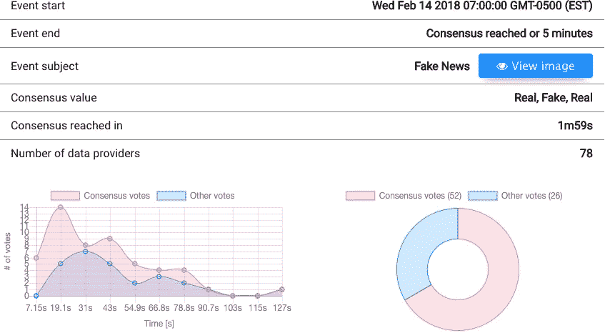
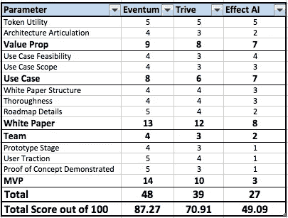

# 分散的机械土耳其人:深入探讨 3 个即将推出的 ico

> 原文：<https://medium.com/hackernoon/decentralized-mechanical-turks-a-deep-dive-into-3-upcoming-icos-60a89e91a424>

The first mechanical turk originated in 1770’s Austria. The turk was an illusion that was showcased as a chess-playing machine. Instead of hidden machine parts, the turk hid chess masters to operate the chess board. (*Source: Britannica*)

2005 年，Venky Harinarayan 认为，可以创建一个平台，利用人类可以轻松完成计算机难以完成的某些任务的事实。在亚马逊早期，哈里纳拉扬曾在杰夫·贝索斯手下工作，他预测，有一项业务将围绕连接那些希望完成研究的人和那些愿意做研究的人而建立。他在 2005 年创建了这个市场，并称之为“土耳其机器人”。

事实上，哈里纳拉扬所做的是通过众包原始的、基于人类的智能来执行计算机无法独自有效执行的任务，从而普及和合法化微任务经济。在亚马逊的机械土耳其人的例子中，卖家(土耳其人)将是一个完成买家(请求者)列出的微观任务的人。亚马逊对作为第三方市场的介绍收取 20%的费用，对有良好记录的员工收取 5%的额外费用。据报道，超过一半的亚马逊“工人”每小时挣不到 5 美元，平台[被描述为“在线众包劳动力的血汗工厂”](https://www.utne.com/science-and-technology/amazon-mechanical-turk-zm0z13jfzlin)

鉴于最近通过[区块链](https://hackernoon.com/tagged/blockchain)进行的市场去中心化和非中介化的流行，以及机械土耳其人模式的内在问题，一些初创公司正在创建由土耳其人和请求者组成的去中心化和开源网络，以更高效和更低的成本完成微观任务。在接下来的回顾中，我们比较了这些平台中的 3 个，每个平台都在推出他们的首次硬币发行( [ICO](https://hackernoon.com/tagged/ico) )。这三个平台分别是: [Eventum](https://eventum.network/) 、 [Trive](https://trive.news/) 和 [Effect](https://www.effect.ai/) 。

3 个 ICO 的评估结构如下:

*   价值主张(对区块链来说是清晰的案例，对代币来说是真正的效用)
*   用例(可行性、局限性)
*   白皮书的质量(可行的令牌模型和需求生成路线图、彻底性、结构良好)
*   MVP(阶段、牵引、概念验证)
*   团队组成(合适的工作人员)

为了对每个 ICO 的质量进行排名，评分矩阵将根据上述因素对每个参数进行细分。每个因素都用 1-5 来衡量，其中 5 代表最强，1 代表最弱。

# **一、价值主张**

也许衡量任何 ICO 最重要的限定条件是 a)认识到为什么区块链的基础设施对提议的商业模式是*必不可少的*，以及 b)理解它的特定标志*如何为参与的利益相关者创造*价值，而不仅仅是像法定货币一样储存价值单位。

**Eventum:** 他们的分散式解决方案将允许收集各种用例的实时信息*并通过“群体智慧”逻辑在用户网络中进行*验证。这种方法通过利用人群对高度可变的人类输入形成共识，将机械土耳其人带到了一个新的高度。这使得 Eventum 能够高效地导出数据，并以高吞吐量建立临界质量协议，从而减少源自中央数据源的额外时间和成本。Eventum token (EVT)为 Eventum 区块链提供支持，奖励那些支持数据处理、平台治理等任务的平台采用者。反过来，用户与平台互动的质量会得到评分，随着用户接受度的上升，代币发行量也会增加。所有用户和令牌交互都在以太坊智能联系人上维护和更新。**得分= 9/10**

与 Eventum 一样，Trive 也运用“群体智慧”现象来调查几乎所有媒体内容流，以对抗假新闻。网络评论者将筛选任何一篇文学作品，并在它被储存在区块链之前独立地对其可信度进行排名。这种规模的操作需要成百上千的参与者，如果他们正确地识别出与共识算法的结果一致的事实内容，所有人都将立即获得一枚三分硬币(TRV)作为他们努力的奖励*。独立审查过程在用户方便时进行，但达成共识需要更长的时间。**得分= 8/10***

**Effect:** Effect 利用众包逻辑，以获取基于人类的信息，为人工智能算法提供信息。然而，与 Eventum 和 Trive 不同的是，众包的方式仅用于获取人类输入，因为核心业务案例不需要建立共识。这一过程减少了通过一次输入获取相同数据所需的繁重成本、存储和时间。NEP-5 令牌在任务完成后分发给用户，其价值与用户群体的增长率成线性关系。**得分= 7/10**

# **二世。用例及应用**

**Eventum:**Eventum 的独特之处在于它能够覆盖这个用例中几乎*无限数量的应用程序。具体来说，Eventum 的价值来自实时数据的收集，并且根据最终用户，可以支持假新闻识别、内容审核和图像分析等应用。虽然这些是 Eventum 最强的用例，但他们正在探索情感识别和视频分析等更动态的实例中的机会。**得分= 8/10***

**Trive:** Trive 的一个主要用例是识别、研究和验证媒体内容，以限制向公众发布的错误信息的数量。与 Effect 一样，Trive 利用了该行业建立的 Mechanical Turk 技术，但在假新闻的众包方面存在挑战，特别是在鉴定固执己见或有争议的作品时。**得分= 7/10**

**Effect:** 目前，Effect 的主要用例是在人工智能领域，尤其是机器学习算法开发。他们的商业案例没有偏离机械土耳其人的最初定义，但像 Eventum 一样，他们也在探索其他用例，如销售算法即服务和分发计算能力来运行请求的算法。**得分= 6/10**

# 三。组

在评估一个 ICO 创业团队时，我寻找的五样东西是令人印象深刻的才能、丰富的经验、合作的历史、强大的顾问委员会和合适的法律顾问。

**Eventum** :一个由 8 人组成的全面团队，所有人都在同一个办公室工作，由 Martin Mikeln 领导，他是一名电气工程师和软件开发人员，拥有丰富的软件和硬件项目、聊天机器人以及在 [Kickstarter 活动中筹集 10 万美元以上的履历](https://www.kickstarter.com/projects/1509130378/bluejay-the-worlds-first-smart-mount-for-your-car)。该团队成功地将分散架构集成到他们的工作原型中，并通过他们的现场演示赢得了用户的青睐。此外，他们最近还聘请了全职专家彼得·贾姆尼克和朱利安·库斯托瑞。

**得分= 4/5**

**特里韦**:由[大卫·蒙德鲁斯](https://www.linkedin.com/in/mongoosenewyork/)(哥伦比亚大学 MBA)和[菲尔·里勒](https://www.linkedin.com/in/prodeveloperfl/)领导的 10 人团队，他们都是前企业家，也是佛罗里达州迈阿密的区块链发展顾问。他们有 6 名上市顾问，除了比特币的坚定拥护者、经济学家杰弗里·塔克(Jeffrey Tucker)之外，网上几乎没有关于他们的信息。**得分= 3/5**

**效果**:相当年轻且缺乏经验的 8 人团队，由[克里斯·道](https://www.linkedin.com/in/chris-r-dawe-b79217151/)领导，他是一位拥有超过 15 年欧洲和北美团队领导经验的连续创业者。该团队由应届大学毕业生组成，他们在区块链没有什么经验，但他们精通人工智能。目前还不清楚该公司是否有顾问。**得分= 2/5**

# **四。白皮书**

在进入这一部分之前，定义白皮书的内容是非常重要的。虽然没有明确的格式或指导原则，但最全面、最成功的白皮书包括:

*   问题与解决方案
*   竞争格局
*   令牌经济和使用案例的技术说明
*   开发时间表，令牌发布阶段
*   付款处理(流程)
*   ICO 战略(价格、市值、激励、分销、营销)
*   项目背后的团队
*   代币的法律问题
*   令牌部署和未来计划

**Eventum:**[Eventum 白皮书](https://eventum.network/Eventum-whitepaper.pdf)很好地强调了如何收集实时信息的现有限制，同时也预测了数据捕获方式的未来差距。特别是，它强调了分散技术可以解决这一痛点的用例，并将 Eventum 定位为市场解决这一问题的解决方案。该文件支持其索赔的技术细节的产品的基础设施，用户的互操作性和 EVT 的功能价值。**得分= 13/15**

**Trive:** 与 Eventum 白皮书非常相似， [Trive 白皮书](https://trive.news/wp-content/uploads/2018/02/Whitepaper.0.2.6x.pdf)也非常强调其提议的区块链的技术和架构细节，尤其是 Trive 存储模块。这篇文章强调了用户如何与平台互动的复杂性，如何激励他们执行推动平台采用的任务，以及如何对他们的努力进行补偿和排名。这篇文章描绘了对错误信息管理的新兴需求，但由于该行业的肮脏，没有太多的市场数据来正式确定其规模。**得分= 12/15**

**效果:**[效果白皮书](https://www.effect.ai/download/effect_whitepaper.pdf)概述了 AI 和机器学习应用的分散化解决方案的强大案例，并抽象地提出了 3 个阶段的效果网络解决方案。然而，这篇文章严重依赖于基于理论的解决方案，并没有详细描述系统的层次结构和功能。还需要注意的是，Effect 的白皮书仍然是一个草案，将来还会修改。**得分= 8/15**

# **V. MVP**

拥有一个工作原型，或者更好的是，产品的 alpha 或 beta 版本展示了对执行产品路线图的强烈承诺。成功的测试项目的特征包括有一个由开发人员领导的演示，有一个让你导航平台的界面，访问完全透明的开源代码和建立一个质量测试用户社区。

Eventum: [Eventum 的 alpha](https://alpha.eventum.network/?action=signup) 已经吸引了许多能够验证用例概念证明的用户。Eventum 也是 3 个平台中唯一一个在实际运行的区块链上进行概念验证的平台！就在上周，Eventum 举办了一场[现场活动](https://alpha.eventum.network/events/3)，展示了该平台在不到两分钟内众包和识别假新闻的能力！在该事件中，78 名用户为他们收集、处理和验证数据的工作分配了 4 个以太(1M EVT)，所有这些都由验证节点确认并存储在以太坊智能合约上。alpha 上还有 3 个现场活动[定于 2 月举行，将进一步验证内容审核和图像分析等其他用例的概念证明。 **得分= 14/15**](https://alpha.eventum.network/)

Eventum 向他们的 alpha 发布了现场活动的结果。下面的截图展示了详细描述测试人员在验证“假新闻”时的交互的分析

Eventum 还发布了智能合同的 URL，该合同存储了每个测试人员在“假新闻”直播事件期间的交易活动。对智能合约的更详细的访问需要安装元掩码插件。

**Trive:**Trive 原型 [Trive 原型](https://hive.trive.news/document-list)，一个仍处于 MVP 阶段的 javascript 应用，归档了一组媒体内容，在安装 Chrome 扩展后，评论者可以对这些内容进行注释和评分。概念证明正在展示，但流程的时间效率需要进一步阐明。此外，TRV 系统的传播、区块链的分散式基础设施和底层数据存储目前尚未实现。**得分= 10/15**

Trive 在他们的 MVP 上发布所有评分和注释的内容。下面的屏幕截图是一个示例，显示了示例审查员输入的内容。

**Effect:** 目前，Effect 在生产中没有工作原型。当他们的 MVP 真的上线时，我们会更新帖子。**分数= 3/15**

## 六。结论

下面的矩阵分解了每个 ICO 的总体得分，包括每个因素是如何融入每个参数的。

Eventum 在阐述、部署和展示他们的技术方面走得最远。他们有一个经验丰富的团队，有一个合法的 alpha 原型，平台测试人员因为他们在各种用例中的交互而得到奖励。最重要的是，所有这些都被跟踪，并可以在以太坊智能合约上开源查看。**得分= 87.3/100**

**Trive** 试图通过众包事实核查来解决内容误传的问题。MVP 仍在进行中，但概念验证是可见的。然而，当这一概念以实时形式推出并进入带有不同政治评论的自以为是的内容时，就会出现局限性，因为文章会受到更多审查，这取决于评论者的政治倾向。**得分= 70.9/100**

**效果**通过收集原始的人类数据，为算法训练和开发提供了有力的证据。虽然范围有限，但我个人认为这一工具有很好的学术用途，例如帮助社会科学家模拟社会动态如何影响“群体思维”现象。Effect 仍然需要开发原型，但是许多基础工作已经建立。**得分= 49.1/100**