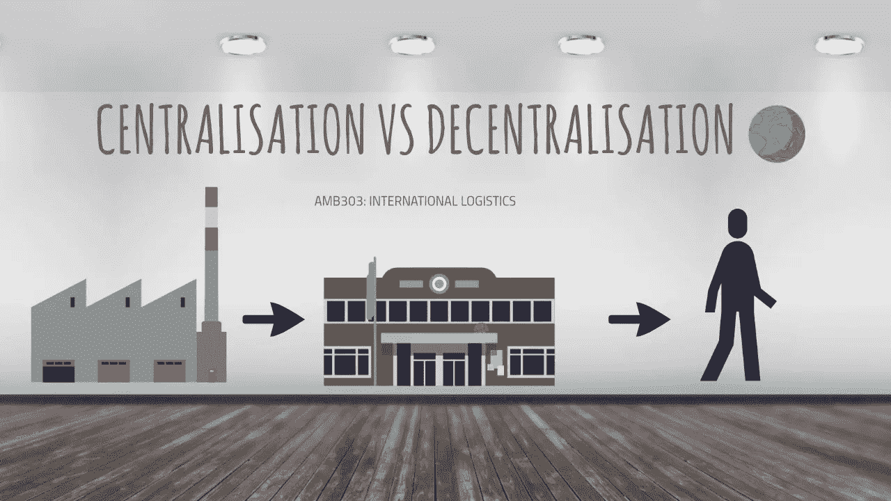
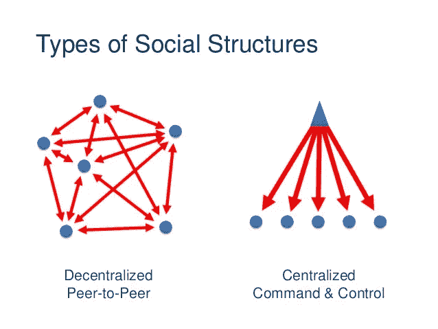
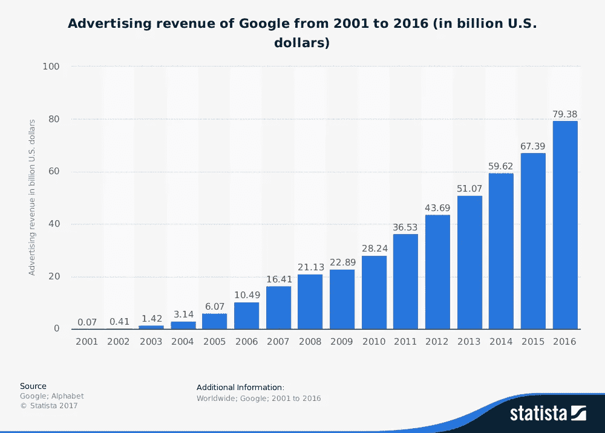
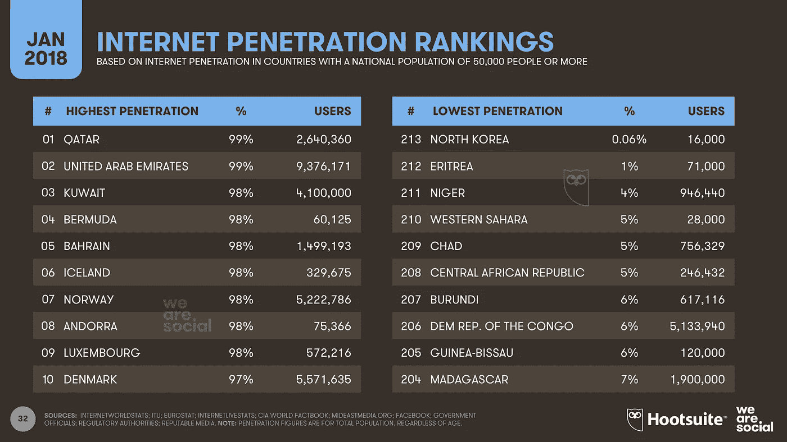

# 分散技术、社会和思想

> 原文：<https://medium.com/hackernoon/decentralizing-technology-society-and-thought-c59318a8aef9>

约翰·奈斯贝特 1982 年的书:[《大趋势》](https://www.enotes.com/topics/megatrends)在《纽约时报》畅销书排行榜上呆了两年多，售出[1400 万册](https://www.richardvanhooijdonk.com/en/blog/trend-watcher-spotlight-john-naisbitt/)。在这篇文章中，奈斯贝特强调了定义我们当代技术时代的十个最重要的趋势。他探索的第五个趋势被介绍为从集权到*分权*的快速过渡。

分散化是描述权力、控制、访问或所有权的特征，因为它们分布在构成网络的多个参与者、点或节点上。它反映并表现在各种架构、集体和框架中。

回到一万年前，平等主义的狩猎采集社会是占主导地位的社会形态。在我们组织成阶级、财富和权力的等级体系之前，严格的文化规范被强制执行，以防止任何个人或少数群体获得比其他人更多的地位、权威或资源。维持一个公平的竞争环境是生死攸关的问题。有进取心的群体扩展到新的地区，并在孤立的条件下生存下来，因为他们有能力一起工作并保持群体的稳定。

但是随着人们生存能力的提高，人口数量增加了。我们需要更多的食物，所以我们发展了农业。这导致了过剩和对逐渐专业化角色的需求。我们开始用尽当地的资源，然后[踏上更远的地方去探索](https://www.theguardian.com/inequality/2017/dec/05/how-neolithic-farming-sowed-the-seeds-of-modern-inequality-10000-years-ago)。这滋生了冲突和征服，被征服者变成了下层阶级，而征服者变成了贵族、酋长和国王。不平等、民族主义和恐惧让等级制度成为未来几千年的社会基石。

“分权”一词最初是由亚历克西斯·德·托克维尔创造的，用来描述联邦化的美国的政治权力分配。但正如德国经济学家[威廉·罗普克](https://hackernoon.com/back-to-basics-decentralization-and-society-df3154d30928)所写的那样，“集权和分权的观点”不仅反映在政治上，也反映在行政、经济、文化、住房、[技术](https://hackernoon.com/tagged/technology)、社会和工业组织以及社区形成上。"

在合成系统中，[分散意味着安全](/@VitalikButerin/the-meaning-of-decentralization-a0c92b76a274) —将数据分散到多个节点上降低了任何一点对系统产生负面影响的可能性。[在社会](http://www.ciesin.org/decentralization/English/General/Different_forms.html)中，它的特点是权力分配更加平等，少数人对基础设施的控制更少；在思想上，去中心化推动了平等主义的政治、社会和哲学观念，其中没有等级，只有[多种相互依赖的互动](https://www.oecd.org/governance/regional-policy/48724565.pdf)、[意义星座](https://books.google.com.vn/books?id=4568eg8-_NIC&pg=PA11&lpg=PA11&dq=%22constellations+of+meaning%22&source=bl&ots=w9P4GfUH90&sig=Pb4C-tTn0bwTjGrSjTgEk1BLtDE&hl=en&sa=X&ved=2ahUKEwiewuHxl_jdAhUJWsAKHRx-A504ChDoATAEegQIAhAB)和[共生生态系统](https://www.ibm.com/blogs/blockchain/2018/09/symbiotic-collaboration-a-key-to-succeed-with-blockchain-in-financial-services/)。

[技术分散](https://en.wikipedia.org/wiki/Decentralization)可以定义为“商品和服务的生产和消费从集中模式向分散模式的转变。”但这不仅仅是因为数字领域。技术可以包括我们用来与环境互动的工具、材料、技能、技术和过程。

回到工业文明的黎明——通过大规模的技术创新，快速的社会分权开始发生。在互联网出现之前，[印刷机](https://ubiquity.acm.org/article.cfm?id=348784)就已经将信息提供给了更广泛的人群；[汽车](https://www.carsoncenter.uni-muenchen.de/events_conf_seminars/event_history/2014-events/2014_conf_ws_sem/greening_conference_june/meyer_paper.pdf)传播了移动的自由，因此人们将不再依赖于集中的交通方式；制造业的分散化在当地创造了就业机会，扩大了中产阶级的生活。这些发明像滚雪球一样越滚越大，在技术分散化最迅速的时期达到顶峰，也就是我们的[互联网时代](https://spectrum.ieee.org/view-from-the-valley/telecom/internet/brewster-kahle-on-whats-next-for-the-decentralized-web-movement)。

最大的技术网络起源于一种去中心化的想法。这个想法是，如果一个通信网络不依赖于任何单一的电源、数据或控制源，它可以被分割成多个部分，但仍然可以运行。许多设备通过通用协议共享数据，这意味着没有中心，没有单点故障。在互联网的第一波浪潮中，从 20 世纪 80 年代到 21 世纪初，技术分散反映在人们与网络的关系中。协议由在线社区控制[。尽管互联网泡沫给这个领域带来了大量投资，但在垄断形成之前，必须有一段时间的强烈的创造力、学习和发展。](https://www.washingtonpost.com/sf/business/2015/05/30/net-of-insecurity-part-1/?noredirect=on&utm_term=.74d47ba60e2c)

如今，互联网用户的访问在很大程度上是集中的，作为一种分散的社会机制，其范围是有限的。科技公司已经开发出超过开放协议能力的软件和系统。用户已经从开放平台转移到这些更先进的服务。拥有连接和电缆的[公司现在是盈利实体；核心服务是集中和受控的。](https://computer.howstuffworks.com/internet/basics/who-owns-internet1.htm)

即使当我们访问开源网站时，这通常也是通过集中式软件、服务和服务器来实现的。正如[硅谷投资公司 Elevation Partners](http://www.elevation.com/ep_it.asp?id=102) 的联合创始人罗杰·麦克纳米所说，“谷歌、脸书、亚马逊越来越成为超级垄断者，尤其是谷歌[…]。他们经营的市场份额与标准石油公司[……]100 多年前的规模几乎相同，但最大的不同是他们现在的业务范围是全球性的。”

对消费者来说，第一波互联网去中心化的光明面是数十亿人获得了信息和交流的渠道。我们获得了以闪电般的速度表达自己的能力，并跨越了以前无法想象的距离。社会化、参与商业和教育变得更快、更容易和可编程，尽管可能不是以分散的、平等主义的理想方式。

有史以来第一次，我们可以向整个世界见证、交流和表达自己。但是从某种意义上来说，这只是凸显了价值、权力和主权的不均衡分配。由于集中的基础设施不接受他们的证书或阻止他们进入，数十亿人无法加入全球经济。在这个曾经乌托邦式的互联网时代，超过 11 亿人仍然“[隐形](http://www.worldbank.org/en/news/press-release/2017/10/12/11-billion-invisible-people-without-id-are-priority-for-new-high-level-advisory-council-on-identification-for-development)”，无法使用医疗保健、社会保障、教育和金融等重要服务。[几十年来](https://www.youtube.com/watch?v=QX3M8Ka9vUA)，全球范围内的生产力一直在下降，而我们本以为这是一个创造力、革新和发明的时代。不平等导致了令人担忧的社会紧张局势，我们看到这反映在对热门话题的争议中，如[假新闻](https://www.theguardian.com/media/2018/oct/08/bbc-chief-fake-news-label-erodes-confidence-in-journalism)、[国家支持的机器人](https://www.independent.co.uk/news/world/americas/us-politics/trump-russia-twitter-bots-automated-accounts-congress-russia-investigation-latest-a8182626.html)、禁止服务用户的[、](https://www.cnet.com/news/facebook-deleted-583-million-fake-accounts-in-the-first-three-months-of-2018/)[隐私](https://www.theguardian.com/global/commentisfree/2018/feb/08/the-guardian-view-on-internet-privacy-its-the-psychology-stupid)和[有偏见的算法](https://www.technologyreview.com/s/610275/meet-the-woman-who-searches-out-search-engines-bias-against-women-and-minorities/)。

当前部署的互联网技术尚未颠覆价值网络、信任、治理、身份管理和所有权的核心集中化。但重要的是要认识到，由于某些固有的好处，集权并不是占主导地位的。在斯坦福大学进行的[研究模拟中，人们观察到，中央集权的结构非但没有让群体受益，反而在本质上破坏了稳定，大大增加了群体在稳定环境中灭绝的几率。进行这项研究的研究人员表示，很明显，中央集权造成的不稳定会刺激古老的部落进一步寻找资源，导致等级制度的蔓延和更稳定的平等主义社会通过征服而消亡，这正是历史所显示的。](https://journals.plos.org/plosone/article?id=10.1371/journal.pone.0024683)

[社会集权的不稳定本质](https://www.jstor.org/stable/3542628)，以及由此产生的寻找、迁移和统治的动机导致了整个物种的灭绝，并导致了艰难、抗议和革命。不平等的蔓延不是因为它本身是一个更好的体系，而是因为它造成了人口结构的不稳定，引发了不合理、冲突，并导致了弱势社会的终结。斯坦福大学研究小组发表的论文中的一段[引用得很好:“我们人类灵长类动物没有被进化决定的、适者生存的社会结构所束缚。我们不能假设，因为不平等的存在，它在某种程度上是有益的。平等——或不平等——是一种选择。”自从工业革命开始以来，我们经历的权力下放的轨迹表明，在宏观层面上，我们正在做出正确的决定。](https://journals.plos.org/plosone/article?id=10.1371/journal.pone.0024683)

认为互联网革命已经结束是愚蠢的。毕竟，这还是一项相对较新的技术。通过分布式账本技术，互联网不仅仅是一个全球通信网络。正如经济学家和社会理论家[杰里米·里夫金](https://www.youtube.com/watch?v=QX3M8Ka9vUA)解释的那样，现在我们的信息互联网开始与[区块链](https://hackernoon.com/tagged/blockchain)的技术融合，形成“一个新生的、数字化的【原文如此】、可再生能源的互联网；现在，这两个互联网正在与一个羽翼未丰、自动化、全球定位系统，以及很快无人驾驶的公路、铁路、水上和空中交通互联网融合。”区块链是通向完全分散的万维网的垫脚石。

本质上，区块链扩展了我们当前互联网的速度、范围、灵活性和自动化能力，超越了通信，进入了人类关注的最有价值的角落。在[身份管理](https://www.forbes.com/sites/forbestechcouncil/2018/07/27/how-blockchain-can-solve-identity-management-problems/)、[零售和供应](https://hackernoon.com/how-walmart-alibaba-and-others-are-shaking-up-retail-with-blockchain-a34fee518d69)、[教育](/universablockchain/blockchain-in-education-49ad413b9e12)、[金融部门](https://www2.deloitte.com/nl/nl/pages/financial-services/articles/5-blockchain-use-cases-in-financial-services.html)、[非营利组织](https://www.forbes.com/sites/forbestechcouncil/2018/04/25/blockchain-is-reestablishing-trust-in-nonprofits/#5d50d5d37916)、[能源](https://www.wired.co.uk/article/microgrids-wired-energy)、[废物管理](https://coincentral.com/blockchain-waste-management-one-mans-rubbish-is-another-ones-treasure/)、[物流](https://www.forbes.com/sites/insights-penske/2018/09/04/how-blockchain-may-impact-logistics-supply-chain-and-transportation-a-conversation-with-the-blockchain-in-transport-alliance/#6b122c25f2b3)和[数据服务](https://www.inc.com/nicolas-cole/web-analytics-will-get-a-massive-improvement-with-blockchain-technology.html)中，已经开发并正在建立应用程序。

互联网和区块链的这种不断发展的技术结合甚至有一天可能会通过新的集体智慧分散*的思想*,这对社会具有重大意义，因为它在最受信任的层面上运行。在分散和集中的社会系统之间的[选择](https://journals.plos.org/plosone/article?id=10.1371/journal.pone.0024683)实际上可以在未来通过全球共识做出，使用安全的[区块链作为可扩展的电子投票工具](https://hackernoon.com/how-blockchain-will-make-electronic-voting-more-secure-fba15d752bee)用于决策。通过在区块链上存储数据，投票可以变得透明、完全匿名，并防止篡改的可能性。区块链解决方案已经在[塞拉利昂](https://cointelegraph.com/news/sierra-leones-fake-blockchain-election-hasnt-damaged-the-technologys-reputation)和[巴西](https://www.newsbtc.com/2018/01/08/brazilian-electoral-system-to-use-ethereum-network/)的政治领域进行了试验，以展示它们如何提供安全性、公平性和透明度。

区块链技术已经被用于对公司的运营做出决策，例如[选举董事会成员](https://www.coindesk.com/bitcoin-foundation-blockchain-voting-system-controversy/)和[验证协议变更](https://hackernoon.com/what-blockchain-technologists-should-know-about-voting-theory-f9bac8e5a1c9)。如果互联网是全球集体智慧的原始形式，在区块链技术的推动下，它可能会成为有牙齿的集体智慧——一个有能力影响真正有价值的变化的公共思想网络。你不需要成为马克思主义者也能相信我们的技术环境、经济和文化深深地影响着意识和行为。在这样一个世界里，资产、数据、信任、身份和治理都是安全的，并且可以在世界任何地方通过共识进行数字操作，我们的外部和内部生活都可以进化。

在 IOST，我们正在为未来的平等而努力。我们相信，分散的区块链网络将创造一个更好的社会，以新的方式思考全球问题，并以真正影响变革的解决方案做出回应。我们正在构建一个可扩展的、高效的、无许可的区块链生态系统，为在线服务的安全互联网奠定基础。

区块链技术的出现正在过滤分散到不同的技术，社会和概念系统。但是技术和我们之间的关系是一种周期性的相互依存关系。由于区块链提供了某些组织理想，这也清楚地表明了它的历史背景。[奈斯贝特](https://www.enotes.com/topics/megatrends)很好地捕捉到了这一点——我们所依赖的基础设施是高度集中的，但我们生活在一个以向去中心化理想靠拢为标志的时代。区块链是朝着一个先进的、平等的、仁慈的世界发展的下一步。

要加入我们的去中心化未来之旅并了解更多，请访问我们的 [IOST 网站](http://Iost.io)。