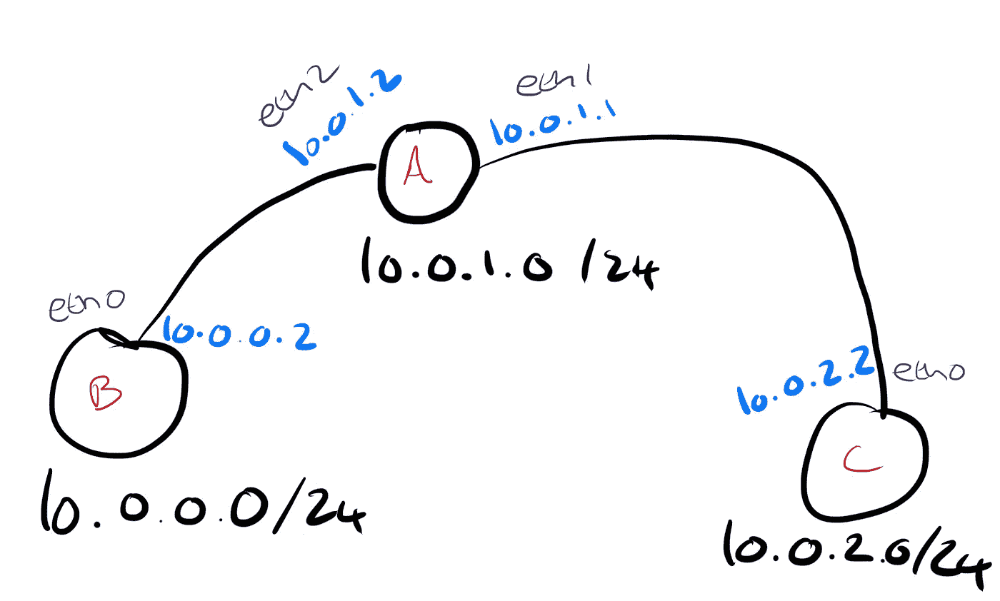

# 网络决定如何处理数据包

> 原文：<https://medium.com/hackernoon/deciding-on-what-to-do-with-a-packet-d8c47412c61b>

当一台设备要向另一台设备发送数据包时，有两种选择:

1.  如果接收者在同一个子网上，它可以直接发送[包](https://hackernoon.com/tagged/packet)给他们，它只需要确定接收者的 MAC 地址。
2.  如果接收方在另一个子网上，它会将数据包传递到一个设备上，该设备可以将数据包转发到目的地。

# 选项 1

发送设备需要测试的第一件事是，接收设备和我在同一个子网吗？

为此，它使用配置接口时定义的 IP 地址和网络掩码来确定与其位于同一子网的地址范围。

例如

```
eth0: flags=4099<UP,BROADCAST,MULTICAST>  mtu 1500
        **inet 10.0.0.7  netmask 255.255.255.0**  broadcast 10.0.0.255
        ether b8:27:eb:28:f5:e0  txqueuelen 1000  (Ethernet)
```

使用各种工具之一，我们可以计算出这意味着，10 . 0 . 0 . 1–10 . 0 . 0 . 254 范围内的任何 IP 都与我们在同一个子网中


如果我们知道一个收件人和我们在同一个子网，那么我们需要找出它的 MAC 地址，这是使用 ARP 请求来完成的。

地址解析协议(ARP)是一种将 IP 地址映射到 MAC 地址的协议。

设备可以发出一个 ARP 请求，询问“谁有 IP 地址 X？”，它被发送到广播地址，这意味着它被传送到子网上的每个设备。

所有收件人都会检查邮件并丢弃邮件，除非他们拥有所述的 IP 地址。IP 地址的所有者回复说“IP 地址 X 在 MAC 地址 Y”。

这个响应通常会被缓存，这样下次发送者就不需要再次执行查找。

我们可以使用`ping`生成一些数据包，看看 WireShark 会发生什么

```
pi@raspberrypi:~$ ping 10.0.0.4
PING 10.0.0.4 (10.0.0.4) 56(84) bytes of data.
64 bytes from 10.0.0.4: icmp_seq=1 ttl=64 time=1.96 ms
64 bytes from 10.0.0.4: icmp_seq=2 ttl=64 time=0.932 ms
```

`10.0.0.4`与`10.0.0.7/24`在同一个子网中，因此第一步是发出一个 ARP 请求来查找`10.0.0.7`的 MAC 地址


`10.0.0.4`看到 ARP 请求是给自己的，响应表示对应的 MAC 地址是自己的。


现在，发送方知道了接收方的 MAC 地址，就可以将消息打包并发送给接收方。


# 选项 2

如果发送方确定接收方不在同一个子网上，它需要将消息传递给能够将消息发送到目的地的其他人。

路由表根据数据包的目的地提供数据包发送目的地的信息。

更具体的路由优于更一般的路由，通常有一个默认路由用于不匹配任何规则的数据包。

Linux 上的`ip route` 命令显示系统路由表

```
router:~ $ ip route
default via 192.168.1.1 dev wlan0
10.0.0.0/24 via 10.0.0.8 dev eth2 
10.0.0.4 
 nexthop dev eth0 weight 1 
 nexthop dev eth1 weight 1 
192.168.1.0/24 dev wlan0 proto kernel scope link src 192.168.1.85
```

这表明:

*   任何目的地为`192.168.1.0/24`子网的数据包都会从直接连接到该子网的`wlan0`接口发出(没有通过关键字的**),因此设备会查找目的地 MAC 地址，并将数据包直接传递到匹配的设备。**
*   任何去往`10.0.0.4`的数据包都会从直接连接到设备的`eth0`或`eth1`接口发出。所选择的路由取决于 Linux 内核版本以及它如何实现等价多路径(ECMP)路由。
*   任何目的地为`10.0.0.0/24`的数据包，除了目的地为`10.0.0.4`的数据包(因为它们有一个更具体的路由，该路由优先于此路由)，都从接口`eth2`发送到`10.0.0.8`处的设备，接口`eth2`可以将它们转发到它们的目的地(通过关键字的**表示这是一个中间跳)，因此将从`eth2`发出 ARP 请求，以在`10.0.0.8`处查找设备的 MAC 地址，并且数据包将简单地传递到设备上，以转发到目的地。**
*   最后，如果这些路由都不匹配您的数据包，默认规则会通过`wlan0`接口将它们发送到`192.168.1.1`，以便转发到目的地。

我们可以构建一个更简单的[网络](https://hackernoon.com/tagged/network)，我们自己的路由器，并将不同子网上的设备连接到它，以说明这如何与 Wireshark 一起工作。



在我们的路由器上(A)

```
pi@raspberrypi-router:~ $ sudo ip route
10.0.0.0/24 dev eth2 proto kernel scope link src 10.0.1.2
10.0.2.0/24 dev eth1 scope link
```

该路由器连接网络 B 和 C，网络 B 和 C 分别具有范围`10.0.0.0/24`和`10.0.2.0/24`内的设备，这些设备可从`eth2`和`eth1`到达。为简单起见，我们将集中讨论这些网络上的单个设备(`10.0.0.2`和`10.0.2.2`)，但是 B 和 C 可以是连接多个设备的交换机。

在设备 B 上(10.0.0.2)

```
pi@raspberrypi:~ $ sudo ip route
10.0.1.0/24 dev eth0 scope link
10.0.2.0/24 via 10.0.1.2 dev eth0
```

该设备通过`eth0`接口直接连接到`10.0.1.0/24`网络，并可以通过`10.0.1.2`到达`10.0.2.0/24`网络

在设备 C 上(10.0.2.2)

```
pi@raspberrypi:~ $ sudo ip route
10.0.0.0/24 via 10.0.1.1 dev eth0
10.0.1.0/24 dev eth0 scope link
```

该设备通过`eth0`接口直接连接到`10.0.1.0/24`网络，并可以通过`10.0.1.1`到达`10.0.2.0/24`网络

现在有了 Wireshark，我们可以看到它们的运行，让我们从设备 B 向设备 C 发送一个请求

```
curl 10.0.2.2:8000/
```

设备 B 发现它有一个到`10.0.2.0/24 via 10.0.1.2 dev eth0`的路由，所以它首先从`eth0`发出一个 ARP 请求，以找到`10.0.1.2`的 MAC 地址


然后，它尝试建立到目的地`(10.0.2.2)`的 TCP 连接，并通过将其 MAC 地址作为目的地，将数据包发送到`10.0.1.2`处的路由器。


路由器接收数据包，并查看它是否可以通过路由`10.0.2.0/24 dev eth1`到达`10.0.2.2`

然后，它在`eth1`上发出一个 ARP 请求，以找到`10.0.2.2`的 MAC 地址


它将刚刚学习的 MAC 地址作为目的地，并将数据包转发到其目的地。


然后，在设备 C 处，它接收数据包，并向设备 a 发回回复。它查询自己的路由表，为`10.0.0.2`找到一条路由

`10.0.0.2`可以通过`eth0`界面到达，`10.0.0.0/24 via 10.0.1.1 dev eth0`

它已经缓存了之前的 MAC 地址`10.0.1.1`，因此不需要发出 ARP 请求，只需将缓存的 MAC 地址作为目的地。


然后，路由器将反向重复该过程，并将回复转发回发送方！

仅此而已，有了足够多的互连路由器，你就可以在任何你喜欢的网络之间路由数据包。