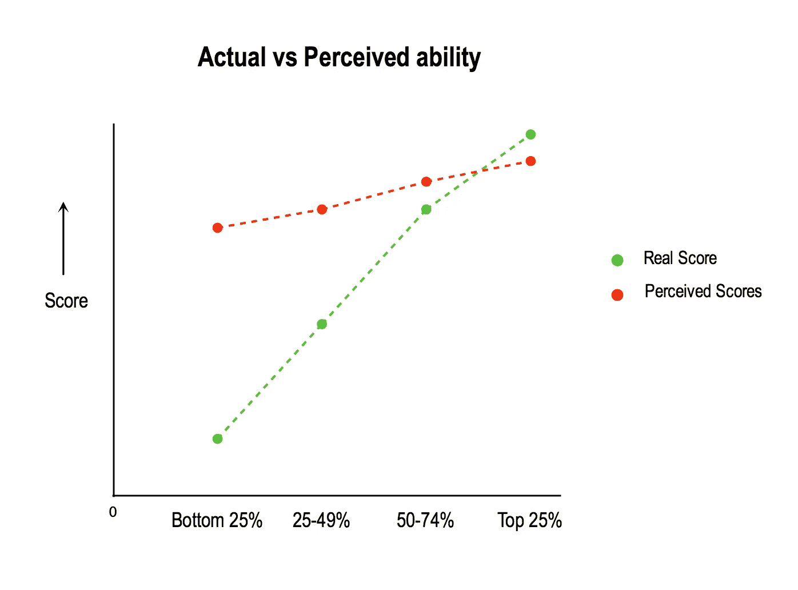

# 解读邓宁-克鲁格效应

> 原文：<https://medium.com/hackernoon/decoding-the-dunning-kruger-effect-1818a87bd802>

## 缺乏技能如何导致自我评估膨胀

Photo by [dylan nolte](https://unsplash.com/photos/gVSYfFsn-vU?utm_source=unsplash&utm_medium=referral&utm_content=creditCopyText) on [Unsplash](https://unsplash.com/?utm_source=unsplash&utm_medium=referral&utm_content=creditCopyText)

我已经做了八年的产品经理。在与不同公司的许多产品经理交谈后，很明显评估产品人才是多么困难。这让我走上了进行产品面试的道路，以帮助公司雇佣符合他们需求的优秀产品经理。与此同时，我进行了一项平行的任务，通过所有现有的研究来掌握招聘的科学。这些见解真的很有趣，我认为这将有助于“解码”我读过的一些研究——或者换句话说，分解重点，为你节省一些时间和几千字。

我要解码的第一篇论文名为邓宁和克鲁格的《不熟练且不自知——认识到自己的不熟练是如何导致自我评估膨胀的》。我是在了解了[邓宁-克鲁格效应](https://en.wikipedia.org/wiki/Dunning%E2%80%93Kruger_effect)之后对这篇论文产生兴趣的，如果“冒名顶替综合征”这个词听起来耳熟的话，你可能以前听说过这个效应。

**以下是本文主要揭示的内容:**

> **让你擅长工作的技能也让你善于认识到自己是否擅长这份工作。因此，当有人对自己的工作不熟练时，他们也缺乏意识的技能，这使他们无法认识到自己不好。**

以下是研究人员如何进行这项研究的细节，这项研究分三个阶段进行，探索三个不同的问题。

## **第一阶段:**

## **初级问题:“无能的人是不是没有能力评估自己的技能？”**

他们是如何做的:研究人员测试了三个不同的小组，他们在 a)幽默 b)逻辑推理 c)语法方面有不同的技能水平，并要求他们衡量自己的测试表现。然后记录每个人的数据点。

结果和收获:

Results of Phase 1

> 底层四分之一的人倾向于把自己评价为高于平均水平——他们高估了自己的能力 50%以上。事实上，底部的两个四分位数高估了他们的能力，认为他们比实际情况要好。
> 
> 前 25%的人实际上低估了他们在测试中的表现。
> 
> 缺乏表现良好的知识的人往往意识不到这一事实——研究人员将其归因于缺乏“[元认知技能](https://en.wikipedia.org/wiki/Metacognition)”

## **第二阶段:**

## **初级问题:**技术较差的人肯定高估了自己的技术和能力。他们的误判仅限于他们自己的技能还是他们也错误地评估了他们同伴的技能？

他们是如何做的:和上面一样的小组被召集起来，这一次，每个人都被给予他们的同伴的测试，并被要求评分以评估他们的同伴在测试中做得有多好。之后，考生被要求再次评估自己的考试成绩。

结果和收获:

1.  与排名前 25%的人相比，排名后 25%的人更难衡量他人的能力。
2.  即使在看了同龄人的表现后，排名后 25%的人对自己的分数评估没有任何不同，在某些情况下，他们倾向于夸大自己的分数。
3.  有趣的是，在看到同龄人的表现后，前 25%的人实际上对自己进行了不同的评估，并提高了自己的表现分数。

> 这是因为研究人员所说的虚假共识效应。在缺乏数据的情况下，最优秀的人认为每个人的表现都和他们自己的相似，这就是为什么他们低估了自己。

## 第三阶段:

## **主要问题:**对能力较差的人进行核心技能培训真的有助于他们评估自己的技能吗？正如前者所暗示的，提高你擅长某事的能力是否也提高了你的元认知技能？

他们是如何做的:研究人员决定训练这些人来提高技能。训练结束后，他们被要求再次给自己和同伴的分数打分。

结果和总结:

1.  培训底层四分之一中技能较低的候选人实际上提高了他们评估自己的能力。
2.  训练他们的核心技能也能提高他们的元认知技能。

**论文最后的收获:**

> 这里有一个悖论，那就是为了帮助不称职的人更好地评估他们和其他人的技能，我们需要培训他们，使他们更有能力。

作者提到的一件事是，负面反馈的普遍缺乏使得无能的人很难成长，因为他们一开始就没有意识到自己的无能。这个问题主要是由能力最低的四分之一的人面临的。同样，这并不适用于每一个领域和每一个用例——例如，如果你在不懂西班牙语的情况下走进一个讲西班牙语的房间，无论他们的技能水平如何，没有人会很难识别这一点。

**解码这些洞见获取技能并招聘**

*这对公司的招聘和招聘以及我们看待技能的方式有什么影响？:*

1.  雇佣任何技能排名垫底的人都会产生可怕的后果。

不熟练的员工不会意识到他们需要改进，即使是在和最优秀的人混在一起之后。

以一个程序员为例——如果有人不擅长编程，除了工作做得不好之外，他们可能还缺乏评估自己工作做得不好的能力。低于平均水平的程序员倾向于认为他们高于平均水平。

2.如果我们确实雇佣了技能较差的员工，我们应该对他们进行培训并给予反馈。

> 训练是打破这个循环的最好方法。培训实际上不仅能帮助他们发展自己的技能，还能帮助他们发展整体的元认知能力。

3.最重要的是，公司应该选择技能最高的人来面试和招聘。如果你选择不熟练的人，他们将无法评估人才。

4.公司中最有技能的人可能会低估他们的表现(共识效应)，除非他们曾与技能较低的人共事过。

5.最后，招聘人员应该有能力识别那些自我意识到自己技能的人，因为许多技能水平较低而自我意识水平较高的人可能会随着时间的推移而提高。

## 你觉得 LinkedIn 没有真实反映你的技能吗？还是在寻找下一个机会，难以突破噪音？如果答案是肯定的，并且您想了解为您量身定制的激动人心的机会，请在此注册[。](http://bit.ly/2NEFHpi)

## 如果你是一家正在寻找新招聘方式的公司，请在这里报名[。](http://bit.ly/2BXflh7)