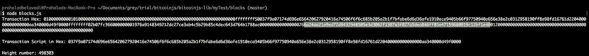
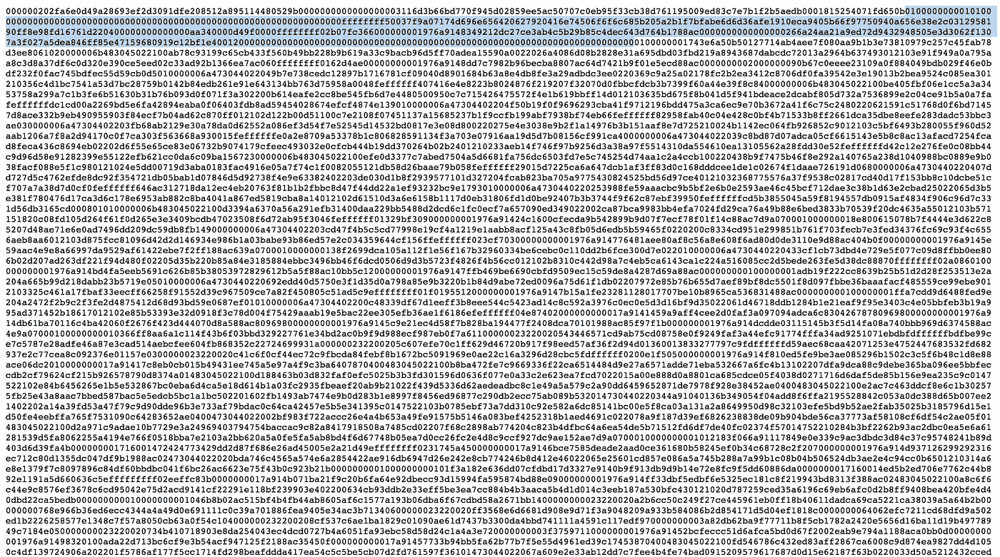
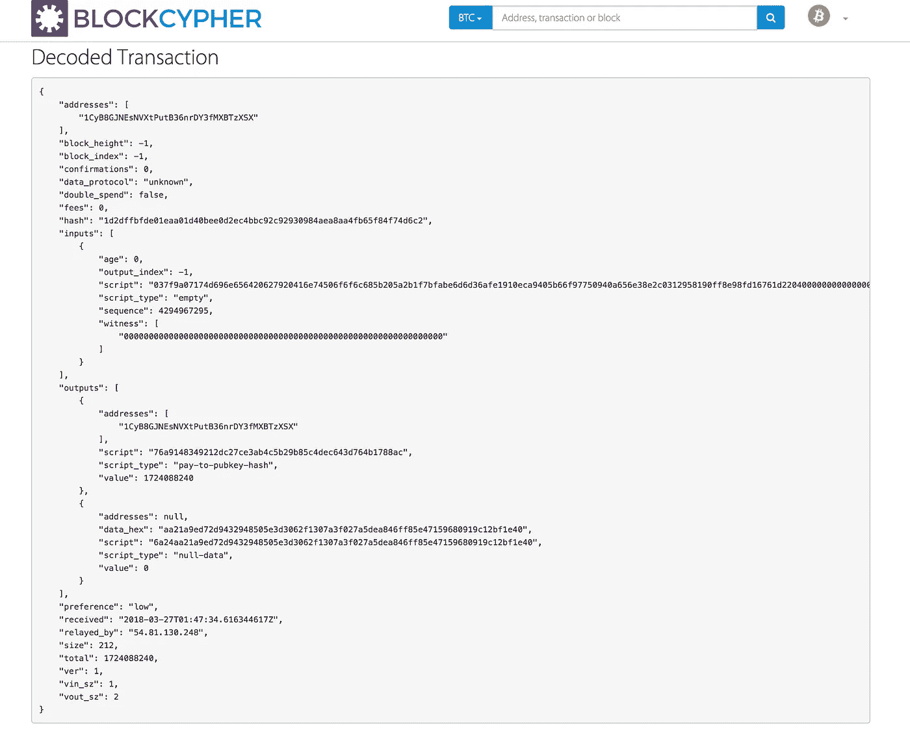
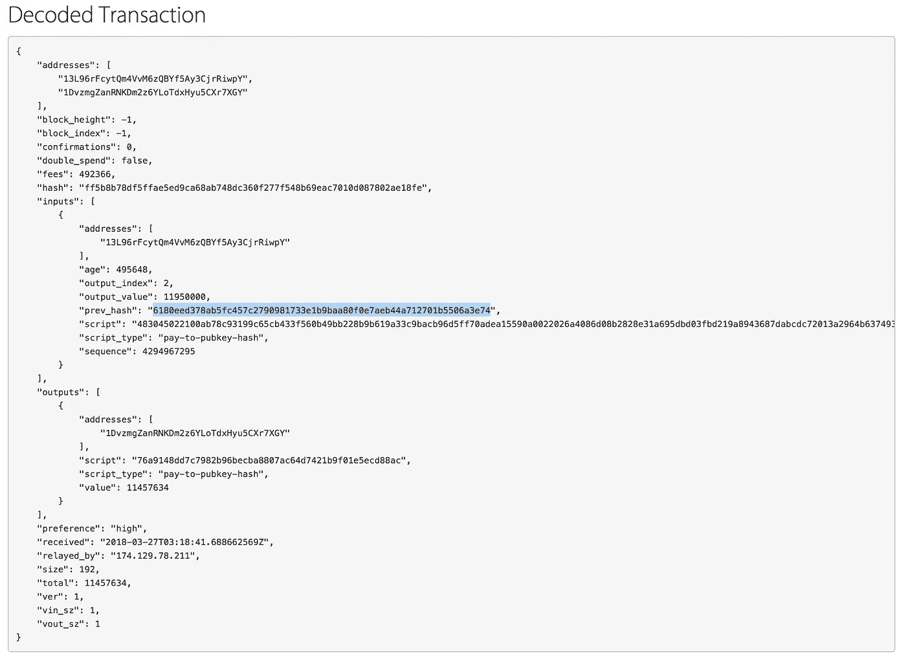
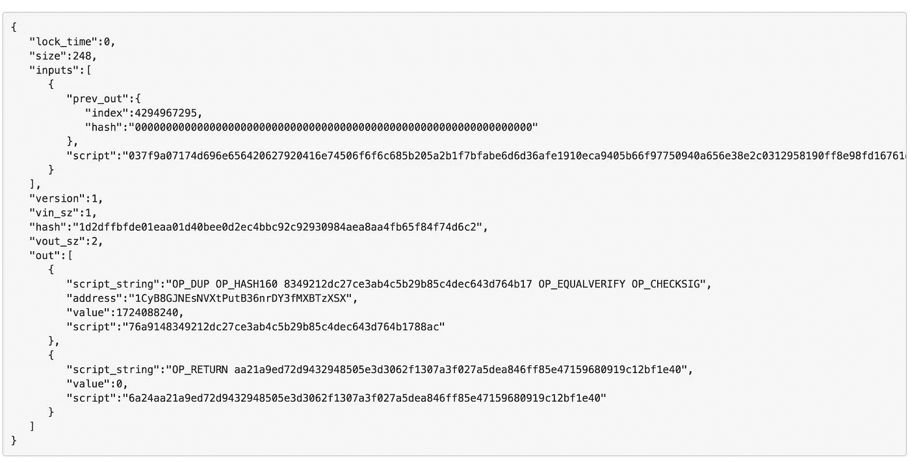

# 解构已确认的比特币交易

> 原文：<https://medium.com/hackernoon/deconstructing-a-confirmed-bitcoin-transaction-12fe84169100>

本文讨论了比特币交易的内容。我可能不完全正确，但这是基于对 bitcoinjs 库的修补。如果我错了，请随时纠正我。

我用于测试的存储库在这里[可用。如果你正在尝试这篇文章中的东西，请使用这个版本。](https://github.com/prahaladbelavadi/bitcoin-js-testing/tree/master/myTest)

我只是记录下一些我认为可以解释这个系统如何运作的东西。与实际的 [bitcoinjs-lib](https://github.com/bitcoinjs/bitcoinjs-lib/) 没有太大的区别，但是对于所有生产案例，使用 [bitcoinjs-lib repo](https://github.com/bitcoinjs/bitcoinjs-lib/releases) 并且也只有[稳定版本](https://github.com/bitcoinjs/bitcoinjs-lib/releases)，因为主分支用于开发。

Blockchain.info 的 mempool 中可用的未确认交易的列表可以在这里查看[。每秒钟都有更新和更多的事务添加进来。](https://blockchain.info/unconfirmed-transactions)

为了本文的所有目的，除非另有说明，我们将检查[该交易](https://blockchain.info/tx/1d2dffbfde01eaa01d40bee0d2ec4bbc92c92930984aea8aa4fb65f84f74d6c2)。

本文的目的是向您介绍验证块中事务的存在、事务的内容，然后创建一个类似的事务的过程。

先决条件:

*   安装 [Nodejs](https://nodejs.org/en/download/) 、 [Git Bash](https://git-scm.com/downloads) 和任何文本编辑器( [Atom](http://atom.io/) )
*   克隆此存储库
*   更改目录并安装软件包

```
$ git clone github.com/prahaladbelavadi/bitcoin-js-testing
$ cd ./bitcoin-js-testing
$ npm install
```

*   在此导航到 blocks 目录，并运行以下命令

```
$ cd ./myTest/blocks
$ node blocks.js
```

它以十六进制格式记录事务、输入脚本和块的高度。未确认的交易没有块高度，因为它们还没有包括在块中。



在块 [498303](https://blockchain.info/block-height/498303) 的十六进制格式中，我们可以确认交易存在。



Block [498303](https://blockchain.info/block-height/498303) in Hex

我们将剖析这笔交易。

```
Transaction Hex: 010000000001010000000000000000000000000000000000000000000000000000000000000000ffffffff50037f9a07174d696e656420627920416e74506f6f6c685b205a2b1f7bfabe6d6d36afe1910eca9405b66f97750940a656e38e2c0312958190ff8e98fd16761d220400000000000000aa340000d49f0000ffffffff02b07fc366000000001976a9148349212dc27ce3ab4c5b29b85c4dec643d764b1788ac0000000000000000266a24aa21a9ed72d9432948505e3d3062f1307a3f027a5dea846ff85e47159680919c12bf1e400120000000000000000000000000000000000000000000000000000000000000000000000000
```

我们将使用[密码器](https://live.blockcypher.com/btc/decodetx/)对交易进行解码。

将交易十六进制数粘贴到解码器中。



Coinbase Transaction decoder

事务解码器显示，转发到网络的事务十六进制包含以下内容:

*   十六进制交易输入脚本
*   输出地址
*   输出脚本和类型

PS:这不包含输入地址，因为它是一个 coinbase 事务。

如果我们从块 [498303](https://blockchain.info/block-index/1649492) 中查看[这个](https://live.blockcypher.com/btc/tx/ff5b8b78df5ffae5ed9ca68ab748dc360f277f548b69eac7010d087802ae18fe/)解码的[事务](https://live.blockcypher.com/btc/tx/ff5b8b78df5ffae5ed9ca68ab748dc360f277f548b69eac7010d087802ae18fe/)



Valid spend transaction decoded

我们可以看到它有一个先前的输入地址，链接到区块链上先前记录的事务的事务散列。

每个输出需要有一个相应的输入及其签名，以证明它确实可以花费比特币，除非它是一个 coinbase 交易。

每个资源管理器基于它们的本地节点或它们选择跟踪的任何内容，以自己不同的方式显示和跟踪指标。



Random bitcoin transaction decoded on blockchain.info decoder

我们可以在 [blockchain.info](https://blockchain.info/decode-tx) 的[解码器](https://blockchain.info/decode-tx)中观察到，它也显示了对其执行的不同操作。

在接下来的文章中，我打算展示如何编写自己的事务并将其转发给网络。

由于我将不断地在 bitcoinjs 测试存储库的分支上尝试新的东西，这可能会与您的实验冲突，所以我为本文的唯一目的打包了一个版本。

此处[可用](https://github.com/prahaladbelavadi/bitcoin-js-testing/releases/tag/0.01)。它应该包含发布本文时的代码。

请随意使用它，尝试新的东西。

参考资料:

*   [https://github . com/prahaladbelavadi/bit coin-js-testing/releases/tag/0.01](https://github.com/prahaladbelavadi/bitcoin-js-testing/releases/tag/0.01)

干杯！