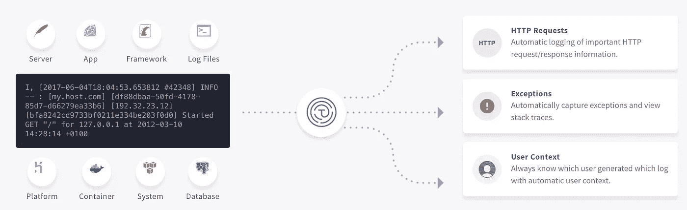

# Python 中的装饰者:你需要知道的

> 原文：<https://medium.com/hackernoon/decorators-in-python-what-you-need-to-know-72c81cc65c94>

装饰器是一个强大的概念，它允许你用另一个函数“包装”一个函数。

装饰器的想法是除了它的正常职责之外，抽象出你希望一个函数或类做的事情。这有助于很多原因，比如代码重用，以及遵守 [curlys 定律](https://blog.codinghorror.com/curlys-law-do-one-thing/)。

通过学习如何编写自己的装饰器，您可以显著提高自己代码的可读性。他们可以改变函数的行为，而不需要实际改变代码(比如添加日志行)。它们是 python 中相当常见的[工具](https://hackernoon.com/tagged/tool)，使用 flask 或 click 等框架的人都很熟悉，但许多人只知道如何使用它们，不知道如何编写自己的框架。

*这是你的朋友@ Timber 给你带来的一篇客帖。如果你有兴趣为我们写作，请随时在 Twitter 上联系*[](https://twitter.com/timberdotio)**。**

*首先，让我们展示一个 python 中装饰器的例子。下面是一个非常基本的例子，说明如果你使用它，装饰者会喜欢什么。*

```
*1 2 3 @my_decorator def hello(): print('hello')*
```

**当你在 python 中定义一个函数时，这个函数就变成了一个对象。**

*上面的函数`hello`是一个函数对象。`@my_decorator`实际上是一个函数，它能够使用`hello`对象，并将一个不同的对象返回给解释器。装饰器返回的对象就是所谓的`hello`。从本质上讲，这就好像你要编写自己的普通函数一样，比如:`hello = decorate(hello)`。Decorate 被传递给这个函数——它可以任意使用它——然后返回另一个对象。装饰者有能力吞下函数，或者返回不是函数的东西，如果它愿意的话。*

*如前所述，装饰器只是一个被传递函数的函数，并返回一个对象。因此，要开始编写装饰器，我们只需要定义一个函数。*

```
*1 2 def my_decorator(f): return 5*
```

*任何函数都可以用作装饰器。在这个例子中，装饰器被传递一个函数，并返回一个不同的对象。它简单地完全接受给它的函数，并且总是返回 5。*

```
*1 2 3 @my_decorator def hello(): print('hello')1 2 3 4 5 >>> hello() Traceback (most recent call last): File "<stdin>", line 1, in <module> TypeError: 'int' object is not callable 'int' object is not callable*
```

*因为我们的装饰器返回的是一个 int，而不是一个`callable`，所以它不能作为一个函数被调用。记住，decorator 的返回值*替换* `hello`。*

```
*1 2 >>> hello 5*
```

*在大多数情况下，我们希望装饰器返回的对象实际上模仿我们装饰的函数。*这意味着装饰器返回的对象需要是一个函数本身*。例如，假设我们想在每次调用函数时简单地打印，我们可以编写一个函数来打印这些信息，然后调用这个函数。但是这个函数需要由装饰器返回。这通常会导致函数嵌套，例如:*

```
*1 2 3 4 5 def mydecorator(f): # f is the function passed to us from python def log_f_as_called(): print(f'{f} was called.') f() return log_f_as_called*
```

*正如你所看到的，我们有一个嵌套的函数定义，装饰函数返回那个函数。这样，函数`hello`仍然可以像标准函数一样被调用，调用者不需要知道它被修饰了。我们现在可以将`hello`定义如下:*

```
*1 2 3 @mydecorator def hello(): print('hello')*
```

*我们得到以下输出:*

```
*1 2 3 >>> hello() <function hello at 0x7f27738d7510> was called. hello*
```

**(注:* `*<function hello at 0x7f27738d7510>*` *引用里面的数字会因人而异，它代表的是内存地址)**

*如果需要，一个函数可以被修饰多次。在这种情况下，装饰者会引起连锁反应。本质上，top decorator 从前者传递对象，以此类推。例如，如果我们有以下代码:*

```
*1 2 3 4 5 @a @b @c def hello(): print('hello')*
```

*解释器本质上是在做`hello = a(b(c(hello)))`，所有的装饰器会互相包装。您可以通过使用我们现有的装饰器，并使用它两次来亲自测试这一点。*

```
*1 2 3 4 5 6 7 8 9 @mydecorator @mydecorator def hello(): print('hello') >>> hello() <function mydec.<locals>.a at 0x7f277383d378> was called. <function hello at 0x7f2772f78ae8> was called. hello*
```

*你会注意到第一个装饰者包装了第二个装饰者，并单独印刷了它。*

*您可能已经注意到了一件有趣的事情，那就是打印的第一行显示的是`<function mydec.<locals>.a at 0x7f277383d378>`，而不是第二行显示的内容，也就是您所期望的:`<function hello at 0x7f2772f78ae8>`。这是因为装饰器返回的对象是一个新函数，不叫`hello`。这对于我们的小例子来说没什么问题，但是经常会破坏测试和试图自省函数属性的东西。如果装饰者的想法是像它所装饰的功能那样行动，它也需要模仿那个功能。幸运的是，在 functools 模块中有一个名为`wraps`的 python 标准库装饰器。*

```
*1 2 3 4 5 6 7 8 9 10 11 12 13 14 15 16 17 import functools def mydecorator(f):  @functools.wraps(f) # we tell wraps that the function we are wrapping is f def log_f_as_called(): print(f'{f} was called.') f() return log_f_as_called @mydecorator @mydecorator def hello(): print('hello') >>> hello() <function hello at 0x7f27737c7950> was called. <function hello at 0x7f27737c7f28> was called. hello*
```

*现在，我们的新功能看起来就像它的包装/装饰一样。然而，我们仍然依赖于它不返回任何内容，也不接受任何输入的事实。如果我们想让它更通用，我们需要传入参数并返回相同的值。我们可以修改我们的函数，如下所示:*

```
*1 2 3 4 5 6 7 8 9 import functools def mydecorator(f):  @functools.wraps(f) # wraps is a decorator that tells our function to act like f def log_f_as_called(*args, **kwargs): print(f'{f} was called with arguments={args} and kwargs={kwargs}') value = f(*args, **kwargs) print(f'{f} return value {value}') return value return log_f_as_called*
```

*现在我们在每次调用函数时打印，包括函数接收的所有输入，以及它返回的内容。现在，您可以简单地修饰任何现有的函数，并对其所有输入和输出进行调试日志记录，而无需手动编写日志记录代码。*

*如果您正在为您想要发布的任何代码使用装饰器，而不仅仅是为您自己，您可能想要用日志记录语句替换所有的`print`语句。在这种情况下，您需要定义一个日志级别。假设您总是想要调试日志级别可能是安全的，但是这也可能取决于函数。我们可以向装饰器本身提供变量，以定义它应该如何表现。例如:*

```
*1 2 3 @debug(level='info') def hello(): print('hello')*
```

*上面的代码允许我们指定这个特定的函数应该在信息级别而不是调试级别记录。在 python 中，这是通过编写一个返回装饰器的函数来实现的。是的，装饰者也是一个功能。所以这本质上是在说`hello = debug('info')(hello)`。这个双括号可能看起来很奇怪，但是基本上，debug 是 function，它返回一个函数。将它添加到我们现有的装饰器中，我们将需要再嵌套一次，现在使我们的代码如下所示:*

```
*1 2 3 4 5 6 7 8 9 10 11 import functools def debug(level): def mydecorator(f) @functools.wraps(f) def log_f_as_called(*args, **kwargs): logger.log(level, f'{f} was called with arguments={args} and kwargs={kwargs}') value = f(*args, **kwargs) logger.log(level, f'{f} return value {value}') return value return log_f_as_called return mydecorator*
```

*上面的更改将`debug`变成了一个函数，它返回一个使用正确日志级别的装饰器。这开始变得有点难看，而且嵌套过多。我喜欢用一个很酷的小技巧来解决这个问题，就是简单地给`debug`添加一个默认的 kwarg `level`并返回一个[部分](https://docs.python.org/2/library/functools.html#functools.partial)。partial 是一个“不完整的函数调用”,包括一个函数和一些参数，因此它们作为一个对象传递，而不实际调用函数。*

```
*1 2 3 4 5 6 7 8 9 10 11 import functools def debug(f=None, *, level='debug'): if f is None: return functools.partial(debug, level=level)  @functools.wraps(f) # we tell wraps that the function we are wrapping is f def log_f_as_called(*args, **kwargs): logger.log(level, f'{f} was called with arguments={args} and kwargs={kwargs}') value = f(*args, **kwargs) logger.log(level, f'{f} return value {value}') return value return log_f_as_called*
```

*现在装饰者可以正常工作了:*

```
*1 2 3 @debug def hello(): print('hello')*
```

*并使用调试日志记录。或者，您可以覆盖日志级别:*

```
*1 2 3 @debug('warning') def hello(): print('hello')*
```

*将日志写入托管日志聚合服务使您的生活更加轻松，因此您可以专注于构建更好的软件，而不是调试。*

*声明:我是@ Timber 的现任员工。这一部分完全是可选的，但是我真诚地相信，登录到云会让您的生活更加轻松(并且您可以完全免费地尝试)。*

```
*1 pip install timber1 2 3 4 5 6 7 import logging import timber logger = logging.getLogger(__name__) timber_handler = timber.TimberHandler(api_key='...') logger.addHandler(timber_handler)*
```

*就是这样。你所需要做的就是从 timber.io 中获取你的 API 密匙，然后你就可以看到你的日志了。我们从日志模块中自动捕获它们(并无缝地添加上下文)，因此您可以继续正常地进行日志记录。*

**

**原载于*[*timber . io*](https://timber.io/blog/decorators-in-python/)*。**