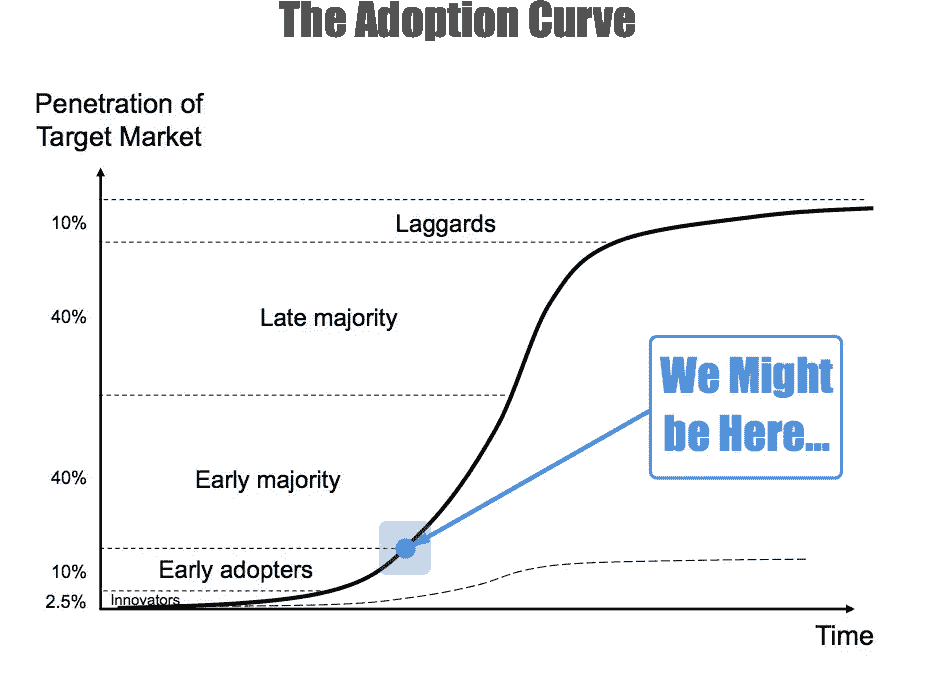

# 解密加密挥发性

> 原文：<https://medium.com/hackernoon/decrypting-crypto-volatility-94e8af100503>

Photo by [Chris Liverani](https://unsplash.com/photos/NDfqqq_7QWM?utm_source=unsplash&utm_medium=referral&utm_content=creditCopyText)

了解加密市场的短期活动相当于试图理解混沌理论。尽管试图理解是什么导致加密资产经历日内波动可能是徒劳的，但宏观波动周期更容易预测。不足为奇的是，当市场崩盘时，人们倾向于问一些难以回答的问题，而当市场上涨时，人们就不那么想了。

大多数加密投资者都充分意识到加密是一种不稳定的资产，虽然难以承受，但这些投资者对各自所持股份 10-30%的波动相对不敏感。但一旦这一负面数字增加到 40%—80 %,即使是最虔诚的密码传播者也会挠头质疑现实。

## 大崩盘

在刚刚过去的 2017 年 12 月，我们看到[比特币](https://hackernoon.com/tagged/bitcoin)在 50 天内从 19783 美元的历史高点飙升至 6953 美元。这是一个惊人的损失，在这段相对时间内，其价值的 65%。相应地，整个加密市场的资本总额从 8130 亿美元的历史高点下降到大约 3320 亿美元，代表整个市场价值损失了大约 60%。简而言之，这些都是名义价值的重大损失。目前我们坐拥 4500 多亿美元。

虽然加入[亚历克斯·米勒](https://www.youtube.com/channel/UCP2VGrRLI8IFL2KHgSezBSg)的 YouTube 视频[可能有点滑稽，但不要买比特币。它要坠毁了！！！在这里，他简洁地描述了围绕比特币涨跌的轰动效应。提醒你一下，这是他在 2015 年发布的。](https://www.youtube.com/watch?v=XbZ8zDpX2Mg)

## 比特币市场主导地位

除了比特币的个别价格行为，故事的一个重要部分是比特币的整体市场主导地位。从历史上看，它在很大程度上一直是所有加密技术的始祖，但它对市场的控制正在发生变化吗？截至 2017 年 1 月，比特币保持着略高于 85%的市场主导地位。从那以后，它的市场主导地位直线下降，即使在今天也只占整个加密市场的不到 40%，这与下图中 2017 年 7 月的情况一致。

值得注意的是，从 2017 年 7 月到现在的 2018 年 2 月，比特币对整体市场保持着很高的吸引力。这方面的一个指标是，即使初始硬币发行(ICO)市场持续增长，每周吸收越来越多的加密资金，比特币仍设法稳定在 40%的水平。

有很多假设的原因可以说明这一点，但如果其他所有因素保持不变，加密货币涌入 ICO 令牌通常会对比特币的市场主导地位产生进一步的稀释效应，即使在 2017 年底/2018 年初的大崩盘之后也没有出现这种情况。

## 心理部分

市场往往是理性的非理性的。下图的市场周期心理学提醒我们，我们是情绪化的生物，我们在财务收益和损失后的决策始终反映了这一点。

价格变动、分析、定性输入，甚至是在这个全球市场上执行交易的算法，其执行过程背后都有人(*直到强人工智能*的出现)。市场周期图显示了市场活动的微观和宏观周期，因为总参与者一次又一次地意识到他们自己与价格行为的关系。

你可以试着看看这张图表，试着找出我们所处的位置。挑战在于，我们可能同时处于曲线上的多个位置，尤其是在考虑单个资产、[区块链](https://hackernoon.com/tagged/blockchain)垂直市场、整个加密市场以及整体宏观经济状况时。我可以肯定的是，随着加密成为一个 24 小时全球市场，微观周期往往会发生得非常快。当我们相信我们已经完全结束了这个循环的时候，就会有一些事情发生，触发它重复自己。

By [https://www.cheatsheet.com/](https://www.cheatsheet.com/)

**发现我们自己处于采纳曲线上**

接下来，定位我们自己在采纳曲线上是另一个有趣的练习。根据下图，采用通常分阶段进行。*创新者*和*早期采用者*参与进来。紧随其后的是*早期多数*和*晚期多数*。就在市场接受率达到峰值时，落后者开始发挥作用，即最后 10%的市场参与者。

受制于哲学和意识形态的辩论，很少能够与那些想要引用轶事证据来说明他们对采用曲线的看法的人进行逻辑讨论。他们声称当他们的母亲、祖父母、优步司机等..都在谈论密码，派对结束了！如果他们是正确的，我们很可能处于采纳曲线的后期阶段。嗯，今天晚上我从纽约布鲁克林的一个加密会议乘车回家，我的优步司机在一次关于莱特币的谈话中坚持自己的观点。他肯定知道最近的价格变动。现在，请允许我告诉你为什么我们可能仍然处于 S 曲线的早期采用者和早期多数阶段。

让我们考虑一下真正的加密采用是什么样子的。估计密码持有者的总数是一项困难的任务。不过，我们确实有一些数据。2017 年 11 月底，就在 3 个月前，[比特币基地报告拥有超过 1300 万个客户账户](https://futurism.com/coinbase-users-surpasses-charles-schwab-brokerage-accounts/)，这一数字超过了查尔斯·施瓦布账户持有人的总数。总部位于香港的币安是世界上最大的加密货币交易所，据报道[在短短一个小时内就有 24 万人注册，几个月前还有数百万人注册](http://www.independent.co.uk/news/business/news/binance-bitcoin-latest-cryptocurrency-exchange-trading-users-increase-numbers-hong-kong-a8153496.html)。现在，即使我们在这里扩大一些估计，我认为我们很难说全球密码持有者的数量大大超过 3000 万，即使是这样。

世界人口约为 76 亿，截至 2015 年，盖洛普报告称，62%的世界人口通过正规金融机构或移动设备拥有银行账户。根据这些数字，这将表明全球有 47 亿人拥有银行账户。这暗示 0.64%的银行全球人口是密码持有者。我认为这个数字很难让我们越过采用曲线的早期多数(T4)部分(T5)。

**新散户的影响**

现在我们必须考虑估计的 0.64%的影响。虽然我们很想吹捧最近大量采用加密的力量，但我认为他们在短期内的采用并不像每个人认为的那样重要。

假设账户持有人平均存款 5000 美元，我们每周新增 100 万人。我们基本上每 7 天就会向加密市场增加 50 亿美元的法定资本。理论上，考虑到目前的市值约为 4500 亿美元，这听起来是一个相当大的数字。但即使这是真的，它也没有考虑从系统中抽走的资金和快速资产抛售的影响。

Photo by [Cory Schadt](https://unsplash.com/photos/Hhcn6yy3Uo8?utm_source=unsplash&utm_medium=referral&utm_content=creditCopyText)

我的直觉告诉我，账户持有人的平均存款远低于 5000 美元，尽管主流交易所正在宣传用户大量增长，但许多散户投资者正在多个交易所开设账户。在这种情况下，我们有很多重叠的加密用户群体，很难列表。

**寻找机构资金**

Photo1 by [Hunters Race](https://unsplash.com/photos/MYbhN8KaaEc?utm_source=unsplash&utm_medium=referral&utm_content=creditCopyText) & Photo2 by [Benjamin Child](https://unsplash.com/photos/GWe0dlVD9e0?utm_source=unsplash&utm_medium=referral&utm_content=creditCopyText)

加密市场迫不及待地想要为机构资金进入加密市场开绿灯。这与空间是如此相关，以至于纯粹的推测发生在大规模发生的可能性上。总的来说，公司有数十亿美元可以投资。如果一个强大的公司集团开始将资本投入到加密领域，很可能会产生多米诺骨牌效应，推高资产价格。

虽然我们可以调查单个公司的资产负债表并绘制图表，但有许多公司的资产负债表上有大量现金或现金等价物的例子。例如，在最近特朗普公司减税之后，这些公司有了更多的现金。下面的文章[减税记分牌:工人 60 亿美元；股东 1710 亿美元](http://money.cnn.com/2018/02/16/investing/stock-buybacks-tax-law-bonuses/index.html)表明公司正在寻求用可获得的现金回购公司股票，这通常会让股东受益。此外，随着促进海外资金回流的努力，据估计，当这些资金回流时，还将有 4500 亿美元用于股票回购。如果这些资本中只有一小部分用于加密资产，甚至作为对冲，会怎么样？这可能会有很大的不同。

但我不会对机构收养过于兴奋，至少一开始不会。健康的场外交易市场和暗池交易活动一直在秘密发展。本质上，这些是点对点或准点对点交易。在场外交易和暗池的情况下，它们可以被认为是在交易所订单簿之外进行交易的总订单流。

也就是说，这些交易倾向于转移底层加密资产的所有权，而不产生价格行为。如果你是一个机构玩家，想要获得大量的密码，你可能会通过无数的渠道来获得和出售你的股份，以尽量减少你对价格的影响。无论如何，机构资本的参与是主流加密技术采用的关键部分，并将内在地推高资产估值。

## 媒体狂热

媒体已经为区块链和 crypto 疯狂了。区块链具有迷惑性、颠覆性、优雅性，让很多人变得富有。它神秘的起源源于中本聪和比特币的故事。它的后续发展与黑暗网络有联系，也是最早的著名非法市场之一，名为丝绸之路。加密货币的采用威胁到货币的建立以及我们所知的管理货币的系统。从叙事的角度来看，有什么不喜欢的呢？

虽然大多数人不能说出美国前 10 任总统的名字，更不用说解释工作证明(PoW)和利益证明(PoS)区块链共识算法之间的区别，但有很多空间可以满足人类情感的诉求。媒体非常非常擅长这个！

无论是摩根大通(JPMorgan Chase)首席执行官杰米·戴蒙德(Jamie Diamond)、伯克希尔·哈撒韦(Berkshire Hathaway)首席执行官沃伦·巴菲特(Warren Buffet)、国际货币基金组织(IMF)总裁克里斯蒂娜·拉加德(Christine Lagarde)，还是许多其他金融公众人物，不对数字资产发表意见已成为禁忌。甚至贝莱德的全球首席投资策略师 [Richard Turnell](https://www.blackrock.com/investing/biographies/richard-turnill) 也在 2018 年 2 月 27 日公开表示，“我们认为随着市场的成熟，加密货币**在未来** **可能会得到更广泛的使用。然而，目前我们认为，只有那些能够承受潜在的全面亏损的人，才应该考虑购买。”对于一家管理着 6.28 万亿美元资产的公司来说，这些可不是小数目…**

主流和替代媒体以及市场影响者对加密市场的大肆宣传和恐惧是巨大的，并迎合了加密持有者日常生活中的高波动性。

## 比特币期货+后续加密衍生品

加密衍生品的出现还处于早期阶段，但它为散户和机构参与者创造了一个现金结算渠道，让他们可以在不实际持有任何基础加密资产的情况下获得加密资产。虽然期货、期权和其他衍生品主要是代表比特币市场创造的，但其他密码被捆绑到衍生工具中，为潜在的非密码持有者提供更广泛的密码市场敞口只是时间问题。

就个人而言，我对这些衍生品的真实市场影响感到矛盾。虽然交易衍生品有很多原因，但其中一个原因是参与者可能希望用这些加密衍生品对冲他们的加密头寸，甚至是他们的传统投资组合。

从阴谋论者的角度来看，我愿意相信一些真正聪明的非法行为者正在寻找方法，以符合他们利益的方式获得比特币衍生品合约，并寻求推动价格上涨或下跌的方法，使他们的合约更有价值，并使这一运动与他们的合约到期时间保持一致。虽然这种行为可能是欺诈和非法的，但这并非不可能。

值得注意的是，迄今为止还没有任何加密交易所交易基金(ETF)获得批准。这很重要，因为如果 ETF 真的获得批准，可能会要求积累加密数据，作为这些基金的基础(如果它们的计划不是合成工具，意味着它们背后没有基础资产)

一般来说(除了 ETF 市场)，我认为目前的加密衍生品在加密市场上是中性的。参与者不想保管密码，也不想应对在密码交易所与他们进行交易的挑战，但他们对交易这些资产的优势和劣势感兴趣。通过参与衍生品领域，它们不会直接影响加密交易指令簿的价格行为，因此我认为它们对整个市场的影响在实践中相当微不足道。

**鲸鱼**

鲸鱼是秘密中一个有趣的群体。他们是高净值持有者，有能力推动市场。和任何市场参与者一样，他们会受到市场波动的心理影响。虽然很难确定鲸鱼个人或团体的兴趣是什么，但我相信它们的活动有一些共同的主题。它们如下:

*   他们通常希望保持匿名
*   他们想保护他们的财富
*   他们正在寻找风险最小、回报高的投资机会
*   他们希望最大限度地减少和/或完全避免税务负担(除非绝对必要，否则可能涉及最大限度地减少向菲亚特的转换)
*   他们一直担心物理和计算机安全

也就是说，鲸鱼很可能认识其他鲸鱼，它们可能参与同义的市场活动。由于其他市场参与者捕捉现场鲸鱼活动，他们可能会采取行动，以互利的方式跟进鲸鱼活动。

## Bot 交易

正如传统金融市场一样，自动化市场参与者——机器人——的数量也在不断增加。这些机器人是计算机生成的交易应用程序，在实时市场上实时运行，通常使用算法软件执行交易。很难说有多少加密交易量是在自动 bot 交易上运行的，但如果我们看一些数字，就有可能考虑高水平的估计。

今天的市场交易量名义价值约为 190 亿美元。如果我们假设只有 1500 万参与者(之前估计的 3000 万的一半)实际上在交易他们的投资组合，而这个数字中只有一半在积极地交易他们的投资组合，那么剩下大约 750 万参与者。

Photo by [Carl Raw](https://unsplash.com/photos/o59Gt5O4QZ4?utm_source=unsplash&utm_medium=referral&utm_content=creditCopyText)

让我们假设这 750 万人中的每一个都有 1 万美元的账户。这意味着他们持有的账户价值 750 亿美元。现在让我们假设在任何一天，他们的投资组合中只有 5%是活跃交易的。这是假设每天只有 37.5 亿美元的散户投资者资金在交易。

所以接下来的问题是——“剩下的 152.5 亿美元的交易量从哪里来？”虽然答案包括通用加密基金和 Whales 等参与者，但其中一部分肯定要归功于机器人。如果你想进一步了解机器人，可以看看 [Gekko](https://gekko.wizb.it/) 、 [ZenBot](https://github.com/DeviaVir/zenbot) 、 [CryptoTrader](https://cryptotrader.org/) 或 [Haasbot](https://www.haasonline.com/) 。

## 基金

基金类别是另一个有趣的类别。基金的范围可以从家族理财室、传统对冲基金、风险投资基金、新成立的加密对冲基金、现实世界的投资银行到非正式的加密辛迪加。当然也可能有其他玩家，但我想把重点放在那些可能持续产生交易量的玩家身上。虽然没有明确的答案，但要问的一个关键问题是，基金对加密有什么兴趣？

一些选项包括传统的买入和持有、对火爆市场的预期积累、活跃交易、头寸对冲、一般多样化和敞口。这样的例子不胜枚举，但值得注意的是，总的来说，他们在 crypto 的整体波动性中扮演了一个角色，因为他们比散户投资者的移动量更大。

## 市场操纵者

市场操纵者和一般的不良行为者是存在的，而且很可能永远存在。例如，巴克莱仍在应对外汇市场操纵的后果。值得注意的是，另一名交易员——前纽约外汇交易主管面临指控，导致该公司面临 100 亿美元的罚款。

Photo by [Jaanus Jagomägi](https://unsplash.com/photos/zEpAZCWzGhg?utm_source=unsplash&utm_medium=referral&utm_content=creditCopyText)

巴克莱拥有超过 1 万亿美元的资产，是世界上最大的银行之一。如果有市场操纵活动可以发生在一个著名的品牌公司，我们真的如此天真地认为泵和转储，画磁带，订单欺骗不是在一个全球化的，分散的，24/7 的环境中进行的，这在很大程度上是不受监管的吗？

加密市场可能经历的最大潜在丑闻和操纵威胁之一是与 Bitfinex 和 Tether 相关的。我鼓励你自己做研究，而不是散布流言蜚语。这里有一份名为[的相关报告，量化了系绳](http://www.tetherreport.com/)的影响。我不能保证这份报告的准确性，但我至少想强调它有可能是真的。

我之前问题的答案是，“**是的**市场操纵正在进行，”但程度如何？特定的资产类别和代币在多大程度上容易受到这些方案的影响？

## **圣杯——稳定的硬币和资产支持代币**

加密市场急需稳定的硬币和资产支持的代币(除了 Tether)。有人称稳定的硬币是加密市场的圣杯。虽然资产支持的金融工具对金融界来说并不新鲜，但对加密市场来说却是新奇的。在我的公司 Vermundi，我们正在努力部署稳定的硬币和资产支持令牌系统。更多详情敬请期待！

Photo by [Stephen Radford](https://unsplash.com/photos/86QxYjwq8LU?utm_source=unsplash&utm_medium=referral&utm_content=creditCopyText)

正在进行的项目有很多——[base coin](http://www.getbasecoin.com/)、 [MakerDAO](https://makerdao.com/) 等等。他们在很大程度上仍处于起步阶段。在许多情况下，资产支持代币也是如此，但我的预测是，在我们看到真正成功的稳定硬币形成规模之前，我们将看到更多的资产支持代币被部署。

稳定硬币和资产支持硬币都需要至少证明是可靠的——1)*价格稳定性*、 *2)可扩展性*和 *3)弹性*。有些人会主张*隐私*和*去中心化*，虽然这些都是不错的附加功能，但我们需要稳定的硬币选项可供市场使用，以便在 cryptoverse 中有安全的资产可用。这种仪器从生态系统中消失是一个巨大的危险信号！Multicoin Capital 撰写的这篇文章《Stablecoins 概述》是我在这个话题上看到的最好的文章之一。

## 规章制度

来拯救世界的是监管！一些措施已经出台，但这些法律的影响将与每个主权管辖区的政策和执法结构密切相关。现在，每个国家，无论是中国、美国还是其他国家，都可能会以不同的身份严厉打击加密，但也有非常聪明和坚定的人会不断寻找规避规则和/或法律的方法。如果这些规则会阻止他们采取他们想采取的行动——转移资金或从事各种类型的交易，我会更有理由这样认为。

Photo by [Claire Anderson](https://unsplash.com/photos/Vq__yk6faOI?utm_source=unsplash&utm_medium=referral&utm_content=creditCopyText)

目前，加密还是蛮荒的西部，监管将在未来扮演重要角色。我个人的观点是，监管将对金融体系造成更多短期波动冲击，并将加大稳定市场的力度。

事实上，如果监管能够介入，并有效地对资本流动实施强有力的控制，我相信，我们更有可能看到更多的机构活动、养老基金、主权财富基金和其它机构跳入加密领域。有趣的是，一些机构投资者现在可能正在试水，但我相信当绿灯亮起时，将会出现一个指数级的转折点。我们会去抛物线。

## ICO 效应

首次发行硬币(ico)对密码市场有多重影响。这里有几个我想强调的。

*促进作为投资媒介的加密技术的积累*。一方面，他们提倡采用加密技术，因为在许多情况下，为了投资投机性 ICO，你必须使用加密技术。我相信这种情况会随着时间的推移而改变，但在这种情况大规模发生之前，持有 BTC、瑞士联邦理工学院、NEO 等知名加密公司可以让 ICO 投资者将加密资本部署到下一个新的激动人心的项目中。因此，ICO 市场创造了对大牌密码的需求。没有他们，你根本无法参与 ico。

*通过加密清算效应创造市场抛售*。如果你是一个性感的加密公司，刚刚完成你的 ICO，机会是你坐在价值数百万美元的加密。从这里开始的决策点是——你用你的加密资本做什么——清算为菲亚特，全部以加密方式持有，或者找到一些快乐的媒介？如果你是一家真实的公司，你需要支付员工、办公室、供应品、法律费用、税收以及经营企业所需的一切费用。在这种情况下，清算菲亚特成为一个更少的选项，更多的是一个要求。

Photo by [Sergey Pesterev](https://unsplash.com/photos/wZLsZ9DRLSI?utm_source=unsplash&utm_medium=referral&utm_content=creditCopyText)

假设，让我们说你的公司在 crypto 筹集了 3000 万美元。你将 2500 万美元兑换成美元，并在密码中保留 500 万美元。我现在要强调的是，价值 2500 万美元的 crypto 现在正被撤出市场，并被转换回菲亚特。如果这是一次性事件，那将是一件大事。但是现在有成百上千的 ICOs 还有更多正在筹备中。

这就形成了资金流入和资金流出生态系统的恶性循环。谁知道贸易平衡到底是什么样子，除非我们有来自所有交易所的综合数据，这些交易所正在处理加密到法定货币和法定货币到加密货币的交易，以及真实世界银行账户的实际流入和流出。这些信息根本就不存在。

*ICO 故障*。虽然一些 ICO 故障已经发生，但还会有更多的故障出现。这将导致大幅波动和抛售，导致许多 ICO/altcoin 持有者亏损。当这些发生时，我预计更大的市场冲击将接踵而至，影响的不仅仅是低价竞标。从众心理、媒体以及我们可以投入的其他一切因素的结合，将加剧这类市场活动的波动性。小心这个。

## 精明的投资

Photo by [Vitaly](https://unsplash.com/photos/OCrPJce6GPk?utm_source=unsplash&utm_medium=referral&utm_content=creditCopyText)

在整篇文章中，我们讨论了密码市场不稳定的无数原因。许多旁观者，甚至那些投资加密的人都在问——聪明的资金在做什么？虽然这个问题没有明确的答案，但一些选项包括:

1.  完全置身事外
2.  hold 买入并长期持有
3.  日间交易
4.  买蘸酱
5.  使不同
6.  我的给你最喜欢的密码
7.  设置主节点…
8.  以上的一些组合

…这个清单还在继续！

任何人都可以制定一个策略，但是所有成功的投资策略——它们总是有效，直到失效。我相信，作为一种资产类别，我们正处于加密的转折点。市场开始显示出复苏的迹象，机构资本正在想办法参与进来。我相信我们将很快看到更大市场的 1 万亿美元市值，但嘿，谁知道呢？

— — — —

*免责声明:这篇文章不是也不应该被认为是财务建议。大部分内容是我个人的专业意见和相关的预测。这篇文章是出于教育目的而写的，只是为了帮助你理解密码市场正在发生的事情。*