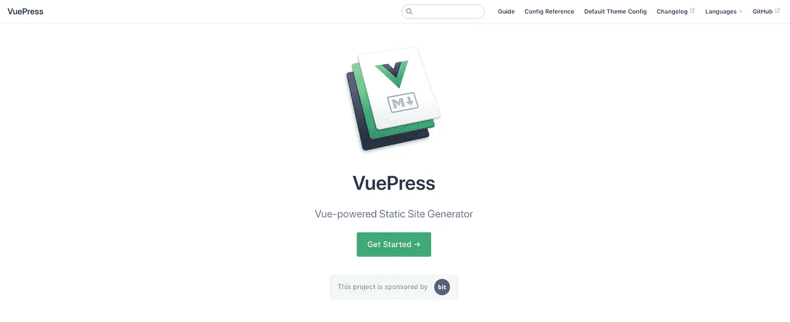
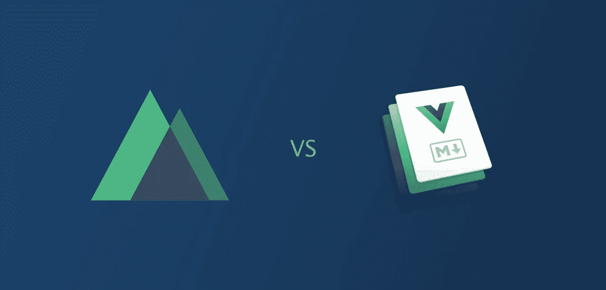
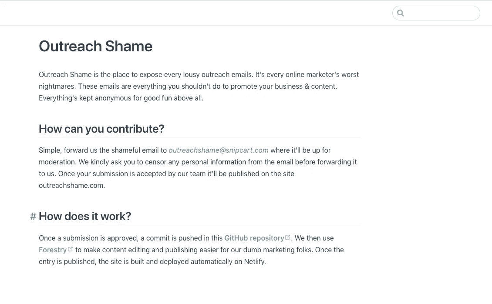
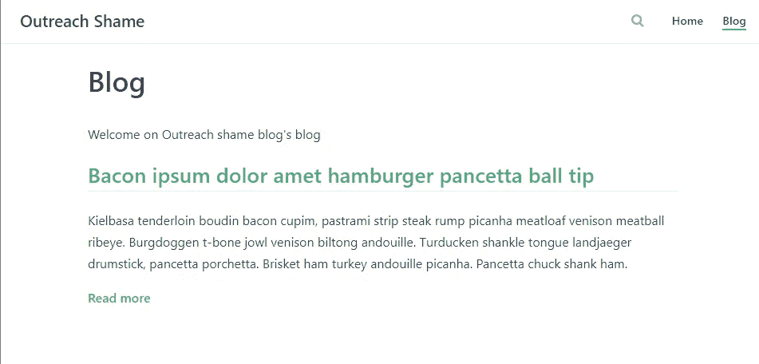
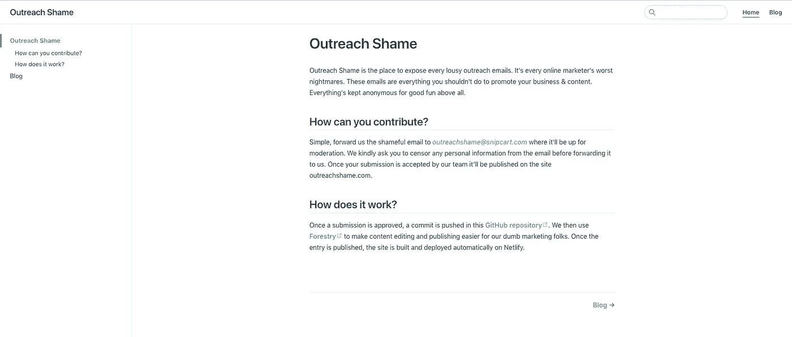

# 深入了解 VuePress:创建一个干净的文档和博客

> 原文：<https://medium.com/hackernoon/deep-dive-into-vuepress-craft-a-clean-documentation-blog-de6ac8e0c917>


Photo by [Daniel McCullough](https://unsplash.com/photos/-FPFq_trr2Y?utm_source=unsplash&utm_medium=referral&utm_content=creditCopyText) on [Unsplash](https://unsplash.com/search/photos/architect?utm_source=unsplash&utm_medium=referral&utm_content=creditCopyText)

有没有浏览过 Vue.js 文档？

任何熟悉它的人都会告诉你:

真是**宏伟**。

为了建造它， [Vue](https://snipcart.com/blog/vue-js-seo-prerender-example) 的创造者尤雨溪想出了 VuePress。

对于我们即将到来的副业项目，我们肯定想要一些博士的魔术。这篇文章描述了这一过程。

**你将了解什么是 VuePress，以及它的伟大之处。您将学习如何快速建立一个整洁的基于 Vue.js 的文档&博客。**

技术教程的步骤:

1.  安装 VuePress。
2.  生成文档内容。
3.  向 VuePress 添加博客。
4.  在导航中插入博客。

这既简单又直接——您很快就能完成。

# 我们 VuePress 项目的一点背景

我说的这个副业是什么？好吧，它始于任何博客编辑或网站管理员都非常熟悉的痛苦:

值得畏缩的外展邮件。

你知道那种赞扬你的博客内容并提供一些关于房地产的客座博文的电子邮件...在一个 WEB 开发平台上？！


C’mon man, try a little harder!

我们认为是时候让人们关注这种糟糕的营销技术了。为了做到这一点，我们建立了一个简单的 Hugo 静态网站，任何人都可以在这里匿名发布有趣的例子，告诉他们如何不去拓展。网站的名字？**外联羞耻**。

> 注意:外联羞耻还没有上线。它为我们提供了一个构建 VuePress 文档的良好用例。你会在我们创建的文档中找到真正的指导方针。跟随他们给我们发送你的糟糕的外联例子；一旦上线，它们就会出现在网站上。

# 什么是 VuePress？

简而言之， **VuePress 是一款极简的 Vue 供电的静态站点生成器。**



如前所述，其设计背后的最初目标是生成文档。它的系统还允许你为几乎任何东西写一个主题。

我在一些地方读到 VuePress [还不支持博客](https://vuepress.vuejs.org/guide/#todo)。尽管它缺少一些现成的博客功能，但它仍然非常适合简单的博客，稍后您会看到这一点。

VuePress 只有几个月大，但[已经引起了一些反响](https://www.staticgen.com/)主要是因为它直接来自 Vue.js 背后的大脑。让我们看看[这个人对 VuePress 有什么看法](https://www.youtube.com/watch?v=lIv1ItUzktc):

> “它的特别之处在于，它完全使用 Vue 进行布局。因为 Vue 是一个前端框架，它实际上使用一些服务器端的渲染功能来生成静态 HTML。结果是，当你为 VuePress 网站编写布局或主题时，它实际上是一个通用的应用程序，既可以在服务器上运行，也可以在客户端上运行。”

但是服务器被跳过了。该应用程序的每条路线都被虚拟化，以生成静态 HTML 文件，这些文件作为 Vue.js 单页应用程序加载。

# 为什么应该使用 VuePress？

正如你可能知道的，[有成吨的静态网站发电机](https://snipcart.com/blog/choose-best-static-site-generator)在那里。那么 VuePress 在哪里脱颖而出呢？

→ **其独特的降价使用& Vue 组件**

默认情况下，VuePress 处理 Markdown 到 HTML 的转换。这使得生成新内容变得非常容易。*你甚至可以在你的降价文件*中直接使用 Vue 组件 *。它允许你添加自定义或动态功能到您的网站顺利。其他内置的 [Markdown 功能](https://vuepress.vuejs.org/guide/markdown.html)包括一个 YAML 前置模块，用于设置预定义变量或创建 VuePress 将自动解释的自定义变量。*

→ **从一开始就支持多语言**

开箱即用，VuePress 可以让你用你需要的多种语言编写几个版本的网站。(!)

→ **其整洁的默认设置&自定义主题**

我至少可以说，VuePress 的默认主题看起来很干净。它将为任何技术文档的快速实现做工作。它反应灵敏&功能齐全(搜索功能、导航条&侧边栏、可选主页等)。).然后，[定制默认主题](https://vuepress.vuejs.org/guide/custom-themes.html#custom-themes)或者从头开始，简单又好玩。

# 为什么 VuePress 比 Nuxt.js 更适合 Vue SPA？



如果你对整个 Vue.js 生态系统感兴趣，你肯定已经知道通用应用的框架是 [Nuxt.js](https://nuxtjs.org/) 。它远不止是一个 SSG，但它的`nuxt generate`功能允许你创建一个应用程序的静态版本。VuePress 正是受到了这一特性的启发。

两者的目标截然不同。你可以在 VuePress 中做的一切也可以通过 Nuxt.js 来实现。VuePress 简化了它擅长的事情，目前包括文档和非常小的 spa。如果这就是你所需要的，VuePress 可以创造奇迹，而 Nuxt.js 可能很快就会觉得有点过头了。

另一方面，你不能使用 VuePress 进行任何真正的[应用开发](https://snipcart.com/blog/cockpit-cms-tutorial-nuxtjs)。毫无疑问，你应该选择 Nuxt.js。

Nuxt.js 经常被认为是处理 Vue.js SPA SEO 问题的好工具。事实证明，VuePress 也是这样做的，以确保所有内容都能被搜索引擎呈现和抓取。

我将通过说 VuePress 给我留下了深刻的印象来结束这场争论。它是如此简单，以至于我不得不努力思考一个更复杂的用例来填充这个 tuts！

无论如何，让我们看看它是如何进行的！；)

# VuePress 教程:制作文档和博客平台

对于我的用例，我将继续使用 VuePress 进行外联羞耻的记录。既然我在做这个，为什么不加一个博客来支持这个项目呢？

**先决条件:**

*   安装 npm
*   对 Vue.js 的基本了解

## 1.安装 VuePress

VuePress 是一个需要通过`npm`或`yarn`安装的节点应用。

打开终端并键入:

```
npm i -g vuepress
```

VuePress 将直接出现在你的命令行中。这里有两个有用的命令:

*   `vuepress dev`启动一个开发服务器，自动重新加载所有的开发工具。这是您在开发网站时将使用的命令。
*   `vuepress build`建立你的网站。生成的资产将准备好部署在任何托管服务上。

## 2.生成文档内容

您可以将 VuePress 添加到任何带有`README.md`文件的存储库中。这就是为什么 VuePress 的主要卖点是更简洁的文档。

在项目的根目录下，创建一个`README.md`文件。这将是你的网站索引，主页。我的内容:

```
# Outreach shame Outreach Shame is the place to expose every lousy outreach emails. It’s every online marketer’s worst nightmares. These emails are everything you shouldn’t do to promote your business & content. Everything’s kept anonymous for good fun above all. ## How can you contribute? Simple, forward us the shameful email to *outreachshame@snipcart.com* where it’ll be up for moderation. We kindly ask you to censor any personal information from the email before forwarding it to us. Once your submission is accepted by our team it’ll be published on the site outreachshame.com. ## How it does work? Once a submission is approved, a commit is pushed in this [GitHub repository](https://github.com/snipcart/outreachshame). We then use [Forestry](https://forestry.io/#/) to make content editing and publishing easier for our dumb marketing folks. Once the entry is published, the site is built and deployed automatically on Netlify.
```

然后，启动您的开发服务器:

```
vuepress dev
```

VuePress 就绪后，打开浏览器并导航至`http://localhost:8080`。

您将看到您的网站带有经典的默认 VuePress 主题。



在导航条上有一个标题是很好的，对吗？

嗯，用快速配置定制默认的 VuePress 主题很容易。

首先在项目文件夹的根目录下创建一个名为`.vuepress`的文件夹。在这个文件夹中，添加一个名为`config.js`的文件。此文件将用于自定义网站。它基本上是一个应该导出 JSON 对象的 [JavaScript](https://hackernoon.com/tagged/javascript) 文件。

如果你重新加载你的网站，你会在导航栏的左上角看到标题。

## 3.将博客添加到 VuePress

如您所见，使用 VuePress 为项目构建自定义文档轻而易举。所以，让我们再深入一点，添加一个博客。

正如我之前写的，VuePress 允许你编写自定义的 Vue 组件，可以插入到任何 Markdown 文件中。在这种情况下，我将构建一个组件来呈现博客文章列表。

在`.vuepress`文件夹中创建一个名为`components`的文件夹。您将在那里添加您的组件。然后它们将自动在全球范围内可用；不需要导入。

不知何故，VuePress 解决了这个问题。

创建一个名为`BlogIndex.vue`的文件——vue press 组件使用单文件组件模式。

在 VuePress 应用程序中创建的组件获得一些现成的计算属性。你可以访问`this.$site`，它给你网站的元数据，每个页面都在里面。这在这种情况下会很有用，因为这是我们获取博文的方式。

您还可以使用`this.$page`获得关于当前页面上下文的信息。

下面是组件文件中需要的代码:

模板本身非常简单。我遍历了帖子列表，将它们全部列出。我使用的是 VuePress 附带的`vue-router`中的`router-link`组件。

我添加了一个名为`posts`的计算属性。这个属性从站点页面获取所有的博客文章。当您创建新的博客文章时，您需要指定一些前沿信息，例如文章日期。最新的帖子将首先出现。

组件准备好了！现在你需要添加一些内容。

在项目的根目录下创建一个名为`blog`的文件夹。在这个文件夹中，添加一个`README.md`文件。这将是博客索引，这是您将包含`BlogIndex`组件的地方。

```
--- 
blog_index: true 
--- # Blog Welcome on Outreach shame blog <BlogIndex />
```

前面的`blog_index`将用于确保博客索引不会出现在帖子中。我在过滤`BlogIndex`组件的`posts` computed 属性中的帖子时使用了它。

注意包含一个定制组件是多么容易。它由 VuePress 自动注册，可以包含在任何降价文件中。

下一步是添加第一篇博文。在`blog`文件夹中，创建一个名为`first-post.md`的文件。

您必须定义几个 frontmatter 设置:

```
<!-- /blog/first-post.md -->
--- 
title: Bacon ipsum dolor amet hamburger pancetta ball tip 
date: 2018-07-28 
description: 
     Kielbasa tenderloin boudin bacon cupim, pastrami strip steak rump picanha meatloaf venison meatball ribeye. Burgdoggen t-bone jowl venison biltong andouille. Turducken shankle tongue landjaeger drumstick, pancetta porchetta. Brisket ham turkey andouille picanha. Pancetta chuck shank ham. 
--- # First post /* Your awesome content goes here */
```

属性`title`、`description`、`date`很重要。它们将在列出博客文章时使用。在`blog`文件夹中的每篇文章都应该有这些定义。

## 4.在 VuePress 导航中插入博客

最后一步是通过导航栏使博客可用。

再次打开`/.vuepress/config.js`文件并添加:

您需要在`themeConfig`属性中指定导航条元素。

然后，重新加载你的网站。点击博客导航项，您应该会看到这样的内容:



# 现场演示和 GitHub 回购



> *看现场演示* [*这里*](https://outreachshame-docs.netlify.com/)
> 
> *参见 GitHub 回购* [*此处*](https://github.com/snipcart/outreachshame-docs)

# 结束语

VuePress 很简单。我只花了大约两个小时来制作这个演示。这包括学习 VuePress 的工作原理。它可能是记录您的开源项目或库的最佳工具。

能够在此基础上使用 Vue 组件是一个巨大的优势。我们目前正在开发购物车的第三个版本。这个实验迫使我认真考虑使用 VuePress 来构建它的文档！

然而，正如使用它所证实的，我不认为你应该使用 VuePress 来构建应用程序。像 Nuxt 和 Gatsby 这样的框架是开发更复杂应用程序的更好选择。

*如果你喜欢这篇文章，请花一秒钟到* [*推特上分享一下*](https://twitter.com/home?status=Deep%20Dive%20into%20%23VuePress%3A%20Craft%20a%20Clean%20Documentation%20%26%20Blog%20https%3A//bit.ly/2KmWY46%20%20%23vuejs%20%23webdev) *。有意见或问题吗？点击下面的部分！*

*我最初在* [*Snipcart 博客*](https://snipcart.com/blog/vuepress-tutorial-vuejs-documentation) *上发表了这篇文章，并在* [*我们的时事通讯*](https://us5.list-manage.com/subscribe?u=c019ca88eb8179b7ffc41b12c&id=3e16e05ea2) *上分享了它。*