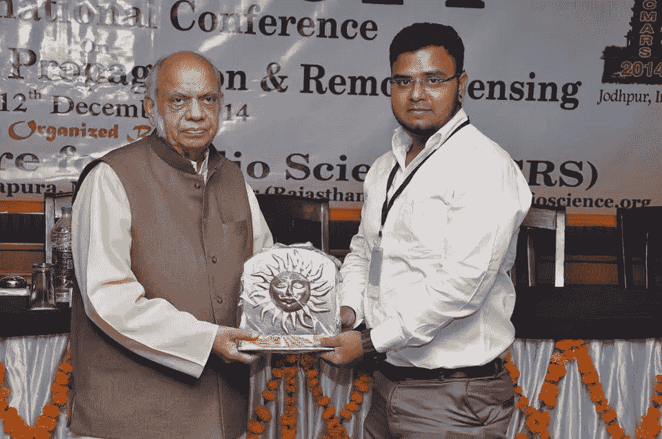
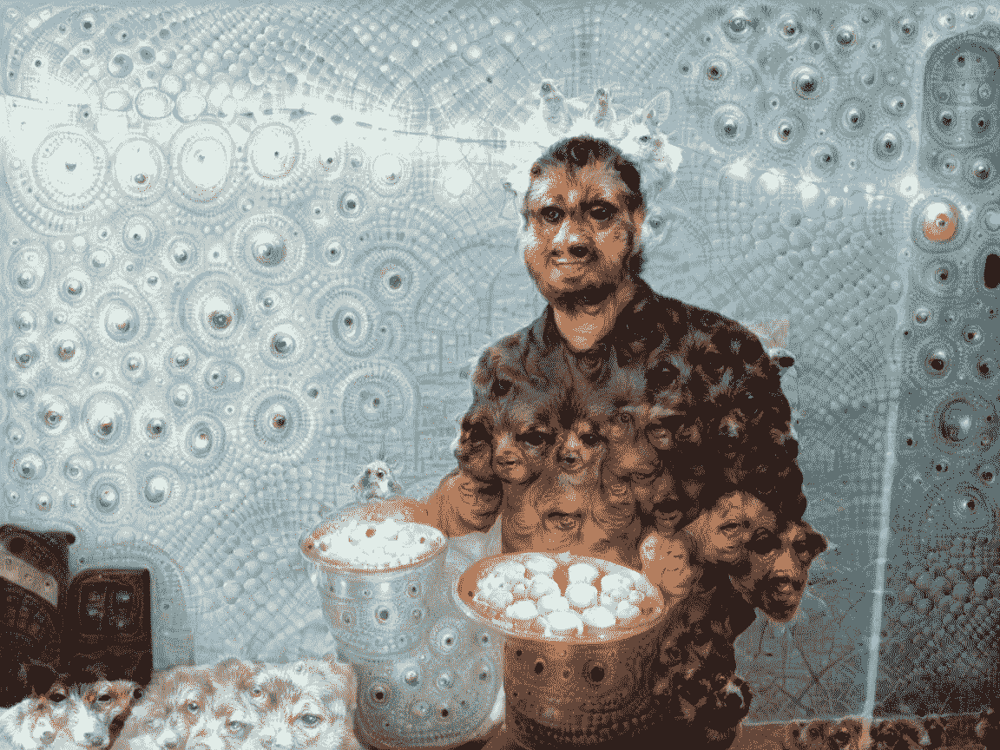
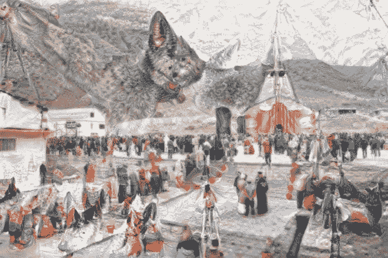
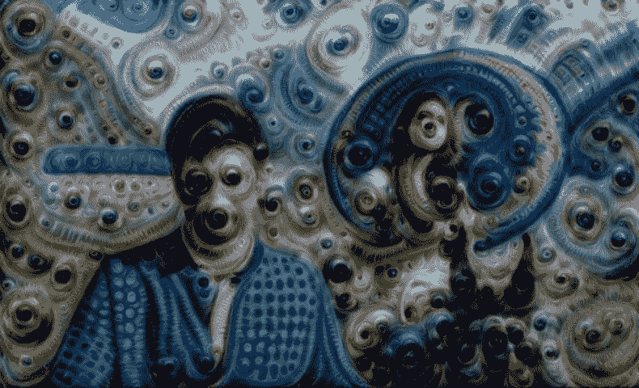
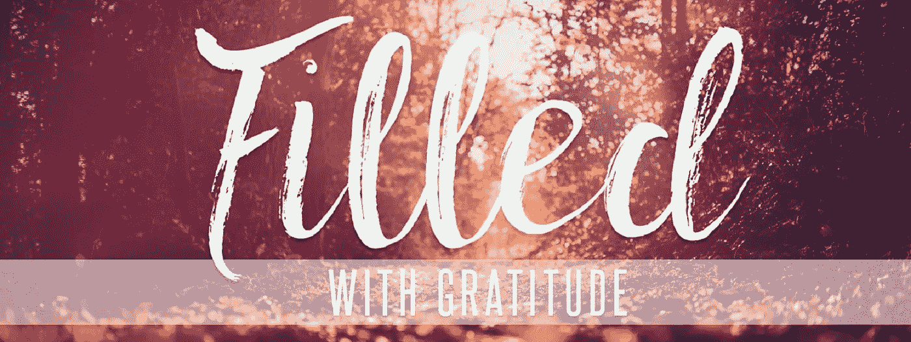

# TensorFlow 深度梦境:建立你的第一次深度梦境体验的实用指南

> 原文：<https://medium.com/hackernoon/deep-dream-with-tensorflow-a-practical-guide-to-build-your-first-deep-dream-experience-f91df601f479>

> 想象力比知识更重要。因为**的知识**是有限的，而**的想象力**包容了整个世界，刺激了进步，催生了进化。”

无论是机器学习工程师，还是深度学习专业人士，都会聚集在一些聚会或会议上，他们讨论的深度学习最常见的应用范围从对象检测，人脸识别，自然语言处理和语音识别，主要是由于自动驾驶汽车，亚马逊-Alexa 或聊天机器人，但还有其他类型的应用不同于这些标准应用，这些应用不仅在人工智能领域，也在艺术领域引起了巨大的轰动。

一个这样的应用是“**深梦”**，它赋予了艺术家力量，反过来增强了我们的创造性启示，扩大了我们可以想象的空间。

**深梦**是一个[计算机视觉](https://en.wikipedia.org/wiki/Computer_vision)程序，由[谷歌](https://en.wikipedia.org/wiki/Google)工程师 [Alex Mordvintsev](https://twitter.com/zzznah) 创建，它使用[卷积神经网络](https://en.wikipedia.org/wiki/Convolutional_neural_network)通过[算法](https://en.wikipedia.org/wiki/Algorithm) [幻觉](https://en.wikipedia.org/wiki/Pareidolia)在的[图像中寻找并增强模式，从而在图像中创建一个类似于](https://en.wikipedia.org/wiki/Image)的[致幻](https://en.wikipedia.org/wiki/Hallucinogenic)外观

谷歌的计划推广了术语(深度)“做梦”，指的是在经过训练的[深度网络](https://en.wikipedia.org/wiki/Deep_neural_network)中产生期望的[激活](https://en.wikipedia.org/wiki/Activation_(neural_network))的图像生成，该术语现在指的是相关方法的集合。

## **从理论到实践**

接下来是我最喜欢的部分，在自学了[谷歌](https://en.wikipedia.org/wiki/Google)深度梦之后，是时候从**阅读器**模式切换到**编码器**模式，因为从这一点开始，我将只谈论代码，这与了解任何深度学习应用背后的概念同等重要。

遵循这个一步一步的实践指南来创建你的第一个深度梦体验，但是在开始我的编码之旅之前，先看看我的深度梦图像，这些图像非常迷幻。


Image 1: Welcome to the trippy world of hallucinogenic images

**免责声明**:在开始本编码教程之前，请确保您在一个文件夹中有两个 python 文件，即 download.py 和 inception5h.py，您可以从我在参考资料部分提到的 GitHub 资源库中获得，否则您会发现自己被“没有找到模块”错误所困扰，这无疑是一种痛苦

那么，让我们开始吧

```
#This was developed using Python 3.6.3 (Anaconda) 
#Important library to import%matplotlib inline
import matplotlib.pyplot as plt
import tensorflow as tf
import numpy as np
import random
import math# Image manipulation.
from PIL import Image
from scipy.ndimage.filters import gaussian_filter
```

# 初始模型

使用 Inception 5h 模型是因为它更容易使用:它接受任何大小的输入图像，并且它似乎比 Inception v3 模型创建了更漂亮的图片。

```
import inception5h
```

下载初始模型的数据。它的大小是 50 兆字节

```
inception5h.maybe_download()Downloading Inception 5h Model ...
Data has apparently already been downloaded and unpacked.
```

加载先启模型，这样它就可以使用了。

```
model = inception5h.Inception5h()
```

Inception 5h 模型有许多层，可以用于深度做梦。但是为了便于参考，我们将只使用 12 个最常用的层。

```
len(model.layer_tensors)
```

要了解 inception 5h 模型中的不同层

```
def printTensors(pb_file):# read pb into graph_def
    with tf.gfile.GFile(pb_file, "rb") as f:
        graph_def = tf.GraphDef()
        graph_def.ParseFromString(f.read())# import graph_def
    with tf.Graph().as_default() as graph:
        tf.import_graph_def(graph_def)# print operations
    for op in graph.get_operations():
        print(op.name)printTensors("inception/5h/tensorflow_inception_graph.pb")
```

# 图像处理的辅助功能

这个函数加载一个图像，并以浮点 numpy 数组的形式返回。

```
def load_image(filename):
    try:
        original = Image.open(filename)
        print("the size of the image is :")
        print(original.format,original.size)
    except:
        print ("Unable to load image")return np.float32(original)
```

将图像保存为 jpeg 文件。图像以 numpy 数组的形式给出，像素值在 0 到 255 之间。

```
def save_image(image, filename):
    # Ensure the pixel-values are between 0 and 255.
    image = np.clip(image, 0.0, 255.0)

    # Convert to bytes.
    image = image.astype(np.uint8)

    # Write the image-file in jpeg-format.
    with open(filename, 'wb') as file:
        Image.fromarray(image).save(file, 'jpeg')
```

该函数绘制图像。使用 matplotlib 会产生低分辨率图像。使用 PIL 给出了漂亮的图片。

```
def plot_image(image):
    # Assume the pixel-values are scaled between 0 and 255.

    if False:
        # Convert the pixel-values to the range between 0.0 and 1.0
        image = np.clip(image/255.0, 0.0, 1.0)

        # Plot using matplotlib.
        plt.imshow(image, interpolation='lanczos')
        plt.show()
    else:
        # Ensure the pixel-values are between 0 and 255.
        image = np.clip(image, 0.0, 255.0)

        # Convert pixels to bytes.
        image = image.astype(np.uint8)# Convert to a PIL-image and display it.
        display(Image.fromarray(image))
```

归一化图像，使其值介于 0.0 和 1.0 之间。这对于绘制梯度很有用。

```
def normalize_image(x):
    # Get the min and max values for all pixels in the input.
    x_min = x.min()
    x_max = x.max()# Normalize so all values are between 0.0 and 1.0
    x_norm = (x - x_min) / (x_max - x_min)

    return x_norm
```

该函数绘制归一化后的梯度

```
def plot_gradient(gradient):
    # Normalize the gradient so it is between 0.0 and 1.0
    gradient_normalized = normalize_image(gradient)

    # Plot the normalized gradient.
    plt.imshow(gradient_normalized, interpolation='bilinear')
    plt.show()
```

这个函数调整图像的大小。它可以接受一个大小参数，你可以给它你想要的图像的像素大小，例如(100，200)。或者它可以带一个因子参数，你可以给它一个你想要的缩放因子，比如 0.5，用来在每个维度上把图像的大小减半。

这是用 PIL 实现的，有点长，因为我们处理的是像素是浮点值的 numpy 数组。PIL 不支持这一点，因此必须将图像转换为 8 位字节，同时确保像素值在适当的范围内。然后调整图像的大小并转换回浮点值。

```
def resize_image(image, size=None, factor=None):
    # If a rescaling-factor is provided then use it.
    if factor is not None:
        # Scale the numpy array's shape for height and width.
        size = np.array(image.shape[0:2]) * factor

        # The size is floating-point because it was scaled.
        # PIL requires the size to be integers.
        size = size.astype(int)
    else:
        # Ensure the size has length 2.
        size = size[0:2]

    # The height and width is reversed in numpy vs. PIL.
    size = tuple(reversed(size))# Ensure the pixel-values are between 0 and 255.
    img = np.clip(image, 0.0, 255.0)

    # Convert the pixels to 8-bit bytes.
    img = img.astype(np.uint8)

    # Create PIL-object from numpy array.
    img = Image.fromarray(img)

    # Resize the image.
    img_resized = img.resize(size, Image.LANCZOS)

    # Convert 8-bit pixel values back to floating-point.
    img_resized = np.float32(img_resized)return img_resized
```

# DeepDream 算法

# 梯度

以下辅助函数计算输入图像的渐变，用于 DeepDream 算法。Inception 5h 模型可以接受任何大小的图像，但是非常大的图像可能会使用许多千兆字节的 RAM。为了保持较低的 RAM 使用率，我们将把输入图像分割成较小的图像块，并计算每个图像块的梯度。

但是，这可能会导致 DeepDream 算法生成的最终图像中出现可见线条。因此，我们随机选择瓷砖，所以瓷砖的位置总是不同的。这使得瓷砖之间的接缝在最终的 DeepDream 图像中不可见。

这是一个帮助函数，用于确定合适的图块大小。期望的图块尺寸例如是 400×400 像素，但是实际的图块尺寸将取决于图像尺寸。

```
def get_tile_size(num_pixels, tile_size=400):
    """
    num_pixels is the number of pixels in a dimension of the image.
    tile_size is the desired tile-size.
    """# How many times can we repeat a tile of the desired size.
    num_tiles = int(round(num_pixels / tile_size))

    # Ensure that there is at least 1 tile.
    num_tiles = max(1, num_tiles)

    # The actual tile-size.
    actual_tile_size = math.ceil(num_pixels / num_tiles)

    return actual_tile_size
```

这个辅助函数计算输入图像的梯度。将图像分割成小块，并计算每个小块的梯度。瓷砖是随机选择的，以避免在最终的 DeepDream 图像中出现可见的接缝/线条。

```
def tiled_gradient(gradient, image, tile_size=400):
    # Allocate an array for the gradient of the entire image.
    grad = np.zeros_like(image)# Number of pixels for the x- and y-axes.
    x_max, y_max, _ = image.shape# Tile-size for the x-axis.
    x_tile_size = get_tile_size(num_pixels=x_max, tile_size=tile_size)
    # 1/4 of the tile-size.
    x_tile_size4 = x_tile_size // 4# Tile-size for the y-axis.
    y_tile_size = get_tile_size(num_pixels=y_max, tile_size=tile_size)
    # 1/4 of the tile-size
    y_tile_size4 = y_tile_size // 4# Random start-position for the tiles on the x-axis.
    # The random value is between -3/4 and -1/4 of the tile-size.
    # This is so the border-tiles are at least 1/4 of the tile-size,
    # otherwise the tiles may be too small which creates noisy gradients.
    x_start = random.randint(-3*x_tile_size4, -x_tile_size4)while x_start < x_max:
        # End-position for the current tile.
        x_end = x_start + x_tile_size

        # Ensure the tile's start- and end-positions are valid.
        x_start_lim = max(x_start, 0)
        x_end_lim = min(x_end, x_max)# Random start-position for the tiles on the y-axis.
        # The random value is between -3/4 and -1/4 of the tile-size.
        y_start = random.randint(-3*y_tile_size4, -y_tile_size4)while y_start < y_max:
            # End-position for the current tile.
            y_end = y_start + y_tile_size# Ensure the tile's start- and end-positions are valid.
            y_start_lim = max(y_start, 0)
            y_end_lim = min(y_end, y_max)# Get the image-tile.
            img_tile = image[x_start_lim:x_end_lim,
                             y_start_lim:y_end_lim, :]# Create a feed-dict with the image-tile.
            feed_dict = model.create_feed_dict(image=img_tile)# Use TensorFlow to calculate the gradient-value.
            g = session.run(gradient, feed_dict=feed_dict)# Normalize the gradient for the tile. This is
            # necessary because the tiles may have very different
            # values. Normalizing gives a more coherent gradient.
            g /= (np.std(g) + 1e-8)# Store the tile's gradient at the appropriate location.
            grad[x_start_lim:x_end_lim,
                 y_start_lim:y_end_lim, :] = g

            # Advance the start-position for the y-axis.
            y_start = y_end# Advance the start-position for the x-axis.
        x_start = x_endreturn grad
```

# 优化图像

这个函数是 DeepDream 算法的主要优化循环。它计算初始模型的给定层相对于输入图像的梯度。然后将梯度添加到输入图像，从而增加层张量的平均值。这个过程被重复多次，并且放大了初始模型在输入图像中看到的任何模式。

```
**def** optimize_image(layer_tensor, image,
                   num_iterations=10, step_size=3.0, tile_size=400,
                   show_gradient=**False**):
    *"""*
 *Use gradient ascent to optimize an image so it maximizes the*
 *mean value of the given layer_tensor.*

 *Parameters:*
 *layer_tensor: Reference to a tensor that will be maximized.*
 *image: Input image used as the starting point.*
 *num_iterations: Number of optimization iterations to perform.*
 *step_size: Scale for each step of the gradient ascent.*
 *tile_size: Size of the tiles when calculating the gradient.*
 *show_gradient: Plot the gradient in each iteration.*
 *"""*

    *# Copy the image so we don't overwrite the original image.*
    img = image.copy()

    print("Image before:")
    plot_image(img)

    print("Processing image: ", end="")

    *# Use TensorFlow to get the mathematical function for the*
    *# gradient of the given layer-tensor with regard to the*
    *# input image. This may cause TensorFlow to add the same*
    *# math-expressions to the graph each time this function is called.*
    *# It may use a lot of RAM and could be moved outside the function.*
    gradient = model.get_gradient(layer_tensor)

    **for** i **in** range(num_iterations):
        *# Calculate the value of the gradient.*
        *# This tells us how to change the image so as to*
        *# maximize the mean of the given layer-tensor.*
        grad = tiled_gradient(gradient=gradient, image=img)

        *# Blur the gradient with different amounts and add*
        *# them together. The blur amount is also increased*
        *# during the optimization. This was found to give*
        *# nice, smooth images. You can try and change the formulas.*
        *# The blur-amount is called sigma (0=no blur, 1=low blur, etc.)*
        *# We could call gaussian_filter(grad, sigma=(sigma, sigma, 0.0))*
        *# which would not blur the colour-channel. This tends to*
        *# give psychadelic / pastel colours in the resulting images.*
        *# When the colour-channel is also blurred the colours of the*
        *# input image are mostly retained in the output image.*
        sigma = (i * 4.0) / num_iterations + 0.5
        grad_smooth1 = gaussian_filter(grad, sigma=sigma)
        grad_smooth2 = gaussian_filter(grad, sigma=sigma*2)
        grad_smooth3 = gaussian_filter(grad, sigma=sigma*0.5)
        grad = (grad_smooth1 + grad_smooth2 + grad_smooth3)

        *# Scale the step-size according to the gradient-values.*
        *# This may not be necessary because the tiled-gradient*
        *# is already normalized.*
        step_size_scaled = step_size / (np.std(grad) + 1e-8)

        *# Update the image by following the gradient.*
        img += grad * step_size_scaled

        **if** show_gradient:
            *# Print statistics for the gradient.*
            msg = "Gradient min: **{0:>9.6f}**, max: **{1:>9.6f}**, stepsize: **{2:>9.2f}**"
            print(msg.format(grad.min(), grad.max(), step_size_scaled))

            *# Plot the gradient.*
            plot_gradient(grad)
        **else**:
            *# Otherwise show a little progress-indicator.*
            print(". ", end="")

    print()
    print("Image after:")
    plot_image(img)

    **return** img
```

# 递归图像优化

初始模型是在相当小的图像上训练的。确切的大小还不清楚，但每个维度可能有 200-300 个像素。如果我们使用更大的图像，比如 1920x1080 像素，那么上面的`optimize_image()`函数会给图像添加许多小图案。

这个辅助函数将输入图像缩小几次，并通过上面的`optimize_image()`函数运行每个缩小的版本。这导致最终图像中的图案更大。这也加快了计算速度。

```
def recursive_optimize(layer_tensor, image,
                       num_repeats=4, rescale_factor=0.7, blend=0.2,
                       num_iterations=10, step_size=3.0,
                       tile_size=400):
    """
    Recursively blur and downscale the input image.
    Each downscaled image is run through the optimize_image()
    function to amplify the patterns that the Inception model sees.Parameters:
    image: Input image used as the starting point.
    rescale_factor: Downscaling factor for the image.
    num_repeats: Number of times to downscale the image.
    blend: Factor for blending the original and processed images.Parameters passed to optimize_image():
    layer_tensor: Reference to a tensor that will be maximized.
    num_iterations: Number of optimization iterations to perform.
    step_size: Scale for each step of the gradient ascent.
    tile_size: Size of the tiles when calculating the gradient.
    """# Do a recursive step?
    if num_repeats>0:
        # Blur the input image to prevent artifacts when downscaling.
        # The blur amount is controlled by sigma. Note that the
        # colour-channel is not blurred as it would make the image gray.
        sigma = 0.5
        img_blur = gaussian_filter(image, sigma=(sigma, sigma, 0.0))# Downscale the image.
        img_downscaled = resize_image(image=img_blur,
                                      factor=rescale_factor)

        # Recursive call to this function.
        # Subtract one from num_repeats and use the downscaled image.
        img_result = recursive_optimize(layer_tensor=layer_tensor,
                                        image=img_downscaled,
                                        num_repeats=num_repeats-1,
                                        rescale_factor=rescale_factor,
                                        blend=blend,
                                        num_iterations=num_iterations,
                                        step_size=step_size,
                                        tile_size=tile_size)

        # Upscale the resulting image back to its original size.
        img_upscaled = resize_image(image=img_result, size=image.shape)# Blend the original and processed images.
        image = blend * image + (1.0 - blend) * img_upscaledprint("Recursive level:", num_repeats)# Process the image using the DeepDream algorithm.
    img_result = optimize_image(layer_tensor=layer_tensor,
                                image=image,
                                num_iterations=num_iterations,
                                step_size=step_size,
                                tile_size=tile_size)

    return img_result
```

# 张量流会话

我们需要一个 TensorFlow 会话来执行图表。这是一个互动的会议，所以我们可以继续添加梯度函数到计算图。

```
session = tf.InteractiveSession(graph=model.graph)
```

是时候运行算法了

```
#load the image which you want to process
image=load_image(filename='test_output/test_output_11.jpg')
plot_image(image)# the size of the image is :
# JPEG (780, 1040)
```



Image 2 : That’s me few years back

首先，我们需要在盗梦模型中引用张量，我们将在 DeepDream 优化算法中最大化它。在这种情况下，我们选择初始模型的整个第三层(层索引 2)。它有 192 个频道，我们将尝试最大化所有这些频道的平均值。

```
layer_tensor = model.layer_tensors[2]
layer_tensor# <tf.Tensor 'conv2d2:0' shape=(?, ?, ?, 192) dtype=float32>
```

递归应用深度梦算法。

```
img_result = recursive_optimize(layer_tensor=layer_tensor, image=image,
                 num_iterations=10, step_size=3.0, rescale_factor=0.7,
                 num_repeats=4, blend=0.2)
```


Image 3: After applying Deep Dream to my image

现在我们将在初始模型中最大化一个更高层。在这种情况下，它是第 7 层(索引 6)。该层识别输入图像中更复杂的形状，因此 DeepDream 算法将产生更复杂的图像。这一层似乎在识别狗脸和皮毛，因此 DeepDream 算法将它们添加到了图像中。

```
layer_tensor = model.layer_tensors[6]
img_result = recursive_optimize(layer_tensor=layer_tensor, image=image,
                 num_iterations=10, step_size=3.0, rescale_factor=0.7,
                 num_repeats=4, blend=0.2)
```



Image 4: After applying Deep Dream Algorithm

这是一个使用 DeepDream 算法仅最大化图层要素通道子集的示例。在这种情况下，索引为 10 的层和只有其前 3 个特征通道被最大化。

```
layer_tensor = model.layer_tensors[10][:,:,:,0:3]
img_result = recursive_optimize(layer_tensor=layer_tensor, image=image,
                 num_iterations=10, step_size=3.0, rescale_factor=0.7,
                 num_repeats=4, blend=0.2)
```



Image 5: After applying Deep Dream Algorithm

```
layer_tensor = model.layer_tensors[4]
img_result = recursive_optimize(layer_tensor=layer_tensor, image=image,
                 num_iterations=10, step_size=3.0, rescale_factor=0.7,
                 num_repeats=4, blend=0.2)
```



Image 6: After applying Deep Dream Algorithm

```
# To save the final Outputimage_save=save_image(img_result,"test_output/test_output_12.jpg")
```

如果这还不够，我在 YouTube 上上传了一个视频，它将进一步扩展你的迷幻体验。

结论:就是这样，这篇文章向你展示了如何使用张量流和一些概念，你也可以自己创造一个深刻的梦境体验。

特别说明:如果没有 Magnus Erik Hvass Pedersen 通过他著名的 TensorFlow 教程给出的指导，这篇文章是不可能完成的。GitHub 库可以在这里找到。

资源:

1.  对于 **GitHub** 库点击[这里](https://github.com/ElephantHunters/Deep-Dream-using-Tensorflow)。
2.  为了增加对深层梦想的理解，请阅读谷歌研究博客文章。



**感谢您的关注**

你用*你的*时间来阅读*我的*工作对我来说意味着一切。我完全是这个意思。

如果你喜欢这个故事，疯狂鼓掌吧👏 **)** 按钮！这将有助于其他人找到我的工作。

此外，如果你愿意，可以在 Medium、LinkedIn 或 Twitter 上关注我！我很乐意。

[](/@naveenmanwani) [## 纳文·曼瓦尼培养基

### 阅读纳文·曼瓦尼在媒介上的作品。一个机器学习工程师，一个深度学习爱好者|谷歌印度…

medium.com](/@naveenmanwani) [](https://www.linkedin.com/in/naveen-manwani-65491678/) [## Naveen Manwani -机器学习工程师- AIMonk Labs Private Ltd | LinkedIn

### 查看纳文·曼瓦尼在全球最大的职业社区 LinkedIn 上的个人资料。Naveen 有一份工作列在他们的…

www.linkedin.com](https://www.linkedin.com/in/naveen-manwani-65491678/) [](https://twitter.com/NaveenManwani17) [## 纳文·曼瓦尼(@纳文·曼瓦尼 17) |推特

### 纳文·曼瓦尼的最新推文(@纳文·曼瓦尼 17)。机器学习工程师@ AIMONK Labs Pvt ltd，深…

twitter.com](https://twitter.com/NaveenManwani17)