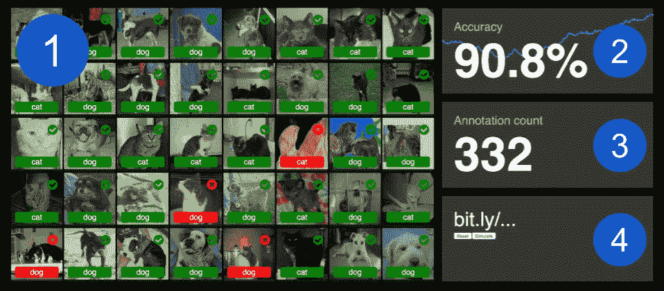

# Deep Hive:深度学习现场直播

> 原文：<https://medium.com/hackernoon/deep-hive-deep-learning-live-on-stage-7d1525a55bb1>

最近我不得不做一些关于机器学习、深度学习和计算机视觉的演讲。我开始在一个幻灯片平台上工作，并看着其他人在网上做了什么来传达诸如监督学习、CNN 等概念。

我发现了非常好的图片和图表。作为一名数据科学家，它们对我来说很有意义，但大部分感觉太抽象，无法直接传达给非技术观众。

除此之外，人们通过做比听学得更好。所以我总是尝试与观众互动，让我的演讲更吸引人。

> 如果我可以在舞台上现场表演机器学习的整个过程(数据收集、训练、测试)会怎么样？

这将使这个想法更加有形和具体。我就是这样得到了开发 Deep Hive 的灵感。

完整的源代码可从
[https://github.com/wouterdewinter/deep-hive](https://github.com/wouterdewinter/deep-hive)获得

# 深层蜂巢

主要概念很简单:

1.  观众中的人们同时标记图像和；
2.  用这些注释训练模型；
3.  测试结果显示在主屏幕上。

任务是学习机器学习模型来将图像分类到多个类别中。默认的猫狗数据集有两个类。自定义数据集可以包含更多的类，但是更多的类将需要更多的数据来实现合理的性能。


The Dashboard screen

## 训练和测试集

为了防止泄露信息，数据集被分成训练集和测试集。训练集中的图像显示给观众中的用户进行标记。测试集中的图像用于评估准确性。这些是显示在仪表板上的图像。

对于用户提交的每个图像标签，该模型将评估一个测试图像。将最后 64 张测试图像的平均分数作为报告的准确度。

# 体系结构

让我们深入了解应用程序的本质细节。


Moving parts of the application

## 工人

工人实际上是应用程序的工作马。这个 python 脚本在后台运行，包含 Keras 模型。它从消息队列接收消息，比如新的注释。它与模型交互，并将准确性统计数据推回消息队列。

该脚本在单线程中运行。您不能让多个 workers 以负载平衡的方式运行，因为您需要模型从每个新注释中学习，而不仅仅是它的一部分。有多种方法以分布式方式训练模型，但这更复杂，并且对于这里使用的少量数据是不需要的。

## 模型

对于图像分类任务，卷积神经网络(CNN)是黄金标准。通常，CNN 需要大量的训练数据才能表现良好。我们在这里没有这种奢侈，因为我们只有非常有限的时间让观众给图像贴标签。幸运的是，我们可以通过'*转移学习* **'** 来大幅减少所需的数据量。

使用这种技术，我们可以重用来自另一个网络的已经训练好的层，将我们自己的层放在上面，并且只训练这些最后的层。


Transfer Leaning

深层蜂巢模型在标准 VGG-16 模型的基础上增加了三层:

```
Layer (type)                 Output Shape              Param #
=================================================================
vgg16 (Model)                (None, 4, 4, 512)         14714688
_________________________________________________________________
global_average_pooling2d_1 ( (None, 512)               0
_________________________________________________________________
dense_1 (Dense)              (None, 256)               131328
_________________________________________________________________
dropout_1 (Dropout)          (None, 256)               0
_________________________________________________________________
dense_2 (Dense)              (None, 2)                 514
=================================================================
Total params: 14,846,530
Trainable params: 131,842
Non-trainable params: 14,714,688
_________________________________________________________________
```

总共有 14，846，530 个参数，但我们只需要训练其中的 131，842 个。太棒了。

因为模型需要一个接一个地学习新的图像标签，所以我们本质上是在做“*在线学习*”。这就是我选择老式 SGD(随机梯度下降)优化器而不是 Adam 或其他具有动态学习率的优化器的原因。

## 信息排队

为了简单起见，我选择 Redis 作为消息队列。Redis 是一个流行的内存中键/值存储，但是有一个非常方便的 pubsub 机制。它充当工作人员和 web 服务器之间的中继。

## 网络服务器

对 web 服务器的要求相当适中。提供一些静态文件，为前端公开一个小 api，并将消息传递给 Redis。Flask 是轻量级的，非常适合这个任务。因为模型是通过 worker 和 Redis 解耦的，所以 Flask 可以毫无问题地多线程运行。

## 前端

仪表板非常动态，需要在新数据到达时每秒更新多个部分几次。一个简单的 React 应用程序就可以完成这项工作。应用程序每 300 毫秒轮询一次新数据。这不能很好地扩展，但是通常只有一个控制面板在运行。使用 websockets 将是一个更具可伸缩性的选择。

## 注释

注释屏幕是为移动设备构建的，向观众成员显示图像，并为每个类显示一个按钮。单击其中一个类提交标签，并立即请求一个新的图像进行注释。


The annotation screen

## 仪表盘

仪表板有 4 个部分:



1.  **图像网格**显示了 40 幅图像的完整测试集。它显示图像、预测标签和指示正确或不正确预测的颜色。
2.  **准确度**显示测试集的准确度，背景中的图表显示趋势。图形由优秀的 d3.js 库渲染。
3.  **注释计数**，嗯…显示注释的图像数量。
4.  **简短的 URL** 供观众在手机上输入。在我的演示中，我在 Deep Hive 演示之前的幻灯片中显示了一个 QR 码，以节省一些用户的输入。

短网址下面有两个按钮:

*   **Reset** 将重置模型并重新评估测试集；
*   **模拟**通过在消息队列中推送完整训练集的图像标签来模拟观众。

# 数据集

我用两个不同的数据集测试了这个应用程序。

主要的一个是 [Kaggle 狗对猫数据集](https://www.kaggle.com/c/dogs-vs-cats)。这样，我在大约 250 个用户注释中获得了大约 90%的准确率。如果你的观众有 25 个人，这通常用不了一分钟！

我在为一个客户做一个花卉识别器。使用两个类的私有数据集中的图像，我得到了超过 90%的 160 条注释。对于模型来说，这似乎是一个更容易的任务。


The flower dataset

# 结论

我希望你喜欢这个应用程序和引擎盖下的窥视。如果人们感兴趣，我可能会很快增加一些功能。例如学习速率滑块或一些其他超参数控制。请在评论中告诉我你对下一个版本有什么想法。

请随意使用 Deep Hive 进行您自己的演示。我很好奇，想知道进展如何！