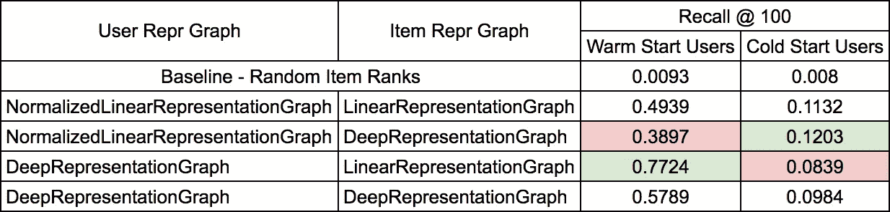

# 利用 Keras 和 TensorRec 进行深度学习推荐

> 原文：<https://medium.com/hackernoon/deep-learning-for-recommendation-with-keras-and-tensorrec-2b8935c795d0>

随着 [TensorRec](https://github.com/jfkirk/tensorrec) v0.21 的发布，我增加了在你的推荐系统中轻松使用深度神经网络的能力。

对于一些推荐问题，例如冷启动推荐问题，深度[学习](https://hackernoon.com/tagged/learning)可以是从用户和项目元数据学习的优雅解决方案。使用 [TensorRec](https://github.com/jfkirk/tensorrec) 和 [Keras](https://keras.io/) ，您现在可以在您的推荐系统中快速、轻松地试验深度表示模型。

# 履行

在 TensorRec 模型中，学习如何处理用户和项目特征的组件被称为“表示图”(或简称为“repr”)。这些图形将高维用户/项目特征(例如元数据和指示符变量)转换成低维用户/项目表示。

The TensorRec recommender system.

通过扩展类`AbstractKerasRepresentationGraph`，将模型的表示图定义为一系列 Keras 层。接下来，覆盖`create_layers`抽象方法以返回 Keras 层的有序列表。

# **示例**

您可以在本模块的[中找到上面的示例，该示例用于针对](https://github.com/jfkirk/tensorrec/blob/master/examples/keras_example.py)[图书交叉数据集](http://www2.informatik.uni-freiburg.de/~cziegler/BX/)的完整推荐系统。

有了这个数据集，推荐系统正在学习根据用户元数据(位置、年龄)和图书元数据(作者、书名、出版年份等)向用户推荐图书。这个例子使用线性核表示和深层网络表示的组合来比较推荐系统的四种不同配置。

Book Crossing example results

该网络的架构尚未针对图书交叉问题进行优化，应仅将其视为新 Keras 功能的一个示例。

# **提醒一句**

当你拿着锤子(或深度学习)的时候，一切看起来都像钉子(或深度学习问题)。

许多现实世界的推荐问题最好通过深思熟虑的分析、特征工程、简单的模型和有效的反馈系统来解决。深度模型非常灵活，但是这使得它们特别容易由于过度参数化而过度拟合。在这些情况下，对于以前未知的用户和项目，性能会受到严重损害。

这个问题的一个例子是上面图书穿越例子中的第三种配置。该系统是四种配置中仅基于年龄和位置为现有用户提供推荐的最有效的配置，但是基于相同的用户元数据，该系统在新用户方面表现最差，这是过度适应的典型例子。这个问题可以通过更丰富的元数据、更好的特征工程或更简单的模型来避免。

图书交叉的例子也说明了最好的产品结果可能来自拥有多个推荐系统。由两个推荐系统驱动的产品，一个是为热启动用户设计和优化的，另一个是为冷启动新用户设计和优化的，可能是你产品的最佳系统设计[T1。](https://hackernoon.com/tagged/design)

如果你想为 TensorRec 做贡献(甚至只是尝试),我很乐意在 [GitHub](https://github.com/jfkirk/tensorrec) 或这篇文章的评论区听到你的反馈。

特别感谢 Joe Cauteruccio (Spotify)、迈克尔·桑德斯(Spotify)和 Logan Moore(东北大学)对 TensorRec 的贡献。

*注:这是一个个人项目，在撰写本文时，与 Spotify 无关。*