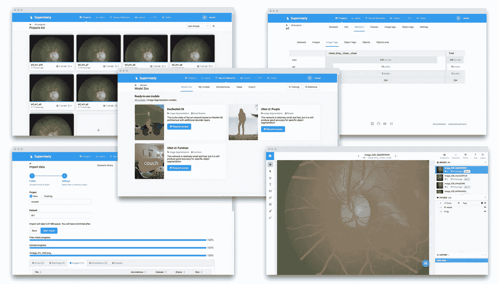
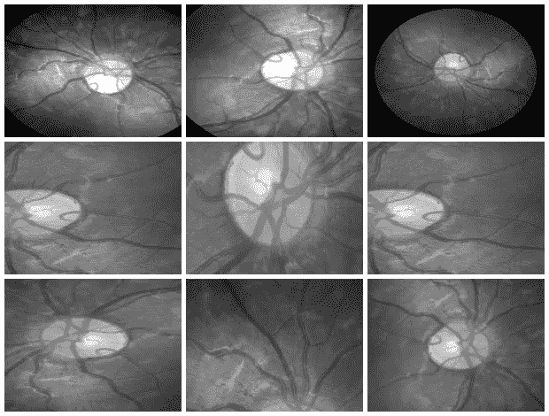

# 💊医学中的深度学习:在监督下推进医学图像分析

> 原文：<https://medium.com/hackernoon/deep-learning-in-medicine-advancing-medical-image-analysis-with-supervisely-33e936159206>

你好世界！

1895 年 12 月，威廉·伦琴在第一张 x 光照片中展示了他妻子的手骨。“我已经看到了我的死亡，”她说。这一突破对 20 世纪的医疗产生了不可思议的影响。最新的深度学习进展为该领域开辟了新的可能性。

深度学习在计算机视觉和其他领域取得了巨大成功。现在，它正在积极改变医学界。人工智能帮助医生更快地做出更准确的诊断。

今天，我们想分享我们对一个非常有前途的方向的思考和研究:在单一环境中进行医学图像分析的人在回路人工智能— [监督](https://supervise.ly)。

我们的平台允许管理和注释数据，训练神经网络，应用它们进行自动预注释，然后将它们部署为 API。

# 医学影像面临的挑战

IBM 的研究人员[估计](https://www.healthcare-informatics.com/news-item/analytics/ibm-unveils-watson-powered-imaging-solutions-rsna)医学图像作为医疗保健行业中最大和增长最快的数据源，至少占所有医学数据的 90%。

**挑战 1:数据隐私**

> 医疗数据仍然是个人的，不容易获得。由于数据隐私问题，大多数公共卫生中心不愿意共享数据。

**挑战 2:注释数据的大小**

注释过程很难外包，只有专业医师才能分析医学图像。这种限制导致高成本和缺乏注释数据。

**挑战 3:注释工具的质量**

可用于从医学图像中提取见解的注释工具仍然有限，在大多数情况下无法公开获得，并且需要手动完成大多数分析。

**挑战 4(1 和 2 的结果):分段挑战**

与常见图像(COCO、PascalVoc 等)的大型公共数据集相比，用于分割任务的数据集通常非常小。由于数据集的大小，很难训练非常深的神经网络架构。感兴趣的对象可以在大小、形状和位置上变化。与“软”边界相结合，它产生了额外的问题。

# 我们的目标

我们将克服挑战 3 和挑战 4:为行业提供端到端的解决方案，使人类专家更加高效，并利用强大的人工智能技术自动化日常任务。

Supervisely: user interfaces

我们意识到还有很多工作要做:增加方便的注释工具的数量，增加对 DICOM 格式、三维图像、图像序列等的支持。但这些只是技术问题，初步措施已经完成，并取得了可喜的成果。

我们热衷于加速医学发展，并很高兴成为推动医疗保健深度学习革命的全球研究社区的一员。

> 这种新能力(深度学习)最重要的应用莫过于改善病人护理
> 
> —英伟达首席执行官兼联合创始人黄仁勋

# 案例研究:视网膜图像中的血管分割

在成像领域有很多深度学习医疗应用:肿瘤检测、跟踪肿瘤发展、血流量化和可视化、牙科放射学等等。

因为我们不是医生，所以我们寻找我们或多或少了解的数据。这就是我们决定对血管分割进行研究的原因。让我们来看看这个领域最流行的公共数据集之一: [STARE](http://cecas.clemson.edu/~ahoover/stare/) (视网膜的结构化分析)。

数据集包含 28 幅带注释的图像，分辨率为 999 × 960。我们考虑在训练数据集中只有 **6 幅注释图像的情况。其他图像将用于质量的最终评估。所有训练图像如下:**

Here is the whole training dataset we use.

这个场景非常接近真实世界:医生注释一些图像，然后神经网络根据这些数据进行训练，并应用于其他图像进行预分割。然后医生只是纠正神经网络的预测。

这种方法被称为人工智能中的人。其目的是显著提高人类专家的效率。

PS。感谢监督，整个研究花了两个小时，没有匆忙☕.

## 步骤 1:训练数据扩充

我们只有 6 张带注释的图片。为了训练神经网络，我们必须自动增加数据集的大小。超级有特殊的模块来执行扩充:DTL(数据转换语言)。它允许以一种简单的基于 json 的格式配置整个增强过程，并且只需点击几下鼠标就可以完成。

How DTL query interface looks like

在这个用例中，我们做了水平/垂直翻转和相对较大的随机裁剪。我们仅从 6 幅带注释的图像中获得了 264 个训练样本。这是我们应用于数据的计算图的可视化:

Resulted crops after augmentation

## 第二步:训练神经网络

目前用于监督语义分割的神经网络很少。其中之一是我们的定制 UNet 式建筑。之所以选择它，是因为:我们的训练数据集很小，训练起来既准确又快速。此外，由于类别不平衡问题，我们使用二元交叉熵和骰子损失的组合。与背景像素相比，血管像素只占图像区域的很小一部分。

我们训练了 NN 50 个纪元。在训练期间可视化神经网络预测是有趣的。我们采取看不见的图像，并在每个时期后应用神经网络。在这里，您可以看到我们的神经网络如何随着时间的推移变得更加智能。

超级支持多 GPU 训练。每个历元在四个 GPU 上花费大约 20 秒。总训练时间——大约 17 分钟。

## 第三步:自动预分割

我们将神经网络应用于新图像。让我们将预测与现实进行比较。

**Left**: NN predictions, **Right**: ground truth

从这个比较中可以看出，每一个相对粗的血管都是分段的。没有噪音。这意味着人类只需要用“折线”工具画几条细线。

此外，据我们所知，真实数据比我们在这个实验中使用的公开数据具有更高的分辨率。我们认为这个事实对于发际线分割的质量是至关重要的。公开图像的分辨率是不够的。看看这个例子:你看到医生标注的血管了吗？

Left: meme, Middle: original image, Right: doctor’s annotation

## 第四步:手动校正

正如你从上面的图片中看到的，自动预注释的质量非常好。这是更容易和更快地纠正神经网络预测比从零开始手工注释。

我们并不懒惰，并做了时间测量:从零开始手工注释和校正神经网络预测需要多少时间。从零开始手动标注: **36 分钟/图**。NN 预测的修正: **4 分钟/张**。

结论很明显。

# 最后的想法

深度学习在医学图像分析方面潜力巨大。人工智能正在改变医生诊断疾病的方式。

医生和深度学习算法之间的主要重要区别是医生必须睡觉。神经网络可以处理数百万幅图像，并且可以不断改进。

“人在回路”的方法和有监督的自动分段将让我们更快地创建大型数据集。所有步骤无需编码即可完成。这意味着没有人工智能背景的用户可以接触到最先进的人工智能。所以 ML 社区将建立更多的服务来帮助医生提供更好更快的治疗。

让我们一起创造未来。

如果你觉得这篇文章很有趣，那么让我们也来帮助别人吧。如果你给它一些，更多的人会看到它👏。