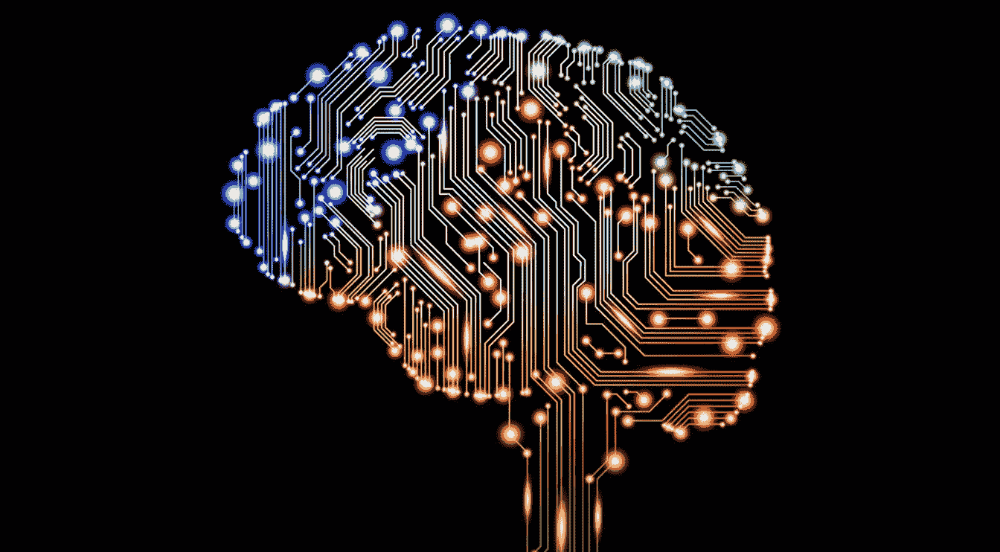

# 深度学习资源

> 原文：<https://medium.com/hackernoon/deep-learning-resources-e32bd081e84d>

## 2018 年从零开始学习 DL 的最佳方式

有越来越多令人惊叹的资源，让深度学习比以往任何时候都更容易获得。几年前，很难找到一个好的介绍，它不会用一个巨大的先决条件列表来淹没你。现在，你不需要 11 个博士学位就可以开始。如果你懂 python——你可以在几天内开始训练你的第一批人工神经网络，并且在几个月内对这个领域非常熟悉。

这是一个帮助您入门的最佳资源集合，除了对 Python 的基本理解之外，没有任何先决条件。

# 用于数据科学和机器学习的 Python

 [## Python 用于数据科学和机器学习训练营

### 了解如何使用 NumPy、Pandas、Seaborn、Matplotlib、Plotly、Scikit-Learn、机器学习、Tensorflow 等等！

www.udemy.com](https://www.udemy.com/python-for-data-science-and-machine-learning-bootcamp) 

如果您不确定自己的 python 技能，我建议从这里开始。这个简单的入门课程将带你浏览所有你需要的库，轻松地学习下面的任何课程。使用它来刷新您的记忆，并学习 Python、Jupyter、NumPy 和 Matplotlib 的基础知识。本课程还有更多部分，但只要你知道这 4 个，你就很棒。

# 神经网络上的 3blue1brown 视频

理解 DL 基础知识的最好方法是观看这个关于人工神经网络如何工作的极其精彩的高层次简明概述。我强烈建议您从这里开始。观看这 4 个短片，你会对你需要使用其他资源学习的细节有一个很好的总体概念。

# 探索深度学习

 [## 探索深度学习

### 人工智能是本世纪最令人兴奋的技术之一，深度学习在许多方面都是…

www.manning.com](https://www.manning.com/books/grokking-deep-learning) 

这是一本很棒的书，会教你深度学习的基本原理。它有非常直观和容易理解的解释，并且不使用除 NumPy 之外的任何库。你会逐渐建立起你的理解，建立起你想知道的所有基本算法，从零开始。

# 使用 Python 进行深度学习

 [## 使用 Python 进行深度学习

### 47 美元深度学习是目前最有趣、最强大的机器学习技术。顶级深度学习…

machinelearningmastery.com](https://machinelearningmastery.com/deep-learning-with-python/) 

与前一本书不同，这本书没有深入数学和理论，而是通过一个非常简单易用的 DL 库(keras)指导您构建几个实际项目。除了上一本书的理论，这也是获得实践经验的好方法。也没有 python 之外的先决条件，非常容易上手。

# Fast.ai 深度学习课程(v.2)

如果你正在寻找从零开始训练前沿深度学习算法的最快、最简单的方法，最好的学习地点是 [fast.ai](http://course.fast.ai) 。

 [## 面向编码人员的深度学习

### fast.ai 面向编码员的实用深度学习 MOOC。学习 CNN，RNNs，计算机视觉，NLP，推荐系统…

course.fast.ai](http://course.fast.ai) 

这是一门免费课程，使用自上而下的方法教你深度学习。在开始的几个小时里，你将只使用几行代码来训练一个最先进的图像分类器，随着你的学习，课程将更深入地解释理论和其他算法，并让你完全理解事物是如何工作的。

一开始信息量可能有点大，这就是为什么如果你在任何时候感到困惑，我建议你也使用上面提到的书。

这 5 种资源足以让你在几个月内从零开始训练神经网络。本文的其余部分是其他优秀资源的集合，它们将使您的旅程更加轻松。

# 数学先决条件

学习数学最简单的方法是跟随可汗学院和 3blue1brown 的课程。在学习其他课程之前，你不需要学习所有这些内容，但是我建议你在空闲时间观看这些视频，最终你会发现这些知识很有用。最重要的是，你需要了解这三个主题:

*   **演算** [可汗学院](https://www.khanacademy.org/math/calculus-home)
    [3blue1brown](https://www.youtube.com/playlist?list=PLZHQObOWTQDMsr9K-rj53DwVRMYO3t5Yr)
*   **线性代数** [可汗学院](https://www.khanacademy.org/math/linear-algebra)
    [3blue1brown](https://www.youtube.com/playlist?list=PLZHQObOWTQDPD3MizzM2xVFitgF8hE_ab)
*   **概率统计** [可汗学院](https://www.khanacademy.org/math/statistics-probability)

# 动手机器学习

 [## 使用 Scikit-Learn 和 TensorFlow 进行机器实践学习

### 通过最近的一系列突破，深度学习推动了整个机器学习领域。现在，甚至…

shop.oreilly.com](http://shop.oreilly.com/product/0636920052289.do) 

这本书是学习一般机器学习的最佳途径，它给你一个极好的参考和所有算法的概述。

# 吴恩达的 Coursera 课程

 [## 机器学习|课程

### 关于这门课程:机器学习是让计算机在没有明确编程的情况下行动的科学。在…

www.coursera.org](https://www.coursera.org/learn/machine-learning) 

这门课程是最受欢迎的入门方式之一。

# 麻省理工学院课程

一旦你准备好学习更高级的课程，我强烈推荐你去看看麻省理工学院的这些优秀的新课程:

 [## 深度学习简介

### 深度学习方法和应用的入门课程。

introtodeeplearning.com](http://introtodeeplearning.com)  [## 人工通用智能

### 这门课采用工程学的方法来探索建立人类智能的可能研究路径…

agi.mit.edu](https://agi.mit.edu)  [## 自动驾驶汽车的深度学习

### 这堂课是对深度学习实践的介绍，通过建立一个自动驾驶的应用主题…

selfdrivingcars.mit.edu](https://selfdrivingcars.mit.edu) 

# 人工智能

最后，这些是对了解 AGI 感兴趣的人的资源，并获得对人工智能作为一个领域的更广泛理解。

## 主算法

 [## 主算法

### 看看 Audible.com 的这个伟大的听众。在数据驱动的机器时代，在机器学习的庇护下…

www.audible.com](https://www.audible.com/pd/Science-Technology/The-Master-Algorithm-Audiobook/B014X1DS8W) 

这是一本很棒的有声读物，给你一个 ML 领域和算法的高层次概述，旨在为“主算法”(可以学习任何东西的 AI)奠定路线图。

## 论智力

 [## 论智力

### 看看 Audible.com 的这个伟大的听众。杰夫·霍金斯，创造了掌上电脑、Treo 智能手机和…

www.audible.com](https://www.audible.com/pd/Science-Technology/On-Intelligence-Audiobook/B002V8LKTE) 

在这本有声读物中，你将学习到一个关于人类大脑如何工作的理论，这是 DL 算法的基础。它非常吸引人，听起来很有趣，会帮助你以一种新的方式思考安的。

## 人工智能:现代方法

 [## 人工智能:现代方法(第三版)

### 人工智能:一个现代的方法，3e 提供了最全面的，最新的理论和…

www.amazon.com](https://www.amazon.com/Artificial-Intelligence-Modern-Approach-3rd/dp/0136042597) 

人工智能领域的顶级教科书。这不是最快的入门方式，但被认为是有史以来最好的人工智能教科书之一。

## 加州大学伯克利分校人工智能课程

基于人工智能的精彩课程:现代方法。将真正帮助你更好地理解这本书，并在你学习的过程中建立一些实际的项目。

此外，DL 上还有一些很棒的播放列表，让收藏更加完整:

[**用 Python 学习机器**](https://www.youtube.com/playlist?list=PLQVvvaa0QuDfKTOs3Keq_kaG2P55YRn5v)

[**神经网络揭秘**](https://www.youtube.com/playlist?list=PLiaHhY2iBX9hdHaRr6b7XevZtgZRa1PoU)

[**机器学习 youtube 教程由**](http://www.youtube.com/playlist?list=PLD0F06AA0D2E8FFBA) [**数学和尚**](https://www.youtube.com/channel/UCcAtD_VYwcYwVbTdvArsm7w)