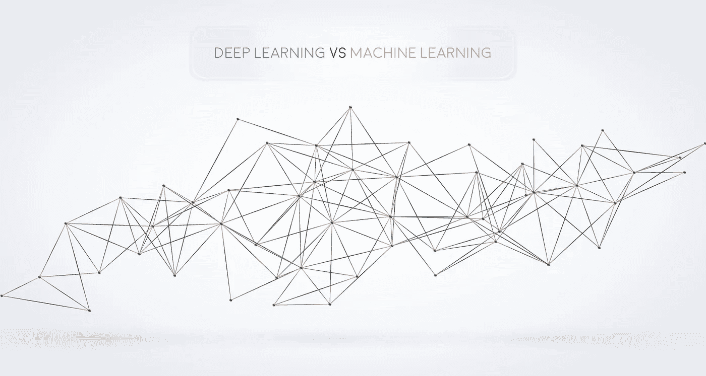
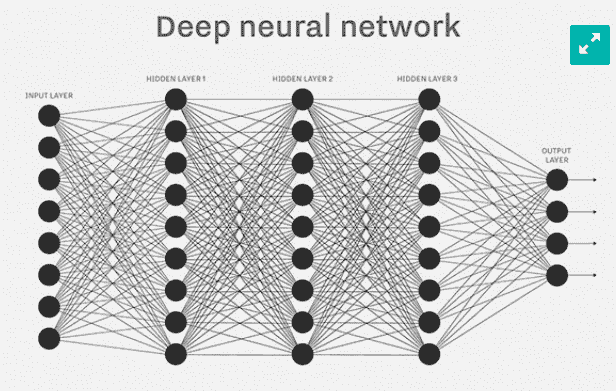

# 深度学习 vs 机器学习

> 原文：<https://medium.com/hackernoon/deep-learning-vs-machine-learning-52ca79851fd5>

有一群人并不真正知道机器学习和深度学习这样的炒作术语之间是否有任何区别，也不知道这两者之间是如何相互联系的。在我们进一步深入之前，值得一提的是，尽管人工智能、人工智能和深度学习经常被用来代替另一个，特别是被一些商人、营销人员或创业者使用，但这些术语并不完全相同！所以，请不要再迷惑他们了！

# 触及表面:术语和定义

首先，人工智能是一个更广泛的术语，包括机器学习及其更小的深度学习子集。你知道我们要去哪里吗？如果你有一台计算机在算法的帮助下从事某项任务，那就不能称之为人工智能。然而，你可以称之为机器学习，但我们不要操之过急，要深入一点。

因此，机器学习是指机器从其经历大量任务的经验中学习的能力。想象一下，你有一个数据集，你可以输入给机器，让它学习和识别它的对象。这是最重要的部分:如果你试图使用一种算法来预见一个事件的结果，你不能认为这个过程是机器学习。相反，当你使用结果来精炼未来预测并使它们更加准确时，这就是[机器学习发展](https://perceptionbox.io/ai-machine-learning-development)发生的时候。

但是在机器训练中还有另一层“智能”。深度学习被认为只是实现机器学习或其子类别的另一种方式。可以这么想:深度学习是机器学习的升级版。为什么？因为它的算法受到人脑性能的启发，旨在反映其活动。类似于人类使用他们的大脑来发现模式和聚集不同类型的数据，深度学习工具可以被训练为机器执行相同的任务。

# 深入固体:机器和深度学习比较

如果你比较一下通常对来自外部环境的信息进行解码的人脑的日常活动，你会发现这正是深度学习领域的科学试图呼应的。与大脑类似，机器的任务是分解信息和分配类别。

它的意思是:如果我们感知到一些新信息，我们大脑的自然功能会试图根据过去的经验(我们的档案)给出解释。这个概念被认为是算法驱动的深度学习概念的核心。但是一颗播下的种子(算法)生根发芽的理想设置是什么呢？

答案是人工神经网络或简称为 ann。由于具有分层结构，人工神经网络通过输入、隐藏(一个或多个)和输出层传递数据。

让我们解释一下。通常，一个神经网络首先通过一系列大数据进行教育。教育过程包括输入和告诉 ANN 想要的结果。想象一下，教网络识别动物会是什么样子。然后，最初的训练将是给它提供带有相关名称的动物以及非动物的照片，这样网络可以随着时间的推移而改进。

所以这一切都说明了这一点:当得出结论时，这些算法试图复制我们的大脑活动。后一个过程是关于推断、暗示或假设的信息。

对此不要有任何误解。一方面，这是深度学习的工作，它会自动找出参数，对输入的信息进行聚类。另一方面，机器学习需要将这些参数与训练数据集一起引入。

但有一点是肯定的:通常，DL 需要大数据来产生高质量的准确预测。科学家常常难以获得有助于处理特定行业任务的训练集:为特定业务领域(如医疗或空间)量身定制的大数据可能会花费不菲。

# 真实生活用例

首先，大多数知名的支付(如 PayPal)解决方案利用机器学习和算法的力量来应对金融犯罪。最重要的是，你最喜欢的电视剧建议引擎(例如网飞)是机器学习的另一个用例，它为智能娱乐提供了动力。毕竟，在收购机器学习公司 Kosei 之后，Pinterest 的相关内容变得更酷了。Lyft 和优步是交通行业的先驱，他们通过运用算法来优化运营和整体性能，建立了一个帝国。

机器和深度学习的用例数不胜数。就领域而言， [Forbes](https://www.forbes.com/sites/bernardmarr/2018/08/20/10-amazing-examples-of-how-deep-learning-ai-is-used-in-practice/#5d7f0cddf98a) 编制了一份成功利用深度学习巨大潜力的实际场景列表，其中也包括新闻聚合和客户体验工具。除此之外，想想所有通过 cookies 和你的搜索历史提供给你的广告:你不太可能看到与你完全无关的内容。为什么？这主要是因为机器学习旨在帮助营销人员更好地定位和定制。

让我们看看在整篇文章中我们是否在同一波长上。简单的事实是，人工智能是一个比机器学习大得多的话题，而后者是深度学习的父类别。所以你有一个俄罗斯娃娃类型的概念之间的关系。

随着人工智能成为最大和最高级的“matryoshka”，机器学习是人工智能的一个子类，它专注于计算机处理数据集的能力，并在处理大数据的过程中自学改变算法。

典型的机器学习模型会随着时间的推移而改进。然而，如果出现错误，他们仍然需要工匠——工程师——的帮助。相比之下，通过深度学习，算法足够智能，可以在没有任何帮助的情况下识别预测是否正确。

训练机器在数据处理和分类方面模仿人类是通过使用人工神经网络实现的:人工神经网络是模仿人脑创建的特殊算法，能够识别相似之处并对信息进行聚类。