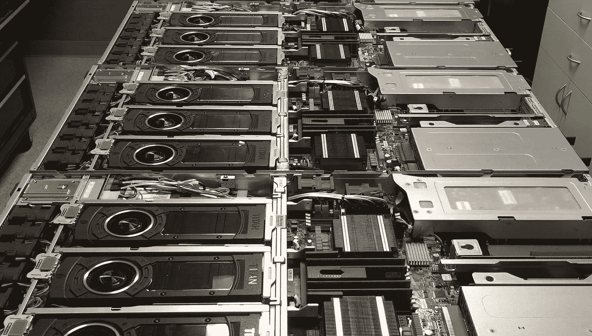
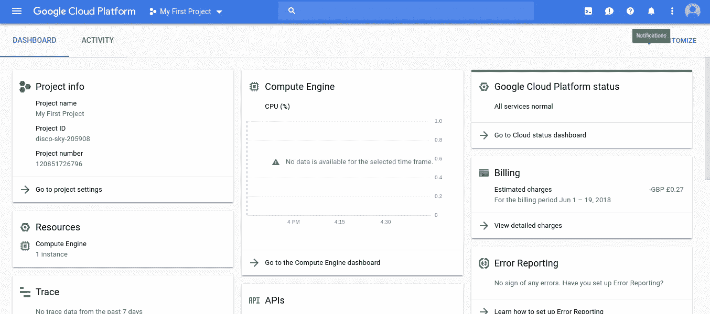
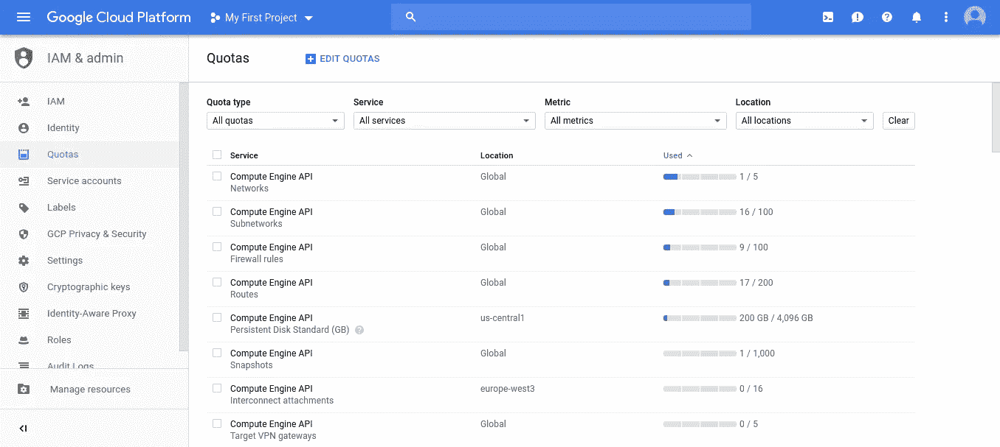
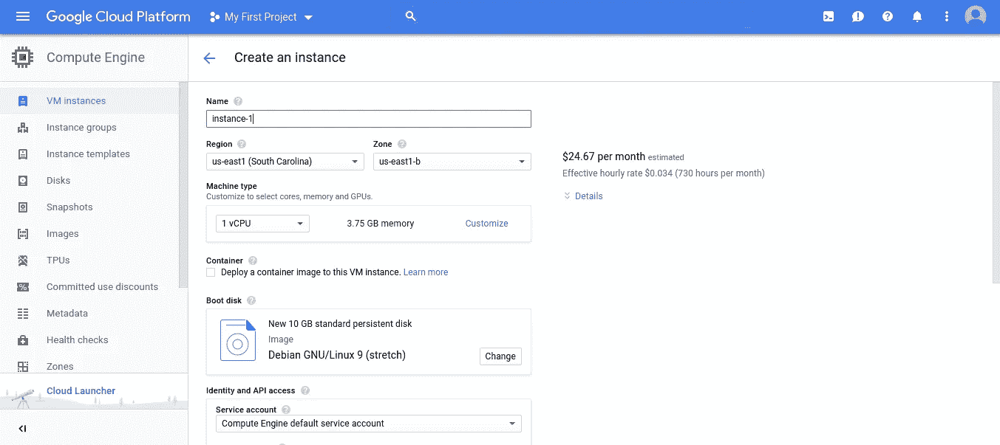

# 借助谷歌云平台实现 GPU 支持的深度学习

> 原文：<https://medium.com/hackernoon/deep-learning-with-google-cloud-platform-66ada9d7d029>

GPU-gasm ❤❤

我知道，高端深度学习 GPU 支持的系统构建起来非常昂贵，而且不容易获得，除非你是顶尖大学的研究员，我不喜欢连续几天在我的终端上看着纪元编号，只知道我的模型毫无价值。

谷歌云是来拯救我们所有人的，如果你还不知道的话，谷歌云提供价值 300 美元的试用积分来试用他们的任何云服务。这正是我一直在寻找的。

在 cloud.google.com 启动谷歌云网站，用你的谷歌账户注册试用。你需要一张信用卡来验证，但是如果你在用完信用额度之前取消，你将不会被收费。

Console Home Page

转到“计算引擎”菜单，第一次启动需要一些时间，然后“创建实例”。该死，我们漏了一步。问题是谷歌有一些额外的验证要求来为你的机器添加 GPU，可以理解，你不会希望有人使用你的 GPU 进行加密挖掘。

转到 IAM & admin -> Quotas，在 Service 中选择 Compute Engine API，在 Metrics 中选择 NVIDIA GPU，您可以选择 K80、P100 或 V100。K80 很适合我。选中所需地区的 GPU 配额(快速提示:美国服务器将是最便宜的)，“编辑配额”，填写您的详细信息，在下一页输入您需要的 GPU 数量，不要太贪心，您输入的数字越高，批准就越困难。

“原因”部分是最重要的，简要描述你的目的，在这种情况下是“深度学习研究”，确保你表现出非商业目的。审批需要 12-24 小时，您会收到一封电子邮件。

谷歌可能会要求你升级帐户，然后才允许改变配额，这样做，你不会被收费，直到你用尽 300 美元的信用。

Quotas under IAM & admin

Create Instance Page

完成后，转到“创建实例”部分，确保您选择的区域与之前选择的区域相同，通过单击“自定义”选择机器类型，我推荐 4 个 30GB 内存的 vCPUs。添加您想要的 GPU。选择启动盘，我推荐“Ubuntu 16.04 配 200GB 标准持久盘”。调整你的其他需求，点击“创建”。

几分钟后，你的深度学习机器将准备好训练你的模型，哦，还没有。

原来他们没有预装 NVIDIA CUDA 驱动程序，这太可惜了。这部分有点痛苦，如果你需要的话，也许我会再写一篇。这样做，安装你最喜欢的深度学习框架，Tensorflow，PyTorch 等。你可以走了。SSH 使用控制台选项，或者如果您喜欢设置一个 SSH 密钥来使用您自己的终端。

建议或批评总是受欢迎的。

干杯！

Saurabh 是印度瓦朗加尔国家理工学院计算机科学专业的本科生，目前是班加罗尔印度科学学院的研究实习生。