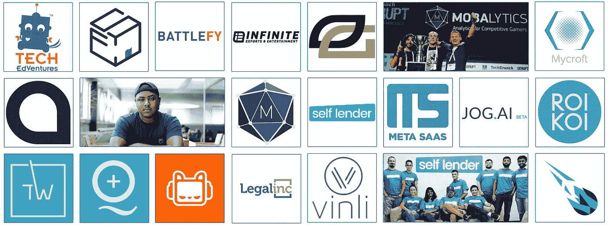
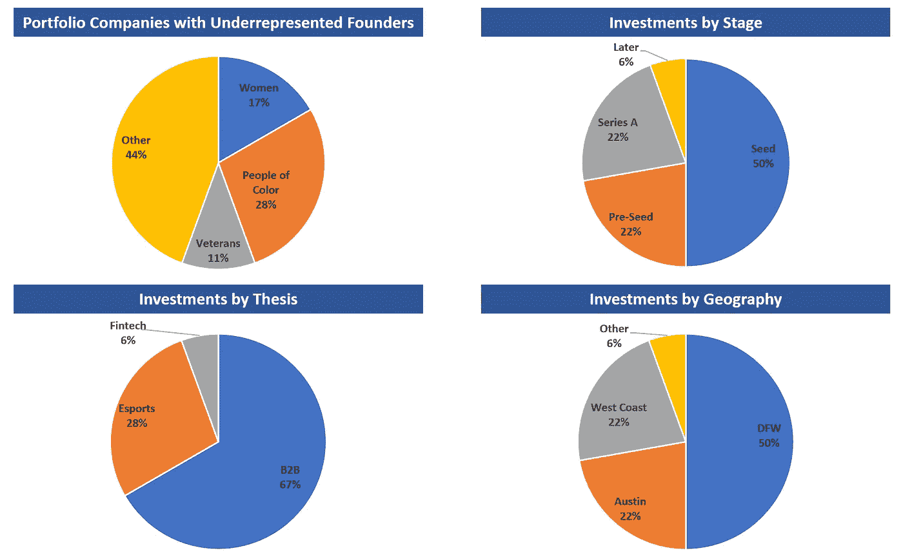
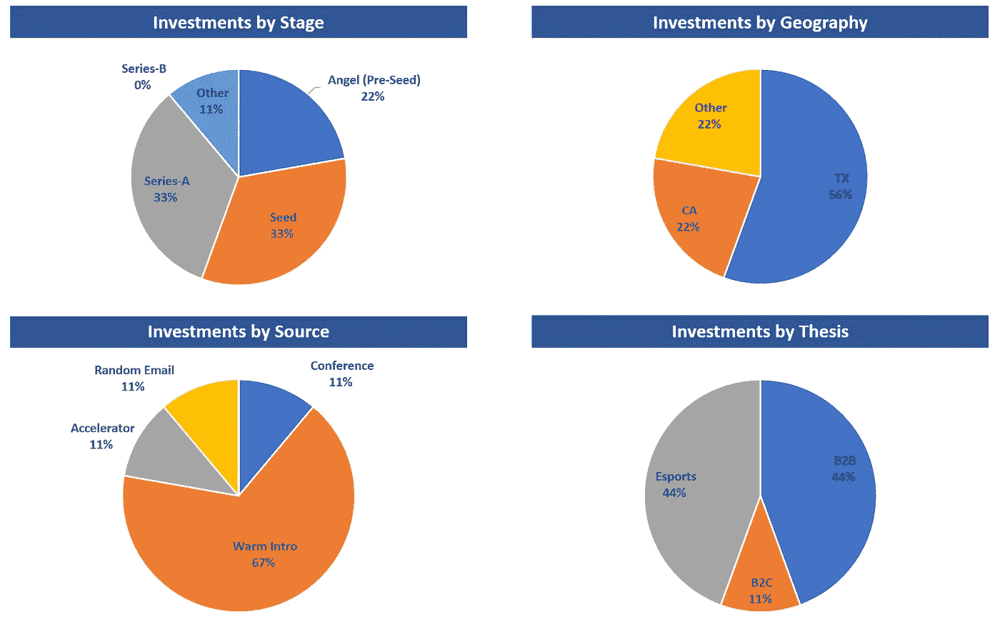
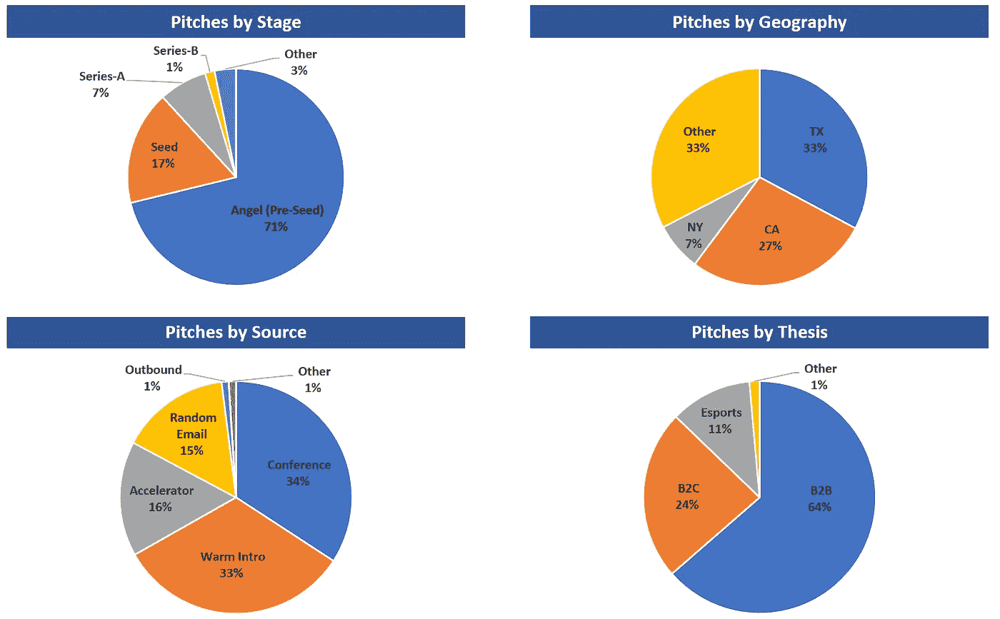

# 深空冒险——两年内(从数字上看)

> 原文：<https://medium.com/hackernoon/deep-space-ventures-two-years-in-by-the-numbers-9965a0f46d6a>

2017 年是[深空风险投资](http://deepspacevc.com/)的第二年。一路走来，我学到了很多，经历了很多，也交到了一些很棒的朋友。

过去的两年是一段疯狂的旅程。许多起起落落。一些惨痛的教训。有些投资显然会赢，有些则不会。我不会在这里深入探讨，但我确实厌倦了听到投资者只谈论赢家。我们都有输家，这没关系(尤其是在早期投资阶段)。

我们有 18 家投资组合公司，我们计划投资比我们最初设定的投资更多的资金(作为“常青树”基金的优势之一)。如果我必须设定一个目标，我会说我们计划对早期企业进行 100 项投资，我怀疑我们将在未来 7-10 年内完成这一目标。我认为我们的目标是每年达成约 5-7 笔新交易，但如果 2017 年是一个指标，也许我们会比这更快。

2017 年，我们:

*   看了 500 份推介材料(这并不包括收到的每一份材料，而是我们仔细看过或与之对话的每一家公司)
*   完成 9 项新投资
*   进行了 3 次后续投资
*   继续建立多元化创始人的投资组合——我们投资组合中 56%的公司至少有一位创始人来自代表性不足的群体

下面，我总结了一系列我认为我们做得好的事情，以及一些我们做得不好的事情。

**我们做得好的地方有哪些:**

1.  建立一个利基市场(实际上是 2 个)——直到我们这样做了，我才意识到这有多重要
2.  找到了与顶级投资者进入资本表的方法(学习和交易流程的重要来源)
3.  策划一个专有的交易流程网络(部分是因为第二点)
4.  投资一些快速增长的公司，我们即将在 2018 年 Q1 奥运会(准确地说是 2 月)完成我们的第一次退出

**我们可以改进的地方(我可能遗漏了一些东西，如果你有反馈，我会很高兴听到你的反馈):**

1.  时间管理/分配
2.  当我们仔细/深思熟虑地审视一家企业后，给出更好的反馈(不是我们传递的每一副牌，而是我们采访的每一位创始人)
3.  传得更快
4.  更好地与其他投资者和合适的投资者分享我们看到的机会
5.  在我们考虑投资的种子期之前，与我们打算监控和跟踪的种子前期公司建立更多的关系
6.  提高我作为一名有效的董事会成员的能力
7.  如果一家公司没有走上成功之路，或者我们知道这个想法在目前的形式下行不通，那就去找一个支点，或者更快地改变方向

# 投资组合摘要(迄今为止的 18 项投资):

# 2017 年进行的投资-按数字:

# 2017 年推介活动—按数字(500 个推介):

展望 2018 年，我非常激动。我认为我们将达成一些伟大的交易，我们将取得一些积极的成果，我们将应用我们在 DSVC 头两年学到的经验，不仅成为一个更好的投资者，更广泛地成为创业生态系统中更好的一员。

斯蒂芬·海斯(Stephen Hays)是 Deep Space Ventures 的管理合伙人，这是一家位于德克萨斯州达拉斯的微型风险投资公司，专注于电子竞技和 B2B 企业初创公司。

[点击这里在 Twitter 上关注斯蒂芬](https://twitter.com/hazesyah)

[在这里阅读更多关于深空冒险的信息](http://deepspacevc.com/)